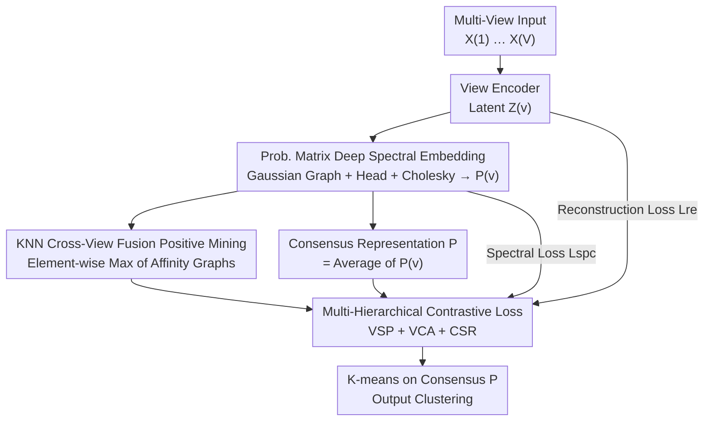

# Multi-Hierarchical Contrastive Spectral Fusion for Multi-View Clustering

**Conference**: CVPR 2026  
**Paper**: [CVF Open Access](https://openaccess.thecvf.com/content/CVPR2026/html/Cai_Multi-Hierarchical_Contrastive_Spectral_Fusion_for_Multi-View_Clustering_CVPR_2026_paper.html)  
**Area**: Multi-View Clustering / Contrastive Learning / Spectral Embedding  
**Keywords**: Multi-view clustering, Deep spectral embedding, Contrastive learning, Consensus representation, Manifold structure

## TL;DR
MCSF integrates differentiable deep spectral embedding into multi-view encoders and fuses multiple views into a "structure-aware" consensus representation using a tri-level contrastive loss (Intra-view Structure Preservation / View-Consensus Alignment / Consensus Structure Refinement), achieving leading clustering accuracy across 8 benchmarks.

## Background & Motivation

**Background**: Multi-view clustering (MVC) aims to discover consistent clustering structures across "heterogeneous representations of the same sample set," such as image-text pairs, multi-sensor data, or multi-lingual corpora. Recent mainstream methods utilize contrastive learning to pull semantically similar samples (positive pairs) together and push dissimilar ones (negative pairs) apart, spanning instance-level, neighborhood-level, and cluster-level/pseudo-label alignments.

**Limitations of Prior Work**: The authors point out that current contrastive clustering frameworks are mostly **structure-agnostic**. They rely on cosine similarity, k-nearest neighbors, or preliminary cluster pseudo-labels to select positive pairs. While these pull semantically related samples together in the embedding space, they **fail to capture the true geometric/manifold structure of the data**. Consequently, under noise, view discrepancies, or subtle inter-class differences, the learned representations lack intra-cluster compactness and inter-cluster separability, leading to fragmented clustering boundaries (as shown in Figure 1(a) of the paper).

**Key Challenge**: Representation learning only optimizes "similarity," without constraints on whether the "embedding space faithfully reflects the original data manifold." Existing deep spectral embedding methods (e.g., SpectralNet, MvSCN) preserve structure but rely on additional Siamese networks to construct similarity graphs, which is computationally expensive and decoupled from representation learning. Furthermore, traditional contrastive methods only perform **pairwise** alignment (intra-view or inter-view), lacking a unified consensus space to carry global semantic consistency.

**Goal**: (1) Allow spectral structure constraints to be integrated directly into the encoder in a differentiable and low-cost manner; (2) Upgrade pairwise alignment to a multi-hierarchical mechanism capable of producing "structure-aware consensus representations."

**Key Insight**: Treat the "probability matrix" itself as the spectral embedding. The cluster probability matrix $H^{(v)}$ output by a softmax prediction head, once processed via Cholesky orthogonalization, satisfies spectral embedding orthogonality while being naturally differentiable and trainable end-to-end, bypassing the Siamese graph construction step.

**Core Idea**: Replace "Siamese spectral graphs + pairwise contrast" with a "probability matrix spectral embedding + tri-level contrastive loss" to simultaneously achieve manifold preservation, cross-view alignment, and consensus refinement within a unified network.

## Method

### Overall Architecture

MCSF (Multi-Hierarchical Contrastive Spectral Fusion) equips each of the $V$ views with an encoder-decoder set. For each view $X^{(v)}\in\mathbb{R}^{n\times d_v}$, the encoder yields a latent representation $Z^{(v)}$, which serves two purposes: one path constructs a Gaussian kernel similarity graph $W^{(v)}$ (local geometry), and the other passes through a prediction head $g_\psi$ to produce a cluster probability matrix $H^{(v)}$, which is then Cholesky-orthogonalized into the spectral embedding $P^{(v)}$. A consensus representation $P$ is initialized by averaging all $P^{(v)}$. During training, three losses collaborate: a reconstruction loss $L_{re}$ preserves original view information, a spectral loss $L_{spc}$ embeds local manifolds into $P^{(v)}$, and a multi-hierarchical contrastive loss $L_c$ simultaneously optimizes "intra-view structure / view-consensus alignment / intra-consensus refinement." Post-convergence, k-means is performed on the consensus matrix $P$ to obtain cluster labels.

### Key Designs

**1. Prob. Matrix Deep Spectral Embedding: Integrating Spectral Structure without Siamese Networks**

Traditional spectral clustering requires computing eigenvectors of the Graph Laplacian $L$, an expensive and non-differentiable operation unsuited for deep networks. Existing deep spectral methods require auxiliary Siamese networks to learn similarity graphs. MCSF's approach: the encoder first constructs a similarity matrix $W^{(v)}_{ij}=\exp(-\|z^{(v)}_i-z^{(v)}_j\|_2^2/2\sigma^2)$ using a Gaussian kernel on $Z^{(v)}$, yielding the unnormalized Laplacian $L^{(v)}=D^{(v)}-W^{(v)}$. Simultaneously, the prediction head $g_\psi$ outputs the cluster probability matrix $H^{(v)}=\mathrm{softmax}(g_\psi(Z^{(v)}))\in\mathbb{R}^{n\times K}$. The key step is treating this **probability matrix itself as the spectral embedding**, applying Cholesky parameterization for in-batch orthogonalization to prevent dimensional collapse:

$$P^{(v)}=H^{(v)}\,\mathrm{chol}\!\left((H^{(v)})^\top H^{(v)}+\varepsilon I\right)^{-1}.$$

Thus $P^{(v)}$ remains approximately orthogonal. A spectral loss $L_{spc}=\sum_v\sum_{i,j}W^{(v)}_{ij}\|p^{(v)}_i-p^{(v)}_j\|_2^2$ is used to pull similar samples together in the embedding. Theorem 1 in the paper proves that minimizing $L_{spc}$ is equivalent to minimizing the standard spectral objective $\sum_v \mathrm{Tr}(P^{(v)\top}L^{(v)}P^{(v)})$. This combines graph construction, orthogonality, and structure preservation into differentiable operators trained end-to-end.

**2. Multi-Hierarchical Contrastive Loss: Upgrading Pairwise Alignment to Structure-Aware Consensus**

MCSF constructs three levels of contrastive terms on the spectral embeddings $P^{(v)}$ and the consensus representation $P=\frac1V\sum_v P^{(v)}$, using temperature-scaled cosine similarity $f(p_i,p_j)=\exp(\mathrm{sim}(p_i,p_j)/\tau)$:

- **VSP (Intra-View Structure Preservation)**: $L_{VSP}=-\sum_v\log\frac{\sum_{P_i}f(p^{(v)}_i,p^{(v)}_j)}{\sum_{N_i}f(p^{(v)}_i,p^{(v)}_j)}$, pulling positive pairs together and pushing negative pairs apart within the same view to maintain local structure.
- **VCA (View-Consensus Alignment)**: Aligns each view's $p^{(v)}_i$ with the consensus $p_j$, forcing views to contribute to a unified consensus carrying shared semantics.
- **CSR (Consensus Structure Refinement)**: Contrasts within the consensus representation $P$ itself to enhance intra-cluster compactness and inter-cluster separability in the consensus space.

The complete multi-hierarchical contrastive loss is the product of these terms:

$$L_c=-\sum_v\log\Big(\underbrace{\tfrac{\sum_{P_i}f(p^{(v)}_i,p^{(v)}_j)}{\sum_{N_i}f(p^{(v)}_i,p^{(v)}_j)}}_{VSP}\cdot\underbrace{\tfrac{\sum_{P_i}f(p^{(v)}_i,p_j)}{\sum_{N_i}f(p^{(v)}_i,p_j)}}_{VCA}\cdot\underbrace{\tfrac{\sum_{P_i}f(p_i,p_j)}{\sum_{N_i}f(p_i,p_j)}}_{CSR}\Big).$$

Theoretical analysis (Theorem 2) shows that minimizing $L_c$ is equivalent to maximizing the mutual information $I(P^{(v)};P^{(v)})+I(P^{(v)};P)+I(P;P)$. Theorem 3 further guarantees that the mutual information between the consensus representation and true labels is no lower than that of any single view: $I(P;Y)\ge\max_v I(P^{(v)};Y)-\epsilon$.

**3. KNN Cross-View Fusion Positive Mining: Defining Positives through Local Structure**

MCSF avoids using cosine thresholds or clustering pseudo-labels. Instead, it mines positive pairs from input features: for each view, it computes cosine affinity $A^{(v)}_{ij}=\cos(x^{(v)}_i,x^{(v)}_j)$ and constructs a sparse KNN graph using top-$k$ neighbors. It then performs **element-wise maximum** fusion: $A_{ij}=\max_v A^{(v)}_{ij}$. In the fused graph, $A_{ij}=1$ defines the positive set $P_i$. The element-wise max ensures that if any view considers two samples similar, they are treated as a positive pair, effectively complementing missing neighborhood relations across views.

### Loss & Training

The total loss is a weighted sum of reconstruction, spectral, and contrastive terms:

$$L=L_{re}+\alpha L_{spc}+\beta L_c,\qquad L_{re}=\sum_v\sum_i\|x^{(v)}_i-\hat x^{(v)}_i\|_2^2.$$

$\alpha$ and $\beta$ balance fidelity, structure preservation, and semantic alignment. A mini-batch optimizer with adaptive momentum is used. Since orthogonal constraints are applied within batches, larger batches are preferred for stability.

## Key Experimental Results

### Main Results

Evaluated on 8 benchmarks (3Sources, MSRC-v1, Extended YaleB, etc.) using ACC, NMI, and ARI against 4 shallow and 7 deep MVC methods. ACC (%) highlights:

| Dataset | Metric | MCSF (Ours) | Next Best | Gain |
|--------|------|------|----------|------|
| COIL-20 | ACC | 93.75 | 82.71 (DCMVSC) | +11.0 |
| Extended YaleB | ACC | 81.72 | 81.09 (PCMVSC) | +0.6 |
| NUS-WIDE | ACC | 46.12 | 41.19 (PCMVSC) | +4.9 |
| MSRC-v1 | ACC | 96.19 | 92.38 (CVCL) | +3.8 |
| CIFAR-100 | ACC | 99.98 | 95.68 (ROLL) | +4.3 |
| Hdigit | ACC | 99.90 | 99.78 (UMCGL) | +0.1 |

MCSF achieves SOTA or near-SOTA on all datasets, particularly on hard datasets like COIL-20 and NUS-WIDE. Its performance on the noisy Extended YaleB outperforms graph-based (UMCGL) and contrastive (CVCL) methods due to explicit manifold preservation.

### Ablation Study

Contribution of each loss component (ACC %):

| Lre | Lspc | Lc | 3Sources | COIL-20 | Hdigit |
|-----|------|-----|----------|---------|--------|
| ✓ | | | 36.69 | 56.11 | 21.80 |
| | ✓ | | 73.37 | 56.46 | 86.55 |
| | | ✓ | 44.38 | 59.31 | 21.48 |
| ✓ | ✓ | | 74.56 | 56.46 | 84.28 |
| | ✓ | ✓ | 94.08 | 84.86 | 99.84 |
| ✓ | ✓ | ✓ | **94.67** | **93.75** | **99.90** |

### Key Findings

- **Synergy between Spectral and Contrastive Loss**: Using $L_{spc}$ or $L_c$ alone on COIL-20 yields ~56%; combining them jumps to 84.86%, and adding $L_{re}$ reaches 93.75%.
- **Tri-level Contrastive Effectiveness**: VCA is crucial for heterogeneous text data (3Sources), whereas VSP is more effective for visual data (COIL-20). CSR consistently provides a boost when combined with others.
- **Hyper-parameter Preferences**: Better clustering is observed with larger $\alpha$ and smaller $\beta$. Accuracy improves with larger batch sizes (e.g., COIL-20 ACC rises from 54.37% to 93.75% as batch size increases to 1440) for stable orthogonalization.

## Highlights & Insights
- **Probability Matrix as Spectral Embedding**: Treating the softmax output as the embedding and using Cholesky orthogonalization is an elegant design that integrates structure and representation learning into a single network, removing the need for Siamese components.
- **Information Theoretic Backing**: VSP/VCA/CSR are shown to maximize multi-level mutual information, providing a theoretical lower bound for the consensus representation's utility.
- **Element-wise Max Fusion**: This simple KNN graph fusion trick robustly mines positive pairs by complementing missing neighborhood links across views.

## Limitations & Future Work
- **Dependency on Large Batch Size**: In-batch orthogonalization fails under small batches (e.g., COIL-20 drops to 54% with batch size 48), making it unsuitable for memory-constrained or small-sample scenarios.
- **Sensitivity to Hyper-parameters**: $\alpha, \beta$, and $k$ are sensitive to the dataset, requiring grid searches and lacking an adaptive selection mechanism.
- **Scale and Efficiency**: Most benchmarks are small to medium scale. While the paper claims "low cost," quantitative comparisons of runtime and VRAM against Siamese-based methods are missing.
- **Equal-weight Consensus Initialization**: Averaging views may be sub-optimal if one view is noisy; future work could explore confidence-weighted consensus.

## Related Work & Insights
- **vs. SpectralNet / MvSCN**: Those use Siamese networks for graph learning; MCSF integrates structure preservation into the main network using the probability matrix, saving computational resources.
- **vs. CVCL / MFLVC**: Traditional contrastive MVC is structure-agnostic; MCSF adds spectral manifold constraints and a tri-level consensus space, improving robustness to noise.
- **vs. DCMVSC**: While DCMVSC uses GCNs for optimization, MCSF relies on differentiable spectral loss and contrastive alignment, yielding clearer block-diagonal structures in t-SNE visualizations.

## Rating
- Novelty: ⭐⭐⭐⭐ Probability matrix as spectral embedding + Cholesky is novel and self-consistent.
- Experimental Thoroughness: ⭐⭐⭐⭐ Extensive benchmarks and ablations, though lacking efficiency metrics.
- Writing Quality: ⭐⭐⭐⭐ Clear logic with theoretical support; good use of visual aids.
- Value: ⭐⭐⭐⭐ Provides a differentiable, theoretically-grounded paradigm for structure-aware contrastive clustering.

<!-- RELATED:START -->

## Related Papers

- [\[CVPR 2026\] Global-Graph Guided and Local-Graph Weighted Contrastive Learning for Unified Clustering on Incomplete and Noise Multi-View Data](global-graph_guided_and_local-graph_weighted_contrastive_learning_for_unified_cl.md)
- [\[CVPR 2026\] Reliable Clustering Number Estimation for Contrastive Multi-View Clustering](reliable_clustering_number_estimation_for_contrastive_multi-view_clustering.md)
- [\[CVPR 2026\] Anti-Degradation Lifelong Multi-View Clustering](anti-degradation_lifelong_multi-view_clustering.md)
- [\[CVPR 2026\] Learning Anchor in Dual Orthogonal Space for Fast Multi-view Clustering](learning_anchor_in_dual_orthogonal_space_for_fast_multi-view_clustering.md)
- [\[CVPR 2026\] Imbalanced View Contribution Evaluation and Refinement for Deep Incomplete Multi-View Clustering](imbalanced_view_contribution_evaluation_and_refinement_for_deep_incomplete_multi.md)

<!-- RELATED:END -->
