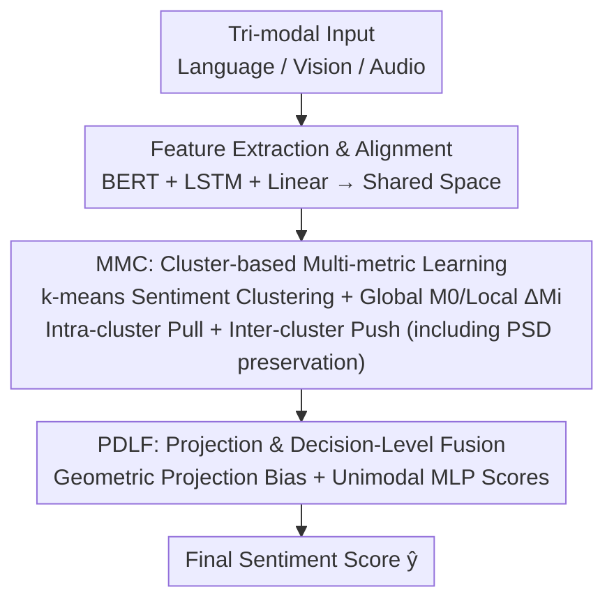

# Multi-Metric Representation Learning Strategy Based on Clustering for Fine-Grained Multimodal Sentiment Analysis

**Conference**: CVPR 2026  
**Paper**: [CVF Open Access](https://openaccess.thecvf.com/content/CVPR2026/html/Wang_Multi-Metric_Representation_Learning_Strategy_Based_on_Clustering_for_Fine-Grained_Multimodal_CVPR_2026_paper.html)  
**Code**: https://github.com/hurriedpi/MMRest  
**Area**: Multimodal VLM  
**Keywords**: Multimodal sentiment analysis, multi-metric learning, sentiment clustering, geometric projection, lightweight

## TL;DR
To address the problem of "overlapping sentiment centers and ambiguous fine-grained boundaries" after fusing different modalities into the same representation space, MMRest first performs k-means sentiment clustering on tri-modal representations. It then employs a multi-metric learning strategy involving a global metric and cluster-specific local metrics to pull similar sentiments closer and push dissimilar ones further apart. Finally, a Projection and Decision-Level Fusion (PDLF) mechanism adds the geometric projection bias derived from the metrics to unimodal prediction scores. MMRest outperforms SOTA models on CMU-MOSI/MOSEI with approximately 30% of the parameters compared to Transformer-based methods.

## Background & Motivation

**Background**: Multimodal Sentiment Analysis (MSA) understands human emotions by fusing language, vision, and audio. Mainstream methods are categorized into multimodal fusion strategies (frequently using cross-modal attention with text as the dominant modality) and multimodal representation learning strategies (using multi-layer contrastive learning to learn joint representations from positive and negative pairs across unimodal and multimodal combinations).

**Limitations of Prior Work**: The authors identify a critical ignored issue: when integrating data from different modalities into the same representation space, **sentiment centers tend to overlap**. Representations of different sentiment categories cluster too closely, blurring decision boundaries. t-SNE visualizations of DMD and MCL-MCF representations confirm that even SOTA models exhibit this overlap. The authors argue that the training processes of these models are dominated by "modality": they distinguish modalities well but are weak at distinguishing different **sentiment centers**. Worse, Transformers and contrastive learning introduce high computational overhead.

**Key Challenge**: Models are proficient at "distinguishing modalities" but deficient at "distinguishing sentiments." During fusion, modality information overrides fine-grained sentiment information, causing sentiment centers to cluster together in the shared space.

**Goal**: The objective is to develop a method that **directly models intra-cluster (same sentiment) and inter-cluster (different sentiment) relationships** to pull same-sentiment representations together and push different ones apart, thereby alleviating sentiment center overlap. The method must also be more lightweight than Transformer or multi-layer contrastive learning models.

**Key Insight**: Transform the problem into "metric learning + clustering." First, perform clustering based on sentiment in the shared space to obscure modality information. Then, learn a global metric for "commonalities shared by all clusters" and local metrics for the "uniqueness of each sentiment cluster," using these metrics to directly characterize the distance between sentiments.

**Core Idea**: Utilize "Cluster-based Multi-metric Learning (Global + Local Metrics)" to model intra-cluster compactness and inter-cluster separation for fine-grained sentiments. Then, inject the metric information into the final sentiment score as a bias via geometric projection. The entire process avoids cross-modal attention to remain lightweight.

## Method

### Overall Architecture
MMRest consists of two modules in series: **MMC** (Multi-metric Multimodal learning on Clusters), responsible for reshaping the emotional structure of the representation space, and **PDLF** (Projection and Decision-Level Fusion), responsible for integrating metric information into the final prediction. The process is as follows: tri-modal inputs $X_m\,(m\in\{L,V,A\})$ undergo feature extraction—BERT provides the first token for language, and LSTMs provide the last hidden states for vision/audio. Linear layers align the language dimension to $d_1$. Aligned representations are subjected to k-means clustering (based on sentiment labels) in a shared space. A global metric $M_0$ and cluster-specific local metrics $\Delta M_i$ are learned using intra/inter-cluster hinge losses to pull same sentiments closer and push different ones apart. During training, eigenvalue decomposition is used to ensure the metric matrices are positive semi-definite. Finally, PDLF calculates geometric projection biases using the optimal metrics and adds them to intermediate scores obtained via unimodal Conv1D+MLP blocks to output the final sentiment score $\hat y$. The system contains no cross-modal attention, resulting in significantly fewer parameters.

### Key Designs

**1. MMC: Cluster-based Multi-metric Learning to directly separate overlapping sentiment centers**

This module addresses the root cause of "sentiment center overlap." It first performs clustering in the shared space: using the CMU-MOSI/MOSEI label range $[-3,3]$, the range is divided into 7 intervals assigned cluster labels $0\!-\!6$ (e.g., $[-3,-2.5]$ as 0). k-means then partitions representations into $k$ clusters (a hyperparameter), which **obscures modality information**. The receptive field $R_i$ of each cluster center $C_{e_i}$ is defined by the $M$ nearest representations, and sentiment labels are assigned to clusters via a voting mechanism based on the label distribution within the receptive field. The essence of multi-metric learning is that fine-grained sentiments have both commonalities and uniqueness; thus, a **global metric** $M_0$ captures commonalities across all clusters, while **local metrics** $\Delta M_i$ capture uniqueness for each cluster. Intra-cluster compactness uses a hinge loss $L^{(i)}_{intra}=\max\big(0,\sum_{(p,q)\in S_i}d_{M_i}(C_p,C_q)-\sum_{(p,q)\in D_i}d_{M_i}(C_p,C_q)+\xi\big)$, where the metric distance is $d_{M_i}(C_p,C_q)=(C_p-C_q)^{\top}M_i(C_p-C_q)$, $M_i=M_0+\Delta M_i+\beta I$ ($\beta I$ prevents $M_0+\Delta M_i$ from being ill-conditioned), and $S_i/D_i$ are same/different sentiment pairs within the receptive field. Inter-cluster separation utilizes a triplet-like loss $L^{(ij)}_{inter}=\sum_n\max\big(0,d_{M_i}(C_n,C_{e_i})-d_{M_j}(C_n,C_{e_j})+\rho_{ij}\big)$, requiring distances to the assigned cluster center and other centers to differ by at least $\rho_{ij}=\alpha\lVert C_{e_j}-C_{e_i}\rVert_2^2$ (an adaptive margin based on cluster center distance). The total loss is $L_{MMC}=L_{total\text{-}intra}+v_1 L_{total\text{-}inter}+v_2\lVert M_0\rVert_F^2$.

A crucial training detail is **positive semi-definiteness (PSD) preservation**: updating $M_0$ and $\Delta M_i$ directly via Adam can result in non-PSD matrices, destroying the validity of the Mahalanobis distance. Consequently, each Adam update is first symmetrized $M_0^{(t+1/2)}=\tfrac12\big(\mathrm{Adam}(M_0^{(t)})+\mathrm{Adam}(M_0^{(t)})^{\top}\big)$, followed by eigenvalue decomposition $Q\Lambda Q^{\top}=\mathrm{Eig}(M_0^{(t+1/2)})$. Negative eigenvalues are truncated to zero: $M_0^{(t+1)}=Q\,\mathrm{diag}(\max(0,\lambda_1),\dots)\,Q^{\top}$, forcing the metric matrices to be PSD.

**2. PDLF: Injecting metric information into unimodal predictions via geometric projection bias to avoid cross-modal attention**

While MMC learns optimal $M_i$ and cluster centers, the authors argue that "pooling all multimodal data for sentiment clustering may lose unimodal differences." The most direct way to integrate MMC and PDLF would be mapping to the same space (requiring decomposition of $M_i$ into $U^{\top}U$), but matrix decomposition is computationally expensive and introduces information loss. PDLF's innovation is integrating the optimal metric with unimodal predictions as a **"bias"** in two parts. **Part I (Geometric Projection Bias)**: Tri-modal representations are concatenated as $C_f$, and the Mahalanobis distance to each cluster center is calculated under each metric $M_i$. After finding the nearest cluster center $C_{e_{near}}$ and the second nearest $C_{e_{s\text{-}near}}$, let $u=C_f-C_{e_{near}}$ and $v=C_{e_{s\text{-}near}}-C_{e_{near}}$. The projection is calculated as $\mathrm{bias}_{multi}=\frac{\sum(u\cdot M_0)\odot u}{\sqrt{\sum(v\cdot M_0)\odot v}}$, and averaged across tri-modal blocks to obtain $\mathrm{bias}$. Geometrically, this is the metric projection of $u$ onto the "nearest-to-second-nearest cluster center" vector, providing interpretability while bypassing cross-attention. **Part II (Decision-Level Score)**: Unimodal representations are processed via Conv1D for dimension unification, concatenated, and passed through another Conv1D and MLP to obtain an intermediate score $\hat y'$. The final result is $\hat y=\hat y'+\gamma\,\mathrm{bias}$, with total loss $L=\eta L_{MMC}+L_{task}$ (where $L_{task}$ is L1 loss).

### Loss & Training
The total loss is $L=\eta L_{MMC}+L_{task}$, where $L_{MMC}=L_{total\text{-}intra}+v_1 L_{total\text{-}inter}+v_2\lVert M_0\rVert_F^2$ and $L_{task}$ is the L1 loss. Metric matrices are kept PSD at each step via "symmetrization + eigenvalue truncation." Training is conducted on unaligned data with batch sizes of 64/128 for CMU-MOSI/MOSEI. Models are trained on a single RTX 4070Ti Super (16GB) with early stopping (patience=10).

## Key Experimental Results

### Main Results
Evaluated on CMU-MOSI (2199 segments, 1284/229/686 split) and CMU-MOSEI (22856 segments, 16326/1871/4659 split). Metrics include MAE, Pearson Correlation (Corr), 7/5/3/2-class accuracy (Acc-7/5/3/2), and F1-score (Acc-2 and F1 are reported for "negative/non-negative" and "negative/positive" splits; the table below uses the latter).

| Dataset | Metric | MMRest (Ours) | MCL-MCF | DEVA |
|--------|------|-------------|---------|------|
| CMU-MOSI | Acc-2↑ | **84.64/86.78** | 82.22/84.30 | 84.40/86.29 |
| CMU-MOSI | Acc-5↑ | **56.42** | 55.10 | 51.78 |
| CMU-MOSI | Acc-7↑ | **48.98** | 47.52 | 46.32 |
| CMU-MOSI | MAE↓ | **0.683** | 0.693 | 0.730 |
| CMU-MOSI | Corr↑ | 0.802 | **0.807** | 0.787 |
| CMU-MOSEI | Acc-5↑ | **56.52** | 55.93 | 55.32 |
| CMU-MOSEI | Acc-7↑ | **54.72** | 54.06 | 52.26 |
| CMU-MOSEI | MAE↓ | **0.531** | 0.539 | 0.541 |

Compared to the second-best MCL-MCF on MOSI, Acc-5 and Acc-7 improved by 1.32% and 1.46%, respectively. The authors hypothesize that on smaller datasets, the massive multi-layer contrastive networks of MCL-MCF focus excessively on inter-modal interaction and learn redundant information, whereas MMRest focuses directly on sentiment modeling. Note: Corr on MOSI (0.802) is slightly lower than MCL-MCF (0.807), and the performance gap narrows on the larger MOSEI (Acc-2 improvement of +0.75%).

### Ablation Study
(CMU-MOSI, Acc-5/Acc-7)

| Configuration | Acc-5↑ | Acc-7↑ | Description |
|------|--------|--------|------|
| Full MMRest ($L_{MMC}$ + bias) | 56.42 | 48.98 | Full model |
| w/o bias (Remove PDLF projection) | 54.08 | 47.52 | Decreases 2.34 / 1.46 |
| w/o $L_{MMC}$ & bias | 51.60 | 45.19 | Further removal of clustering loss, decreases 4.82 / 3.79 |
| Single Metric (SM, $M_0/\Delta M_i$ as identity) | 80.76(Acc-2) | — | Significant degradation in Acc-5/7 and MAE |

Modality Ablation: Text-only maintains reasonable predictive power; audio-only or vision-only **fails to train properly**. Tri-modal fusion yields significant gains (up to +4.16%), validating that PDLF facilitates necessary modal interaction.

### Key Findings
- **Multi-metric clustering loss $L_{MMC}$ is the primary contributor**: Removing $L_{MMC}$ and bias causes Acc-5/Acc-7 on MOSI to drop by 4.82%/3.79%, proving that structural constraints (intra-cluster compactness + inter-cluster separation) are core to alleviating sentiment center overlap.
- **Geometric projection bias provides tangible gains**: Removing only the bias results in a 2.34%/1.46% drop, demonstrating that injecting optimal metrics as biases into unimodal predictions is effective.
- **Multi-metric > Single metric**: Replacing learnable $M_0/\Delta M_i$ with identity matrices only slightly affects Acc-2/Corr but severely degrades Acc-5/Acc-7/MAE, confirming that multi-metric learning is vital for fine-grained (multi-class) sentiment modeling.
- **Lightweight**: Parameter count is approximately 30% of MAG-BERT (the lightest Transformer method). MCL-MCF requires 2–3x the memory and runtime of MMRest while performing worse across both datasets.

## Highlights & Insights
- **Treats "sentiment center overlap" explicitly as a metric learning problem**: Uses k-means clustering + global/local dual metrics to directly shape sentiment clusters, providing interpretability without stacking attention layers.
- **Geometric projection bias bypasses matrix decomposition**: Injecting metric information as a projection along the "nearest-to-second-nearest cluster center" direction maintains geometric interpretability while avoiding $M_i=U^{\top}U$ decomposition complexity.
- **PSD preservation optimization is reusable**: Any end-to-end Mahalanobis metric learning work faces non-PSD issues; the "symmetrization + eigenvalue truncation" projection step is a clean, transferable trick.
- **Efficiency is a key selling point**: Trainable on consumer-grade hardware (4070Ti Super) with 30% of the parameters of competitors, making it practical for resource-constrained sentiment analysis deployments.

## Limitations & Future Work
- **Dependency on $k$ and cluster granularity**: The number of clusters $k$ and the interval-based range division (7 segments) are hand-tuned hyperparameters that require adjustment for different labeling scales.
- **Diminishing gains on large datasets**: Improvements on the larger, more challenging CMU-MOSEI are smaller than on MOSI, suggesting the strategy is particularly beneficial for suppressing redundancy in small-to-medium data regimes.
- **Validated only on tri-modal MSA**: The method is tied to L/V/A modalities and $[-3,3]$ continuous sentiment labels; its applicability to other multimodal tasks or discrete labels remains to be tested.
- **Potential improvements**: Making $k$ and cluster assignments learnable/adaptive, or extending the geometric projection bias to multiple neighboring cluster centers to capture more complex emotional manifolds.

## Related Work & Insights
- **vs. MCL-MCF (Multi-layer Contrastive Learning)**: MCL-MCF designs numerous contrastive pairs across unimodal/multimodal combinations, resulting in a large network focused on inter-modal interaction. MMRest uses cluster-based metrics to model sentiment relations directly, saving parameters and achieving higher fine-grained accuracy.
- **vs. DMD / Cross-modal Attention Methods**: These rely on computationally heavy attention for interaction; t-SNE shows their sentiment centers still overlap. MMRest replaces attention with metric learning to reshape the sentiment space.
- **vs. Traditional Multi-metric Learning (CDMML / DMLCN)**: Prior works often focus only on local metrics; MMRest utilizes a "shared" structure—learning a global $M_0$ and local $\Delta M_i$ simultaneously—and is the first to apply this to fine-grained multimodal sentiment analysis.

## Rating
- Novelty: ⭐⭐⭐⭐ Introducing multi-metric learning + clustering to MSA to solve "sentiment center overlap" is a fresh perspective, though the components (k-means, metric learning) are established tools.
- Experimental Thoroughness: ⭐⭐⭐⭐ Dual benchmarks + 11 baselines + three categories of ablation + efficiency and t-SNE visualizations. Some analyses (variance, cases, hyperparameters) are in the supplementary material.
- Writing Quality: ⭐⭐⭐⭐ Motivation and geometric intuition are clear; however, the PDLF section is notation-heavy, and Table 2's layout is slightly confusing.
- Value: ⭐⭐⭐⭐ Lightweight and open-source, offering practical value for sentiment analysis under computing constraints. Scope is somewhat narrow (specifically tri-modal MSA).

<!-- RELATED:START -->

## Related Papers

- [\[CVPR 2026\] Factorize, Reconstruct, Enhance: A Unified Framework for Multimodal Sentiment Analysis](factorize_reconstruct_enhance_a_unified_framework_for_multimodal_sentiment_analy.md)
- [\[CVPR 2026\] Conflict-Aware Adaptive Cross-Reconstruction for Multimodal Sentiment Analysis](conflict-aware_adaptive_cross-reconstruction_for_multimodal_sentiment_analysis.md)
- [\[CVPR 2026\] Prototype-as-Prompt: Multimodal Sentiment Prototypes Endowing Large Language Models the Capability to Perform Multimodal Sentiment Analysis](prototype-as-prompt_multimodal_sentiment_prototypes_endowing_large_language_mode.md)
- [\[CVPR 2026\] Enhance-then-Balance Modality Collaboration for Robust Multimodal Sentiment Analysis](enhance-then-balance_modality_collaboration_for_robust_multimodal_sentiment_anal.md)
- [\[CVPR 2026\] CICA: Coupling Confidence-Aware Pretraining with Confidence-Informed Attention for Robust Multimodal Sentiment Analysis](cica_coupling_confidence-aware_pretraining_with_confidence-informed_attention_fo.md)

<!-- RELATED:END -->
