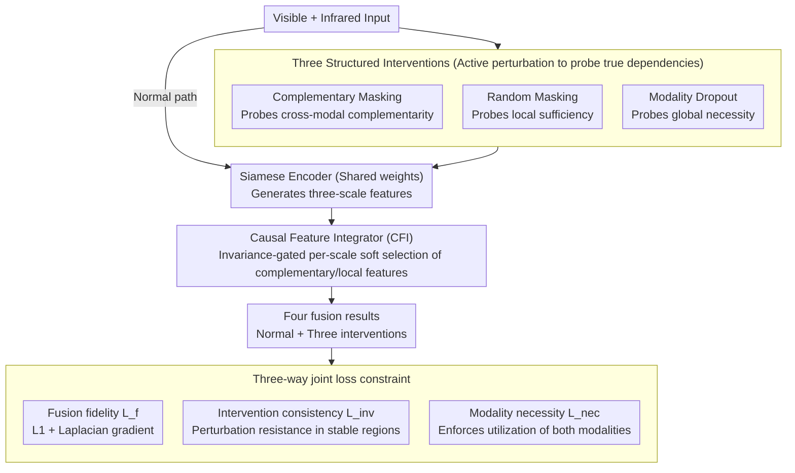

# Multi-Modal Image Fusion via Intervention-Stable Feature Learning

**Conference**: CVPR 2026  
**arXiv**: [2603.23272](https://arxiv.org/abs/2603.23272)  
**Code**: Coming soon  
**Area**: Multi-modal VLM  
**Keywords**: Multi-modal image fusion, causal inference, intervention learning, infrared and visible image fusion, feature stability

## TL;DR

A multi-modal image fusion framework inspired by causal inference is proposed. By probing true inter-modal dependencies through three structured intervention strategies (complementary masking, random masking, and modality dropout), and designing a Causal Feature Integrator (CFI) to learn intervention-stable features, the method achieves a PSNR of 66.02 and AG of 4.129 on MSRS, with an object detection mAP of 0.821.

## Background & Motivation

1. **Background**: Multi-modal image fusion (MMIF) integrates complementary information from different modalities into a unified representation. Infrared-visible image fusion (IVIF) is the most typical sub-task, merging thermal semantics from infrared with texture details from visible light. Current SOTA methods utilize complex architectures (dual-stream CNNs, Transformer global attention, diffusion models) to model cross-modal relationships.

2. **Limitations of Prior Work**: All existing methods share a fundamental limitation—they learn from observational data without distinguishing between true complementary relationships and spurious statistical regularities. When thermal signals systematically co-occur with specific visible light patterns in the training set, models capture these statistical associations rather than understanding if they reflect meaningful dependencies. This leads to feature selection based on co-occurrence frequency rather than actual contribution to fusion quality.

3. **Key Challenge**: Correlation $\neq$ causality. Models trained only on input-output pairs cannot determine if observed inter-modal correlations are causal or coincidental. According to Pearl's causal hierarchy, current MMIF methods operate entirely at the "Association" level, lacking reasoning capabilities at the "Intervention" and "Counterfactual" levels.

4. **Goal**: How to design principled intervention strategies to probe true inter-modal dependencies and learn fusion features that remain stable across intervention patterns, thereby overcoming vulnerabilities caused by spurious correlations?

5. **Key Insight**: Inspired by Pearl's causal hierarchy, three complementary structured perturbation strategies are designed, each testing different aspects of modal relationships. The core hypothesis is that features truly essential for fusion should maintain their importance under different intervention patterns, while spurious correlations will collapse under perturbation.

6. **Core Idea**: Replace "passive observation + statistical fitting" with "active perturbation + stability screening"—systematically intervening in inputs to discover features that are invariant across interventions as a reliable basis for fusion decisions.

## Method

### Overall Architecture

A U-Net-style Siamese architecture is adopted. Two weight-sharing encoders process visible and infrared inputs separately, generating three scales of features $\{\Theta_1^v, \Theta_2^v, \Theta_3^v\}$ and $\{\Theta_1^i, \Theta_2^i, \Theta_3^i\}$. The Causal Feature Integrator (CFI) is embedded in the decoder to perform intervention-aware fusion at each scale. During training, the model executes three interventions simultaneously, outputting four fusion results (normal + three interventions), jointly constrained by three loss functions.

### Key Designs

**1. Three Structured Interventions: Probing "Is this dependency real?" from three dimensions**

The root of spurious correlation is that the model only sees input-output pairs. This work actively perturbs inputs to see which feature importance withstands the perturbation. **Complementary Masking** applies spatially disjoint masks $\mathcal{M}^v \cap \mathcal{M}^i = \mathbf{O}$—the masked area in one modality is exactly what is preserved in the other; if the fusion remains high-quality, it proves true complementarity where modalities "fill in" for each other. **Random Masking** applies the same random mask $\mathcal{M}^r$ to both modalities; feature combinations that maintain quality under partial observability represent robust **local sufficiency**. **Modality Dropout** sets one modality entirely to zero, forcing the model to reveal its dependence on a single modality to test **global necessity** and prevent degradation into single-modality reliance.

**2. Causal Feature Integrator (CFI): Replacing "statistical significance weighting" with a gate**

After intervention, a module is needed to select intervention-stable features at each scale. At scale $k$, CFI first performs bidirectional cross-modal attention—visible light acts as the query to search infrared key/values to obtain $\Theta_k^{v \to i}$, and vice-versa for $\Theta_k^{i \to v}$. Two paths aggregate into complementary features $\Theta_k^c = \Theta_k^{v \to i} + \Theta_k^{i \to v}$ and local features $\Theta_k^l = \Theta_k^i + \Theta_k^v$. The crucial step is the **learnable invariance gate**, which computes a pixel-wise weight from complementary features to perform soft selection:

$$\mathcal{G}_k = \sigma(\text{Conv}_{3 \times 3}(\Theta_k^c)), \qquad \Theta_k^{\text{CFI}} = \mathcal{G}_k \odot \Theta_k^c + (1 - \mathcal{G}_k) \odot \Theta_k^l$$

High gate values select cross-modal complementary features (stable under intervention), while low values retreat to local features. Unlike traditional attention weighting, CFI explicitly incorporates "intervention stability" into the gating.

**3. Three-way loss: Nailing down fusion quality, intervention stability, and modal balance**

The total loss $\mathcal{L} = \mathcal{L}_f + \alpha \mathcal{L}_{\text{inv}} + \beta \mathcal{L}_{\text{nec}}$ addresses specific failure modes. The fusion fidelity loss $\mathcal{L}_f$ uses L1 reconstruction and Laplacian gradients to maintain pixel and edge quality. The intervention consistency loss $\mathcal{L}_{\text{inv}}$ penalizes differences between standard and intervened outputs only in gate-selected stable regions, with spatial entropy regularization to prevent the gate from collapsing. The modality necessity loss $\mathcal{L}_{\text{nec}}$ maximizes the difference between normal and single-modality fusion, forcing the model to utilize both modalities.

### Loss & Training

- **Fusion Fidelity Loss**: $\mathcal{L}_f = \|I_f - I_{vi}\|_1 + \|I_f - I_{ir}\|_1 + \lambda_1 \|\nabla I_f - \max(\nabla I_{vi}, \nabla I_{ir})\|_1$
- **Intervention Consistency Loss**: Penalizes discrepancies between complementary/random masked fusion and standard fusion in gated regions.
- **Modality Necessity Loss**: $\mathcal{L}_{\text{nec}} = \|I_f - I_f^i\|_1 + \|I_f - I_f^v\|_1$
- Hyperparameters: $\alpha = 0.1$, $\beta = 0.05$, $\lambda_1 = 1.0$, mask size $16 \times 16$, random mask count 1-6.
- Trained on RTX 4090 for 50 epochs, Adam optimizer, lr=1e-4, batch size 16.

## Key Experimental Results

### Main Results (Infrared and Visible Fusion)

| Method | TNO-AG | TNO-PSNR | MSRS-AG | MSRS-PSNR | MSRS-CC | M3FD-AG | M3FD-PSNR |
|------|--------|----------|---------|-----------|---------|---------|-----------|
| DCEvo | 3.942 | 61.24 | 3.807 | 64.49 | 0.605 | 4.575 | 61.33 |
| Conti | 3.860 | 61.12 | 3.737 | 64.26 | 0.603 | 4.476 | 61.11 |
| LRRNet | 3.855 | 61.72 | 2.672 | 64.68 | 0.515 | 3.613 | 62.95 |
| **Ours** | **5.128** | **62.06** | **4.129** | **66.02** | **0.646** | **5.276** | **62.13** |

| Downstream Task | Method | Metric |
|----------|------|------|
| Object Detection (M3FD) | Ours | mAP=**0.821** |
| Object Detection (M3FD) | SAGE | mAP=0.815 |
| Semantic Segmentation (MSRS) | Ours | mIoU=**0.747** |
| Semantic Segmentation (MSRS) | A2RNet | mIoU=0.740 |

### Ablation Study

| Configuration | AG | SF | PSNR | CC | Qabf |
|------|----|----|------|----|------|
| w/o CFI | 5.764 | 5.972 | 60.21 | 0.544 | 0.428 |
| w/o L_inv | 5.179 | 5.728 | 58.08 | 0.573 | 0.331 |
| w/o L_nec | 4.016 | 4.018 | 61.39 | 0.393 | 0.368 |
| w/o L_nec & L_inv | 3.361 | 3.478 | 59.85 | 0.524 | 0.312 |
| w/o Int (L_f only) | 5.332 | 5.348 | **63.95** | **0.598** | 0.524 |
| **Full Model** | **6.136** | **6.244** | 63.62 | 0.605 | 0.467 |

### Key Findings

- **Trade-off between Intervention and Non-intervention**: w/o Int (pure correlation learning) actually performs better in PSNR and Qabf, but AG and SF (structural integrity and texture richness) are significantly lower. This reveals an inherent contradiction: correlation-driven optimization favors pixel fidelity, while intervention-driven frameworks prioritize structural stability.
- **Modality Necessity Loss has the highest impact**: Removing $\mathcal{L}_{\text{nec}}$ causes AG to drop from 6.136 to 4.016, indicating the model heavily biases toward a single modality without this constraint.
- **ATE analysis validates intervention effects**: Modality dropout has the largest effect (as expected), random masking the smallest (indicating learned local sufficiency), and complementary masking a moderate effect (confirming cross-modal compensation capability).
- **Cross-domain generalization**: Models trained on IVIF transfer directly to medical image fusion (MRI-PET/SPECT) with optimal AG and SF, proving intervention learns universal fusion principles.

## Highlights & Insights

- **Introducing causal inference to image fusion** provides conceptual depth: Rather than treating "causality" as a mere label, the work designs three intervention strategies and quantifies effects via ATE analysis, forming a complete causal analysis loop.
- **"Intervention stability" as a feature selection criterion** is highly transferable: It is applicable not only to image fusion but also to any multi-modal task requiring robust feature screening (e.g., sentiment analysis, sensor fusion).
- The **w/o Int vs. Full** comparison reveals that PSNR is not the ultimate fusion metric; structure/texture preservation (AG/SF) might be more critical for downstream tasks.

## Limitations & Future Work

- Intervention parameters (mask size, count) rely on empirical tuning rather than theoretical guidance.
- Weights for the three interventions ($\alpha, \beta$) are manually set and may not be optimal.
- Only IVIF and medical fusion are verified; other combinations like RGB-Depth or RGB-Event are not explored.
- The "causal" framework remains largely heuristic—complementary masking is closer to data augmentation than rigorous causal intervention.
- Computational overhead is not reported; performing three interventions simultaneously significantly increases training-time forward passes.

## Related Work & Insights

- **vs CDDFuse**: CDDFuse uses Transformer+CNN for global/local features based on statistical learning. Ours uses intervention training to separate true complementarity from spurious correlation.
- **vs Mask-DiFuser**: Diffusion-based methods produce high quality but don't consider feature robustness. Our intervention framework could be integrated with diffusion models.
- **vs Causal Representation Learning**: This work transfers causal ideas from low-light enhancement and self-supervised learning to fusion, adapting for the lack of explicit labels and the fact that modal complementarity often violates independence assumptions.

## Rating

- Novelty: ⭐⭐⭐⭐ The perspective of bringing causal inference to image fusion is novel; intervention strategies are principled.
- Experimental Thoroughness: ⭐⭐⭐⭐ Three IVIF benchmarks + medical fusion + detection/segmentation tasks; exhaustive ablation and convincing ATE analysis.
- Writing Quality: ⭐⭐⭐⭐ Causal motivation is clear, though some notation could be more consistent.
- Value: ⭐⭐⭐⭐ Proposes a new training paradigm (intervention learning over pure correlation) with verified effectiveness and generalization.

<!-- RELATED:START -->

## Related Papers

- [\[CVPR 2026\] ReCoFuse: Ultra-Robust Image Fusion via Restorative Multi-Modal Diffusion Reciprocal Coupling](recofuse_ultra-robust_image_fusion_via_restorative_multi-modal_diffusion_recipro.md)
- [\[CVPR 2026\] Intervention-Aware Multiscale Representation Learning from Imaging Phenomics and Perturbation Transcriptomics](intervention-aware_multiscale_representation_learning_from_imaging_phenomics_and.md)
- [\[CVPR 2026\] Multi-Hierarchical Contrastive Spectral Fusion for Multi-View Clustering](multi-hierarchical_contrastive_spectral_fusion_for_multi-view_clustering.md)
- [\[CVPR 2026\] VideoFusion: A Spatio-Temporal Collaborative Network for Multi-modal Video Fusion](videofusion_a_spatio-temporal_collaborative_network_for_multi-modal_video_fusion.md)
- [\[CVPR 2025\] Multi-Layer Visual Feature Fusion in Multimodal LLMs: Methods, Analysis, and Best Practices](../../CVPR2025/multimodal_vlm/multi-layer_visual_feature_fusion_in_multimodal_llms_methods_analysis_and_best_p.md)

<!-- RELATED:END -->
