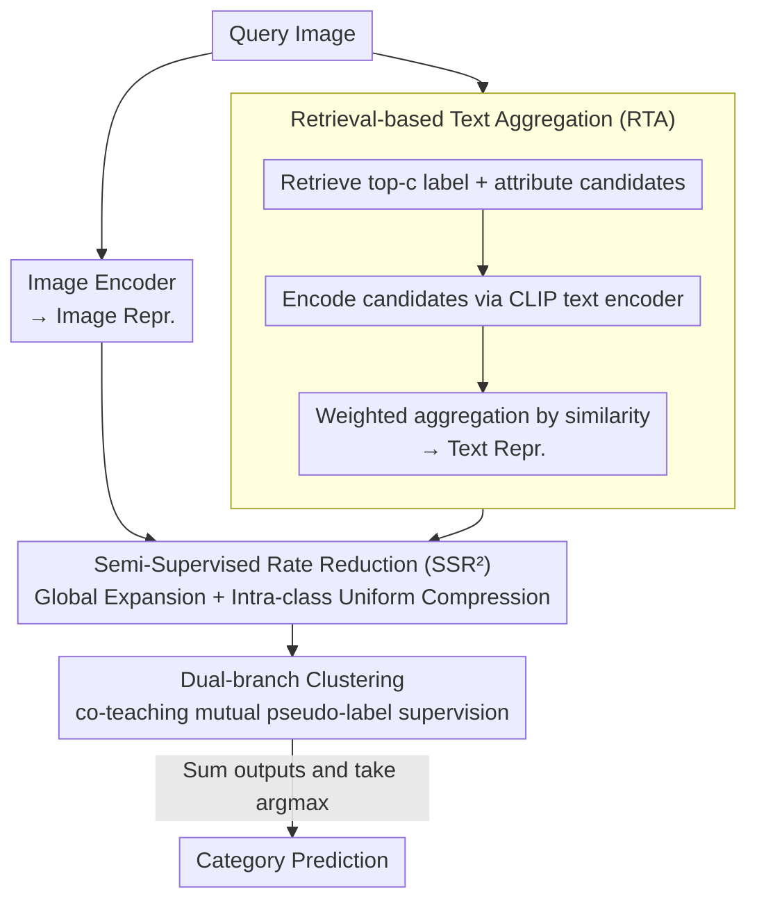

# Multi-Modal Representation Learning via Semi-Supervised Rate Reduction for Generalized Category Discovery

**Conference**: CVPR2026  
**arXiv**: [2602.19910](https://arxiv.org/abs/2602.19910)  
**Code**: To be confirmed  
**Area**: Multi-modal VLM  
**Keywords**: Generalized Category Discovery, Multi-modal Representation Learning, Semi-Supervised Rate Reduction, Intra-modal Alignment, CLIP

## TL;DR

Ours proposes the SSR²-GCD framework, which learns structured representations with balanced intra-modal compression via a Semi-Supervised Rate Reduction loss. Combined with a Retrieval-based Text Aggregation strategy to enhance cross-modal knowledge transfer, it outperforms existing multi-modal GCD methods across 8 datasets.

## Background & Motivation

1.  **Practical Demands of Generalized Category Discovery (GCD)**: Real-world data contains both known and unknown categories. GCD aims to leverage knowledge from known categories to discover unknown ones, serving as a natural extension of open-set recognition.
2.  **Rise of Multi-modal Methods**: Recently, methods like CLIP-GCD, TextGCD, and GET have introduced textual information into visual GCD tasks, improving performance through cross-modal alignment.
3.  **Limitations of Inter-modal Alignment**: Existing multi-modal GCD methods focus primarily on inter-modal alignment while neglecting the structural issues within intra-modal representation distributions.
4.  **Imbalanced Compression Issue**: Traditional contrastive learning loss $\mathcal{L}_{\text{con}}$, composed of an unsupervised term (pulling all augmented pairs) and a supervised term (pulling only labeled data of known categories), leads to over-compression of known categories and under-compression of unknown categories, resulting in blurred cluster boundaries.
5.  **CLIP Long Text Limitations**: CLIP performs poorly when encoding long text prompts exceeding 20 tokens; traditional concatenated prompt construction is sub-optimal.
6.  **Inter-modal Alignment May Be Harmful**: Simply stacking inter-modal alignment loss with intra-modal loss may inadvertently disrupt the learning of intra-modal representations.

## Method

### Overall Architecture
SSR²-GCD addresses the "over-compression of seen classes and under-compression of unseen classes" representation imbalance in multi-modal GCD. The pipeline starts with Retrieval-based Text Aggregation (RTA) to generate a robust textual representation for each image. Image and text representations are then processed via a Semi-Supervised Rate Reduction (SSR²) loss for representation learning. Finally, a dual-branch classifier learns pseudo-labels from both modalities with mutual supervision.

### Key Designs

**1. Retrieval-based Text Aggregation (RTA): Bypassing CLIP long-text bottlenecks via weighted aggregation in embedding space**

CLIP encodes long prompts (over 20 tokens) poorly, making concatenated prompts sub-optimal. RTA adopts the label and attribute dictionaries from TextGCD to retrieve the $c$ most similar label and attribute candidates for each query image. Instead of concatenating them into a single string, they are encoded separately and then aggregated via weighting:

$$\boldsymbol{z}^{\text{T}} = \sum_{i=1}^{c} \sigma_i \mathcal{F}^{\text{T}}(\mathcal{T}(a_i)) + \sum_{i=1}^{c} \sigma_i \mathcal{F}^{\text{T}}(\mathcal{T}(b_i))$$

Weights are assigned as $1-\alpha$ for the most similar candidate and $\frac{\alpha}{c-1}$ for others ($\alpha=0.5, c=4$). This avoids long-text degradation while integrating more candidate information.

**2. Semi-Supervised Rate Reduction (SSR²): Enforcing balanced compression via information-theoretic principles**

Traditional contrastive loss $\mathcal{L}_{\text{con}}$ over-compresses seen classes and under-compresses unseen classes. SSR² re-designs the loss based on the Maximal Coding Rate Reduction principle:

$$\mathcal{L}_{\text{SSR}^2} = -R(\mathbf{Z}) + R_c^{\text{s}}(\mathbf{Z}_{\text{s}}, \mathbf{Y}^*) + R_c^{\text{u}}(\mathbf{Z}_{\text{u}}, \mathbf{Y})$$

Where $R(\mathbf{Z})$ is the overall coding rate, maximized to expand all representations in the global space; $R_c^{\text{s}}$ compresses seen classes using ground-truth labels $\mathbf{Y}^*$; $R_c^{\text{u}}$ compresses unseen classes using pseudo-labels $\mathbf{Y}$ predicted by the classifier. Applied to both encoders ($\mathcal{L}_{\text{SSR}^2}^{\text{I}}$ and $\mathcal{L}_{\text{SSR}^2}^{\text{T}}$), this "global expansion + intra-class uniform compression" ensures balanced low-dimensional subspace representations for both seen and unseen classes.

**3. Dual-branch Clustering: Mutual pseudo-label supervision via co-teaching**

Pseudo-labels from different modalities vary in quality. Training occurs in two stages: a warm-up phase using $\mathcal{L}_{\text{warm}} = \mathcal{L}_{\text{SSR}^2}^{\text{I}} + \mathcal{L}_{\text{SSR}^2}^{\text{T}} + \mathcal{L}_{\text{cls}}^{\text{I}} + \mathcal{L}_{\text{cls}}^{\text{T}}$ to initialize representations and classifiers, followed by an alignment phase adding a co-teaching loss $\mathcal{L}_{\text{co-teach}}$ for mutual supervision of high-confidence samples. Final predictions are obtained by $\arg\max(\boldsymbol{y}_i^{\text{I}} + \boldsymbol{y}_i^{\text{T}})$.

## Key Experimental Results

### Main Results (8 Datasets, All ACC %)

| Dataset | TextGCD | GET | **SSR²-GCD** | Gain |
|---|---|---|---|---|
| ImageNet-100 | 88.0 | 91.7 | **92.1** | +0.4 |
| ImageNet-1k | 64.8 | 62.4 | **66.7** | +1.9 |
| CIFAR-10 | 98.2 | 97.2 | **98.5** | +0.3 |
| CIFAR-100 | 85.7 | 82.1 | **86.4** | +0.7 |
| CUB-200 | 76.6 | 77.0 | **78.3** | +1.3 |
| Stanford Cars | 86.1 | 78.5 | **89.2** | +3.1 |
| Oxford Pets | 93.7 | 91.1 | **95.7** | +2.0 |
| Flowers102 | 87.2 | 85.5 | **93.5** | +6.3 |

Gains are particularly significant on Stanford Cars (+3.1%) and Flowers102 (+6.3%).

### Comparison of Representation Learning Methods (All ACC %)

| Loss Config | CIFAR-10 | Stanford Cars | Flowers102 |
|---|---|---|---|
| $\mathcal{L}_{\text{CLIP}}$ (Inter-modal only) | 98.3 | 87.0 | 89.7 |
| $\mathcal{L}_{\text{con}}$ (Intra-modal only) | 98.4 | 87.9 | 91.8 |
| $\mathcal{L}_{\text{SSR}^2}$ (Intra-modal only) | **98.5** | **89.2** | **93.5** |
| $\mathcal{L}_{\text{CLIP}} + \mathcal{L}_{\text{SSR}^2}$ | 98.3 | 88.1 | 92.9 |

Key Finding: Stacking inter-modal alignment loss actually decreases performance.

### Ablation Study (Stanford Cars / Flowers102, All ACC %)

| Dual | RTA | SSR² | Stanford Cars | Flowers102 |
|---|---|---|---|---|
| ✗ | ✗ | ✗ | 75.2 | 78.3 |
| ✓ | ✗ | ✗ | 81.7 | 83.9 |
| ✓ | ✓ | ✗ | 86.0 | 87.4 |
| ✓ | ✗ | ✓ | 85.5 | 89.1 |
| ✓ | ✓ | ✓ | **89.2** | **93.5** |

Each of the three components contributes independently, with their combination yielding the best results.

## Highlights & Insights

- **Novel Theoretical Perspective**: First to introduce the Maximal Coding Rate Reduction principle to multi-modal GCD, replacing traditional contrastive learning with an information-theoretic framework to provide balanced compression guarantees.
- **Counter-intuitive but Convincing Finding**: Inter-modal alignment can be harmful in multi-modal GCD; intra-modal alignment alone can implicitly achieve inter-modal alignment.
- **In-depth Experimental Analysis**: Validates core arguments through multiple perspectives including similarity distribution maps, effective rank curves, $R_e$ consistency metrics, and t-SNE visualizations.
- **Clever RTA Design**: Circumvents CLIP long-text constraints by performing weighted aggregation in the embedding space, allowing the integration of more candidate information.

## Limitations & Future Work

- Computational and memory overhead increases linearly as candidate count $c$ grows (requires multiple passes through the CLIP text encoder).
- Image and text modalities are treated equally, lacking an adaptive modality importance weighting mechanism.
- Category count $K$ must be known or estimated; robustness to incorrect estimation of the number of unknown categories is not discussed.
- Validated only on CLIP-B/16 backbone; performance of larger models (ViT-L/H) remains unexplored.
- The unlabeled portion of semi-supervised rate reduction depends on pseudo-label quality; noise in early pseudo-labels might affect convergence.

## Related Work & Insights

| Method | Text Generation | Representation Learning | Clustering Strategy | Features |
|---|---|---|---|---|
| TextGCD | Concat top-3 labels + top-2 attrs | $\mathcal{L}_{\text{CLIP}}$ (Inter) | Dual-branch + co-teaching | First multi-modal GCD, but ignores intra-modal alignment |
| GET | Prompt via text inversion network | $\mathcal{L}_{\text{CLIP}}+\mathcal{L}_{\text{con}}$ | Single-branch MLP | Uses both inter and intra, but simple stacking |
| CLIP-GCD | Knowledge base retrieval | $\mathcal{L}_{\text{CLIP}}$ | SimGCD clustering | Only utilizes inter-modal alignment |
| **SSR²-GCD** | RTA weighted aggregation | $\mathcal{L}_{\text{SSR}^2}$ (Intra only) | Dual-branch + co-teaching | First to solve imbalanced compression without inter-modal alignment |

## Rating

- Novelty: ⭐⭐⭐⭐ — Unique perspective by introducing rate reduction to multi-modal GCD; discovery of "harmful inter-modal alignment" is insightful.
- Experimental Thoroughness: ⭐⭐⭐⭐⭐ — Comprehensive evaluation on 8 datasets, comparison of 6 representation learning configurations, and multi-dimensional analysis (rank, consistency, distribution, visualization).
- Writing Quality: ⭐⭐⭐⭐ — Clear structure and rigorous mathematical derivation, though some notation is dense.
- Value: ⭐⭐⭐⭐ — Provides a new direction for representation learning in multi-modal GCD, with significant improvements on fine-grained datasets.

<!-- RELATED:START -->

## Related Papers

- [\[ICLR 2026\] SpectralGCD: Spectral Concept Selection and Cross-modal Representation Learning for Generalized Category Discovery](../../ICLR2026/multimodal_vlm/spectralgcd_spectral_concept_selection_and_cross-modal_representation_learning_f.md)
- [\[CVPR 2026\] IsoCLIP: Decomposing CLIP Projectors for Efficient Intra-modal Alignment](isoclip_decomposing_clip_projectors_for_efficient_intramodal_alignment.md)
- [\[CVPR 2026\] VideoFusion: A Spatio-Temporal Collaborative Network for Multi-modal Video Fusion](videofusion_a_spatio-temporal_collaborative_network_for_multi-modal_video_fusion.md)
- [\[CVPR 2026\] BriMA: Bridged Modality Adaptation for Multi-Modal Continual Action Quality Assessment](brima_bridged_modality_adaptation_for_multi-modal_continual_action_quality_asses.md)
- [\[CVPR 2026\] Continual Learning with Vision-Language Models via Semantic-Geometry Preservation](continual_learning_with_vision-language_models_via_semantic-geometry_preservatio.md)

<!-- RELATED:END -->
