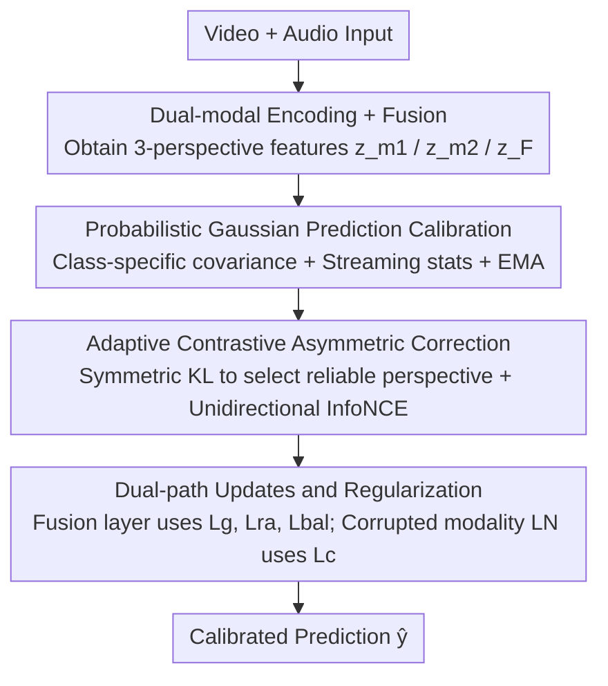

# Multi-modal Test-time Adaptation via Adaptive Probabilistic Gaussian Calibration

**Conference**: CVPR 2026  
**Paper**: [CVF Open Access](https://openaccess.thecvf.com/content/CVPR2026/html/Xu_Multi-modal_Test-time_Adaptation_via_Adaptive_Probabilistic_Gaussian_Calibration_CVPR_2026_paper.html)  
**Code**: https://github.com/XuJinglinn/AdaPGC  
**Area**: Multi-modal VLM / Test-time Adaptation  
**Keywords**: Multi-modal TTA, Gaussian Discriminant Analysis, Class-conditional distribution, Modality asymmetry, Contrastive correction

## TL;DR
To address the failure of class-conditional distribution modeling caused by "modality distribution asymmetry" in Multi-modal Test-time Adaptation (TTA), AdaPGC explicitly models the feature distribution of each class using a probabilistic Gaussian model with class-specific covariances. It further suppresses the bias of corrupted modalities through contrastive correction based on symmetric KL divergence, achieving SOTA results across most corruption settings on Kinetics50-C and VGGSound-C.

## Background & Motivation

**Background**: Multi-modal TTA dynamically adjusts pre-trained multi-modal models during the inference stage using unlabeled target data to defend against distribution shifts (e.g., cameras contaminated by rain/fog, microphones mixed with noise). Representative methods such as READ enhance robustness by amplifying high-confidence predictions and suppressing noisy ones, while SuMi and TSA further improve performance through smoothing, cross-modal sharing, or selective adaptation.

**Limitations of Prior Work**: Most of these methods rely on black-box neural networks to directly output predictions **without explicitly modeling the class-conditional distribution** $p(x\mid y=c)$. The authors demonstrate through experiments (Figure 1 in the original paper) that the lack of explicit modeling leads to lower prediction accuracy and irregular decision boundaries, whereas explicit modeling of class-conditional distributions provides smoother boundaries and more accurate predictions.

**Key Challenge**: Existing single-modal TTA methods (e.g., DOTA, BayesTTA) have made progress by explicitly modeling class-conditional distributions using classic Gaussian Discriminant Analysis (GDA), but these fail when directly applied to multi-modal scenarios. The root cause is **modality distribution asymmetry**—real-world corruptions often affect only one specific modality (e.g., wet ground after rain primarily interferes with LiDAR, while night scenes primarily interfere with cameras), causing only a subset of modalities in a batch to shift. Classic GDA treats corrupted and clean modalities equally by using class-specific means but **shared covariances**, which leads to biased mean estimation and contaminated covariance dispersion.

**Goal**: (1) Explicitly model class-conditional distributions in unsupervised, source-free multi-modal TTA; (2) Mitigate the disruption of this modeling caused by modality asymmetry.

**Key Insight**: Replace the "shared covariance" in classic GDA with "class-specific covariance" and maintain a set of Gaussian parameters for each of the three perspectives (two single modalities plus one fusion). Subsequently, identify which modality is contaminated through a comparison of distribution differences between single-modal and fusion predictions for targeted correction.

**Core Idea**: AdaPGC combines a "streaming probabilistic Gaussian model with class-specific covariances" for explicit class-conditional distribution modeling and "symmetric KL detection + unidirectional contrastive alignment" to offset modality asymmetry.

## Method

### Overall Architecture
During test time, AdaPGC processes a target data stream $D_{target}=\{x^t_i\}$. Each sample contains two modalities (e.g., video $m_1$, audio $m_2$), which are passed through their respective encoders $\phi_1, \phi_2$ and a fusion layer $F$ to obtain three $d$-dimensional penultimate features $z_{m_1}, z_{m_2}, z_F$. The process comprises two main modules: **Probabilistic Gaussian Prediction Calibration** (providing calibrated logits using streaming class-conditional Gaussian distributions) and **Adaptive Contrastive Asymmetric Correction** (identifying corrupted modalities and performing unidirectional feature alignment). Finally, a test-time optimization step is completed under **dual-path updates and regularization** to output the calibrated prediction $\hat y_i$.

### Key Designs

**1. Probabilistic Gaussian Prediction Calibration: Explicitly modeling class-conditional distributions using streaming Gaussians with class-specific covariances**

To address the failure of classic GDA shared covariance in multi-modal settings, this module maintains a set of **class-specific** Gaussian parameters $(\mu^t_{m,c}, \Sigma^t_{m,c}, \pi^t_{m,c})$ for each perspective $m\in\{m_1,m_2,F\}$ and each class $c$. The corresponding log-posterior score is:
$$g_{m,c}(z) = -\tfrac{1}{2}(z-\mu^t_{m,c})^\top \Sigma_c^{-1}(z-\mu^t_{m,c}) + \log\pi^t_{m,c} - \tfrac{1}{2}\log|\Sigma^t_{m,c}| + \text{const}.$$
Since neither supervision nor source data is available, parameters cannot be estimated accurately at once. The authors employ **streaming updates**: maintaining soft counts $N_c$, first-order statistics $S_c=\sum \gamma_{ic}z_i$, and second-order statistics $Q_c=\sum \gamma_{ic}z_iz_i^\top$ (where $\gamma_{ic}$ is the soft assignment responsibility from the source model). This allows for incremental updates of $\mu_c=S_c/N_c$ and $\Sigma_c=Q_c/N_c-\mu_c\mu_c^\top$, followed by EMA smoothing with $\alpha=0.9$ (Eq. 13). This approach avoids storing historical samples while numerically stabilizing the evolving distribution. For initialization, the source model linear classification head $s_c(z)=w_c^\top z+b_c$ is equivalently embedded: setting $\mu^0_{m,c}=w_c$, $\Sigma^0_{m,c}=I$, and $\log\pi^0_{m,c}=b_c+\tfrac12\|w_c\|^2+\tfrac12\log|\Sigma^0_{m,c}|$, which aligns the initial log-posterior with the source classifier. Finally, source logits are fused with GDA evidence $l(z_F)=s(z_F)+\lambda\, g_F(z_F)$. To prevent direct interference and confidence oscillation between the two, a **soft prediction alignment loss** $L_g=-\mathbb{E}[\sum_c p^{lp}_c\log p^{src}_c]$ is added (where $p^{lp}$ is derived from the log-posterior with gradient truncation used as a reference) to gently pull the source decision surface toward the log-posterior.

**2. Adaptive Contrastive Asymmetric Correction: Identifying the corrupted modality and unidirectionally aligning it with the reliable modality**

Modality asymmetry distorts mean/covariance estimation, undermining the previous module. The key is to **automatically determine which modality is contaminated**. Given that the fusion prediction $p(c\mid z_F)$ is more robust than either single-modality prediction, the authors use symmetric KL divergence to measure the discrepancy between each single-modality prediction and the fusion prediction:
$$D^t_{m,i}=\mathrm{SKL}\big(p(c\mid z^t_{m,i}),\, p(c\mid z^t_{F,i})\big),\quad \mathrm{SKL}(p,q)=\tfrac12\big(\mathrm{KL}(p\|q)+\mathrm{KL}(q\|p)\big).$$
The modality with the larger discrepancy from the fusion prediction is judged to have shifted. Accordingly, the current batch is divided into two sets: $I^t_{m_1}$ ($m_1$ corrupted) and $I^t_{m_2}$ ($m_2$ corrupted). During correction, the feature space aligned by contrastive learning during the pre-training phase is utilized with **unidirectional InfoNCE**: only the unreliable side receives gradients, while the reliable side is stop-grad to prevent mutual degradation (temperature $\tau=0.05$). For instance, for $i\in I^t_{m_1}$, the normalized $\hat z_{m_1,i}$ is pulled toward the stop-grad $\hat z_{m_2,i}$. This approach "pulls the corrupted modality back toward the reliable one" rather than using a simple weighted average, preserving clean modality information while correcting bias.

**3. Dual-path Updates and Regularization: Directing different losses to specific parameters with entropy regularization for stable optimization**

To prevent degradation during test-time optimization, two lightweight entropy regularizations are used: confidence regularization $L_{ra}=-\frac1B\sum_i u_i\log u_i$ (where $u_i=\max_c p_{i,c}$, suppressing over-confident predictions) and class balance regularization $L_{bal}=-\sum_c q_c\log q_c$ (encouraging class balance within a batch). The total loss is $L=L_{ra}+L_{bal}+w_c L_c+w_g L_g$, where only $L_g$ and $L_c$ carry weights. Crucially, the **update paths are strictly separated**: $L_g, L_{ra}, L_{bal}$ only update the fusion layer attention parameters $W_{\Theta_h}, B_{\Theta_h}$ ($h\in\{Q,K,V\}$) without modifying modal encoders; meanwhile, contrastive correction $L_c$ **only updates the LayerNorm in the encoder of the modality judged as corrupted**. This targeted "correct only what is corrupted" update reflects the core observation of modality asymmetry and avoids unnecessary perturbation of clean modalities.

### Loss & Training
The source model uses pre-trained CAV-MAE; Adam optimizer with a learning rate of $1\times10^{-4}$ and a batch size of 16; hyperparameters $w_c=0.01$, $w_g=1$, fusion weight $\lambda=1$; EMA rate $\alpha=0.9$. Theoretically, two RTX 4090s are used: one stores the source model and updates its parameters, while the other manages GDA model storage, updates, and predictions.

## Key Experimental Results

### Main Results
Two corrupted datasets: Kinetics50-C (50 human action classes, 15 visual corruptions + 6 audio corruptions) and VGGSound-C (309 audio-visual event classes). The metric used is the prediction accuracy under each corruption type and the average (Avg., %).

| Dataset (Corrupted Modality) | Source | READ | SuMi | TSA | AdaPGC |
|--------------------|--------|------|------|-----|--------|
| Kinetics50-C (Video, Avg.) | 59.9 | 62.5 | 63.9 | 64.5 | **66.1** |
| Kinetics50-C (Audio, Avg.) | 69.3 | 71.1 | 71.9 | 71.5 | **73.2** |
| VGGSound-C (Audio, Avg.) | 25.6 | 32.4 | 33.2 | 34.7 | **36.8** |
| VGGSound-C (Video, Avg.) | 56.0 | 56.9 | 57.3 | 56.9 | 57.0 |

AdaPGC achieves SOTA in 3 out of 4 settings, with significant gains in complex disturbances like fog, pixelation, and wind. The exception is **VGGSound-C video corruption** (57.0, slightly lower than SuMi's 57.3), indicating limited gains in the most difficult setting involving 309 classes and visual corruption.

### Ablation Study
Three components are decomposed on Kinetics50-C: Fusion Logits (FL, Eq. 14), Prediction Alignment loss (PA, Eq. 17), and Asymmetric Correction module (AR). FL+PA corresponds to the "classic GDA" setting, while the addition of AR completes AdaPGC.

| Configuration | Video-C Avg. | Audio-C Avg. | Description |
|------|--------------|--------------|------|
| None (baseline) | 63.81 | 71.88 | No components added |
| FL+PA (≈Classic GDA) | 64.90 | 72.90 | Explicit modeling only, no asymmetric correction |
| Full (FL+PA+AR) | **66.08** | **73.19** | Full model |

### Key Findings
- **All components are effective**: Accuracy in Video-C and Audio-C increases as each module is added to the baseline. AR provides a significant boost on top of FL+PA (Video-C 64.90→66.08), proving that "correcting modality asymmetry" is key to exceeding classic GDA.
- **Class-specific covariance is a prerequisite for explicit modeling**: The authors explicitly replace shared covariance with class-specific covariance because inter-class differences are not solely reflected in mean shifts.
- **Robustness to hyperparameters**: Accuracy remains largely stable across a broad range of values for fusion coefficient $\lambda$, contrastive weight $w_c$, and alignment weight $w_g$, with optimal results near $\lambda=1$ and $w_g=1$.

## Highlights & Insights
- **Transforming "modality asymmetry" from a diagnosis into an actionable mechanism**: Rather than generalizing multi-modal challenges, the paper points out that corruptions often affect only a single modality, thereby disrupting mean/covariance estimation in shared GDA. It quantifies "which modality is corrupted" using symmetric KL divergence—directly linking the diagnosis to the solution.
- **Ingenious equivalent initialization from source head to GDA**: By absorbing the linear bias $b_c$ into the class prior $\log\pi^0_{m,c}$, the GDA starting point is made identical to the source classifier. This acts as a "zero-cost hot start," allowing the model to gradually deviate from the source distribution via streaming statistics.
- **The "Unidirectional InfoNCE + Targeted LayerNorm Update" reflects a principle of restraint**: By using stop-grad on the reliable side and only updating the LN of the corrupted encoder, the method avoids contaminating clean modalities. This "minimal intervention" update path design is highly instructive.

## Limitations & Future Work
- **Lack of advantage in highly complex settings**: Performance on VGGSound-C video corruption (309 classes) at 57.0 is lower than SuMi, suggesting the benefits of explicit Gaussian modeling diminish when classes are numerous and visual corruption is severe.
- **Reliance on the "single modality corruption" assumption**: Symmetric KL detection categorizes each sample as either "$m_1$ corrupted" or "$m_2$ corrupted." If both modalities are simultaneously corrupted or both are clean, this hard partition might result in misjudgment (no specific dual-modality corruption experiments were provided).
- **Engineering cost of dual GPUs**: Storing the source and GDA models on separate cards, plus maintaining $d\times d$ covariances and $Q_c$ statistics for each class, leads to significant storage/computational overhead when the number of classes $C$ or feature dimension $d$ is high.
- Evaluation is limited to two synthetic corruption benchmarks (CAV-MAE backbone); its performance on real-world distribution shifts or with more modalities (e.g., LiDAR/Radar) remains to be verified.

## Related Work & Insights
- **vs. Classic GDA (DOTA / BayesTTA / ADAPT)**: These methods use GDA for explicit class-conditional modeling in single-modal TTA. This paper argues that multi-modal asymmetry causes shared covariance to fail, and the shift to class-specific covariance plus modality-level correction is a key "patch" for multi-modal expansion.
- **vs. READ**: READ maintains stability by constraining output predictions but does not continuously track feature distributions. AdaPGC tracks class statistics via incremental GDA to dynamically adjust decision boundaries.
- **vs. SuMi / TSA**: SuMi relies on smoothing and cross-modal sharing, while TSA selects uncorrupted modalities for correction; neither explicitly models the evolving class-conditional distribution. AdaPGC is more thorough in combining distribution modeling with asymmetric correction, outperforming them in most settings.

## Rating
- Novelty: ⭐⭐⭐⭐ Diagnosing modality asymmetry as "shared covariance failure" and correcting it with class-specific Gaussians and symmetric KL is a clear perspective with tight mechanism mapping.
- Experimental Thoroughness: ⭐⭐⭐⭐ Comprehensive across two benchmarks, multiple corruption types, and ablation studies, though lacks advantage in the most difficult setting and misses dual-modality corruption analysis.
- Writing Quality: ⭐⭐⭐⭐ Motivations (Figure 1) and mathematical derivations (initialization, streaming stats) are well-explained.
- Value: ⭐⭐⭐⭐ Provides a plug-and-play paradigm for multi-modal TTA involving explicit distribution modeling and modality-level correction; open-source and reproducible.

<!-- RELATED:START -->

## Related Papers

- [\[CVPR 2026\] Decoupling Stability and Plasticity for Multi-Modal Test-Time Adaptation](decoupling_stability_and_plasticity_for_multi-modal_test-time_adaptation.md)
- [\[CVPR 2026\] SoC: Semantic Orthogonal Calibration for Test-Time Prompt Tuning](soc_semantic_orthogonal_calibration_for_test-time_prompt_tuning.md)
- [\[CVPR 2026\] Condensed Test-Time Adaptation of VLMs for Action Recognition](condensed_test-time_adaptation_of_vlms_for_action_recognition.md)
- [\[CVPR 2026\] Dynamic Logits Adjustment and Exploration for Test-Time Adaptation in Vision Language Models](dynamic_logits_adjustment_and_exploration_for_test-time_adaptation_in_vision_lan.md)
- [\[CVPR 2026\] STAR: Test-Time Adaptation Can Enhance Universal Prompt Learning for Vision-Language Models](star_test-time_adaptation_can_enhance_universal_prompt_learning_for_vision-langu.md)

<!-- RELATED:END -->
