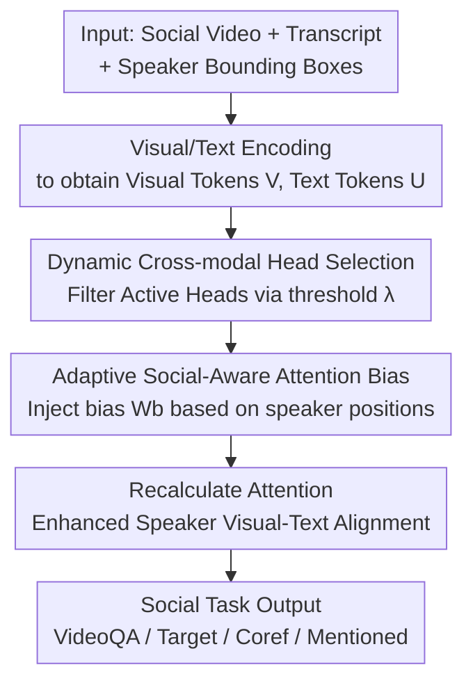

# Multi-speaker Attention Alignment for Multimodal Social Interaction

**Conference**: CVPR 2026  
**Paper**: [CVF Open Access](https://openaccess.thecvf.com/content/CVPR2026/html/Ouyang_Multi-speaker_Attention_Alignment_for_Multimodal_Social_Interaction_CVPR_2026_paper.html)  
**Code**: https://github.com/ut-vision/SocialInteraction  
**Area**: Multimodal VLM / Video Understanding  
**Keywords**: Multi-party Social Understanding, Cross-modal Attention, Speaker Alignment, Training-free Intervention, MLLM

## TL;DR
This paper discovers that Multimodal Large Language Models (MLLMs) suffer from severe cross-modal attention misalignment between "speaker text tokens and their corresponding visual regions" in multi-speaker dialogue scenarios. It proposes a **parameter-free and architecture-agnostic** attention alignment method: first, dynamically selecting attention heads responsible for visual grounding, then injecting an adaptive bias calculated from speaker positions into these heads to "weld" the visual features and dialogue of the same speaker together. This achieves an average improvement of 2~3% across three MLLMs and three datasets, setting new SOTA records.

## Background & Motivation
**Background**: Understanding social interactions in videos requires simultaneous reasoning about "who is speaking, to whom, and with what eye contact/gestures." MLLMs are considered natural candidates for such tasks (VideoQA, speaking target identification, pronoun coreference resolution, mentioned speaker prediction) due to their inherent ability to process language and vision.

**Limitations of Prior Work**: The authors observed a counter-intuitive phenomenon—feeding visual information to MLLMs **does not consistently improve, and can even degrade**, performance in multi-speaker scenarios. For instance, on OnlineMMSI, adding video frames to Qwen2.5-VL provides zero gain for "mentioned speaker prediction," while LLaMA-3.2-Vision suffers a drop in performance on "pronoun coreference resolution."

**Key Challenge**: The authors attribute the problem to **cross-modal attention misalignment** within the transformer. By quantifying the attention intensity from "speaker text tokens → the speaker's bounding box visual tokens," they found that alignment in multi-speaker videos is **far weaker and more dispersed** than in object-centric images like COCO (Table 1: COCO AttnMax is $9.23\times10^{-2}$, while MMSI is only $4.54\times10^{-2}$). The root cause is that speakers in dialogues often appear as anonymous/named references like "speaker 2" or "Mitchell," lacking explicit visual counterparts. Existing remedies, such as inserting box coordinates into text or drawing colored boxes on images, either maintain weak attention or cluster attention on box boundaries, sometimes incorrectly overlapping speaker 3's attention onto the speaker 2 region.

**Goal**: To realign "visual and textual representations of the same speaker" without damaging the pre-trained capabilities of the MLLM or introducing trainable parameters.

**Key Insight**: Since the problem lies in the attention distribution itself, **intervention should occur directly at the attention layers**, rather than relying on external prompt modifications or model retraining.

**Core Idea**: In a single sentence: **Inject an adaptive bias based on speaker positions only into the attention heads responsible for visual grounding, thereby softly pushing cross-modal attention toward the current speaker's region.**

## Method

### Overall Architecture
The method is a **lightweight intervention module plugged into existing MLLM cross-attention layers**. Inputs include social interaction videos (visual tokens $V$ sliced into spatio-temporal patches), transcriptions with timestamps and speaker labels (text tokens $U$), and bounding boxes $B$ for each speaker in every frame. The output is an alignment-enhanced attention distribution, leading to more accurate social task outputs. The pipeline consists of two steps: first, using **Dynamic Cross-modal Head Selection** to filter "active heads" (those performing visual grounding) from all attention heads to avoid damaging other capabilities; second, using **Adaptive Social-Aware Attention Bias** to boost the attention scores between text tokens of a speaker and their corresponding visual regions. No new trainable parameters are introduced, and box annotations are used only for localization during inference.

### Key Designs

**1. Dynamic Cross-modal Head Selection: Targeting grounding heads to avoid damaging pre-trained capabilities**

Modern MLLMs employ multi-head attention where different heads serve different functions. Research indicates that specific "visual heads" exist in certain layers that focus on image tokens, and these heads **change dynamically** based on the model and training strategy. Applying bias indiscriminately to all heads would disrupt those not responsible for visual grounding. The authors denote visual tokens within all speaker boxes as $V_{all}$, calculate the average cross-modal attention from all utterance tokens to these regions for each head, and classify a head as "active" using a threshold $\lambda$: if $\frac{1}{|U||V_{all}|}\sum_{u\in U}\sum_{v\in V_{all}}\mathrm{Attn}(u,v) > \lambda$, the head is "active." Active heads exhibit attention concentrated on one or two speaker regions, while inactive heads show weak attention across all regions. **Only active heads** receive the bias, preserving the model's original capabilities while enhancing grounding.

**2. Adaptive Social-Aware Attention Bias: Softly boosting alignment based on existing interaction strength**

Selecting the right heads is not enough; the magnitude of the bias must be determined. In active heads, the authors inject a bias for "text token $u_i$ of speaker $s$ at frame $t$ and its visual token $v_j$":

$$W_b(u_i, v_j) = \alpha \cdot \max_{v\in V_{all}} \frac{(u_i W_Q)(v W_K)^\top}{\sqrt{d}},\quad u_i\in U_{s,t},\ v_j\in V_{s,t}$$

Where $\alpha$ controls the bias intensity, and $\max_{v\in V_{all}}$ represents the **originally strongest cross-modal interaction** of that text token across all speaker visual tokens. This "adaptive" nature is critical: entity tokens like "speaker" or "Sheldon" naturally have strong visual interactions, while filler words like "yeah" or "then" have weak interactions. By using the maximum attention value of each token as its bias amount, the **magnitude of the boost is allocated according to the token's own visual relevance**, smoothly pushing the attention distribution toward the current speaker's region without brute-force constraints. The final adjusted attention is:

$$\widetilde{\mathrm{Attn}}(i,j) = \mathrm{softmax}_j\Big(\tfrac{(u_i W_Q)(v_j W_K)^\top}{\sqrt{d}} + W_b(u_i, v_j)\Big)$$

As the bias is derived entirely from existing attention scores and box positions, the method **introduces zero trainable parameters**. Since it only operates on dynamically selected active heads, the computational overhead is minimal.

### Loss & Training
The method itself is a training-free attention intervention. However, for fair comparison, both baseline MLLMs and the models enhanced with this method were fine-tuned using LoRA (rank=128, learning rate 1e-4, batch=4, 3 epochs) on three datasets. Key hyperparameters are $\lambda = 5\times10^{-5}$ and $\alpha = 1.0$. Videos were processed at $640\times360$ with 8 sampled frames, and results reflect the average of three independent runs.

## Key Experimental Results

### Cross-modal Alignment Diagnostics (Quantifying Motivation)
The authors used a comparison table to prove "misalignment exists and this method provides the strongest alignment." Higher AttnMax / AttnMean indicates stronger attention between speaker text and their visual regions:

| Image Source / Alignment Method | AttnMax ($\times10^{-2}$) | AttnMean ($\times10^{-4}$) |
|---|---|---|
| COCO (General objects) | 9.23 | 15.56 |
| MMSI (No intervention) | 4.54 | 3.26 |
| MMSI + Box Prompt | 4.49 | 3.93 |
| MMSI + Visual Prompt | 6.29 | 5.29 |
| MMSI + Fine-Tuning | 6.82 | 6.32 |
| **Ours** | **17.09** | **26.20** |

The raw alignment in multi-speaker scenarios (4.54) is significantly lower than in COCO (9.23). Inserting box coordinates, drawing colored frames, or even fine-tuning only results in marginal improvements. This method raises AttnMax to 17.09, **significantly exceeding all other remedies**.

### Main Results
Comparison across four social tasks (VideoQA, T=Speaking Target ID, P=Pronoun Coref, M=Mentioned Speaker Prediction) on TVQA+, MMSI, and OnlineMMSI. Input modalities: V=Video, L=Text, B=Speaker Box.

| Model | TVQA+ VideoQA | MMSI (T/P/M) | OnlineMMSI (T/P/M) | Gain (Avg) |
|---|---|---|---|---|
| Qwen2.5-VL (VLB) | 86.1 | 64.8 / 76.6 / 62.4 | 60.1 / 75.9 / 50.2 | — |
| **Qwen2.5-VL + Ours** | 87.3 | 68.5 / 78.6 / 66.0 | 62.4 / 78.2 / 53.1 | **+2.6** |
| LLaVA-NeXT-Video + Ours | 84.6 | 68.0 / 79.9 / 63.3 | 61.0 / 77.8 / 52.9 | +2.1 |
| InternVL3 + Ours | 89.1 | 69.7 / 80.5 / 65.7 | 62.6 / 79.7 / 55.2 | +3.2 |

All three MLLMs showed consistent improvements. Gains on MMSI were higher than on TVQA+, likely because MMSI averages 4.1 speakers per scene, better demonstrating the advantages of multi-speaker alignment (whereas TVQA+ scripts are fixed, potentially allowing models to learn name-token associations through fine-tuning). Unlike baseline methods that inject boxes/names/colors into text (which showed inconsistent results on Qwen2.5-VL), this method shows stable improvements across models, datasets, and tasks by **directly modifying the attention distribution**. The only task where it didn't rank first (ranking second) was "Speaking Target Identification," which the authors attribute to the need for balanced attention between the speaker and the target.

### Ablation Study

| Configuration | Key Result | Description |
|---|---|---|
| Layers 0-27 (All) | MMSI-T 66.9 | Applied to all layers |
| Layers 0-9 (Early) | MMSI-T 66.9 | Early layers |
| **Layers 10-19 (Middle)** | **MMSI-T 68.5 / TVQA+ 87.3** | Middle layers optimal |
| Layers 20-27 (Late) | MMSI-T 66.4 | Late layers |
| Active Head Ratio ~9% (λ=5e-5) | Avg +~3% | Effective with few heads |
| Active Head Ratio ~25% | Avg +~4% | Higher ratio, higher gain |

### Key Findings
- **Middle Layers are the Fusion Hub**: Applying bias only to the middle transformer layers (10-19) yields the best results, consistent with prior research identifying middle layers as the site of cross-modal feature fusion.
- **Few Heads are Sufficient**: Even with only ~9% of heads active at $\lambda=5\times10^{-5}$, an average gain of ~3% is achieved, proving that "selecting the right heads" is more effective than "applying to all."
- **Visual Evidence**: Attention maps show that without bias, the model misplaces Penny's attention on Beverley's region, leading to an incorrect answer; with bias, attention naturally congregates on Penny. Temporally, attention shifts from being "uniformly distributed" to "focused on key frames."

## Highlights & Insights
- **Quantifying the counter-intuitive "Adding Vision is Useless" as a diagnosable attention misalignment**: This is the most valuable insight—it is not that MLLMs are incapable, but that cross-modal attention is naturally dispersed in multi-party settings. The use of AttnMax/AttnMean provides a reusable "alignment metric" for future work.
- **Training-free, Zero Parameters, Plug-and-Play**: The bias is calculated from existing attention scores and box positions, allowing direct integration into various MLLMs (LLaVA-NeXT-Video / Qwen2.5-VL / InternVL3) with minimal migration cost.
- **Transferability of "Dynamic Selection + Adaptive Bias"**: This logic—identifying active grounding heads and softly boosting them based on inherent interaction strength—can be borrowed for any task aimed at enhancing specific token grounding without disrupting pre-trained capabilities.

## Limitations & Future Work
- **Reliance on Bounding Box Annotations**: Bias injection depends on boxes to localize speaker regions. The method is difficult to apply in box-free scenarios or when detection is inaccurate, as evaluation was conducted on datasets with provided box labels.
- **Suboptimal Performance in Speaker Target Identification**: This task requires balancing attention between the "current speaker" and the "target." The current method primarily reinforces "current speaker" alignment, suggesting that unidirectional bias has limitations for bidirectional attention tasks.
- **Empirical Hyperparameters**: $\lambda$, $\alpha$, and the layer range were determined via ablation. These may require retuning for different models or datasets. ⚠️ Bias formulas (Eq 4/5) should refer to the original text.
- **Future Directions**: Replacing box dependency with internal model-based speaker localization or expanding the bias to a bidirectional version for "speaker ↔ target" modeling.

## Related Work & Insights
- **vs MMSI / OnlineMMSI (Speaker Embeddings, Visual Prompts)**: These rely on injecting speaker embeddings or colored boxes into text/images. This work modifies internal transformer attention, offering stable gains without extra language prompts and providing the first systematic quantification of this misalignment.
- **vs Attention Modulation Methods (Boosting non-text modalities)**: While effective for standard VQA, such methods lack evaluation in multi-speaker social scenes. This is the first work to apply cross-attention map analysis to multi-party social tasks and validate it across three strong MLLMs.
- **vs MMSI + Fine-Tuning**: While fine-tuning improves downstream performance, the increase in alignment scores is limited (AttnMax only 6.82). This suggests that "performance gains" do not necessarily equate to "better alignment," whereas this method targets alignment directly.

## Rating
- Novelty: ⭐⭐⭐⭐⭐ First to quantify multi-speaker cross-modal attention misalignment and provide a training-free intervention.
- Experimental Thoroughness: ⭐⭐⭐⭐ Covers 3 MLLMs × 3 datasets × 4 tasks with visualization, though dependent on boxes.
- Writing Quality: ⭐⭐⭐⭐ Clear logic from diagnosis to method to validation.
- Value: ⭐⭐⭐⭐ Plug-and-play, transferable to various MLLMs and grounding tasks.

<!-- RELATED:START -->

## Related Papers

- [\[CVPR 2026\] Omni-MMSI: Toward Identity-Attributed Social Interaction Understanding](omni-mmsi_toward_identity-attributed_social_interaction_understanding.md)
- [\[CVPR 2026\] AMUSE: Audio-Visual Benchmark and Alignment Framework for Agentic Multi-Speaker Understanding](amuse_audio-visual_benchmark_and_alignment_framework_for_agentic_multi-speaker_u.md)
- [\[CVPR 2025\] DualTalk: Dual-Speaker Interaction for 3D Talking Head Conversations](../../CVPR2025/audio_speech/dualtalk_dual-speaker_interaction_for_3d_talking_head_conversations.md)
- [\[CVPR 2026\] HAVE-Bench: Hierarchical Audio-Visual Evaluation from Perception to Interaction](have-bench_hierarchical_audio-visual_evaluation_from_perception_to_interaction.md)
- [\[ICML 2026\] Towards Understanding Modality Interaction in Multimodal Language Models via Partial Information Decomposition](../../ICML2026/audio_speech/towards_understanding_modality_interaction_in_multimodal_language_models_via_par.md)

<!-- RELATED:END -->
