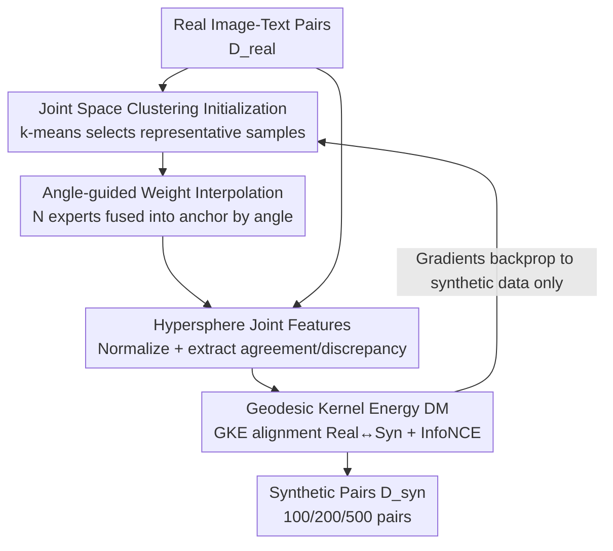

# Multimodal Distribution Matching for Vision-Language Dataset Distillation

**Conference**: CVPR 2026  
**arXiv**: [2605.23482](https://arxiv.org/abs/2605.23482)  
**Code**: Yes (Project Page)  
**Area**: Multimodal VLM / Dataset Distillation  
**Keywords**: Dataset Distillation, Distribution Matching, Image-Text Retrieval, Geometry-Aware, Cross-Architecture Generalization

## TL;DR
This paper proposes MDM (Multimodal Distribution Matching), a geometry-aware distribution matching framework for image-text dataset distillation. By intervening simultaneously at the data, model, and loss levels (joint space clustering initialization + angle-guided weight interpolation + geodesic kernel energy matching on the unit hypersphere), it directly aligns the joint distribution of real and synthetic data via single-level optimization. This reduces distillation costs by up to 98% compared to the trajectory-matching SOTA (LoRS) while outperforming baselines in cross-architecture generalization.

## Background & Motivation

**Background**: Dataset Distillation (DD) compresses a large training set into a tiny synthetic set, ensuring that a model trained on the synthetic set performs similarly to one trained on the full dataset. As systems increasingly process image-text paired inputs, Multimodal Dataset Distillation (MDD) has become essential. Synthetic sets must preserve both intra-modal statistical structures and cross-modal semantic correspondences.

**Limitations of Prior Work**: Existing multimodal distillation methods (MTT-VL, LoRS) are built on the **Matching Training Trajectory** (MTT) paradigm. These methods require repetitive bi-level optimization: first running teacher and student trajectories on real and synthetic data respectively, then updating the synthetic set using the trajectory difference. This introduces two major drawbacks: extremely high computational and memory overhead (LoRS takes 5–7 seconds per iteration and runs for 850–2350 iterations to converge), and the injection of **architecture bias**, as optimization is tied to the training dynamics of a specific architecture, leading to performance drops when switching encoders.

**Key Challenge**: The essence of the trajectory matching paradigm is fitting the "dynamics of a model on a specific optimization path" rather than fitting the "data distribution itself." The former is naturally bound to the source model's structure and path, meaning high cost and poor generalization are two sides of the same coin.

**Goal**: (1) Move away from trajectory replay towards lightweight single-level optimization; (2) Directly match distributions in a joint embedding space aligned with modern encoders to reduce sensitivity to specific architectures; (3) Maintain intra-modal statistics and cross-modal alignment in image-text paired scenarios.

**Key Insight**: In single-modal vision, **Distribution Matching** (DM) has emerged as an alternative—aligning distributions of real and synthetic features directly without replaying trajectories, offering better scalability, stability, and generalization. The authors observe that by bringing DM to the multimodal domain and making it "geometry-aware" on the unit hypersphere for joint features, one can achieve both computational efficiency and strong generalization.

**Core Idea**: Replace "replaying image-text training trajectories" with "directly matching real and synthetic joint distributions on a joint hypersphere," applying geometry-aware initialization and alignment at the data, model, and loss levels.

## Method

### Overall Architecture
MDM addresses the challenge of distilling a small set of image-text pairs (100–500) that preserve semantics and generalize across architectures without trajectory replay. Its mechanism is divided into three complementary levels: the **data level** uses k-means clustering in the joint image-text space to select representative real samples as initial values; the **model level** interpolates multiple independently fine-tuned expert models in the weight space based on "directional consistency" to obtain a frozen teacher that is close to the real distribution without favoring any single architecture; the **loss level** normalizes embeddings to a unit hypersphere, constructs "agreement" and "discrepancy" cross-modal features, and uses Geodesic Kernel Energy (GKE) to align these distributions, supplemented by bidirectional InfoNCE to maintain internal alignment.

The pipeline is: Real pairs → Joint space clustering for synthetic pair initialization → Refreshing an angle-guided interpolated frozen model every iteration → Mapping real/synthetic batches to the hypersphere to extract agreement/discrepancy features → Calculating gradients using GKE + InfoNCE, **backpropagating only to the synthetic data** (synthetic pairs are optimized parameters; the model remains frozen).

### Key Designs

**1. Joint Space Clustering Initialization: Covering Multimodal Semantic Patterns from the Start**

To address poor initial values where the optimization starting point deviates from the real manifold, the authors use an encoder $\Psi$ to project real pairs into joint embeddings $f_n$ by **concatenating** image and text features. They run k-means with $K=|\mathcal{D}_{\mathrm{syn}}|$ clusters to find centroids $c_k$. Each synthetic pair is initialized with the real sample within the cluster that has the highest cosine similarity to the centroid:

$$j_k=\arg\max_{n\in\mathcal{C}_k}\frac{f_n^\top c_k}{\|f_n\|_2\,\|c_k\|_2}$$

The key is using **concatenated joint features** for clustering, reflecting the multimodal structure rather than single modalities. This ensures the synthetic set covers joint semantic patterns without redundancy, providing a stable starting point. Ablations show that Gaussian noise initialization fails completely in retrieval (Mean 0.5), while joint clustering outperforms single-modality clustering.

**2. Angle-guided Weight Space Interpolation: Using "Directional Consistency" to Determine Step Size**

To address the dilemma of where to set the frozen teacher: too close to the pre-trained anchor results in underfitting; too much reliance on one fine-tuned expert results in architecture bias. The authors move the model toward the real distribution only where $N$ fine-tuned experts **align in direction**, retreating to the anchor when directions conflict. For anchor $\theta_0^m$ and expert displacements $\Delta_{i,\ell}^m=\theta_{(i),\ell}^m-\theta_{0,\ell}^m$ ($m\in\{v,t\}$ for image encoder/text projector), layer-wise fusion is performed:

$$\theta^m_{*,\ell}=\theta^m_{0,\ell}+\alpha\,t^m_\ell\cdot\tfrac{1}{2}\big(\Delta^m_{1,\ell}+\Delta^m_{2,\ell}\big),\quad t^m_\ell=\frac{2\langle\Delta^m_{1,\ell},\Delta^m_{2,\ell}\rangle}{\|\Delta^m_{1,\ell}\|_2\|\Delta^m_{2,\ell}\|_2+\langle\Delta^m_{1,\ell},\Delta^m_{2,\ell}\rangle}$$

The coefficient $t^m_\ell$ is determined by the angle between displacement vectors: **the larger the angle (expert inconsistency), the more the fusion relies on the anchor; the smaller the angle, the closer it moves to the real data.** $\alpha < 1$ (0.5 in experiments) further ensures robustness. By randomly sampling experts and checkpoints each iteration, the model level implicitly simulates real distribution dynamics, enhancing cross-architecture generalization.

**3. Geodesic Kernel Energy Distribution Matching: Aligning "Agreement" and "Discrepancy" on the Hypersphere**

This is the core loss of MDM. Image-text embeddings $(z^v,z^t)$ are normalized to the unit hypersphere $\mathbb{S}^{d-1}$. Two cross-modal features are constructed for each pair: **Agreement** (shared semantics) and **Discrepancy** (modal-specific components):

$$u=\mathrm{normalize}(z^v+z^t),\qquad g=\mathrm{normalize}(z^v-z^t)$$

Similarity is measured via geodesic (angular) distance $\phi(a,b)=\arccos(\langle a,b\rangle)$, mapped through a geodesic Gaussian kernel $k_{\mathrm{geo}}(a,b)=\exp(-\phi(a,b)^2/2\sigma^2)$. The **Geodesic Kernel Energy** (GKE, an MMD-type distance on the hypersphere) is defined for sets $\mathcal{A}$ and $\mathcal{B}$:

$$\mathsf{GKE}(\mathcal{A},\mathcal{B})=\Big[\tfrac{1}{m^2}\textstyle\sum_{i,i'}k_{\mathrm{geo}}(a_i,a_{i'})+\tfrac{1}{n^2}\sum_{j,j'}k_{\mathrm{geo}}(b_j,b_{j'})-\tfrac{2}{mn}\sum_{i,j}k_{\mathrm{geo}}(a_i,b_j)\Big]^{1/2}$$

Minimizing this increases cross-set affinity while calibrating intra-set patterns. Separate losses are calculated: $\mathcal{L}_{\mathrm{agr}}=\mathsf{GKE}(\mathcal{U}^r,\mathcal{U}^s)$ and $\mathcal{L}_{\mathrm{dis}}=\mathsf{GKE}(\mathcal{G}^r,\mathcal{G}^s)$. Splitting agreement and discrepancy is a key insight; ablations show that the discrepancy loss brings higher gains, indicating that modal-specific information is harder to learn but more valuable.

### Loss & Training
The total loss combines bidirectional InfoNCE with the two GKE terms:

$$\mathcal{L}_{\mathrm{MDM}}=\mathcal{L}_{\mathrm{InfoNCE}}+\lambda_{\mathrm{agr}}\cdot\mathcal{L}_{\mathrm{agr}}+\lambda_{\mathrm{dis}}\cdot\mathcal{L}_{\mathrm{dis}}$$

$\mathcal{L}_{\mathrm{InfoNCE}}$ ensures internal pair alignment. Hyperparameters: $\tau=0.07$, $\lambda_{\mathrm{agr}}=\lambda_{\mathrm{dis}}=0.8$, $\alpha=0.5$. Distillation uses SGD (momentum 0.5, clip 1.0) for up to 3000 iterations (usually converging much earlier). Text embeddings are 768-d; images are $3\times224\times224$. Retrieval scores are averaged across 5 independent initializations.

## Key Experimental Results

Encoders: NFNet (Vision) and BERT (Text), aligned with MTT-VL/LoRS. Datasets: Flickr8k, Flickr30k, COCO. Metrics: Recall @{1, 5, 10} for Text→Image (IR) and Image→Text (TR).

### Main Results

| Dataset (500 pairs) | Metric (Mean) | MDM (Ours) | LoRS (SOTA) | MTT-VL |
|--------|------|------|----------|--------|
| Flickr8k | Mean Recall | **26.2** | 25.0 | 15.1 |
| Flickr30k | Mean Recall | 30.6 | **31.6** | 25.0 |
| COCO | Mean Recall | **15.3** | 13.5 | 12.6 |

On the largest and most difficult COCO dataset, MDM significantly outperforms LoRS across all budgets. It leads on Flickr8k and is competitive with LoRS on Flickr30k. For reference, full-data training means are approx. 53.8 / 55.7 / 41.2.

### Cross-Architecture Generalization (Table 2: Source NFNet+BERT distilled, mean of 5 target pairs)

| Dataset (500 pairs) | LoRS Mean | MDM Mean |
|--------|------|------|
| Flickr8k | 10.2 | **16.2** |
| Flickr30k | 14.5 | **19.3** |
| COCO | 2.4 | **9.8** |

LoRS performance collapses significantly when architectures change (only 2.4 on COCO), whereas MDM remains consistently higher, proving that distribution matching distills "data-level distributions" rather than "source-model paths."

### Gain in Efficiency (Flickr8k, Table 3)

| Configuration | Time per Iter (s) | Iter to Converge | Total Time (min) |
|------|------|------|------|
| LoRS / 100 | 5.43 | 850 | 76.93 |
| MDM / 100 | 1.72 | 200 | **5.73 (↓93%)** |
| LoRS / 500 | 5.27 | 2350 | 206.41 |
| MDM / 500 | 4.41 | 50 | **3.68 (↓98%)** |

Total distillation time is reduced by up to 98% due to faster single-level iterations and drastically fewer iterations required for convergence.

### Ablation Study

| Configuration | IR | TR | Mean | Description |
|------|----|----|------|------|
| Init: Noise | 0.6 | 0.5 | 0.5 | Gaussian noise fails in retrieval |
| Init: Random Real | 18.6 | 22.6 | 20.6 | Already surpasses LoRS |
| Init: Joint Clustering (Ours) | 19.7 | 24.2 | **21.9** | Superior to single-modality clustering |
| Loss: InfoNCE only | 18.81 | 23.15 | 20.98 | Baseline alignment |
| + agreement | 18.82 | 23.23 | 21.02 | Small gain from agreement |
| + discrepancy | 19.22 | 23.84 | 21.53 | Discrepancy is more effective |
| + Full (Ours) | 19.73 | 24.15 | **21.94** | Optimal synergy |

### Key Findings
- **Discrepancy is more valuable than agreement**: Adding $\mathcal{L}_{\mathrm{dis}}$ alone (21.53) significantly outperforms adding $\mathcal{L}_{\mathrm{agr}}$ alone (21.02), indicating that modal-specific "separation" information is harder but more critical to capture.
- **Initialization is paramount in MDD**: Noise initialization results in a complete failure (Mean 0.5), unlike in single-modal classification distillation. Fine-grained image-text alignment requires the starting point to lie on the real manifold.
- **Cross-architecture generalization is a structural advantage** of distribution matching over trajectory matching, not a result of tuning.

## Highlights & Insights
- **Agreement/Discrepancy Decomposition**: Constructing $u=z^v+z^t$ and $g=z^v-z^t$ is an elegant decomposition that allows the matching to govern both shared and specific semantics. This approach is transferable to any multimodal alignment task.
- **Adaptive Fusion via Expert Angles**: Determining fusion strength by geometric consistency turns a hyperparameter problem into a geometric one. By refreshing checkpoints, it implicitly achieves the goals of MTT without the trajectory replay cost.
- **Geometry-Aware Hypersphere + GKE**: Operating on a hypersphere with geodesic metrics aligns naturally with $\ell_2$-normalized modern encoders, proving more effective than Euclidean MMD for retrieval structures.

## Limitations & Future Work
- MDM **depends on pre-trained image-text encoders**; it is unclear how it performs without them.
- Evaluation is limited to image-text retrieval (Flickr/COCO); it has not been tested on VQA or captioning tasks.
- The use of $N=2$ experts and constant weights $\lambda$ are somewhat ad hoc; adaptive weighting for the discrepancy term could be a future direction.

## Related Work & Insights
- **vs MTT-VL / LoRS (Trajectory Matching)**: They use bi-level optimization to update synthetic sets. MDM uses **single-level distribution matching**, distilling "data-level distributions." This leads to (1) 98% lower computational cost and (2) significantly better cross-architecture generalization.
- **vs Single-modal DM (DM/DataDAM)**: MDM extends these to multimodal settings by introducing agreement/discrepancy decomposition and geometry-aware initialization.
- **vs Coreset Selection**: Methods like Herding or K-Center can only select existing samples and cannot synthesize data, leading to significantly lower performance than MDM across all budgets.

## Rating
- Novelty: ⭐⭐⭐⭐ First systematic adaptation of distribution matching to MDD; the agreement/discrepancy split and angle-guided interpolation are insightful designs.
- Experimental Thoroughness: ⭐⭐⭐⭐ Covers various datasets, budgets, architectures, and efficiency metrics; however, it is restricted to retrieval tasks.
- Writing Quality: ⭐⭐⭐⭐ Clear three-level structure; equations are rigorous; and Figure 2 provides a good overview.
- Value: ⭐⭐⭐⭐ Reduces multimodal distillation costs by an order of magnitude while improving generalization, which is highly practical for resource-constrained scenarios.

<!-- RELATED:START -->

## Related Papers

- [\[CVPR 2026\] ReMatch: Boosting Representation through Matching for Multimodal Retrieval](rematch_boosting_representation_through_matching_for_multimodal_retrieval.md)
- [\[CVPR 2026\] VOLD: Reasoning Transfer from LLMs to Vision-Language Models via On-Policy Distillation](vold_reasoning_transfer_from_llms_to_vision-language_models_via_on-policy_distil.md)
- [\[CVPR 2026\] Uncertainty-Aware Knowledge Distillation for Multimodal Large Language Models](uncertainty-aware_knowledge_distillation_for_multimodal_large_language_models.md)
- [\[CVPR 2026\] RMIR: A Benchmark Dataset for Reasoning-Intensive Multimodal Image Retrieval](rmir_a_benchmark_dataset_for_reasoning-intensive_multimodal_image_retrieval.md)
- [\[CVPR 2026\] UNI-OOD: Unified Object- and Image-level Out-of-Distribution Detection via Cross-Context Attentive Vision-Language Modeling](uni-ood_unified_object-_and_image-level_out-of-distribution_detection_via_cross-.md)

<!-- RELATED:END -->
