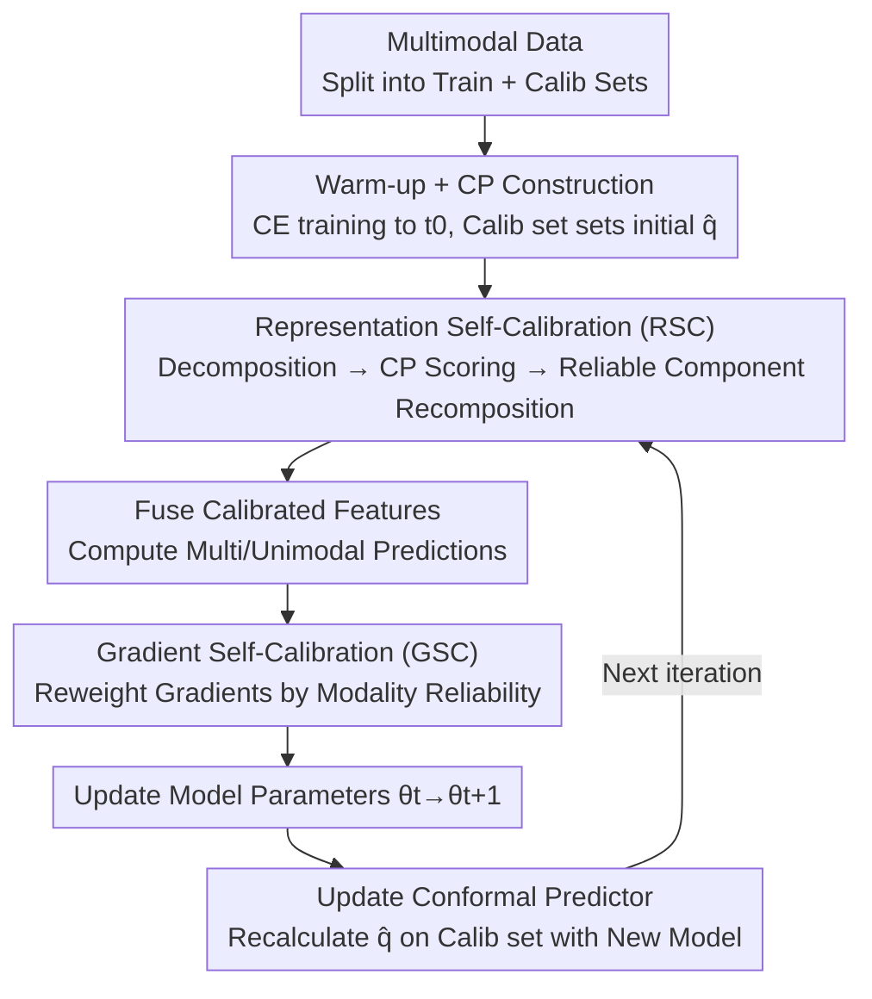

# Multimodal Learning on Low-Quality Data with Conformal Predictive Self-Calibration

**Conference**: CVPR 2026  
**arXiv**: [2605.03820](https://arxiv.org/abs/2605.03820)  
**Code**: https://github.com/XunCHN/CPSC (Available)  
**Area**: Multimodal VLM  
**Keywords**: Multimodal Learning, Conformal Prediction, Modality Imbalance, Noise Robustness, Self-calibrated Training

## TL;DR
This paper proposes CPSC (Conformal Predictive Self-Calibration), which attributes the seemingly independent "low-quality data" issues of modality imbalance and noise pollution to a single root cause—predictive uncertainty regarding the reliability of modalities or samples. It utilizes Conformal Prediction (CP) to generate real-time reliability scores during training, performing self-calibration at both the **feature level** (recomposing reliable feature components) and the **gradient level** (reweighting gradients by sample reliability), achieving new SOTA results across 6 datasets under imbalance and noise settings.

## Background & Motivation
**Background**: Real-world multimodal systems often face "low-quality data," primarily manifested as **implicit modality imbalance** (different modalities converge at different rates, causing the model to favor dominant modalities while ignoring weak ones) and **explicit noise pollution** (dynamic interference like Gaussian or salt-and-pepper noise in certain modalities). Current research typically **treats these two problems separately**: imbalance is addressed via weighted losses, gradient modulation, or resampling; noise is handled through robust fusion or reliability modeling.

**Limitations of Prior Work**: Divide-and-conquer solutions are only effective within their specific settings, lacking a unified framework for both problems. Furthermore, most methods are tied to specific architectures (late fusion weighting, intermediate layer guidance) or prior assumptions (e.g., Bayesian methods requiring priors), making them not model-agnostic.

**Key Challenge**: The authors point out that imbalance and noise **share the same root cause**—they both **increase the model's predictive uncertainty** (evidenced by the log-entropy of the predictive distribution in Fig.1). Imbalance causes weak modalities to be neglected, while noise injects erroneous information, both leading the model to produce "confident but unreliable" overconfident predictions. Since the root cause is identical, it should be addressed unifiedly by "quantifying and calibrating predictive uncertainty."

**Goal**: Design a **model-agnostic and distribution-free** predictive uncertainty quantification mechanism and embed it into the training loop, allowing the model to diagnose its own uncertainty and correct its learning trajectory during training.

**Key Insight**: The authors leverage **Conformal Prediction (CP)**—a statistical framework that provides prediction sets with finite-sample, distribution-free coverage guarantees. Unlike Bayesian methods, CP requires no priors and is naturally model-agnostic. However, most existing CP works are **post-hoc**, applied only after training. The novelty here is pulling CP **into the training loop for dynamic maintenance**, allowing it to co-evolve with the main model.

**Core Idea**: Utilize a CP model that refreshes dynamically during training to assign "reliability scores" to each feature component and sample-modality pair. These scores then calibrate **feature representations** and **gradient flow** simultaneously, treating imbalance and noise as a unified uncertainty problem.

## Method

### Overall Architecture
CPSC adds a "self-calibration training loop" to the standard multimodal training pipeline. Given training data with $M$ modalities, it is **randomly split into a training set $\mathcal{D}_{train}$ and a calibration set $\mathcal{D}_{cal}$** (the latter is used to calculate quantiles for the CP model). The process consists of two stages: a **warm-up phase** where the multimodal model $f_\theta=\{E^1,\dots,E^M,F\}$ (modality encoders + fusion classifier) is trained with standard cross-entropy until epoch $t_0$, followed by initializing the CP model using the calibration set (calculating nonconformity scores and the initial quantile $\hat{q}_{t_0}$). Then, the **self-calibration loop** begins, where each iteration performs: ① extracting unimodal features and applying Representation Self-Calibration (RSC) using the current CP model; ② fusing calibrated features for prediction; ③ applying Gradient Self-Calibration (GSC) using CP reliability scores followed by backpropagation; ④ updating model parameters $\theta_t\to\theta_{t+1}$; ⑤ recalculating quantiles on the calibration set with the updated model to refresh the CP model (CP Updating). Crucially, the **CP model shares parameters with the main model** (using the main classifier), ensuring that reliability judgments evolve synchronously with the model.

### Key Designs

**1. Conformal Predictor Construction and Co-updating**

The core of CP is the **nonconformity score**: for a sample $(x,y)$, $s(x,y)=1-f(x)_y$. A lower predictive probability for the true label results in a higher score, indicating an "abnormal" sample. Given a significance level $\alpha$, the quantile $\hat{q}$ is taken as the $\lceil(n+1)(1-\alpha)\rceil/n$ quantile of the $n$ scores in the calibration set to construct a prediction set $C(x)=\{y:s(x,y)\le\hat{q}\}$, ensuring marginal coverage $\mathbb{P}(y\in C(x))\ge 1-\alpha$. Instead of post-hoc application, this paper refreshes $\hat{q}_{t+1}$ by recalculating $s_i^{t+1}=1-f_{\theta_{t+1}}(x_i)_{y_i}$ on the calibration set **after every iteration** (Eq. 16–17). This ensures the CP model remains synchronized with the current model state, preventing "stale" uncertainty judgments.

**2. Representation Self-Calibration (RSC)**

To address noise contaminating features and weak modalities being overwhelmed, RSC decomposes unimodal features. Original features $h^m$ are mapped to a higher dimension via a modality-specific FC layer $W^m_{dec}\in\mathbb{R}^{l\times d}$ ($l=n\times d$) and ReLU to get $h^m_{high}$, which is split into $n$ components $\{c^m_k\}$, each $c^m_k\in\mathbb{R}^d$ capturing different aspects. A KL-divergence constraint is added: $\mathcal{L}^m_{div}=\frac{\lambda_1}{n}\sum_k D_{KL}(P(h^m)\|P(c^m_k))-\frac{\lambda_2}{n(n-1)}\sum_{i\neq j}D_{KL}(P(c^m_i)\|P(c^m_j))$ (consistency term pulls components toward the original feature core, while the diversity term pushes them apart; $\lambda_1=0.8, \lambda_2=0.2$).

Then, CP assigns **reliability scores** to each component: $c^m_k$ is fed to the unimodal classifier $F_m$ to get $p^m_k$, nonconformity scores $s(c^m_k,y)=1-p^m_k[y]$ are computed, and a prediction set $C(c^m_k)$ is constructed. The rank of the true label $y$ in the sorted scores determines the score: $r^m_k=1-\frac{\text{rank}[y,C(c^m_k)]}{|C(c^m_k)|}$. The top-$K$ components are averaged to obtain the calibrated feature $\tilde{h}^m$. Proposition 1 in the paper theoretically supports this by showing the deviation of the calibrated representation is bounded by the deviation of selected reliable components.

**3. Gradient Self-Calibration (GSC)**

While RSC handles features, GSC handles optimization. After obtaining the prediction $\hat{y}=F(\{\tilde{h}^m\})$, multimodal cross-entropy $\mathcal{L}_{CE}(\hat{y},y)$ and unimodal $\mathcal{L}^m_{CE}$ are computed. **Before** backpropagation, modality reliability is estimated: notably, **without using true labels**, the **multimodal predicted label $y'$** is used as a "collaborative judgment" to run a CP process similar to RSC, yielding modality reliability $\rho^m=1-\frac{\text{rank}(y',C(\tilde{h}^m))}{|C(\tilde{h}^m)|}$. This measures consistency between a modality and the collaborative judgment. Gradients are modulated via $w(\rho^m)=a\cdot\rho^m+b$: $\nabla_\theta\mathcal{L}^m_{GSC}=\frac{1}{|\mathcal{B}|}\sum_i w(\rho^m)\cdot\nabla_\theta\mathcal{L}^m_{CE}$. Samples/modalities with low reliability have their gradients suppressed.

### Loss & Training
The total objective is $\mathcal{L}=\mathcal{L}^{\text{mul}}_{CE}+\sum_{m=1}^M\mathcal{L}^m_{div}$. During parameter updates, the modulated unimodal gradients are added: $\theta\leftarrow\theta-\eta(\nabla_\theta\mathcal{L}+\nabla_\theta\mathcal{L}^m_{GSC})$. Hyperparameters include $t_0$, $\alpha$, $n$, $K$, $\lambda_1=0.8, \lambda_2=0.2$, and gradient weights $a, b$. Backbones: ResNet18 for Audio-Visual; ResNet18 for RGB-Depth; ResNet152 + BERT for MVSA.

## Key Experimental Results

### Main Results
**Imbalanced Multimodal Learning** (Acc$_m$/Acc$_a$/Acc$_v$ refer to multimodal/audio/visual accuracy; Avg is the mean):

| Dataset | Metric | CPSC | Prev. SOTA (ARL/IPRM, etc.) | Gain |
|--------|------|------|----------|------|
| Kinetics Sounds | Acc$_m$ | 76.08 | 74.82 (IPRM) | +1.26 |
| CREMA-D | Acc$_m$ | 87.83 | 86.02 (LFM) | +1.81 |
| CREMA-D | Avg | 78.65 | 75.94 (LFM) | +2.71 |
| AVE | Acc$_m$ | 77.66 | 75.81 (MMPareto) | +1.85 |
| AVE | Avg | 63.41 | 61.85 (MMPareto) | +1.56 |

**Robust Multimodal Learning** (Including Gaussian GS / Salt-and-Pepper SP noise with intensity $\epsilon$):

| Dataset | Clean | GS@5 | GS@10 | SP@5 | SP@10 |
|--------|-------|------|-------|------|-------|
| MVSA (CPSC) | 80.07 | 74.12 | 63.32 | 73.95 | 61.27 |
| MVSA 2nd Best | 79.15(EAU) | 73.34 | 61.78 | 73.69 | 60.46 |
| NYU Depth V2 (CPSC) | 73.12 | 64.15 | 57.32 | 61.22 | 47.40 |
| SUN RGB-D (CPSC) | 62.12 | 54.11 | 49.10 | 53.37 | 41.28 |

### Ablation Study
Tested on CREMA-D (Imbalance) and NYU Depth V2 (Noise):

| Configuration | CREMA-D Avg | NYU SP@10 | Description |
|------|---------|------|------|
| w/o RSC / w/o GSC | 73.10 | 41.22 | Baseline |
| GSC Only | 75.32 | 41.36 | Minimal gain under noise |
| RSC Only | 76.20 | 45.94 | Significant gain under noise |
| Full (RSC+GSC) | 78.65 | 47.40 | Best performance |

### Key Findings
- **RSC is more critical than GSC in noisy scenarios**: RSC provides 2–5% gains alone, whereas GSC shows minimal improvement under noise because RSC directly suppresses contaminated components.
- **GSC is optimizer-agnostic**: Performance improves across SGD, Adam, and AdaGrad.
- **CP update frequency and warm-up are essential**: Longer update intervals lead to monotonic performance degradation.
- **Reliability distribution shifts**: After training, reliability scores concentrate toward higher values, and t-SNE shows tighter intra-class and more separated inter-class representations.

## Highlights & Insights
- **Unified root cause for two disparate problems**: Effectively reframes imbalance and noise as elevated predictive uncertainty, allowing a single mechanism (CP reliability scores) to address both.
- **Transitioning CP from post-hoc to in-loop**: Internalizes a statistical tool into the training process by sharing the classifier and co-evolving quantiles.
- **Dual-layer calibration**: RSC manages "which features to use," while GSC manages "which sample gradients to trust."
- **Multimodal collaborative judgment**: Using $y'$ instead of ground truth for GSC modality reliability elegantly quantifies modal contributions.

## Limitations & Future Work
- **Dependence on IID assumption**: The CP coverage guarantee relies on the calibration set following the same distribution as the test set.
- **Increased training overhead**: Feature decomposition and per-iteration quantile recalculation add computational weight.
- **Hyperparameter complexity**: Requires tuning $n, K, \alpha, \lambda_1, \lambda_2, a, b$.
- **Classification focus**: Currently limited to classification tasks; extension to regression or generation remains future work.

## Related Work & Insights
- **vs. Imbalance-specific methods (MMPareto/ARL)**: These focus only on learning rates/sampling; CPSC unifiedly handles noise and imbalance.
- **vs. Robust fusion (EAU/ECML)**: Those often require specific architectures or priors; CPSC is model-agnostic and functions during training.
- **vs. Bayesian methods**: CP is distribution-free and more computationally straightforward compared to prior-dependent Bayesian uncertainty estimation.

## Rating
- Novelty: ⭐⭐⭐⭐⭐ Unifies imbalance and noise via uncertainty and integrates CP as an in-loop calibration tool.
- Experimental Thoroughness: ⭐⭐⭐⭐ Extensive datasets and multifaceted ablations, though lacking detailed training overhead analysis.
- Writing Quality: ⭐⭐⭐⭐ Clear motivation and modular breakdown.
- Value: ⭐⭐⭐⭐ Provides a practical, model-agnostic, training-time-only solution for low-quality multimodal data.

<!-- RELATED:START -->

- **ARL**: Adversarial Re-weighting Learning for Multimodal Imbalance, CVPR 2022.
- **IPRM**: Imbalance-aware Predictive Reliability Modeling, ICCV 2023.
- **EAU**: Evidence-Aware Uncertainty for Robust Multimodal Fusion, NeurIPS 2023.

<!-- RELATED:END -->

## Related Papers

- [\[CVPR 2026\] Decouple to Generalize: Context-First Self-Evolving Learning for Data-Scarce Vision-Language Reasoning](decouple_to_generalize_context-first_self-evolving_learning_for_data-scarce_visi.md)
- [\[CVPR 2026\] Proof-of-Perception: Certified Tool-Using Multimodal Reasoning with Compositional Conformal Guarantees](pop_proof_of_perception_conformal_reasoning.md)
- [\[CVPR 2026\] Predictive Regularization Against Visual Representation Degradation in Multimodal Large Language Models](predictive_regularization_against_visual_representation_degradation_in_multimoda.md)
- [\[CVPR 2026\] Improving Calibration in Test-Time Prompt Tuning for Vision-Language Models via Data-Free Flatness-Aware Prompt Pretraining](improving_calibration_in_test-time_prompt_tuning_for_vision-language_models_via_.md)
- [\[CVPR 2026\] GUI-SAGE: Enhancing GUI Automation with Self-Explanatory Learning](gui-sage_enhancing_gui_automation_with_self-explanatory_learning.md)

<!-- RELATED:END -->
