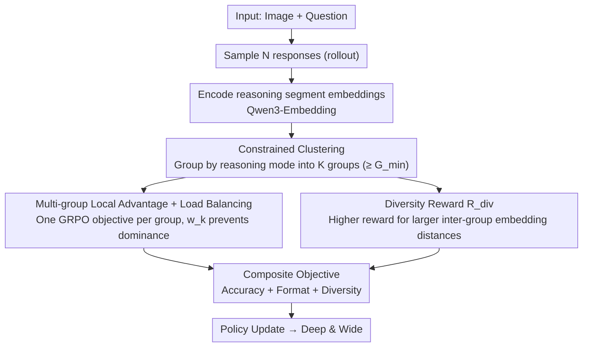

# MUPO: All Roads Lead to Rome - Incentivizing Divergent Thinking in Vision-Language Models

**Conference**: CVPR 2026  
**arXiv**: [2604.00479](https://arxiv.org/abs/2604.00479)  
**Code**: [https://xytian1008.github.io/MUPO/](https://xytian1008.github.io/MUPO/)  
**Area**: LLM Reasoning / Multimodal VLM  
**Keywords**: Reinforcement Learning, GRPO, Divergent Thinking, Reasoning Diversity, Vision-Language Models

## TL;DR

MUPO reveals the issue of reasoning diversity collapse in GRPO training—where models prematurely converge to a few reasoning strategies while discarding most alternatives. By grouping responses for localized advantage estimation and introducing a diversity reward, MUPO incentivizes VLMs to maintain divergent thinking, achieving 2-7% improvements across multiple reasoning benchmarks.

## Background & Motivation

RL (especially GRPO) has become a mainstream method for enhancing VLM reasoning capabilities. However, the authors identify a critical contradiction:

**RL models are deep but narrow, Base models are shallow but wide**: RL models achieve higher accuracy on a single attempt (deeper reasoning), but given multiple attempts, Base models can solve more distinct problems (more diverse strategies). For instance, in geometry problems, RL models consistently use equations (prone to logical errors), while Base models occasionally use verification strategies to reach answers concisely.

**Diversity Collapse**: Tracking the GRPO training process reveals that reasoning diversity drops to negligible levels early in training. Models rapidly converge to a few "dominant" strategies, discarding a vast number of potential alternative paths. This leads to: (1) Exploitation prevailing over exploration, resulting in local optima; (2) Poor scalability, where converged reasoning fails to cover a broad spectrum of problem types.

## Method

### Overall Architecture

MUPO (Multi-Group Policy Optimization) is a plug-and-play alternative to GRPO, designed to cure "diversity collapse"—the phenomenon where all responses converge to the same reasoning strategy after a few training steps. Conceptually: $N$ responses are sampled for a single problem, partitioned into $K$ groups using constrained clustering based on **reasoning embeddings** (each group representing a reasoning mode). Then, two actions are taken: **Intra-group**, local advantage is estimated independently with load-balancing weights to prevent dominant groups from overshadowing others (ensuring each strategy is refined = Depth); **Inter-group**, a diversity reward is added to push different groups apart (ensuring multiple strategies are maintained = Breadth).

### Key Designs

**1. Constrained Clustering: Making each group represent a reasoning mode**

The first step of MUPO is not to divide responses randomly, but to encode the **reasoning segment** of each response into embeddings using Qwen3-Embedding. **Constrained clustering** is then applied to group responses with similar trajectories, enforcing a minimum group size $G_{min}$ to ensure reliable advantage estimation per group. These $K$ groups naturally correspond to specific "reasoning modes" (e.g., coordinate method, similar triangles, or area method in geometry). This grouping is the foundation for "intra-group cultivation and inter-group separation."

**2. Multi-group Local Advantage + Load Balancing: Preventing one strategy from drowning out all signals**

GRPO calculates a global advantage baseline across all responses, resulting in a few high-reward strategies having massive advantage values while other signals are suppressed—the root of collapse. MUPO formulates the objective as a weighted sum of $K$ GRPO objectives, treated as independent "experimental plots": assets $\hat{A}_i^k$ are **estimated locally within groups**. Even if the "coordinate method" has the highest global reward, other groups receive normal update signals based on their internal baselines. Simultaneously, load-balancing weights $w_k=(N/(K|G_k|))^\beta$ ensure that large groups do not dominate the optimization and small groups are not ignored. This component manages **Depth**.

**3. Diversity Reward: Truly pushing groups apart**

Grouping and local optimization are insufficient; without constraints, groups might still converge to similar strategies. Thus, a **diversity reward** $R_{div}$ is added alongside accuracy and format rewards. For each response, the average distance between its reasoning embedding and those in **all other groups** is computed; larger distances yield higher rewards. This forces different groups to represent truly distinct reasoning paths. This component manages **Breadth**.

### Loss & Training

A standard RL pipeline is utilized, where MUPO replaces GRPO as the policy optimization algorithm. 
Reward = Accuracy Reward + Format Reward + Diversity Reward.

## Key Experimental Results

### Main Results

| Model | MathVerse | LogicVista | WeMath | HallusionBench | Gain |
|------|-----------|-----------|--------|----------------|---------|
| GRPO Baseline | Baseline | Baseline | Baseline | Baseline | — |
| **MUPO-Thinker-7B** | +Gain | +Gain | +Gain | +Gain | **2~7%** |

Consistent improvements of 2-7% are observed across multiple reasoning benchmarks, setting a new SOTA.

### Ablation Study

| Configuration | acc@1 | acc@4 | Diversity | Description |
|------|-------|-------|--------|------|
| GRPO | High | Limited | Low (Collapse) | Deep & Narrow |
| Base Model | Lower | High | High | Shallow & Wide |
| MUPO | **Highest** | **Highest** | **High** | Deep & Wide |

### Key Findings

- acc@k analysis reveals fundamental differences: RL models win at k=1, while Base models win for k>1. This suggests diversity is an inherent capability.
- GRPO diversity collapse occurs extremely early (<10% training steps), indicating an algorithmic issue rather than under-training.
- Diversity correlates positively with accuracy—more diverse strategies increase the probability of finding the correct answer.

## Highlights & Insights

- **Divergent vs. Convergent Thinking**: Introducing psychological concepts of divergent/convergent thinking into RL training provides a new perspective on GRPO's limitations.
- **Diagnostic for Diversity Collapse**: Quantifying reasoning diversity via embedding distances and tracking training dynamics represents a reusable analytical framework.
- **acc@k as a Complementary Metric**: Evaluating more than just single-pass accuracy provides a comprehensive view of a reasoning model's potential.
- **Plug-and-play Replacement**: MUPO can directly replace GRPO without modifying other training procedures.

## Limitations & Future Work

- The number of groups $G$ is a hyperparameter; optimal values may vary by task.
- Diversity reward weights require tuning; excessively high weights may sacrifice single-path accuracy.
- Validation has primarily focused on math/logic tasks; effects on open-ended generation remain to be explored.
- Future work could explore adaptive grouping and dynamic diversity weighting.

## Related Work & Insights

- **vs. GRPO/DeepSeekMath**: GRPO pursues deep reasoning at the cost of breadth; MUPO maintains both.
- **vs. DAPO/GVPO**: These methods optimize GRPO from a sampling perspective but do not address diversity collapse.
- **vs. Best-of-N/Self-Consistency**: These are inference-time scaling strategies; MUPO is a training-time strategy, and the two are compatible.

## Rating

- Novelty: ⭐⭐⭐⭐⭐ Diagnosis of GRPO diversity collapse and introduction of divergent thinking is insightful.
- Experimental Thoroughness: ⭐⭐⭐⭐⭐ Comprehensive behavior analysis, training dynamics, and multi-benchmark validation.
- Writing Quality: ⭐⭐⭐⭐⭐ Deep analysis, clear diagrams, and coherent logic.
- Value: ⭐⭐⭐⭐⭐ Significant contribution to the methodology of RL-trained reasoning models.

<!-- RELATED:START -->

## Related Papers

- [\[CVPR 2026\] All Roads Lead to Rome: Incentivizing Divergent Thinking in Vision-Language Models](all_roads_lead_to_rome_incentivizing_divergent_thinking_in_vision-language_model.md)
- [\[CVPR 2026\] VisPlay: Self-Evolving Vision-Language Models](visplay_self-evolving_vision-language_models.md)
- [\[CVPR 2026\] TRivia: Self-supervised Fine-tuning of Vision-Language Models for Table Recognition](trivia_self-supervised_fine-tuning_of_vision-language_models_for_table_recogniti.md)
- [\[CVPR 2026\] MoE-GRPO: Optimizing Mixture-of-Experts via Reinforcement Learning in Vision-Language Models](moe-grpo_optimizing_mixture-of-experts_via_reinforcement_learning_in_vision-lang.md)
- [\[CVPR 2026\] R-4B: Incentivizing General-Purpose Auto-Thinking in MLLMs via Bi-Mode Annealing and Reinforce Learning](r-4b_incentivizing_general-purpose_auto-thinking_in_mllms_via_bi-mode_annealing_.md)

<!-- RELATED:END -->
