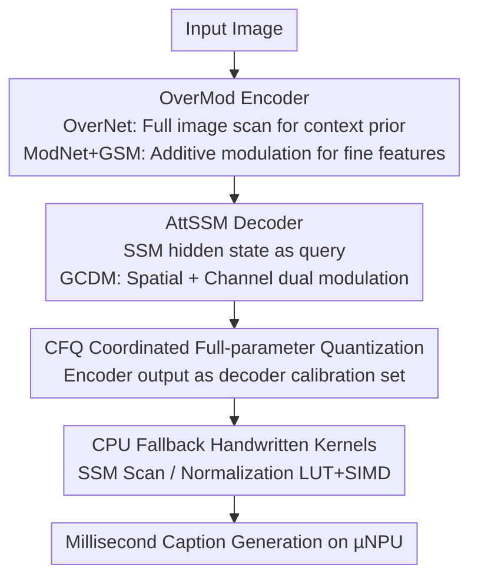

# µVLM: A Vision Language Model for µNPUs

**Conference**: CVPR 2026  
**Paper**: [CVF Open Access](https://openaccess.thecvf.com/content/CVPR2026/html/Chen_mVLM_A_Vision_Language_Model_for_mNPUs_CVPR_2026_paper.html)  
**Code**: TBD  
**Area**: Multimodal VLM  
**Keywords**: µNPU, On-device Image Captioning, Lightweight VLM, State Space Model, Hardware-aware Quantization

> ⚠️ The original paper title uses the Greek letter µ (micro), i.e., **µVLM / µNPU**; the "mVLM / mNPU" in stubs and CVF links refers to the same thing. This note consistently uses µ.

## TL;DR
µVLM is the first vision-language model designed specifically for "µNPUs" (MCU-level, mW power consumption, tens of MBs memory). By replacing hardware-unsupported self-attention with NPU-friendly OverMod encoders and AttSSM decoders, it achieves 117.8 CIDEr on COCO Karpathy while realizing millisecond-level VLM inference (TBT 21 ms, power <300 mW) on µNPUs for the first time.

## Background & Motivation

**Background**: Wearable and edge devices such as smart glasses and small robots increasingly require **on-device generative AI** (e.g., image captioning for visual assistance, early education, and dynamic scene discovery) to protect privacy and eliminate network dependency. Consequently, even low-cost MCUs have begun integrating lightweight NPUs—referred to here as **µNPUs**, which provide GOPS-level computing power at mW power levels (e.g., STM32N657: 600 GOPS, 4.2 MB SRAM).

**Limitations of Prior Work**: Deploying VLMs on µNPUs faces two major barriers. ① **Memory Constraints**: Available memory on µNPUs is limited to tens of MBs (on-chip SRAM may only be a few MBs), whereas even 2015-era captioning models required ~80 MB and modern VLMs range from hundreds of millions to tens of billions of parameters. Even "lightweight VLMs" for smartphones have orders of magnitude more power and memory than wearables. ② **Operator Support**: µNPUs are heavily optimized for convolutions and **lack native support for modern generative components** like softmax and multi-head self-attention, effectively blocking the Transformer route. Approaches based on object detection are also unfeasible due to excessive peak RAM during inference.

**Key Challenge**: The mainstream path for performance improvement is "increasing model scale + using self-attention," which directly conflicts with the "minimal memory + restricted operators" constraints of µNPUs—models cannot be large, nor can they use mainstream attention.

**Goal**: Design a **collaborative encoder-decoder** lightweight VLM capable of real-time image captioning under <32 MB memory and restricted operator sets while maintaining competitive captioning quality.

**Key Insight**: Revisit the CNN-decoder paradigm (as Transformers and detectors are unfeasible), but reimplement "dynamic attention" using **entirely NPU-compatible operators** to achieve both dynamic adaptive expressiveness and full hardware acceleration.

**Core Idea**: Replace expensive kernel-generative dynamic convolutions or self-attention with "additive bias modulation" (Encoder GSM, Decoder GCDM). This reduces the target of dynamic attention from high-dimensional convolution kernel tensors to low-dimensional bias maps. Combined with coordinated quantization and handwritten CPU kernels, this enables VLM inference to run on µNPUs for the first time.

## Method

### Overall Architecture
µVLM is a CNN-decoder pipeline following the "Image → Encoding → Decoding caption" flow, but every stage is redesigned around "µNPU-friendly lightweight dynamic attention." The input image first passes through the **OverMod Encoder**: a dual-branch "Overview-first, Look-Closely-next" structure. OverNet quickly scans the full image to produce a coarse-grained global semantic context prior, which guides ModNet to adaptively extract fine-grained features using **GSM (Global Spatial Modulation)**. Both are merged into a $(C,H,W)$ tensor and sent to the decoder. The **AttSSM Decoder** uses an SSM (Selective State Space Model) as its core: at each time step, the SSM hidden state $h$ acts as a query, using **GCDM (Global Context Dynamic Modulation)** to modulate the encoder features. The modulated result is projected and concatenated with word embeddings before Being fed back into the SSM to generate captions token-by-token (the decoder also uses weight tying between the word embedding matrix and output projection for compression and regularization). Finally, **Deployment Optimization** is applied: CFQ coordinated full-parameter quantization resolves precision mismatch between the encoder and decoder, and handwritten CPU kernels supplement unsupported modules like SSM.

### Key Designs

**1. OverMod Encoder: Dual-branch Overview-first + GSM Additive Modulation**

To address the issue where "dynamic convolutions have strong adaptability but peak RAM and FLOPs exceed µNPU limits," OverMod adopts the biomimetic vision principle of "Overview-first, Look-Closely-next." **OverNet** is a fast path composed of Efficient Static (ES) blocks (residual 3×3 DWConv + Dilated RepConv + ConvFFN + Layer Scale) and downsampling to rapidly produce a global semantic context prior. **ModNet** is the deep path that takes base features from stage three of OverNet and performs fine-grained perception through Efficient Dynamic (ED) blocks, using the context prior as a top-down signal to generate input-dependent parameters. The core is **GSM (Global Spatial Modulation)**: treating the context prior as a query, it passes through a lightweight signal generator (AAP + PConv + H-Swish) to produce a dynamic bias map $\text{dyn\_bias}$, which is then added to the convolution features (Value): $\tilde{x}_{ij} = x_{conv,ij} + \text{dyn\_bias}_{ij}$. Positive biases amplify activations (similar to attention), while negative biases suppress them, intentionally omitting bounded activations like sigmoid to preserve unbounded expressiveness. Key efficiency comes from reducing the modulation target from a "full convolution kernel tensor" $P_{DynamicConv}=N\times C\times k^2$ to a "low-dimensional bias map" $P_{GSM}=C\times H\times W$. For $C{=}192, N{=}256, k{=}7, H{=}W{=}7$, the former requires ~2.4M parameters while the latter only ~9,400, a **reduction of over 250×**. The signal generator's computation is linear $O(L)$ relative to spatial tokens $L$, avoiding the $O(L^2)$ term of self-attention.

**2. AttSSM Decoder: SSM + GCDM Spatial/Channel Dual Modulation**

To address the high overhead of autoregressive generation and the lack of µNPU support for self-attention, the decoder uses a **Selective SSM (Mamba-style)** core, which offers constant memory during inference and is more efficient than LSTM: LSTM's four gated matrices require ~ $8H^2$, while SSM is ~ $2rH^2+3HN$. For $r{=}2, N{<}64$, the simplification $3N < 4H$ almost always holds. **GCDM (Global Context Dynamic Modulation)** is added on top of the SSM for lightweight attention: the SSM hidden state acts as the context prior, first performing spatial modulation $x_{spatial}=x+\text{signal\_generator}(\text{context\_prior})$ (same additive bias as the encoder), followed by SE-style channel modulation $x_{final}=\sigma(\text{Conv}(\text{GAP}(\text{context\_prior})))\odot x_{spatial}$. Compared to standard cross-attention which compares one query against all $N$ encoder tokens ($O(N\cdot H^2)$), GCDM uses only light convolutions and element-wise operations, reducing complexity to approximately $O(H^2)+O(H\cdot N)$, with every operator natively supported by µNPUs.

**3. CFQ Coordinated Full-parameter Quantization: Eliminating Interface Precision Mismatch**

When the encoder and decoder are quantized independently as separate models, distribution shifts at the interface cause significant performance drops. This paper proposes **CFQ (Coordinated Full-parameter Quantization)**: first quantizing the encoder with the original calibration set, then passing original data through the quantized encoder, using its **output as a new calibration set** to quantize the decoder. This aligns the decoder's quantization parameters with the actual data distribution it receives on-device, eliminating the precision gap—a prerequisite for reliable deployment of dual-model systems.

**4. CPU Fallback Handwritten Kernels: Supplementing Unsupported Modules**

Modules like SSM, GRN, and LayerNorm lack native µNPU support and become bottlenecks during CPU fallback. This paper provides hardware-aware C implementations for these operators. The workflow starts with a numerically correct C baseline (e.g., SSM Scan recurrence $h_t=\bar{A}h_{t-1}+\bar{B}x_t$), followed by low-level optimizations: replacing $\exp()$ in discretization with Look-Up Tables (LUT), using CMSIS-DSP/NN and inline assembly for SIMD in SSM Scan, and replacing $\sqrt{}$ and division in normalization with fixed-point arithmetic. Finally, these optimized C functions are integrated into "custom layer stubs" generated by STM32Cube.AI, with JSON configurations defining layer signatures to link the ONNX graph to C implementations. These kernels allow the AttSSM decoder (21 ms) to outperform the LSTM+Bahdanau baseline (32 ms).

### Loss & Training
Four-stage progressive training: ① Pre-train OverMod encoder on ImageNet-1K, with OverNet output connected to an auxiliary classification head ($L=L_{final}+\lambda_{aux}\cdot L_{aux}$) to encourage meaningful features in both branches; ② Freeze the encoder and train the AttSSM decoder on the COCO Karpathy training set; ③ Unfreeze the encoder for end-to-end fine-tuning of the entire µVLM; ④ Freeze the encoder again and fine-tune using SCST with CIDEr as the RL reward. Evaluation uses beam search with a beam size of 3, and the vocabulary is pruned for words appearing fewer than 5 times.

## Key Experimental Results

### Main Results
Comparison with lightweight VLM baselines on the COCO Karpathy test set. µVLM-b achieves a CIDEr of 117.8 with only **29.6 MB**, using only µNPU-supported operators and hardware-aware design, approaching the performance of SmallCap (872 MB / 121.8) which is over 10x larger:

| Model | Size (MB) | Operator Support | Hardware Aware | BLEU-4 | METEOR | SPICE | CIDEr |
|------|----------|----------|----------|--------|--------|-------|-------|
| SmallCap | 872 | No | No | 28.3 | 21.5 | — | 121.8 |
| RFNet | ~500 | Yes | No | 27.7 | 21.1 | — | 121.9 |
| Up-Down | ~400 | Yes | No | 27.7 | 21.4 | — | 120.1 |
| NIC | ~80 | Yes | No | 28.6 | 23.8 | 17.7 | 92.0 |
| **µVLM-b (Ours)** | **29.6** | Yes | Yes | 36.1 | 26.9 | 20.8 | **117.8** |
| µVLM-s (Ours) | 21.2 | Yes | Yes | 32.2 | 25.7 | 19.1 | 109.1 |
| µVLM-t (Ours) | 13.8 | Yes | Yes | 29.4 | 24.4 | 18.2 | 96.4 |

The OverMod encoder also performs well on ImageNet-1K (224×224): OverMod-t achieves 79.2% Top-1 with only 5.2M parameters, comparable to models twice its size; OverMod-b achieves 82.4% with 18.1M.

### Ablation Study
Contribution of each µVLM component to CIDEr (Table 6):

| Configuration | CIDEr | Note |
|------|-------|------|
| Dynamic Conv Only | 95.5 | Baseline |
| + Multi-scale Fusion | 101.4 | +5.9 |
| + Spatial Modulation | 107.1 | +5.7 |
| + Channel Modulation (Full µVLM) | 117.8 | +10.7 more, highest with all four |

Encoder OverMod ablation (Table 4): ED blocks, Dilated RepConv, GRN, and Layer Scale contribute to the 79.2% score; however, **adding SE channel attention to OverNet/ModNet reduced the score to 79.0%**—SE channel attention is redundant and conflicts with OverMod's dynamic modulation.

### Key Findings
- **Same SE/Channel Modulation is harmful in the encoder but beneficial in the decoder**: In the encoder, SE conflicts with dynamic modulation (dropping points), but in the decoder's GCDM, channel modulation brings +10.7 CIDEr. The authors attribute this to the decoder's autoregressive structure lacking complex convolutions; channel modulation can then work with spatial modulation to refine features at each step.
- **AttSSM is faster than LSTM**: On the STM32N657, the AttSSM decoder takes 21 ms compared to 32 ms for LSTM+Bahdanau, and SSM has constant memory usage, proving the effectiveness of the lightweight attention + hardware-friendly operator combination.
- **First millisecond-level VLM on µNPU**: TTFT 208 ms, TBT 21 ms, power <300 mW, all meeting constraints for on-device real-time generation.

### Deployment (STM32N657, 4.2 MB SRAM / 600 GOPS)

| Component | Size (MB) | Latency (ms) | Power |
|------|----------|----------|------|
| OverMod-b Encoder | 21.4 | 187 | <300 mW |
| AttSSM Decoder | 8.2 | 21 | <300 mW |
| LSTM (Bah Atten) Baseline | 9.3 | 32 | — |

## Highlights & Insights
- **Reducing dynamic attention cost from "kernel generation" to "bias map generation"**: GSM uses additive bias $\tilde{x}=x_{conv}+\text{dyn\_bias}$ to reduce parameter count from $N\cdot C\cdot k^2$ to $C\cdot H\cdot W$ (>250× in practice). This is a reusable trick for scenarios requiring dynamic adaptability without the overhead of kernel generation.
- **Better performance without bounded activations**: GSM intentionally omits sigmoid to allow unbounded biases, trading it for stronger expressiveness—this contradicts the common intuition that attention weights must be normalized.
- **CFQ's "using previous stage output as next stage calibration set"**: A general strategy for solving distribution shifts in modular quantization, applicable beyond VLMs.
- **Solid operator-level hardware engineering**: Using LUTs for exp, SIMD for SSM Scan, and fixed-point for sqrt/division, linked via STM32Cube.AI custom stubs and JSON signatures. It provides a complete paradigm for landing non-standard operators on restricted toolchains.

## Limitations & Future Work
- **Narrow Task Scope**: Only validated for image captioning; the authors leave large-scale pre-training and zero-shot/training-free capabilities for future work. It is not currently a general-purpose VLM.
- **Specific Toolchain/Chip Dependency**: Operator engineering is deeply tied to the STM32Cube.AI / STM32 platform. Porting to other µNPUs (MAX78000, Himax WE2, etc.) requires re-implementing CPU fallback kernels.
- **CIDEr lower than unconstrained models**: 117.8 for µVLM-b is slightly lower than 121.8 for SmallCap or 119.4 for I-Tuning, representing the quality cost of memory/operator compliance.
- **Encoder remains the largest part**: The OverMod-b encoder handles 21.4 MB and 187 ms, being the primary source of latency and size. Compressing the encoder further is an obvious direction for improvement.

## Related Work & Insights
- **vs NIC / Up-Down (Classic Captioning)**: NIC established the CNN-LSTM paradigm but required ~80 MB; Up-Down introduced detector region features, pushing parameters over 100M and peak RAM beyond µNPU limits. µVLM returns to CNN-decoder but uses SSM + lightweight dynamic attention to stay small and compliant.
- **vs SmallCap / I-Tuning / LightCap (Lightweight VLM)**: These target the smartphone scale (~1 GB or multi-model pipelines) and often use operators unsupported by µNPUs or are susceptible to quantization mismatch. µVLM is the first to align with µNPU constraints starting from the operator layer.
- **vs Transformer/mPLUG**: Multi-head self-attention has no native support or efficient CPU fallback on µNPUs. µVLM approximates attention effects using GSM/GCDM additive+channel modulation, which has lower complexity and full hardware acceleration.
- **vs Standard Dynamic Convolution [29]**: Similar concept but [29] is not hardware-aware, uses unsupported operators, and exceeds peak RAM limits. µVLM's GSM replaces kernel generation with bias map generation, significantly reducing complexity and memory.

## Rating
- Novelty: ⭐⭐⭐⭐⭐ First VLM for µNPUs; reducing dynamic attention to the bias-map level via GSM/GCDM is a substantial new design.
- Experimental Thoroughness: ⭐⭐⭐⭐ Dual-layer ablation (encoder/full model) + real device latency/power measurements, but tasks are limited to captioning without multi-task or zero-shot evaluation.
- Writing Quality: ⭐⭐⭐⭐ Motivation and operator engineering are detailed with clear formulas; mixed use of µ and ASCII m and reliance on original figures for some diagrams slightly increases reading cost.
- Value: ⭐⭐⭐⭐⭐ Realized millisecond-level VLM on mW-scale µNPUs for the first time, opening engineering feasibility for on-device generative AI in wearables/robotics.

<!-- RELATED:START -->

## Related Papers

- [\[CVPR 2026\] RE-VLM: Event-Augmented Vision-Language Model for Scene Understanding](re-vlm_event-augmented_vision-language_model_for_scene_understanding.md)
- [\[CVPR 2026\] G$^2$VLM: Geometry Grounded Vision Language Model with Unified 3D Reconstruction and Spatial Reasoning](g2vlm_geometry_grounded_vision_language_model_with_unified_3d_reconstruction_and.md)
- [\[CVPR 2026\] TimeViper: A Hybrid Mamba-Transformer Vision-Language Model for Efficient Long Video Understanding](timeviper_a_hybrid_mamba-transformer_vision-language_model_for_efficient_long_vi.md)
- [\[CVPR 2026\] VL-RouterBench: A Benchmark for Vision-Language Model Routing](vl-routerbench_a_benchmark_for_vision-language_model_routing.md)
- [\[CVPR 2026\] Enhancing Video Vision Language Model with Hippocampal Sensing](enhancing_video_vision_language_model_with_hippocampal_sensing.md)

<!-- RELATED:END -->
