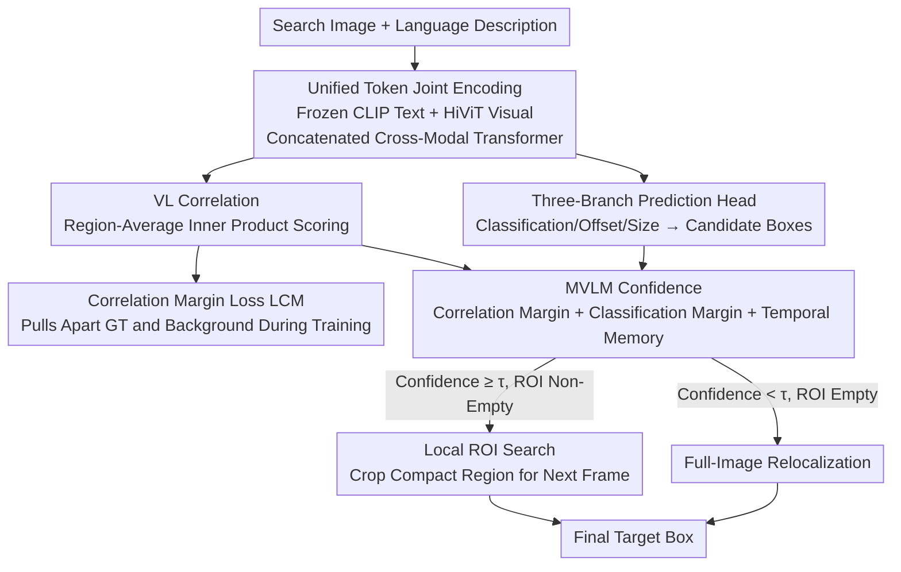

# MVLM: Template-Free Tracking via Vision-Language Margin Confidence and Memory-Gated Tracking

**Conference**: CVPR 2026  
**Paper**: [CVF Open Access](https://openaccess.thecvf.com/content/CVPR2026/html/Park_MVLM_Template-Free_Tracking_via_Vision-Language_Margin_Confidence_and_Memory-Gated_Tracking_CVPR_2026_paper.html)  
**Code**: [Project Page](https://mvlm-tft.github.io)  
**Area**: Multimodal VLM / Visual Tracking  
**Keywords**: Template-free tracking, language-guided, vision-language correlation, confidence gating, relocalization

## TL;DR
MVLM proposes a single-object tracking paradigm that **uses only natural language without any initial bounding boxes or visual templates**: it localizes targets through vision-language correlation and designs a confidence metric that integrates "correlation margin + classification margin + temporal memory" to dynamically switch between "compact ROI local search" and "full-image relocalization," achieving state-of-the-art (SOTA) pure language-based tracking on TNL2K, LaSOT, OTB99, and MGIT benchmarks.

## Background & Motivation
**Background**: Natural language-guided "template-free tracking" (TF) is highly attractive—users do not need to manually draw bounding boxes in the first frame; giving a textual description is sufficient to track any object, and even changing a sentence midway allows seamless switching to a new target, which is ideal for open-world and human-computer interaction scenarios. However, existing language tracking frameworks (JointNLT, UVLTrack, QueryNLT, etc.) nominally "use language" but actually still rely on a visual template from the first frame or an initial bounding box from grounding as a visual anchor, treating language only as an auxiliary cue for initialization. Essentially, they remain template-based trackers.

**Limitations of Prior Work**: The most naive pure language-based approach is to directly compute the correlation between the "search image visual features" and the "language query," selecting the region with the highest correlation as the target. However, **relying solely on instantaneous correlation is extremely unstable**: when the search area is large, spatial uncertainty scales with the area. In the presence of distractors, occlusions, and appearance changes, vision-language saliency becomes ambiguous, causing the tracker to either mislocalize or completely lose the target.

**Key Challenge**: To achieve stability, the search area must be narrowed down to a Region of Interest (ROI) (reducing spatial uncertainty). However, narrowing the search space forfeits the ability to "re-detect after losing tracking" and "re-localize after switching targets"—**there is a trade-off between the "narrowness" (accuracy/stability) and "width" (recoverability) of the search range**. Deciding when to narrow and when to widen depends heavily on the confidence of the current localization, but confidence itself has not been quantified.

**Goal**: Without relying on any visual templates, (1) extract discriminative saliency from VL correlation; (2) formulate a **confidence metric** to online decide whether the search range should be local or global.

**Key Insight**: The authors observe that successful localization fundamentally requires "the correlation of the target region with language to be significantly stronger than that of the background region," creating a positive **correlation margin**. They formulate the problem as "how to maximize this margin" and theoretically prove that a larger margin exponentially reduces the probability of mislocalization.

**Core Idea**: The raw VL correlation is distilled into a temporally stable and reliable confidence metric, MVLM, which **gates** the search strategy—high confidence shrinks the search to a compact ROI for local search, while low confidence triggers full-image relocalization, thereby suppressing spatial uncertainty without sacrificing recovery capability.

## Method

### Overall Architecture
The input to the system is a **search image + a language description**, and the output is the target bounding box in the current frame, requiring no initial bounding box. The pipeline is: a frozen CLIP text encoder encodes the language into text tokens, a visual tokenizer encodes the image into visual tokens, and both sets of tokens are concatenated and fed into a transformer visual encoder for cross-modal joint encoding. Post-encoding, the visual tokens are fed along one path to a three-branch prediction head ("classification/offset/size") to generate a set of candidate bounding boxes, and along another path, they are processed via region-average inner product with the language embedding to calculate the VL correlation score. The **MVLM confidence** (incorporating correlation margin, classification margin, and temporal memory) is then calculated for each candidate box to filter a subset of ROIs: if the subset is non-empty, a compact search region is cropped around the highest-scoring box for the next frame (local search); if the subset is empty, the entire image is used as the search region (global relocalization). During training, an additional **correlation margin loss** $L_{CM}$ is applied to pull apart the correlation of the target region from the background.

### Key Designs

**1. VL Correlation as the Sole Semantic Anchor: Replacing "Template Matching" with "Language-Vision Alignment"**

Template tracking relies on visual samples cropped from the first frame as anchors, which fails under appearance changes or occlusions and requires manual bounding box annotations. This paper completely discards the visual template and uses the **region-average inner product of visual tokens and language embedding** as the localization basis. Given the unit-normalized language embedding $u_t$ and visual tokens $v_x$, the region alignment score of candidate box $b$ is defined as

$$s(I,t,b) = \frac{1}{|R(b)|}\sum_{x \in R(b)} \langle v_x, u_t \rangle$$

where $R(b)$ is the set of visual token indices falling inside box $b$. The key on the encoding side is the **unified token sequence**: image tokens $P^I_t$ and text tokens $P^T_t$ are concatenated into $P_t=[P^I_t; P^T_t]$ and fed together into the transformer. Alternating self-attention allows visual and language tokens to interact directly and refine layer-by-layer, which learns cross-modal alignment better than "two-stream independent encoding followed by similarity calculation." The language embedding $u_t$ is computed via average pooling of the refined text tokens, representing the target's unified semantics. Consequently, tracking is no longer bound to the appearance of a specific frame, maintaining localization as long as the language description holds—which is why it supports "midway text changes to switch targets."

**2. Correlation Margin Loss $L_{CM}$: Directly Pulling Apart the Target Region's Correlation**

Relying solely on maximizing the alignment score is easily deceived by strong distractors in the background because the target and background scores may be too close. Starting from theory (Theorem 1)—which proves that the mislocalization probability decays exponentially with the **correlation margin** $\Delta\rho(b)=\rho(b^*)-\rho(b)$—the authors directly design a loss to **maximize the margin between the GT region and the background**. First, the average correlation inside the GT box is calculated as $\rho_{pos}=\frac{1}{|R^*|}\sum_{x\in R^*}\langle v_x,u_t\rangle$. For each background token, the margin is defined as $\Delta\rho_x=\rho_{pos}-\langle v_x,u_t\rangle$, and the loss is:

$$L_{CM} = \frac{1}{K}\sum_{x \in \text{TopK}(R_{neg})} \exp\!\left(-\tau\,\Delta\rho_x|\Delta\rho_x|\right)$$

where $\tau>0$ is the temperature, and Top-K selects only the **K hardest negative samples** (those with the smallest margins). This design is ingenious: when $\Delta\rho_x>0$ (well separated), the loss is minimized; when $\Delta\rho_x<0$ (background is falsely more similar to the target than the target itself), the exponential penalty grows rapidly, forcing the model to concentrate correlation energy on the target region. This corresponds to the mathematical upper bound of mislocalization in Theorem 1—widening the margin is equivalent to exponentially suppressing the tracking loss rate, proving the loss is mathematically sound rather than purely heuristic.

**3. MVLM Confidence: Distilling Instantaneous Correlation into Temporally Stable Confidence**

Single-frame VL correlation fluctuates, requiring a scalar that is stable across frames and reflects "how confident the tracker is in the current frame." MVLM fuses three kinds of evidence into a bounded confidence metric. First, two **normalized margins** are computed: the correlation margin is the difference between the highest-correlation box and the "next-highest box outside the region" divided by a robust scale $\hat\sigma_{corr}$. Similarly, the classification margin $\tilde\Delta^{cls}_t$ is computed using the classification head scores (the next-highest box must be chosen outside the top-1 IoU exclusion zone $B^{out}_t$ to ensure it is a true competitor rather than an overlapping box of the same object). These two are convex-combined into the single-frame VLM confidence:

$$\text{\kappa}^{vlm}_t = \alpha_{corr}\tilde\Delta^{corr}_t + \alpha_{cls}\tilde\Delta^{cls}_t,\quad \alpha_{corr}+\alpha_{cls}=1$$

Then, an Exponentially Weighted Moving Average (EWMA) is used to integrate history: $\bar\kappa^{mem}_t=(1-\lambda)\kappa^{vlm}_t+\lambda\bar\kappa^{mem}_{t-1}$ (where $\lambda$ is the forgetting factor; larger values produce smoother results but introduce more lag). Finally, the instantaneous and memory confidences are fused: $\kappa^{mvlm}_t=(1-\omega)\kappa^{vlm}_t+\omega\bar\kappa^{mem}_t$. Since each term is normalized to $[-1,1]$, the final $\kappa^{mvlm}_t$ also falls in $[-1,1]$, representing how distinct the correlation/classification peaks are in the current frame. The three types of evidence are complementary: correlation handles semantic alignment, classification handles local visual evidence, and memory ensures temporal consistency.

**4. Memory-Gated Relocalization: Switching Between "Local ROI" and "Global Search" via Confidence Online**

With a dependable confidence metric, the trade-off of "narrow vs wide" search can be resolved. For each candidate box, the per-box $\kappa^{mvlm}_t(b)$ is calculated to filter the ROI subset exceeding threshold $\tau$: $S_t(\tau)=\{b\in B_t:\kappa^{mvlm}_t(b)\ge\tau\}$. The decision rule is straightforward: **if the subset is non-empty** ($|S_t|>0$), the current localization is reliable; the box with the highest classification score is selected as the result, and a compact search region is cropped around it for local search in the next frame. **If the subset is empty** ($|S_t|=0$), it indicates that no reliable candidate exists. The tracker then defaults to the highest classification box in the entire image and treats the whole image as the search region for the next frame, triggering global relocalization. Consequently, when confidence is high, the search region is restricted to a local ROI to reduce spatial uncertainty, and when confidence is low, the search is actively expanded to retrieve the target. This provides both tracking stability and target recovery capability, which underpins the "re-detecting after loss" and "target switching" functionalities.

**5. Theoretical Guarantees for Tracking Success: Two Bounds Decomposing Failure into Two Interpretable Terms**

To ensure the sanity of the proposed mechanism beyond empirical validity, the authors provide two probabilistic bounds. **Theorem 1 (Mislocalization Bound)**, under sub-Gaussian noise assumptions, proves that the mislocalization probability is upper-bounded by $\sum_{b\ne b^*}\exp\!\big(-\frac{(\rho(b^*)-\rho(b))^2}{2\sigma^2}(\frac{1}{|R(b^*)|}+\frac{1}{|R(b)|})^{-1}\big)$, showing that the mislocalization probability decays **exponentially** with the margin, justifying the formulation of $L_{CM}$. **Theorem 2 (Relocalization Bound)** further decomposes the tracking failure under ROI search into two interpretable terms: **ROI exclusion** (the GT box is excluded from the search range because it is too tight, bounded by $\eta(\tau)$) and **intra-ROI mislocalization** (incorrect ranking within the restricted region, bounded by $(M(\tau)-1)\exp(-\frac{n\gamma(\tau)^2}{4\sigma^2})$). The sum of these two terms bounds the total failure rate, formally proving that "increasing the correlation margin + choosing an appropriate region size" can jointly suppress the failure rate exponentially, thus confirming the rationality of MVLM gating in switching between local and global search.

### A Complete Example: Target Switching Midway
Figure 4 in the paper provides a very intuitive example. The initial language query is "a woman wearing blue clothes with long hair," and the tracker stably tracks the woman in blue with $\kappa^{mvlm}_t$ staying high and the ROI subset remaining non-empty, thus continuously executing local ROI search. At frame 697, the user changes the language query to "a man wearing brown clothes and a pair of red gloves." At this moment, the original target's semantics no longer match; both the correlation margin $\tilde\Delta^{corr}_t$ and classification margin $\tilde\Delta^{cls}_t$ collapse. As $\kappa^{mvlm}_t$ drops below the threshold and the ROI subset becomes empty, the system automatically triggers full-image relocalization, re-identifies, and locks onto the man in brown across the entire image. The attention maps also quickly shift from the woman in blue to the new target. This entire transition requires no new visual templates or manual bounding boxes, accomplished entirely through "changing a sentence + confidence-gated control."

### Loss & Training
The total loss is $L_{total}=L_{track}+L_{CM}$, where $L_{track}$ follows the heatmap-based composite tracking loss (combined losses of the classification, offset, and size heads), and $L_{CM}$ is the correlation margin loss defined above. The visual encoder is HiViT, while the text encoder is a frozen CLIP; $N_I=196$, $N_T=77$, and $C=512$. Training is conducted on image-text paired datasets such as TNL2K, LaSOT, and VastTrack for 60 epochs (100k image-text pairs per epoch) with a learning rate of 0.0005, batch size of 80, using AdamW on 4×RTX A6000 48GB GPUs.

## Key Experimental Results

### Main Results
Evaluation is performed on four VL tracking benchmarks across two settings: **Tracking-by-language** (pure language) and **Tracking-by-bbox and -language** (bbox + language). Under the tracking-by-language setting, MVLM significantly outperforms prior methods:

| Setting | Benchmark | Metric | MVLM | Runner-up | Gain |
|------|------|------|------|------|------|
| Pure Language | TNL2K | PRE | 60.9 | 58.9 (MambaVLT) | +2.0 |
| Pure Language | LaSOT | PRE | 65.5 | 61.0 (UVLTrack-B) | +4.5 |
| Pure Language | OTB99 | PRE | 84.3 | 81.0 (QueryNLT) | +3.3 |
| Pure Language | MGIT | PRE | 55.5 | 50.3 (MambaVLT) | +5.2 |

Under the bbox + language setting (where the visual template token $P^R_t$ is also concatenated), MVLM achieves the best performance on TNL2K (PRE 73.0) and MGIT (PRE 66.3 / AUC 71.7), showing that this template-free method **naturally generalizes to template-based tracking**.

### Ablation Study
Ablation studies on TNL2K, LaSOT, and OTB99 sequentially add components (results shown refer to PRE/AUC, with the TNL2K column highlighted):

| Config | Local Search | $L_{CM}$ | MVLM | TNL2K PRE | TNL2K AUC | Description |
|------|:---:|:---:|:---:|:---:|:---:|------|
| A1 | ✗ (Global) | ✗ | ✗ | 53.0 | 50.8 | Global search, no margin loss |
| A2 | ✓ | ✗ | ✗ | 59.6 | 56.9 | Adding local ROI search only |
| A3 | ✓ | ✓ | ✗ | 60.1 | 57.2 | Adding correlation margin loss |
| A4 | ✓ | ✓ | ✓ | 60.9 | 57.8 | Full model (with MVLM gating) |

### Key Findings
- **Local ROI search provides the biggest contribution**: Switching from A1 to A2 (global search to local ROI search) improves the average PRE/AUC across the three benchmarks by +7.9%/+6.8%, confirming that "constraining the search area to suppress spatial uncertainty" is the primary driver of stable tracking.
- **$L_{CM}$ sharpens alignment**: Moving from A2 to A3 on the more challenging LaSOT dataset increases PRE from 62.2 to 65.3. Attention visualization (Figure 2) illustrates that adding $L_{CM}$ visibly consolidates correlation energy within the target region.
- **MVLM gating brings robustness**: From A3 to A4, the addition of MVLM consistently improves performance on all benchmarks and unlocks the unique ability of "re-localization after tracking loss / switching targets midway" inherent to gated methods.
- **Empirical validation of theory**: The collapse plot in Figure 3 fitted a slope of 263.6 with $R^2=0.89$, validating the exponential decay of mislocalization probability with respect to the margin (Theorem 1), and proved that the measured failure rate $\hat p_{tot}(\tau)$ remains strictly below the theoretical upper bound $\hat B_{tot}(\tau)$ (Theorem 2) across all thresholds.

## Highlights & Insights
- **Using confidence as a gating signal is highly instructive**: Fusing "correlation margin + classification margin + temporal memory" into a bounded scalar and utilizing it to determine the search range on-the-fly endows the tracker with "self-awareness"—knowing when it is uncertain to actively expand the search. This confidence-gated strategy can be transferred to any task where a trade-off exists between "local fine-grained search vs global re-search" (such as detection, grounding, or retrieval).
- **Algorithm design perfectly maps to theoretical bounds**: $L_{CM}$ is derived directly from the exponential decay structure of Theorem 1, and the gating mechanism stems from the two-term failure decomposition of Theorem 2. Rather than being post-hoc heuristics, the designs are derived from mathematical bounds, which is rare in engineering-focused tracking fields.
- **True template-free tracking + language switching**: Discarding visual templates entirely and relying on "changing a sentence" to seamlessly switch targets provides practical utility in open-world and human-robot interaction scenarios instead of merely fighting for benchmark gains.
- **Lightweight and plug-and-play**: MVLM introduces minimal computational overhead, plugs directly into a transformer backbone, and can backward-extend to template-based tracking settings.

## Limitations & Future Work
- **Dependence on the discriminative power of language descriptions**: The correlation margin $\gamma$ is co-determined by the "semantic precision of language" and the "visual uniqueness of the target." If the description is vague (e.g., "the person") or if multiple similar targets exist in the scene, the margin shrinks and the gate is prone to misjudgment. The paper's theoretical assumption (existence of a positive margin $\gamma$) may not hold in these extreme scenarios.
- **Multiple hyperparameters require tuning**: $\alpha_{corr}/\alpha_{cls}$, the forgetting factor $\lambda$, the fusion weight $\omega$, the ROI exclusion threshold $\psi_{out}$, and the gating threshold $\tau$ all need to be tuned. The paper lacks comprehensive sensitivity analysis, rendering the stability of optimal values across datasets questionable.
- **Strong theoretical assumptions**: The theorems rely on assumptions such as sub-Gaussian noise, equal-sized regions within the ROI, and shared proxy variances. Real tracking noise may not satisfy these, so the bounds act more as "structural guidance" than exact predictors (indeed, experiments only validated the inequality direction "measured < upper bound").
- **Future directions**: Adapting the gating threshold dynamically according to scene difficulty, explicitly modeling language query uncertainty within the confidence score, or introducing joint gating for multiple targets/multiple descriptions.

## Related Work & Insights
- **vs JointNLT / UVLTrack (Unified grounding and tracking)**: These unify grounding and tracking within the transformer but still rely on the visual bounding box grounded in the first frame as a reference. MVLM requires no initial box, is purely language-driven, and explicitly models temporal aspects (memory + gating) rather than treating tracking as frame-by-frame grounding.
- **vs QueryNLT / GTI (Language used only for initialization)**: These use language only for initialization and then revert to standard template tracking. MVLM relies on language throughout, supporting target switching via mid-sequence query changes.
- **vs MambaVLT / DUTrack / SUTrack (SOTA template + language)**: Under the bbox + language setting, MVLM also achieves the best results on TNL2K/MGIT, proving that its VL alignment + confidence gating design serves as a general-purpose boost beyond the template-free track.
- **vs Grounding/Retrieval methods**: Region proposal-based grounding focuses on short-term image-text correspondence and relies on target detector proposals; MVLM utilizes memory-regularized frame-by-frame decision-making and gating to online adjust the search range, specifically addressing the temporal nature of tracking.

## Rating
- Novelty: ⭐⭐⭐⭐⭐ First transformer-based pure language template-free tracker, with confidence gating elegantly mapped to theoretical bounds
- Experimental Thoroughness: ⭐⭐⭐⭐ SOTA on four benchmarks + ablations + theoretical validation, though hyperparameter sensitivity analysis is relatively sparse
- Writing Quality: ⭐⭐⭐⭐ Clear connection between theory and methodology, though equation notations are somewhat dense
- Value: ⭐⭐⭐⭐⭐ "Confidence-gated search" is a generalizable concept, and template-free tracking + language switching targets real-world interactive scenarios

<!-- RELATED:START -->

## Related Papers

- [\[AAAI 2026\] OmniPT: Unleashing the Potential of Large Vision Language Models for Pedestrian Tracking and Understanding](../../AAAI2026/multimodal_vlm/omnipt_unleashing_the_potential_of_large_vision_language_models_for_pedestrian_t.md)
- [\[CVPR 2025\] Dynamic Updates for Language Adaptation in Visual-Language Tracking](../../CVPR2025/multimodal_vlm/dynamic_updates_for_language_adaptation_in_visual-language_tracking.md)
- [\[CVPR 2026\] VisMem: Latent Vision Memory Unlocks Potential of Vision-Language Models](vismem_latent_vision_memory_unlocks_potential_of_vision-language_models.md)
- [\[CVPR 2026\] CICA: Coupling Confidence-Aware Pretraining with Confidence-Informed Attention for Robust Multimodal Sentiment Analysis](cica_coupling_confidence-aware_pretraining_with_confidence-informed_attention_fo.md)
- [\[CVPR 2026\] Linking Perception, Confidence and Accuracy in MLLMs](linking_perception_confidence_and_accuracy_in_mllms.md)

<!-- RELATED:END -->
