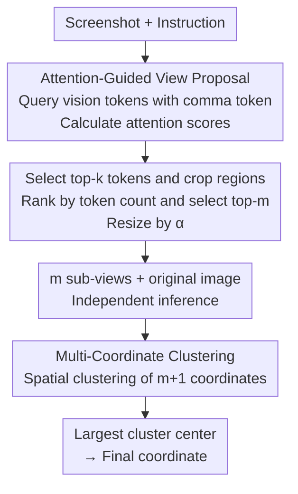

# MVP: Multiple View Prediction Improves GUI Grounding

**Conference**: CVPR 2026  
**Paper**: [CVF Open Access](https://openaccess.thecvf.com/content/CVPR2026/html/Zhang_MVP_Multiple_View_Prediction_Improves_GUI_Grounding_CVPR_2026_paper.html)  
**Code**: https://github.com/ZJUSCL/MVP (Available)  
**Area**: Multimodal VLM / GUI Agent  
**Keywords**: GUI grounding, multi-view reasoning, training-free, attention cropping, coordinate clustering

## TL;DR
To address the instability where "minor screenshot perturbations cause drastic coordinate prediction jumps" in GUI grounding models, this paper proposes the training-free MVP framework. It crops multiple sub-views using instruction-vision attention for independent prediction, then performs spatial clustering on these coordinates, selecting the center of the largest cluster as the final output. It improves Qwen3VL-32B from 55.3 to 74.0 on ScreenSpot-Pro.

## Background & Motivation
**Background**: GUI grounding, which translates natural language instructions into pixel coordinates on a screen (e.g., "Save as specific format" $\rightarrow$ `(1843,532)`), serves as the foundation for GUI agents. The mainstream approach treats it as a generation task: using Large Vision-Language Models (LVLMs), coordinates are directly output as text tokens (e.g., `x=123, y=456`) after training on large-scale GUI datasets via SFT/RL.

**Limitations of Prior Work**: The authors identified significant **prediction instability** in these models. Adding a black border of merely 28 pixels to a screenshot (much smaller than the resolution) causes the same model to produce coordinate drifts averaging 193 pixels for the same image, far exceeding the size of typical UI elements in ScreenSpot-Pro. Crucially, this instability translates to accuracy loss: the pass@2 accuracy (correct if either of two tries is right) is 57.5%, while single-prediction accuracy is only 49.8%. This 7.7-point gap suggests that models **possess the inherent capability** for localization but fail to release it stably during single-view inference.

**Key Challenge**: The instability scales sharply with two factors: **high-resolution screenshots** and **small targets**. Architecturally, RoPE position extrapolation at high resolutions leads to indices falling outside the training distribution, making token sequences highly sensitive to spatial changes. Additionally, vision projectors compress features into tokens, losing fine-grained spatial information and making small targets harder to perceive. Regarding data, current training sets lack sufficient high-resolution and small UI element samples.

**Goal**: To stably realize the model's potential to "occasionally predict correctly" without **retraining or relying on external agent feedback**.

**Key Insight**: Since single-view prediction is unreliable but the model is sometimes correct, aggregating predictions from multiple views allows "majority consensus" to isolate correct coordinates from outliers. Pre-experiments confirm this: pass@N increases monotonically with the number of randomly cropped sub-regions containing the target box.

**Core Idea**: Replace "single-view decision" with "multi-view independent prediction + spatial clustering." Correct predictions tend to cluster densely around the target, while errors scatter. Picking the center of the largest cluster filters out outliers.

## Method

### Overall Architecture
MVP is a training-free inference-time framework that takes a GUI screenshot and a user instruction as input to output a pixel coordinate. It modifies "how the image is fed and how outputs are aggregated" without changing model weights. It consists of two sequential modules: **Attention-Guided View Proposal**, which uses instruction-to-vision attention to crop $m$ sub-views (where the target is likely present and UI elements are enlarged), followed by **Multi-Coordinate Clustering**, which performs $m+1$ independent inferences (on $m$ sub-views plus the original image) and applies spatial clustering to select the final prediction.

### Key Designs

**1. Attention-Guided View Proposal: Using attention to guide cropping**
Feeding high-resolution full images is unstable, while random cropping might miss the target. MVP leverages the LVLM's ability to localize instruction-related regions through its mid-to-deep layer attention. First, **attention scores** are calculated using the comma token `","` from the target coordinate format as the query (found to have the best localization performance) and vision tokens as keys. Cross-attention $A=\mathrm{Softmax}\!\left(\frac{T_{\text{comma}}V^{T}}{\sqrt{d}}\right)$ is averaged across heads to get scores. Second, **candidate regions** are selected: Top-$k$ ($k=100$) vision tokens are used as patch centers $(x_i,y_i)$ to crop $h\times w$ regions $R_i$. Third, **ranking and resizing**: Candidates are ranked by the number of top-$k$ tokens they contain. The top-$m$ regions are selected and enlarged by $\alpha > 1$ (e.g., 1280×720 resized to 2560×1440). Resizing addresses the "small target instability" by making UI elements more perceptible to the model.

**2. Multi-Coordinate Clustering: Consensus through spatial voting**
After obtaining $m+1$ coordinate predictions, the framework applies distance-based clustering. The key insight is that correct predictions will be spatially consistent within the target box, while errors are random. Points are grouped if the distance $d(p_i,p_j) \le \tau$ ($\tau=14$ pixels). The **largest cluster** $G^{*}=\arg\max_{G_k}|G_k|$ is selected, and its centroid $(x_{\text{final}},y_{\text{final}})=\frac{1}{|G^{*}|}\sum_{p_i\in G^{*}}p_i$ is the final output. In case of ties, the cluster whose corresponding crops contain the most top-$k$ attention tokens is chosen.

**3. Mechanism: Training-free and Parallel**
MVP does not modify weights or require external feedback, making it an "out-of-the-box" solution for models like UI-TARS, GTA1, or Qwen3VL. Unlike "Iterative Zoom-in" methods where early cropping errors accumulate through sequential steps, MVP uses **parallel multi-view prediction**. Each view is independent, preventing error propagation and using voting to resolve discrepancies.

### Loss & Training
Ours is a pure inference-time framework with no training. Key hyperparameters: view size $(h,w)=1280 \times 720$ resized to $2560 \times 1440$; $m=4$ (for GTA1-7B, UI-TARS) or $m=2$ (for Qwen3VL); $k=100$; $\tau=14$ pixels. Attention is extracted from layers 20, 24, or 48 depending on the model architecture.

## Key Experimental Results

### Main Results
On ScreenSpot-Pro, MVP provides significant gains across diverse architectures:

| Model | ScreenSpot-Pro Overall | + MVP | Gain |
|------|------|------|------|
| UI-TARS-1.5-7B | 41.9 | 56.1 | +14.2 |
| GTA1-7B | 49.8 | 61.7 | +11.9 |
| Qwen3VL-8B-Instruct | 55.0 | 65.3 | +10.3 |
| Qwen3VL-32B-Instruct | 55.3 | **74.0** | +18.7 |

Qwen3VL-32B + MVP (74.0) sets a new SOTA, outperforming UI-TARS-1.5 (61.6) and Seed1.5-VL (60.9). Improvements on OS-World-G are smaller because its lower native resolution (720P/1080P) suffers less from instability, consistent with the authors' diagnosis.

### Ablation Study
Conducted on ScreenSpot-Pro with GTA1-7B:

| Configuration | SS-Pro Avg. | Description |
|------|---------|------|
| Single Full Image | 49.8 | Baseline |
| Border Padding | 57.3 | Views created by padding only |
| Attention-Guided (Ours) | 61.7 | Attention-driven cropping (+4.4 over padding) |
| Coordinate Averaging | 46.6 | **Worse than baseline** |
| Multi-Coordinate Clustering (Ours) | 61.7 | Spatial consensus (Optimal) |
| Without Resizing | 59.1 | No 2× enlargement |
| With Resizing (Ours) | 61.7 | Resizing gain (+2.6) |

### Key Findings
- **Aggregation method is critical**: Coordinate averaging (46.6) is worse than the single-view baseline (49.8) because outliers skew the mean. Only clustering the largest group effectively filters noise.
- **Attention-guided cropping is superior**: It outperforms "blind" expansion (Border Padding) by 4.4 points.
- **Enlarging sub-views helps**: Resizing contributes +2.6 points, confirming the diagnosis that small targets are more unstable.
- **View count saturation**: Increasing $m$ does not lead to indefinite gains, as predictions tend to converge on a few fixed locations. $m=2\sim4$ is typically sufficient.

## Highlights & Insights
- **Diagnosing "Instability" over "Incapacity"**: The elegant disturbance experiment (28-pixel padding) and the pass@2 gap convincingly prove that models "know" the location but struggle to output it consistently.
- **Training-free Plug-and-Play**: MVP requires no retraining and no external feedback, making it highly practical for deployment with any off-the-shelf model.
- **Attention as "Crop Navigation"**: Re-purposing internal attention signals (specifically from the comma token) to guide the input pipeline is a clever trick applicable to other ROI-sensitive VLM tasks.
- **Parallel Voting over Serial Iteration**: Parallelization avoids the error propagation common in iterative search methods, providing a more robust paradigm for multi-step localization.

## Limitations & Future Work
- **Inference Cost**: Processing $m+1$ views increases compute linearly. The current approach trades FLOPs for stability.
- **Attention Layer Dependency**: Proposing views requires manual selection of the optimal attention layer (e.g., Layer 48 for Qwen3VL-32B), which might vary across models.
- **Hyperparameter Sensitivity**: Parameters like $\tau$ and resize scales were tuned for current benchmarks; adaptation might be needed for significantly different resolution distributions.

## Related Work & Insights
- **vs. Iterative Zoom-in**: Serial methods accumulate error if early steps fail. MVP's parallel consensus mechanism is inherently immune to such propagation.
- **vs. Pure Attention Localization**: Direct attention-based localization often generalizes poorly across instructions. MVP keeps the robust text generation paradigm and uses attention only for region proposal.

## Rating
- Novelty: ⭐⭐⭐⭐ Transforms failures into a stability problem solved by multi-view consensus.
- Experimental Thoroughness: ⭐⭐⭐⭐ Consistent gains across three benchmarks and four models.
- Writing Quality: ⭐⭐⭐⭐ Clear logical chain from diagnosis to hypothesis and validation.
- Value: ⭐⭐⭐⭐ Practical, training-free improvement for GUI agents.

<!-- RELATED:START -->

## Related Papers

- [\[CVPR 2026\] DRS-GUI: Dynamic Region Search for Training-Free GUI Grounding](drs-gui_dynamic_region_search_for_training-free_gui_grounding.md)
- [\[CVPR 2026\] GUI-SAGE: Enhancing GUI Automation with Self-Explanatory Learning](gui-sage_enhancing_gui_automation_with_self-explanatory_learning.md)
- [\[ACL 2025\] Aria-UI: Visual Grounding for GUI Instructions](../../ACL2025/multimodal_vlm/aria-ui_visual_grounding_for_gui_instructions.md)
- [\[CVPR 2026\] Imbalanced View Contribution Evaluation and Refinement for Deep Incomplete Multi-View Clustering](imbalanced_view_contribution_evaluation_and_refinement_for_deep_incomplete_multi.md)
- [\[CVPR 2026\] Concept-Aware Batch Sampling Improves Language-Image Pretraining](concept-aware_batch_sampling_improves_language-image_pretraining.md)

<!-- RELATED:END -->
## Related Papers

- [\[CVPR 2026\] DRS-GUI: Dynamic Region Search for Training-Free GUI Grounding](drs-gui_dynamic_region_search_for_training-free_gui_grounding.md)
- [\[CVPR 2026\] VGent: Visual Grounding via Modular Design for Disentangling Reasoning and Prediction](vgent_visual_grounding_via_modular_design_for_disentangling_reasoning_and_predic.md)
- [\[CVPR 2026\] GUI-SAGE: Enhancing GUI Automation with Self-Explanatory Learning](gui-sage_enhancing_gui_automation_with_self-explanatory_learning.md)
- [\[ICML 2026\] Learning GUI Grounding with Spatial Reasoning from Visual Feedback](../../ICML2026/multimodal_vlm/learning_gui_grounding_with_spatial_reasoning_from_visual_feedback.md)
- [\[CVPR 2026\] Concept-Aware Batch Sampling Improves Language-Image Pretraining](concept-aware_batch_sampling_improves_language-image_pretraining.md)

<!-- RELATED:END -->
