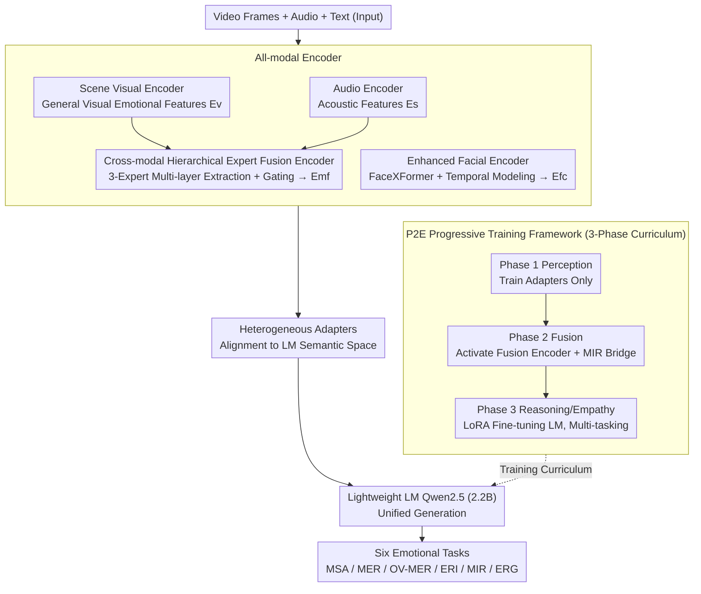

# Nano-EmoX: Unifying Multimodal Emotional Intelligence from Perception to Empathy

**Conference**: CVPR 2026  
**arXiv**: [2603.02123](https://arxiv.org/abs/2603.02123)  
**Code**: [https://github.com/waHAHJIAHAO/Nano-EmoX](https://github.com/waHAHJIAHAO/Nano-EmoX)  
**Area**: Multimodal VLM  
**Keywords**: Affective Computing, Multimodal Large Language Models (MLLMs), Cognitive Hierarchy, Emotion Recognition, Empathic Interaction

## TL;DR
Nano-EmoX proposes a cognitively inspired three-level emotional task hierarchy (Perception → Understanding → Interaction). It is the first multimodal language model to unify six core emotional tasks with compact 2.2B parameters, gradually cultivating high-level empathy from basic perception through the P2E progressive training framework.

## Background & Motivation
1. **Background**: The development of emotional Multimodal Language Models (MLMs) is limited by the gap between low-level perception and high-level interaction, leading to fragmented emotional capabilities and limited generalization.
2. **Limitations of Prior Work**: (i) Existing models are mostly single-level experts—either performing perception (emotion recognition), understanding (cause reasoning), or interaction (empathic response), lacking unification; (ii) Model scales are large (7-9B), making actual deployment difficult.
3. **Key Challenge**: Emotional intelligence is a continuum from perception to empathy, but existing methods segment it into independent tasks, lacking cross-level knowledge transfer.
4. **Goal**: Design a compact unified model (<3B parameters) to complete six core emotional tasks across three cognitive levels: perception, understanding, and interaction.
5. **Key Insight**: Inspired by the Perception-Action Model, emotional tasks are organized according to cognitive depth and trained progressively from low to high levels.
6. **Core Idea**: All-modal encoder (enhanced facial encoder + fusion encoder) + P2E progressive training framework (Perception → Fusion → Multi-task Instruction Tuning).

## Method

### Overall Architecture
Nano-EmoX aims to achieve "a complete emotional chain within a single compact model": from recognizing expressions and tones to reasoning about emotional causes and generating empathic responses—tasks that previously relied on multiple specialized models. Its approach involves encoding four modal branches (scene visual, facial, audio, and fusion), aligning them into the same semantic space via heterogeneous adapters, and feeding them into a lightweight 2.2B language model (Qwen2.5) for unified generation. All interactions are reframed as "Instruction + Multimodal Input → Text Output." Consequently, six tasks—Multimodal Sentiment Analysis (MSA), Multimodal Emotion Recognition (MER), Open-Vocabulary MER (OV-MER), Emotion Reason Inference (ERI), Multimodal Intent Recognition (MIR), and Empathic Response Generation (ERG)—share a single set of parameters, enabling cross-level knowledge transfer. This unified model is not results from one-time mixed training but is cultivated step-by-step through the P2E progressive training framework, unfreezing layers according to the cognitive sequence of "Perception → Fusion → Reasoning/Empathy." Among these, the facial and fusion encoders are dedicated contributing modules for emotional cues, while P2E determines their training progression.

### Key Designs

**1. Enhanced Facial Encoder: Enabling the Model to Understand Nuanced Temporal Expressions**

Facial expressions are the most information-dense visual cues in emotional perception. However, general visual encoders (e.g., SigLIP) only capture global frame semantics and miss fine-grained changes like the movement of mouth corners or eyebrows, nor do they model how expressions fluctuate over a video. Here, a specialized FaceXFormer extracts multi-scale facial features $E_f$ from video frames, followed by a temporal modeling module to explicitly capture frame dynamics. Using a set of learnable temporal query tokens as $Q$, cross-attention is applied to facial features: $E_f^c = \text{CrossAttention}(Q, E_f^K, E_f^V)$, followed by two fully connected layers for alignment to the LM dimension. This yields "identity-agnostic, emotion-centric" representations—distinguishing smiles from frowns on the same face while grouping similar expressions across different individuals.

**2. Cross-modal Hierarchical Expert Fusion Encoder: Adaptive Fusion of Audio-Visual Information Based on Task Depth**

Visual and audio signals carry complementary emotional cues, but different tasks require different "fusion levels"—judging pitch relies on low-level acoustic features, while reasoning about the emotion behind a sentence requires high-level semantics. A fixed fusion method inevitably compromises performance. This design employs three fusion experts with independent weights, extracting features from different depths of the visual and audio encoders (Audio layers 16/18/22, Visual layers 12/16/22) for cross-attention. The three fusion outputs $E_{mf}^i$ are combined via a gating network that dynamically assigns weights based on the current input:

$$E_{mf} = G_1 \odot E_{mf}^1 + G_2 \odot E_{mf}^2 + G_3 \odot E_{mf}^3$$

Consequently, low-level tasks automatically lean toward shallow experts, and high-level tasks lean toward deep experts, allowing fusion to adapt per task rather than using a one-size-fits-all approach.

**3. P2E Progressive Training Framework: Cultivating Empathy from Perception via Cognitive Development Laws**

Emotional intelligence is inherently a continuum from perception to empathy. If six tasks are mixed in multi-task training from the start, the model is forced to learn high-level reasoning before establishing a perceptual foundation, which often leads to training instability. P2E (Perception-to-Empathy) splits training into three sequential curricula with step-by-step unfreezing. Phase 1 trains modal adapters to build the foundation (aligning visual/facial on FERV39K/CAER and audio on CREMA-D/M3ED). Phase 2 activates and trains the fusion encoder on MIntRec/MIntRec2.0, placing "Intent Recognition" as a bridge between perception and reasoning, as inferring intent requires synthesizing multimodal cues. Phase 3 unfreezes LoRA for LM fine-tuning, training all six tasks simultaneously using a tuned data ratio (MER:OV-MER:MIR:ERI:ERG = 18:28:5:31:18). This path of "Perception first, then Fusion, then Reasoning/Empathy" is the key to supporting six tasks with only 2.2B parameters.

### Loss & Training
All three phases utilize the Maximum Likelihood Estimation objective: $\theta^{MLE} = \arg\max_\theta \sum \log P(Y|T;\theta)$. The difference lies in which modules are unfrozen in each phase (Adapters → Fusion Encoder → LoRA+LM) while others remain frozen, thereby injecting perception, fusion, and reasoning capabilities hierarchically.

## Key Experimental Results

### Main Results

| Task | Nano-EmoX (2.2B) | AffectGPT (8.3B) | EmoLLMs (7B) | Description |
|------|-----------------|------------------|-------------|------|
| MSA | Competitive | SOTA | - | Implicit learning |
| MER | SOTA/Competitive | Runner-up | Runner-up | Core perception task |
| OV-MER | SOTA | Runner-up | N/A | Open-vocabulary |
| ERI | SOTA/Competitive | Runner-up | N/A | Cause reasoning |
| MIR | SOTA | N/A | N/A | Intent recognition |
| ERG | SOTA/Competitive | N/A | N/A | Empathic response |

### Ablation Study

| Configuration | Key Metrics | Description |
|------|---------|------|
| Full Nano-EmoX | Optimal | Complete framework |
| w/o Facial Encoder | Drop | Facial cues are vital for emotion perception |
| w/o Fusion Encoder | Drop | Cross-modal fusion is effective |
| w/o P2E (Direct Multi-task) | Significant Drop | Progressive training is critical |

### Key Findings
- 2.2B parameters are sufficient to match or exceed 7-9B models across six tasks, demonstrating architectural efficiency and the effectiveness of the training strategy.
- P2E progressive training yields significant gains over direct multi-task training, validating the value of the cognitive hierarchy curriculum design.
- The facial encoder's contribution to emotion perception outweighs general visual encoder enhancements.

## Highlights & Insights
- The **three-level cognitive hierarchy** framework is not just a way to organize tasks but a guiding principle for training strategies.
- **First to unify six emotional tasks with <3B parameters**, achieving an excellent balance between efficiency and capability.
- The Phase 2 design using **Intent Recognition as a perception-reasoning bridge** has a solid theoretical basis, as intent inference requires cross-modal synthesis.

## Limitations & Future Work
- Small models may still be inferior to larger models in complex reasoning tasks.
- Training data primarily covers English/Chinese; multilingual generalization is unverified.
- MSA tasks are not explicitly trained but acquired implicitly from related tasks, which may be suboptimal.

## Related Work & Insights
- **vs AffectGPT**: AffectGPT uses 8.3B parameters for four tasks; Nano-EmoX supports six tasks with 2.2B parameters and comparable or superior performance.
- **vs EmoLLMs**: EmoLLMs focus only on text-level emotional tasks; Nano-EmoX extends to full multimodal emotional intelligence.

## Rating
- Novelty: ⭐⭐⭐⭐ Innovative cognitive hierarchy framework and P2E strategy.
- Experimental Thoroughness: ⭐⭐⭐⭐⭐ Comprehensive evaluation across six tasks and deep ablation studies.
- Writing Quality: ⭐⭐⭐⭐ Clear framework with a solid cognitive theory foundation.
- Value: ⭐⭐⭐⭐⭐ Compact and efficient unified emotional AI with high practical deployment value.

<!-- RELATED:START -->

## Related Papers

- [\[CVPR 2026\] Abstract 3D Perception for Spatial Intelligence in Vision-Language Models](abstract_3d_perception_for_spatial_intelligence_in_vision-language_models.md)
- [\[CVPR 2026\] Downscaling Intelligence: Exploring Perception and Reasoning Bottlenecks in Small VLMs](downscaling_intelligence_exploring_perception_and_reasoning_bottlenecks_in_small.md)
- [\[CVPR 2026\] Scaling Spatial Intelligence with Multimodal Foundation Models](scaling_spatial_intelligence_with_multimodal_foundation_models.md)
- [\[CVPR 2026\] EMO-R3: Reflective Reinforcement Learning for Emotional Reasoning in Multimodal Large Language Models](emo-r3_reflective_reinforcement_learning_for_emotional_reasoning_in_multimodal_l.md)
- [\[CVPR 2026\] From Where Things Are to What They Are For: Benchmarking Spatial–Functional Intelligence in Multimodal LLMs](from_where_things_are_to_what_they_are_for_benchmarking_spatial-functional_intel.md)

<!-- RELATED:END -->
