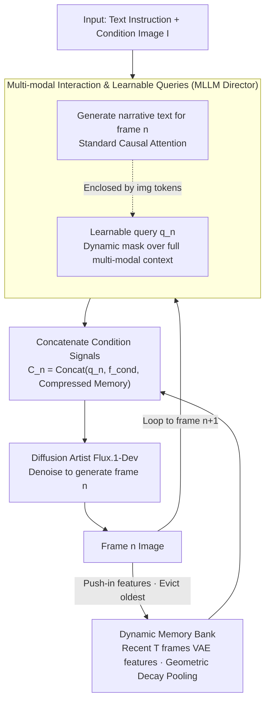

# Narrative Weaver: Towards Controllable Long-Range Visual Consistency with Multi-Modal Conditioning

**Conference**: CVPR 2026  
**arXiv**: [2603.06688](https://arxiv.org/abs/2603.06688)  
**Code**: TBD  
**Area**: Multi-modal VLM  
**Keywords**: Long-range visual consistency, Narrative generation, AR+Diffusion, Memory Bank, E-commerce advertising

## TL;DR
The Narrative Weaver framework is proposed, combining the narrative planning of MLLMs with the fine-grained generation of diffusion models. It achieves long-range visual consistency under multi-modal conditions through learnable queries and a dynamic Memory Bank. Additionally, it introduces EAVSD, the first e-commerce advertising storyboard dataset containing over 330K images.

## Background & Motivation

**Background**: Generative AI models such as Sora, Veo, and Midjourney demonstrate excellent performance in generating short video clips or single images. However, long-range narrative generation—maintaining the consistency of characters, backgrounds, and styles across many frames—remains a major challenge.

**Limitations of Prior Work**: (1) Video generation consistency degrades rapidly beyond short segments; (2) Image generation is often limited to single-frame operations, lacking multi-frame narrative planning; (3) Existing planning methods rely on pure text conditions, failing to achieve controllable vision-based grounding.

**Key Challenge**: There is a lack of a unified framework that integrates narrative planning, fine-grained control, and long-range consistency. Simultaneously, large-scale datasets for multi-modal conditional generation are scarce.

**Goal**: To achieve long-sequence consistent generation under multi-modal conditions in the form of (text, image) → (text, {Image_i}).

**Key Insight**: A hybrid architecture utilizing an Auto-Regressive (AR) model for planning and a diffusion model for generation, where consistency information is propagated between keyframes via a Memory Bank.

**Core Idea**: An MLLM acts as a "director" to plan the narrative and compress context into learnable queries. A Memory Bank anchors the initial visual conditions to prevent drift, and a three-stage progressive training strategy enables data-efficient learning.

## Method

### Overall Architecture
Narrative Weaver expands a (text, image) instruction into an entire visual narrative sequence while maintaining the consistency of characters, backgrounds, and styles across dozens of frames. It adopts a hybrid AR + Diffusion pipeline: the first stage uses an MLLM (Qwen2.5-VL-3B) as the "director" to plan the textual plot for the next frame and compress visual requirements into a set of query vectors. The second stage utilizes a diffusion model (Flux.1-Dev) as the "artist" to generate the actual frame using these queries and historical visual memory. A dynamic Memory Bank transfers information regarding previous frames to ensure the "artist" aligns with the established visual tone. The sequence rolls frame-by-frame: once a frame is generated, its features are compressed into the Memory Bank (evicting the oldest frame), and the process returns to the director for the next frame's planning.

### Key Designs

**1. Multi-modal Interaction & Learnable Queries: Enabling a single MLLM to perform scriptwriting and visual query aggregation without interference.**

The challenge lies in the director alternating between two different tasks: generating text for the next narrative segment and condensing high-level visual instructions for "what to draw." If these tasks share standard attention, query vectors might bias the text generation. The solution is a **dynamic causal attention mask**: text tokens use standard causal attention (attending only to preceding text), while learnable queries $q_n$ are permitted to attend to the entire multi-modal context—including input $\mathbf{I}$, all previous narrative text $\{t_j\}$, and prior queries $\{q_k\}$. This allows queries to absorb comprehensive multi-modal information without polluting the causal chain of pure text.

The sequence uses `` / `</img>` special tokens to enclose query segments, teaching the model to autonomously determine when to stop planning and insert a frame. Due to the clean decoupling of planning and visual aggregation by the mask, the model learns the timing of generation with only approximately 5K data samples.

**2. Dynamic Memory Bank: Balancing long-range consistency and computational efficiency with bounded geometric decay memory.**

In long-sequence generation, visual drift is common—by the tenth frame, the protagonist's appearance or scene might no longer match the beginning. While feeding all historical frame features into the diffusion model ensures consistency, memory and computation costs grow quadratically. The Memory Bank addresses this by caching only the VAE features of the $T$ most recent frames and applying **geometric decay average pooling**. More distant frames are compressed more aggressively; the feature length retained for the $k$-th frame is:

$$l / \lambda^{k-1}$$

Consequently, the total length of the memory is bounded by a constant:

$$L < l \cdot \lambda / (\lambda - 1)$$

The final condition signal for the $n$-th frame is formed by concatenating the current query, initial condition features, and this sequence of compressed memory:

$$\mathbf{C}_n = \text{Concat}(q_n,\, f^{cond},\, \hat{f}_{n-1},\, \dots,\, \hat{f}_{n-T})$$

This design ensures high-resolution details for recent frames (crucial for transitions) while retaining coarse contours for distant frames (sufficient for general direction). This anchors the initial conditions to prevent drift and reduces DiT computational complexity from quadratic to linear relative to the number of frames.

### Example: Generating Frame 5

Consider generating an 8-frame storyboard for e-commerce. At frame 5, the MLLM director examines the input image $\mathbf{I}$ and previous text to write the narrative ("The model applies lipstick to the back of her hand, camera zooms in"). It then outputs learnable queries $q_5$ enclosed in `` tokens, which have attended to the input image and historical context via the dynamic mask. The Memory Bank then provides VAE features for the recent $T$ frames (e.g., $T=4$), where frame 4 is preserved with high detail and frames 3/2/1 are compressed by $1/\lambda, 1/\lambda^2, 1/\lambda^3$ respectively. The diffusion model (Flux.1-Dev) uses $\mathbf{C}_5 = \text{Concat}(q_5, f^{cond}, \hat{f}_4, \hat{f}_3, \hat{f}_2, \hat{f}_1)$ to denoise and generate frame 5, ensuring the lipstick shade, model's face, and lighting align with previous frames. Finally, frame 5 is pushed into the Memory Bank, and frame 1 is evicted.

### Loss & Training
A three-stage progressive training strategy is utilized for efficient learning:

- **Stage 1 (Narrative Planning)**: Only the MLLM is trained to write narratives and determine frame insertion points using standard cross-entropy loss.
- **Stage 2 (Semantic Consistent Generation)**: Learnable queries and projectors are trained. Initial pre-training is conducted on 30M low-resolution text-image pairs, followed by fine-tuning on 60K high-quality samples using a Flow Matching objective.
- **Stage 3 (Fine-grained Consistency Alignment)**: The diffusion model is fully trained, incorporating VAE features from the condition image and the Memory Bank. Flow Matching remains the objective to refine fine-grained consistency.

## Key Experimental Results

### GPT-4o Evaluation (Consistent Visual Generation)

| Method | Text Control | ITC | RGC | MSSC | MSCC | IMQ |
|------|---------|-----|-----|------|------|-----|
| StoryDiffusion | ✗ | 6.54 | 5.86 | 7.48 | 6.00 | 6.80 |
| IP-Adapter | ✗ | 7.11 | 6.10 | 8.57 | 7.57 | 6.65 |
| Flux.1-kontext | ✗ | 7.06 | 9.41 | 8.11 | 7.28 | 6.94 |
| **Ours** | **✓** | **7.54** | 8.86 | **8.67** | **7.91** | **7.35** |

### Automatic Evaluation (DreamSim↓ / CLIP Score↑)

| Method | DreamSim↓ (Avg) | Description |
|------|----------------|------|
| StoryDiffusion | 56.33 | Multi-scene generation method |
| IP-Adapter | 33.30 | Reference image method |
| Flux.1-kontext | 3.71 | Editing method (prone to copy-paste issues) |
| **Ours** | **12.18** | Best among multi-scene generation methods |

### User Study
- 180+ user preference surveys confirm the model's advantages.
- While Flux.1-kontext shows strong metrics, it often exhibits "copy-paste" behavior, which users disfavor compared to Ours.

## Highlights & Insights
- First framework to unify narrative planning, fine-grained control, and long-range consistency, addressing a significant gap in the field.
- The dynamic causal attention mask is an elegant design, enabling the model to learn text planning with only ~5K samples.
- The geometric decay compression in the Memory Bank ensures bounded memory and prioritizes recent context.
- EAVSD fills the vacancy for e-commerce advertising storyboard datasets (330K+ images).
- The three-stage training strategy achieves SOTA results with limited compute and data, demonstrating high practicality.
- Computational complexity is reduced from quadratic to linear, facilitating the generation of longer narrative sequences.

## Limitations & Future Work
- Currently focused on keyframe generation; consistency in transitional video segments between keyframes remains an open problem.
- The planning capacity of Qwen2.5-VL-3B may limit narrative complexity; scaling to larger MLLMs could raise the performance ceiling.
- EAVSD dataset generation relies on commercial models (Qwen-Image, Flux.1-kontext), which may introduce generation biases.
- Dedicated modules for identity (ID) preservation (e.g., face ID embedding) could be integrated to further enhance character consistency.
- The impact of the geometric decay rate $\lambda$ on various narrative lengths requires further ablation.
- Stage 3 training was limited to 1-2 epochs; more extensive training might further improve fine-grained local alignment.

<!-- RELATED:START -->

## Related Papers

- [\[CVPR 2026\] Wan-Weaver: Interleaved Multi-modal Generation via Decoupled Training](wan-weaver_interleaved_multi-modal_generation_via_decoupled_training.md)
- [\[ACL 2025\] Mitigating Visual Forgetting via Take-along Visual Conditioning for Multi-modal Long CoT Reasoning](../../ACL2025/multimodal_vlm/tvc_mitigating_visual_forgetting.md)
- [\[CVPR 2026\] Visual-Aware CoT: Achieving High-Fidelity Visual Consistency in Unified Models](visual-aware_cot_achieving_high-fidelity_visual_consistency_in_unified_models.md)
- [\[CVPR 2026\] Controllable Federated Prompt Learning at Test Time](controllable_federated_prompt_learning_at_test_time.md)
- [\[CVPR 2026\] Hierarchical Attacks for Multi-Modal Multi-Agent Reasoning](hierarchical_attacks_for_multi-modal_multi-agent_reasoning.md)

<!-- RELATED:END -->
