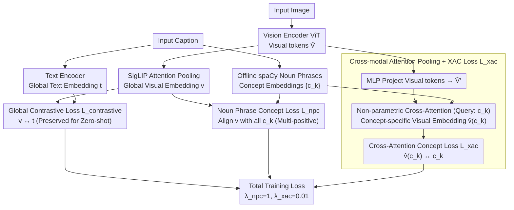

# No Hard Negatives Required: Concept Centric Learning Leads to Compositionality without Degrading Zero-shot Capabilities of Contrastive Models

**Conference**: CVPR 2026  
**arXiv**: [2603.25722](https://arxiv.org/abs/2603.25722)  
**Code**: [https://github.com/SamsungLabs/concept_centric_clip](https://github.com/SamsungLabs/concept_centric_clip)  
**Area**: Multi-modal VLM / Contrastive Learning  
**Keywords**: Compositional Understanding, Contrastive Learning, CLIP Fine-tuning, Noun Phrases, Zero-shot Generalization

## TL;DR

C2LIP proposes a contrastive fine-tuning scheme that does not rely on hard negatives. By decomposing text into noun phrase concepts and introducing cross-modal attention pooling, it achieves SOTA on SugarCrepe/SugarCrepe++ compositionality benchmarks while maintaining or improving zero-shot and retrieval performance.

## Background & Motivation

1. **Background**: Contrastive vision-language models (CLIP, SigLIP) are cornerstones of computer vision, supporting open-world tasks such as zero-shot classification and retrieval.

2. **Limitations of Prior Work**:
    - **Poor Compositional Understanding**: CLIP tends to learn Bag-of-Words (BoW) representations, failing to distinguish between "a red couch" and "a couch next to a red object," thus failing to correctly bind nouns and attributes.
    - **Limitations of Hard Negative Methods**: Existing methods (NegCLIP, DAC, SLVC, etc.) improve compositionality by fine-tuning with generated hard negatives, but (a) are only effective on specific benchmarks with poor generalization; (b) significantly degrade zero-shot classification and retrieval performance; (c) require complex data generation pipelines (LLMs, T2I models).
    - **Architectural Issues**: Global pooling operations in text and vision encoders blend information from different regions, leading to a complete loss of binding relationships.

3. **Key Challenge**: Long descriptive captions naturally do not require compositional representations for contrastive learning (BoW suffices), and global pooling destroys binding information—these two root causes prevent compositionality from being solved by simple post-hoc hard negative training.

4. **Goal**: Simultanously improve compositional understanding and maintain zero-shot/retrieval performance without using hard negatives.

5. **Key Insight**: (a) Use short noun phrases instead of long captions for contrastive learning to force the model to learn fine-grained binding; (b) Extract concept-specific visual representations using cross-modal attention before global pooling to pass compositional learning signals to pre-pooled features.

6. **Core Idea**: Use noun phrase concepts for contrast and cross-modal attention for binding before pooling; compositionality can be achieved without hard negatives.

## Method

### Overall Architecture

The model is fine-tuned on SigLIP, keeping the original global contrastive loss $\mathcal{L}_{contrastive}$ unchanged while introducing two auxiliary losses: (1) Noun Phrase Concept (NPC) contrastive loss $\mathcal{L}_{npc}$ to align the global visual representation with each noun phrase; (2) Cross-Attention Concept (XAC) loss $\mathcal{L}_{xac}$ using noun phrases as queries to extract and align concept-specific representations from visual tokens. The three losses are combined with disparate weights. At inference, there is no additional overhead, and the process is identical to the original SigLIP.

### Key Designs

**1. Noun Phrase Concept Contrastive Loss $\mathcal{L}_{npc}$: Forcing binding where BoW fails**

The first root cause is that long captions do not require compositionality—with a dozen words, the model can match the image using Bag-of-Words (BoW), never learning to bind "red" to "couch." C2LIP replaces the text side of the contrast: it uses spaCy to extract noun phrases (e.g., "a red couch") offline, pools text tokens into concept embeddings $\{c_k\}$, and aligns the global visual embedding $v$ of an image with all its corresponding noun phrases as multiple positives. Phrases are short enough that "a red couch" cannot be matched via BoW—it must be distinguished from "a red object near a couch," forcing the model to bind attributes to nouns. The SigLIP sigmoid loss is extended to support multiple positives. These positives come from real captions rather than LLM-generated hard negatives, avoiding distribution shifts.

**2. Cross-modal Attention Pooling + Cross-Attention Concept Loss $\mathcal{L}_{xac}$: Sending signals before global pooling**

The second root cause is that global pooling mixes nouns and attributes from different regions, losing binding relationships at the pooling step. C2LIP reuses the existing value projections and MLP from the SigLIP attention pooling layer to project visual tokens into a joint space $\bar{V}'$. It then uses the noun phrase concept embedding $c$ as a query to perform cross-attention over $\bar{V}'$, extracting a concept-specific visual embedding:

$$\hat{v}(c) = \bar{V}'^{\top} \cdot \text{attn}(c, \bar{V}')$$

This is aligned to $c_k$ using a contrastive loss similar to $\mathcal{L}_{npc}$. Crucially, this pooling layer **introduces no learnable parameters**—it is a weighted readout, meaning gradient signals for "which token belongs to which concept" are backpropagated directly to pre-pooled visual representations. This design also ensures zero additional overhead at inference.

**3. Total Training Loss: Disparate auxiliary loss weights**

The total objective is:

$$\mathcal{L}_{total} = \mathcal{L}_{contrastive} + \lambda_{npc}\mathcal{L}_{npc} + \lambda_{xac}\mathcal{L}_{xac}$$

The original global contrastive loss $\mathcal{L}_{contrastive}$ is kept intact to preserve zero-shot capabilities. The auxiliary weights are set asymmetrically: $\lambda_{npc}=1$ and $\lambda_{xac}=0.01$. This difference is intentional—the cross-attention loss provides a strong gradient signal, requiring only a small weight to drive pre-pooling features to learn binding. Higher weights would bias the global representation and degrade zero-shot and retrieval performance.

### Loss & Training

- Fine-tuned on CC3M (DreamLIP version) using pre-trained SigLIP ViT-B/16 for only 5 epochs.
- Adam optimizer, learning rate 1e-5, 8x A40 GPUs, effective batch size 768.
- Offline extraction of noun phrases using spaCy.
- Inference is identical to original SigLIP, with no extra parameters or computation.

## Key Experimental Results

### Main Results

Comprehensive evaluation of Compositionality + Zero-shot + Retrieval (ViT-B/16):

| Method | SC Add | SC Replace | SC Swap | SC++ Replace I2T | SC++ Swap I2T | ImNet1K | Flickr30k | MSCOCO | Avg |
|------|--------|-----------|---------|-------------------|---------------|---------|-----------|--------|------|
| SigLIP (Original) | 86.5 | 84.1 | 65.8 | 73.8 | 62.8 | 76.1 | 95.2 | 78.9 | 70.0 |
| NegCLIP | 85.8 | 85.0 | 75.3 | 69.1 | 70.9 | 55.7 | 92.4 | 73.9 | 67.7 |
| DAC-LLM | 93.7 | 89.5 | 74.6 | 53.7 | 59.6 | 51.1 | 83.7 | 59.0 | 57.2 |
| FG-CLIP | 84.7 | 85.1 | 69.9 | 75.8 | 67.5 | 69.0 | 95.8 | 78.4 | 70.7 |
| SigLIP (CC3M ft) | 87.9 | 85.6 | 69.7 | 73.5 | 67.9 | 75.9 | 95.6 | 80.3 | 71.5 |
| **Ours (C2LIP)** | **94.2** | **88.3** | **73.1** | **79.7** | **75.3** | 73.5 | **97.0** | **82.7** | **75.0** |

### Ablation Study

Attribute binding breakdown (SugarCrepe + SugarCrepe++ attribute subsets):

| Method | SC Replace | SC Swap | SC++ Replace I2T/TOT | SC++ Swap I2T/TOT | Avg |
|------|-----------|---------|----------------------|-------------------|------|
| SigLIP | 86.7 | 71.5 | 75.5 / 64.2 | 56.3 / - | - |
| NegCLIP | 85.3 | 80.0 | 66.1 / - | 73.2 / - | - |
| **Ours (C2LIP)** | **89.3** | **77.6** | **82.5** / - | **78.2** / - | - |

### Key Findings

- **C2LIP is the only method ranking highly across all benchmarks**: Hard negative methods (NegCLIP/DAC) suffer from severe degradation in zero-shot/retrieval (ImageNet dropping to 40-55%), whereas C2LIP drops only 2.6% (76.1→73.5).
- **CC3M fine-tuning alone provides limited gains for compositionality** (SigLIP ft only 70.0→71.5), but adding C2LIP concept losses results in a jump to 75.0.
- **Non-parametric cross-modal attention pooling** is critical—it transmits gradient signals directly to pre-pooled features, enabling internal binding.
- Flickr30k retrieval improved from 95.2 to 97.0, and MSCOCO from 78.9 to 82.7, showing that concept alignment also benefits retrieval tasks.

## Highlights & Insights

- **Precise Problem Analysis**: Identifies BoW shortcuts and global pooling information loss as root causes. This is more fundamental than "brute-force" addition of hard negatives.
- **Minimalist Design**: No additional learnable parameters, no inference overhead, fine-tuned in only 5 epochs, and requires no LLMs or T2I models. Uses only spaCy for noun phrase extraction and standard attention operations.
- **Hyperparameter Insight**: The setting of $\lambda_{xac} = 0.01$ indicates that the cross-attention loss gradient is highly effective; a small weight is sufficient.
- **Generality**: Validated on SigLIP, but the principle applies to any CLIP-like model.
- **Deployment Friendly**: Zero-cost at inference, introducing no additional computational burden.

## Limitations & Future Work

- ImageNet zero-shot classification decreased by 2.6%. The authors attribute this to the narrow training data domain and a conflict between scene-centric representations and ImageNet's object-centric tasks, which remains a trade-off.
- Fine-tuned only on CC3M (3M scale); performance on larger datasets remains unverified.
- Noun phrase extraction quality is limited by the accuracy of the spaCy NLP tool.
- Effects on ViT-L and larger models have not been explored.
- Cross-modal attention pooling is only used during training; would using it during inference further improve concept-level retrieval?

## Related Work & Insights

- **vs NegCLIP/DAC**: Hard negative methods can be strong on specific benchmarks (DAC achieves 93.7 on SugarCrepe Add) but severely damage zero-shot capabilities (ImageNet 51.1). C2LIP is balanced across all tasks.
- **vs CLIC**: CLIC performs well on SugarCrepe++ Swap-I2T but poorly on text-only (TOT) tasks, suggesting its text encoder has not truly learned compositionality.
- **vs FG-CLIP**: FG-CLIP (trained on LAION-2B with extensive hard negative data) averages 70.7; C2LIP reaches 75.0 with just 5 epochs on CC3M.
- **vs Assouel et al.**: They also use cross-attention for binding but require LLM scene graph decomposition and multiple forward passes, resulting in high training and inference costs. C2LIP is non-parametric and requires no extra forward passes.

## Rating

- Novelty: ⭐⭐⭐⭐ Deep root cause analysis and an elegant, simple solution, though the idea is not entirely unexpected.
- Experimental Thoroughness: ⭐⭐⭐⭐⭐ Covers compositionality, zero-shot, retrieval, and fine-grained retrieval with fair baseline comparisons.
- Writing Quality: ⭐⭐⭐⭐⭐ Textbook-level writing with clear problem definitions and rigorous experimental design.
- Value: ⭐⭐⭐⭐⭐ Extremely practical post-training solution with zero inference overhead, directly applicable to industrial scenarios.

<!-- RELATED:START -->

## Related Papers

- [\[CVPR 2026\] β-CLIP: Text-Conditioned Contrastive Learning for Multi-Granular Vision-Language Alignment](b-clip_text-conditioned_contrastive_learning_for_multi-granular_vision-language_.md)
- [\[CVPR 2026\] FlowComposer: Composable Flows for Compositional Zero-Shot Learning](flowcomposer_composable_flows_for_compositional_zeroshot_learning.md)
- [\[CVPR 2026\] AGFT: Alignment-Guided Fine-Tuning for Zero-Shot Adversarial Robustness of Vision-Language Models](agft_alignment-guided_fine-tuning_for_zero-shot_adversarial_robustness_of_vision.md)
- [\[ECCV 2024\] The Hard Positive Truth About Vision-Language Compositionality](../../ECCV2024/multimodal_vlm/the_hard_positive_truth_about_visionlanguage_compositionalit.md)
- [\[CVPR 2026\] MuCo: Multi-turn Contrastive Learning for Multimodal Embedding Model](muco_multi-turn_contrastive_learning_for_multimodal_embedding_model.md)

<!-- RELATED:END -->
