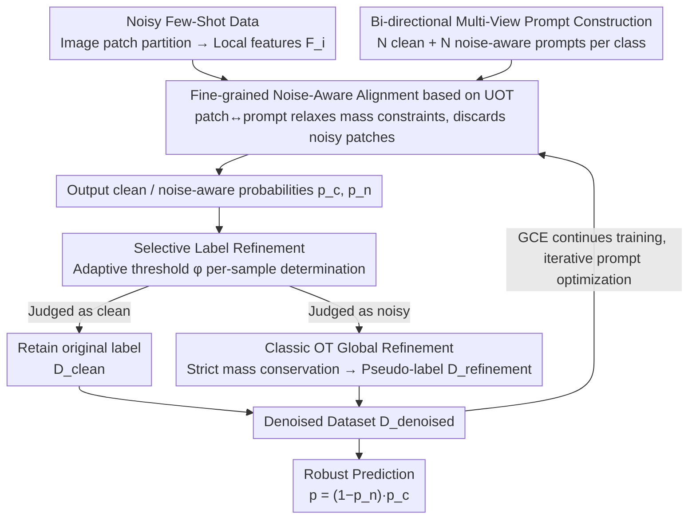

# Noise-Aware Few-Shot Learning through Bi-directional Multi-View Prompt Alignment

**Conference**: CVPR 2026  
**arXiv**: [2603.11617](https://arxiv.org/abs/2603.11617)  
**Code**: None  
**Area**: Multimodal VLM  
**Keywords**: Noisy labels, prompt learning, optimal transport, CLIP, few-shot learning

## TL;DR

The NA-MVP framework is proposed, which achieves fine-grained patch-to-prompt alignment through a bi-directional (clean + noise-aware) multi-view prompt design combined with Unbalanced Optimal Transport (UOT). It utilizes classic OT to perform selective label refinement on identified noisy samples, consistently surpassing SOTA in noisy few-shot learning scenarios.

## Background & Motivation

Vision-Language Models (VLMs) like CLIP can be efficiently adapted to downstream tasks through prompt learning, which is particularly effective in few-shot scenarios. However, when training labels are noisy, the small number of samples per category means even a few incorrect labels can disproportionately bias gradient updates and introduce spurious correlations.

Existing noisy prompt learning methods face three major limitations:

**Insufficient Prompt Expressiveness**: Most methods use only 1-2 prompts (e.g., positive/negative pairs). Single-view alignment fails to capture diverse and fine-grained semantic cues, making it difficult to distinguish between clean and noisy signals effectively.

**Rigid Explicit Negative Labels**: Assigning a hard negative label to each image (specifying a certain counter-class) is problematic, as these fixed signals are often inaccurate or uninformative in noisy environments, hindering optimization.

**Coarse Denoising**: Reliance on fixed confidence thresholds or non-selective pseudo-labeling mechanisms leads to either missing noisy samples or incorrectly modifying clean labels, causing error propagation.

**Key Insight**: Robust noisy few-shot learning requires a transition from global matching to **region-aware fine-grained alignment**—adaptively distinguishing between clean and noisy semantics at the image patch level, while performing label refinement in a sample-adaptive (rather than globally fixed) manner. This requires addressing three sub-problems: (1) How to model clean/noisy signals at the local patch level; (2) How to perform flexible alignment instead of forced global matching; (3) How to selectively correct mislabeled samples without over-intervention.

## Method

### Overall Architecture

NA-MVP consists of two core modules that collaborate iteratively:

- **Noise-Aware Alignment Module**: Constructs multiple clean-oriented and noise-aware prompts for each class. It achieves fine-grained alignment with local image patches via UOT to generate clean/noisy probability distributions.
- **Selective Label Refinement Module**: Derives adaptive thresholds based on bi-directional alignment signals to identify potential mislabeled samples, correcting their labels using classic OT (strict mass conservation).

These two modules iteratively update the training set and optimize prompt parameters, eventually producing a denoised dataset $\mathcal{D}_{\text{denoised}} = \mathcal{D}_{\text{clean}} \cup \mathcal{D}_{\text{refinement}}$ for robust prediction.

### Key Designs

**1. Bi-directional Multi-View Prompt Construction: Replacing Rigid Explicit Negative Labels with Implicit Negatives**

For each class $k$, two sets of learnable prompts are constructed: clean-oriented $\{Prompt_{m,k}^c\}_{m=1}^N$ and noise-aware $\{Prompt_{m,k}^n\}_{m=1}^N$ (default $N=4$). Each prompt consists of $M$ learnable context tokens followed by a class-specific token:

$$Prompt_{m,k}^c = [V_1^c, V_2^c, \ldots, V_M^c, \texttt{CLS}_k]$$

Clean prompts capture class-related stable semantics, while noise-aware prompts act as adaptive filters to identify and suppress misleading signals. Crucially, all non-target classes serve as implicit negative samples, avoiding the rigidity of explicit negative labels—there is no need to specify a particular counter-class; instead, all non-target classes naturally provide contrastive signals.

**2. Fine-grained Noise-Aware Alignment based on UOT: Relaxing Quality Constraints to Safely Discard Noisy Patches**

Local image features $F_i \in \mathbb{R}^{L \times d}$ ($L = H \times W$ patches) and prompt features $G_k \in \mathbb{R}^{N \times d}$ are treated as discrete distributions. The cost matrix $C_k = 1 - F_i G_k^\top$ is computed via cosine similarity.

The key to UOT is **relaxing the strict mass conservation constraints**:

$$\Pi(\mu, \nu) = \{T \in \mathbb{R}_+^{L \times N} \mid T\mathbf{1}_N \leq \mu, \; T^\top\mathbf{1}_L = \nu\}$$

Note that $T\mathbf{1}_N \leq \mu$ uses an inequality, allowing some image patches to not be assigned to any prompt. This relaxation is naturally suited for noisy scenarios: noisy or irrelevant patches do not require forced alignment and can be safely "discarded." The optimal transport plan $T^* = \text{diag}(\mu^{(t)}) Q \text{diag}(\nu^{(t)})$ is efficiently solved using the Dykstra algorithm (Sinkhorn + entropy regularization).

**3. Selective Label Refinement: Sample-Adaptive Threshold + Classic OT to Refine Only the Necessary Samples**

- **Noise Identification**: Computes the UOT distance between samples and clean/noise-aware prompts to obtain similarities $s_{i,k}^c$ and $s_{i,k}^n$, deriving an adaptive threshold:

$$\phi_{i,k} = \frac{\exp(s_{i,k}^n / \tau)}{\exp(s_{i,k}^c / \tau) + \exp(s_{i,k}^n / \tau)}$$

A sample is judged as clean when $p_{ik}^c > \phi_{i,k}$, and noisy otherwise. This threshold is sample-adaptive, making it more flexible than DEFT's fixed threshold of $0.5$.

- **Label Refinement**: For samples identified as noisy, classic OT (strict mass conservation) is used to compute the optimal transport plan $T^*$ between global image features and class prompt features. The pseudo-label is taken as $\tilde{y}_i = \arg\max_j T_{ij}^*$. Strict mass conservation ensures global rationality in assignment.

- **Selective Strategy**: Only samples with $p_{ik}^c < \phi_{i,k}$ are refined, while confident samples remain unchanged. This avoids the issue where global pseudo-labeling methods incorrectly modify correct labels under low noise conditions.

### Loss & Training

**Two-stage Training**:

- **Early Stage** (first $T_{sup}$ epochs): Training on noisy data using $\mathcal{L}_{sup} = \mathcal{L}_{gce} + \lambda_i \cdot \mathcal{L}_{itbp}$.
    - GCE (Generalized Cross-Entropy): A loss function naturally robust to noisy labels.
    - ITBP Loss: A bi-directional contrastive loss that encourages image features to align with clean prompts and move away from noise-aware prompts, explicitly separating clean and noisy semantics.
- **Late Stage**: Activates the label refinement module and continues training with GCE on the denoised dataset $\mathcal{D}_{\text{denoised}}$.

**Inference**: Utilizes both clean and noise-aware probabilities: $p(y=k|x_i) = (1 - p_{ik}^n) \cdot p_{ik}^c$.

**Implementation**: SGD optimizer (lr=0.002, momentum=0.9, weight_decay=5e-4), 50 epochs, 16 shared context tokens, ResNet-50 image encoder, single RTX 4040.

## Key Experimental Results

### Main Results: Comparison under Synthetic Noise (16-shot, Accuracy %)

| Dataset | Method | Sym-25% | Sym-50% | Sym-75% | Asym-25% | Asym-50% |
|--------|------|---------|---------|---------|----------|----------|
| Caltech101 | CoOp | 81.03 | 70.90 | 46.90 | 75.23 | 49.43 |
| | NLPrompt | 91.13 | 89.93 | 86.70 | 91.17 | 89.27 |
| | **NA-MVP** | **92.10** | **91.30** | **89.37** | **91.47** | **89.53** |
| OxfordPets | CoOp | 66.73 | 47.03 | 24.60 | 66.20 | 38.73 |
| | NLPrompt | 86.00 | 83.17 | 70.77 | 84.97 | 77.53 |
| | **NA-MVP** | **88.40** | **88.13** | **86.23** | **87.53** | **79.33** |
| DTD | CoOp | 49.57 | 34.37 | 17.27 | 47.75 | 29.63 |
| | NLPrompt | 61.23 | 55.17 | 39.80 | 60.60 | 50.80 |
| | **NA-MVP** | **63.13** | **58.50** | **48.63** | **62.33** | **52.10** |
| Flowers102 | NLPrompt | 92.57 | 89.90 | 76.80 | 93.40 | 81.10 |
| | **NA-MVP** | **93.30** | **90.47** | 76.47 | 91.37 | 78.43 |

**Key Findings**: NA-MVP shows the most significant advantage at high noise rates (75% Sym)—leading NLPrompt by **+15.46%** (86.23 vs 70.77) on OxfordPets, indicating exceptional robustness when noise is severe. On Flowers102 under low noise, it is close to NLPrompt, with advantages primarily manifesting in difficult, high-noise scenarios.

### Real-World Noise (Food101N)

| Method | 4-shot | 8-shot | 16-shot | 32-shot |
|------|--------|--------|---------|---------|
| NLPrompt | 70.57 | 73.93 | 76.46 | 76.87 |
| **NA-MVP** | **76.10** | **76.27** | **76.90** | **77.03** |

The advantage is greatest at 4-shot (+5.53), verifying that noise has the largest impact with extremely few samples, and NA-MVP's fine-grained denoising mechanism yields the most benefit here.

### Ablation Study (DTD, Sym Noise, Accuracy %)

| Configuration | 25% | 50% | 75% | Mean |
|------|-----|-----|-----|------|
| (a) CoOp Single Prompt | 59.83 | 50.73 | 33.67 | 48.08 |
| (b) + Explicit Negative Label | 59.53 | 52.53 | 34.40 | 48.82 |
| (c) + Implicit Bi-directional | 60.13 | 53.73 | 35.03 | 49.63 |
| (d) + Multi-view | 62.73 | 55.13 | 37.63 | 51.83 |
| (e) + UOT Alignment | 62.50 | 57.70 | 42.33 | 54.18 |
| (f) + OT Alignment | 62.30 | 56.80 | 41.00 | 53.37 |
| (g) + KL Divergence Alignment | 62.27 | 56.43 | 39.10 | 52.60 |
| (h) + Global OT Refinement | 59.60 | 54.77 | 45.77 | 53.38 |
| (i) + Selective Refinement (ϕ) | **63.13** | **58.50** | **48.63** | **56.75** |

**Key Ablation Insights**:
- Implicit bi-directional (c) outperforms explicit negative labels (b), verifying the flexibility of the implicit negative design.
- UOT (e) > OT (f) > KL (g), showing that relaxing mass constraints is advantageous in noisy environments (leads OT by 1.33% at 75% noise).
- Global OT refinement (h) actually harms performance at 25% low noise (59.60 vs 62.50 without refinement) due to incorrect modification of correct labels; selective refinement (i) consistently improves across all noise levels.

### Comparison with DEFT (OxfordPets, Sym Noise, Accuracy %)

| Method | 12.5% | 25% | 37.5% | 50% | 62.5% | 75% |
|------|-------|-----|-------|-----|-------|-----|
| DEFT | 88.83 | 88.23 | 88.10 | 86.73 | 84.10 | 75.87 |
| **NA-MVP** | 88.50 | **88.40** | **88.23** | **88.13** | **86.93** | **86.23** |

DEFT drops sharply at 75% noise (75.87), while NA-MVP maintains 86.23 (+10.36), proving the adaptive threshold $\phi_{i,k}$ is significantly more robust than DEFT's fixed 0.5 threshold.

## Highlights & Insights

- **New Conceptual Perspective**: Redefines noise robustness as "region-aware clean-noisy semantic decomposition," transcending the global matching paradigm of prior work.
- **Clever Adaptation of UOT**: Relaxing mass constraints fits noisy scenarios naturally—noisy patches do not require forced alignment and can be safely "discarded."
- **Complementarity of Two OTs**: UOT is used for local fine-grained alignment (tolerating noise), while classic OT is used for global label refinement (strict mass conservation ensuring assignment rationality).
- The inference formula $(1-p^n) \cdot p^c$ is simple and elegant, utilizing bi-directional information simultaneously.
- Analysis of the number of prompts $N=4$ reveals diminishing marginal returns for multi-view (redundancy starts at $N=8$).

## Limitations & Future Work

- Validated only on classification tasks; not extended to more complex vision tasks like detection or segmentation.
- Focused on ResNet-50 backbone; not verified whether advantages persist with stronger backbones (ViT-L/14, etc.).
- Sinkhorn iterations in UOT introduce additional computational overhead, which is not discussed in detail.
- Noise assumptions are limited to standard symmetric/asymmetric patterns; real-world noise may be more complex (e.g., instance-dependent noise).
- The optimal number of multi-view prompts $N$ may depend on dataset characteristics, and an automatic selection mechanism is lacking.

## Related Work & Insights

- **vs CoOp**: Basic prompt learning that does not consider noise; performance drops sharply as noise increases.
- **vs NLPrompt**: Uses OT-Filter for noise identification + global OT labeling, belonging to coarse-grained global methods. NA-MVP achieves finer processing through patch-level UOT + adaptive thresholds.
- **vs PLOT**: PLOT uses OT for multi-prompt alignment but targets clean data. NA-MVP extends this to a noise-aware bi-directional design.
- **vs CLIPN**: CLIPN uses positive/negative prompt pairs for OOD detection. NA-MVP transfers the bi-directional idea to noisy label learning and incorporates multi-view.
- **Inspiration**: The "relaxed matching" concept of UOT can be transferred to scenarios like noisy object detection annotations or imprecise medical image labels; the conclusion that implicit negatives outperform explicit negative labels is generally applicable to contrastive learning.

## Rating

- Novelty: ⭐⭐⭐⭐ Introducing UOT into prompt-based noisy label learning is novel, and the bi-directional multi-view design is unique.
- Experimental Thoroughness: ⭐⭐⭐⭐ 5 synthetic noise datasets + 1 real-world noise dataset; ablation studies cover components, alignment types, prompt counts, and threshold strategies.
- Writing Quality: ⭐⭐⭐⭐ Motivations are clearly articulated, the three major limitations are well-summarized, and the method description is systematic.
- Value: ⭐⭐⭐⭐ Provides an effective solution for the practical scenario of noisy few-shot learning, with significant gains at high noise levels.

<!-- RELATED:START -->

## Related Papers

- [\[CVPR 2025\] NLPrompt: Noise-Label Prompt Learning for Vision-Language Models](../../CVPR2025/multimodal_vlm/nlprompt_noise-label_prompt_learning_for_vision-language_models.md)
- [\[CVPR 2026\] See Less, See Right: Bi-directional Perceptual Shaping For Multimodal Reasoning](see_less_see_right_bi-directional_perceptual_shaping_for_multimodal_reasoning.md)
- [\[CVPR 2026\] Improving Calibration in Test-Time Prompt Tuning for Vision-Language Models via Data-Free Flatness-Aware Prompt Pretraining](improving_calibration_in_test-time_prompt_tuning_for_vision-language_models_via_.md)
- [\[CVPR 2026\] FedMPT: Federated Multi-Label Prompt Tuning of Vision-Language Models](fedmpt_federated_multi-label_prompt_tuning_of_vision-language_models.md)
- [\[CVPR 2026\] Bridging the Modality Gap in Compositional Zero-Shot Learning via Sparse Alignment and Unimodal Memory Bank](bridging_the_modality_gap_in_compositional_zero-shot_learning_via_sparse_alignme.md)

<!-- RELATED:END -->
