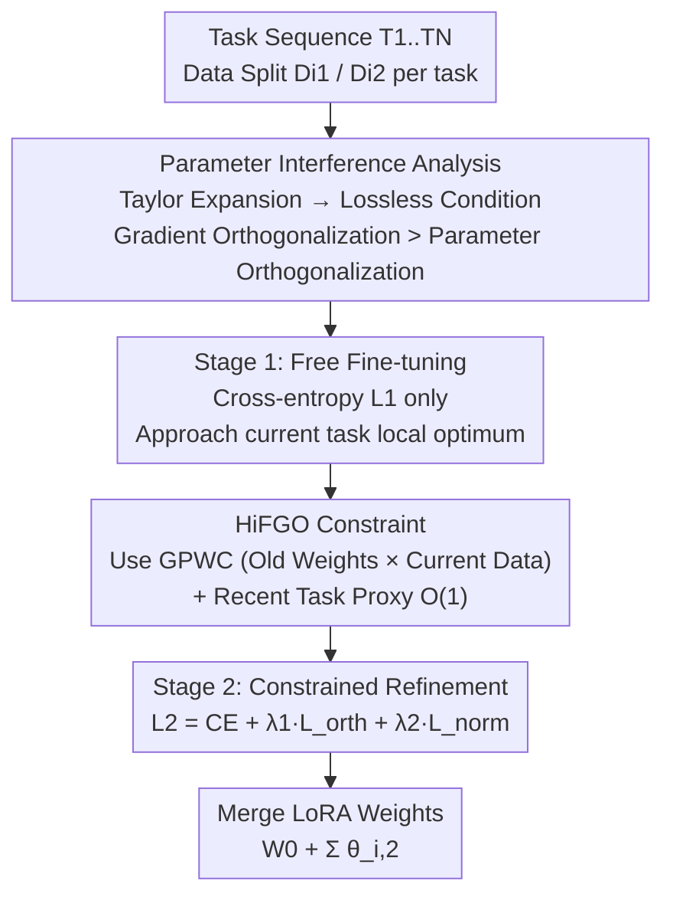

# Octopus: History-Free Gradient Orthogonalization for Continual Learning in Multimodal Large Language Models

**Conference**: CVPR 2026  
**Paper**: [CVF Open Access](https://openaccess.thecvf.com/content/CVPR2026/html/Liu_Octopus_History-Free_Gradient_Orthogonalization_for_Continual_Learning_in_Multimodal_Large_CVPR_2026_paper.html)  
**Code**: https://fxmangd26.github.io/Octopus/ (Project Page)  
**Area**: Multimodal VLM / Continual Learning / MLLM Fine-tuning  
**Keywords**: Continual Learning, Multimodal Large Language Models, Gradient Orthogonalization, History-Free, Two-stage Fine-tuning

## TL;DR
Addressing the challenge of preventing catastrophic forgetting without storing historical data in Multimodal Large Language Models (MLLMs), Octopus demonstrates that gradient orthogonalization is more critical than parameter orthogonalization. It proposes History-Free Gradient Orthogonalization (HiFGO), which utilizes only historical weights (no historical data), combined with a two-stage fine-tuning strategy (free adaptation followed by constrained refinement). On the UCIT benchmark, it outperforms the previous SOTA by 2.14% in Avg and 6.82% in Last accuracy.

## Background & Motivation
**Background**: Continual learning enables MLLMs to incrementally absorb knowledge from a sequence of tasks. Current methods generally fall into three categories: architecture-based (allocating LoRA modules per task), replay-based (storing historical data/activations for rehearsal), and regularization-based (constraining parameter updates to a subspace that does not harm old tasks).

**Limitations of Prior Work**: Each category has significant drawbacks. Architecture-based methods increase inference overhead and may impair generalization to unseen tasks. Replay-based methods require storing historical data, which is often infeasible due to privacy and storage constraints. Regularization-based methods avoid these issues but mostly enforce **parameter orthogonalization**. Research in model merging suggests that parameter orthogonalization is insufficient to completely eliminate parameter interference.

**Key Challenge**: To fully prevent interference, one should constrain **gradient orthogonalization** rather than parameter orthogonalization. However, existing gradient orthogonalization methods (like OGD) rely on historical task data to compute old gradients, returning to the privacy/storage issues of replay methods. Furthermore, experiments show that regularization constraints often "compete" with the optimization objective of the current task, where rigid constraints can degrade fine-tuning performance.

**Goal**: (1) Achieve gradient-level orthogonalization without accessing historical data; (2) Resolve the competition between regularization constraints and task adaptation.

**Key Insight**: A Taylor expansion of two tasks derives a "lossless condition": as long as the parameter update of Task 2 is orthogonal to the **gradient** of Task 1 on its own data, Task 1 remains unharmed (under first-order approximation). The key observation is that since old task parameters have converged to local optima, their gradients on the **current data** encode both reusable shared knowledge and task conflicts. Thus, "old weights + current data" can approximate the required gradients, bypassing historical data.

**Core Idea**: Use "Gradients of Previous parameters Within Current data distribution (GPWC)" to replace old gradients and constrain current updates to be orthogonal to them. A two-stage fine-tuning approach decouples "adaptation" and "constraint" to balance plasticity and stability.

## Method

### Overall Architecture
Octopus performs continual fine-tuning based on LoRA for a task sequence $T_1, \dots, T_N$. It first establishes the theoretical basis for why gradient orthogonalization (over parameter orthogonalization) is necessary, designs the history-free HiFGO constraint accordingly, and finally utilizes two-stage fine-tuning to mitigate the conflict between constraints and adaptation. For a single task $i$: the data is split into $D_{i1}$ and $D_{i2}$. **Stage 1** involves free fine-tuning using only cross-entropy loss to allow LoRA to approach the local optimum of the current task. **Stage 2** computes the GPWC of all historical tasks, adding a gradient orthogonalization loss and L2 regularization to the cross-entropy loss for constrained refinement. The entire pipeline avoids storing any historical data, relying solely on historical weights.

### Key Designs

**1. Parameter Interference Analysis: Proving Gradient > Parameter Orthogonalization**

Addressing the issue that "parameter orthogonalization is insufficient to prevent interference." Let $\theta_1', \theta_2$ be the optimized LoRA weights for two tasks ($\theta_1'=W_0+\theta_1$). The requirement that training Task 2 does not harm Task 1 is defined by the **lossless condition**: $L_{D_1}(\theta_1')=L_{D_1}(\theta_1'+\theta_2)$. A Taylor expansion at $\theta_1'$ gives $L_{D_1}(\theta_1'+\theta_2)=L_{D_1}(\theta_1')+\langle\frac{\partial L_{D_1}(\theta_1')}{\partial\theta_1'},\theta_2\rangle+\mathcal{O}(\|\theta_2\|^2)$. Since LoRA weight magnitudes are much smaller than pre-trained weights, higher-order terms are negligible, simplifying the condition to $\langle\frac{\partial L_{D_1}(\theta_1')}{\partial\theta_1'},\theta_2\rangle=0$—meaning the **current parameter update must be orthogonal to the old task gradient**. The authors point out that methods like OLoRA, which enforce **parameter orthogonalization** ($\theta_2\perp\theta_1$), do not guarantee this. $\theta_1$ represents the trajectory from the pre-trained point to the local optimum, which differs semantically from the instantaneous gradient at $\theta_1'$. This theoretical foundation shifts the focus from parameters to gradients.

**2. HiFGO: Replacing Historical Gradients with GPWC and O(1) Proxying**

To overcome the need for historical data, the ideal orthogonal loss $L_{orth}(\theta_i)=\sum_{j=1}^{i-1}\big(\frac{\partial L_{D_i}(\theta_j')}{\partial\theta_j'}\big)^T\theta_i$ would require gradients from every historical task on their original data. The authors propose **GPWC (Gradients of Previous parameters Within Current data distribution)**. Since old parameters have converged, their gradients on the **current data** reflect shared knowledge and potential conflicts. By using old weights with current data, the model calculates the required gradients without needing historical data. Furthermore, to avoid costs scaling linearly with the number of tasks ($O(t)$), the authors observe that the most recent parameters implicitly encode historical knowledge. Thus, they use the **recent task parameters $\theta_{i-1}'$ as a proxy** for the entire history, simplifying the loss to $L'_{orth}(\theta_i)=\big(\frac{\partial L_{D_i}(\theta_{i-1}')}{\partial\theta_{i-1}'}\big)^T\theta_i$, reducing complexity to $O(1)$.

**3. Two-stage Fine-tuning: Decoupling Adaptation and Refinement**

To solve the performance degradation caused by rigid regularization, the authors identified two issues: constraints drastically compress the searchable parameter space, and multi-objective optimization often leads to suboptimal local minima. Inspired by annealing, they split training. **Stage 1** disables all regularization, using only cross-entropy $L_1=\frac{1}{|D_i|}\sum L_{ce}(f_{\theta_{i,1}'}(x_k),y_k)$ to let the model freely reach the local optimal region. **Stage 2** enables both the task loss and regularization: $L_2=\frac{1}{|D_i|}\sum\big(L_{ce}+\lambda_1 L_{orth}(\theta_{i,2})+\lambda_2 L_{norm}(\theta_{i,2})\big)$, where $\theta_{i,2}$ is initialized from $\theta_{i,1}$. This "constrained refinement" near the optimal solution ensures updates stay within a subspace that preserves old knowledge, allowing the regularization method to approach or exceed the performance of multi-task joint training.

### Loss & Training
Two stages per task: Stage 1 $L_1$ uses pure cross-entropy; Stage 2 $L_2 = L_{ce} + \lambda_1 L_{orth} + \lambda_2 L_{norm}$. The combined output is $W_0+\sum_{i=1}^N\theta_{i,2}$. The orthogonal loss includes two versions: the standard version using GPWC and the $\dagger$ version using the "recent task proxy approximation" (Eq. 8). The backbone is an MLLM fine-tuned with LoRA.

## Key Experimental Results

> **Metric Descriptions**: The UCIT benchmark uses **Avg** (average accuracy across all stages) and **Last** (average accuracy on all tasks after the final task, reflecting forgetting); in ablation, **Imd.** (Immediate accuracy after learning a task) and **BWT** (Backward Transfer, where positive values indicate improvement on old tasks). Zero-shot, Multi-task, and Sequential Fine-tuning provide the lower bound, upper bound, and baseline respectively.

### Main Results
UCIT includes six multimodal instruction tasks: ImageNet-R, ArXivQA, VizWiz, IconQA, CLEVR-Math, and Flickr30k. Octopus (no replay) ranks first in both Avg and Last accuracy:

| Setting | Replay | Avg | Last |
|------|------|-----|------|
| Multi-task (Upper Bound) | - | 72.53 | - |
| Sequential Fine-tune (Baseline) | - | 57.52 | 48.12 |
| Vanilla Rehearsal | ✓ | 69.90 | 68.44 |
| HiDe-LLaVA (Architecture, Prev. SOTA) | ✗ | 68.94 | 64.19 |
| O-LoRA (Parameter Ortho) | ✗ | 64.54 | 58.36 |
| **Octopus (ours)** | ✗ | **71.08** | **71.01** |
| Octopus (ours)$\dagger$ Proxy Version | ✗ | 71.33 | 70.45 |

Octopus achieves an Avg of 71.08 and Last of 71.01, significantly higher than the previous SOTA (HiDe-LLaVA / UCIT [17]) by **+2.14% / +6.82%**. Notably, the Last accuracy is nearly equal to Avg, indicating almost no forgetting occurred, even surpassing methods that use data rehearsal.

### Ablation Study
**(a) Constraint Target + Gradient Source (Table 2, Oxford 6-task Avg)**:

| Configuration | Average | BWT |
|------|---------|-----|
| Ortho to Old Parameters (Last) | 66.71 | -2.51 |
| Ortho to GPWC (Last, Ours) | 71.01 | +0.41 |
| Old Parameters & GPWC (Last) | 71.04 | +0.45 |

**(b) Two-stage Fine-tuning (Table 3, Last)**:

| Configuration | Average | BWT |
|------|---------|-----|
| w/ Two-stage Fine-tuning | 71.01 | +0.41 |
| w/o Two-stage Fine-tuning | 61.18 | -1.29 |

### Key Findings
- **Gradient Orthogonalization superior to Parameter Orthogonalization**: Constraining to GPWC yielded a Last accuracy of 71.01 and BWT of +0.41, whereas parameter constraints yielded only 66.71 and BWT of -2.51. The latter causes negative transfer (forgetting), while the former induces positive transfer.
- **Two-stage training is critical**: Removing this stage caused the average accuracy to drop from 71.01 to 61.18 (-9.83) and BWT to flip from +0.41 to -1.29, proving that "adaptation before constraint" is vital for performance.
- **Recent task proxy is efficient with minimal loss**: The proxy version ($\dagger$) achieved a comparable Avg of 71.33 while reducing the cost of orthogonal loss from $O(t)$ to $O(1)$, validating the hypothesis that recent parameters encode history.
- **BWT Evolution with Task Sequence**: Parameter orthogonalization methods showed increasingly negative BWT (reaching -2.51 by task 6), while the GPWC method remained stable near 0 (+0.41/+0.46), showing greater advantages as the sequence lengthened.

## Highlights & Insights
- **Theoretical Clarity via Taylor Expansion**: By deriving the lossless condition, the authors clearly explain why gradients matter more than parameters, highlighting the semantic mismatch in parameter orthogonalization (trajectory direction $\neq$ instantaneous gradient).
- **GPWC Perspective**: Changing the data while keeping the weights is a clever bypass of historical data dependencies. It captures shared task subspaces while maintaining privacy.
- **Two-stage Annealing Decoupling**: Decoupling plasticity and stability in time rather than space prevents optimization conflicts and acts as a generic template for other regularization-based struggles.
- **Last Accuracy Convergence to Avg**: In continual learning, the final accuracy (Last) is usually much lower than the average (Avg). Bridging this gap is a strong signal that forgetting has been properly mitigated.

## Limitations & Future Work
- The theory relies on the first-order approximation that LoRA weight magnitudes are small. It is unclear if second-order residuals remain negligible if the LoRA rank or magnitude increases significantly.
- The "recent task proxy" depends on the assumption that performance on old tasks is preserved at each stage; the proxy might fail if a task suffers severe mid-sequence degradation.
- Validated primarily on the UCIT benchmark with 6 tasks; scalability to longer sequences, more modalities, or different MLLM backbones requires further testing.
- The two-stage fine-tuning requires splitting each task's data ($D_{i1}/D_{i2}$); a sensitivity analysis on the split ratio was not provided.

## Related Work & Insights
- **vs. OGD / Gradient Orthogonalization**: Both seek gradient orthogonality, but OGD requires historical data. Octopus uses GPWC to rely only on old weights and current data.
- **vs. O-LoRA / BiLoRA (Parameter Ortho)**: These use parameter vectors to represent gradients but only enforce parameter orthogonality. This work shows this is theoretically and empirically insufficient (BWT -2.51 vs +0.41).
- **vs. HiDe-LLaVA / MoELoRA (Architecture/MoE)**: Architecture-based methods incur overhead and harm generalization; Octopus is an efficient regularization method that outperforms these SOTAs.
- **vs. Multi-task Joint Training (Upper Bound)**: Two-stage fine-tuning brings regularization performance close to—and sometimes ahead of—multi-task learning.

## Rating
- Novelty: ⭐⭐⭐⭐⭐ Theoretical distinction of gradient vs. parameter ortho + GPWC logic.
- Experimental Thoroughness: ⭐⭐⭐⭐ Solid results on UCIT and three ablation groups, though limited to one benchmark.
- Writing Quality: ⭐⭐⭐⭐ Logical flow from Taylor expansion to method implementation is strong.
- Value: ⭐⭐⭐⭐ A high-inference-efficiency, privacy-friendly MLLM continual learning solution.

<!-- RELATED:START -->

## Related Papers

- [\[CVPR 2026\] Multimodal Continual Instruction Tuning with Dynamic Gradient Guidance](multimodal_continual_instruction_tuning_with_dynamic_gradient_guidance.md)
- [\[ICLR 2026\] KeepLoRA: Continual Learning with Residual Gradient Adaptation](../../ICLR2026/multimodal_vlm/keeplora_continual_learning_with_residual_gradient_adaptation.md)
- [\[CVPR 2026\] Re-evaluating Continual VQA: Toward Fair and Robust Evaluation for Multimodal Continual Learning](re-evaluating_continual_vqa_toward_fair_and_robust_evaluation_for_multimodal_con.md)
- [\[CVPR 2026\] On Token's Dilemma: Dynamic MoE with Drift-Aware Token Assignment for Continual Learning of Large Vision Language Models](on_tokens_dilemma_dynamic_moe_with_drift-aware_token_assignment_for_continual_le.md)
- [\[CVPR 2026\] Enhancing Continual Learning of Vision-Language Models via Dynamic Prefix Weighting](enhancing_continual_learning_of_vision-language_models_via_dynamic_prefix_weight.md)

<!-- RELATED:END -->
