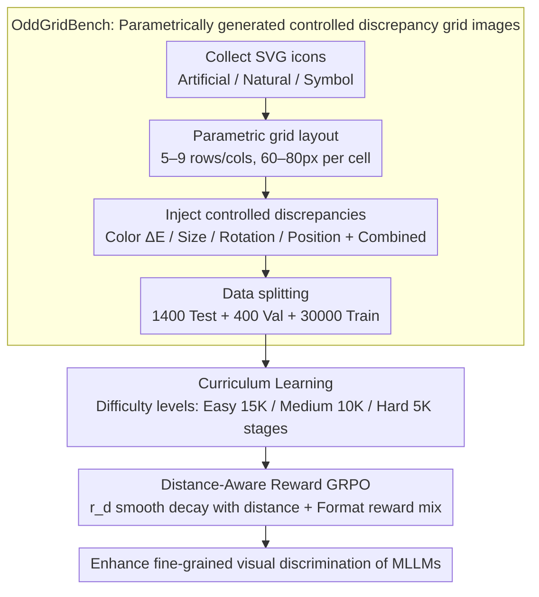

# OddGridBench: Exposing the Lack of Fine-Grained Visual Discrepancy Sensitivity in Multimodal Large Language Models

**Conference**: CVPR 2026  
**arXiv**: [2603.09326](https://arxiv.org/abs/2603.09326)  
**Code**: [https://wwwtttjjj.github.io/OddGridBench/](https://wwwtttjjj.github.io/OddGridBench/)  
**Area**: Multimodal VLM  
**Keywords**: Visual discrepancy perception, benchmark, GRPO, curriculum learning, fine-grained perception

## TL;DR
This paper proposes OddGridBench to evaluate the fine-grained visual discrepancy perception of MLLMs (identifying elements in a grid that differ in color, size, rotation, or position). It finds that all MLLMs perform significantly below human levels. Consequently, it introduces OddGrid-GRPO (curriculum learning + distance-aware reward) to markedly enhance the visual discrimination of models.

## Background & Motivation
**Background**: MLLMs excel at high-level semantic understanding (image captioning, VQA, mathematical reasoning, etc.), but the evaluation and research of low-level visual perception remain insufficient.

**Limitations of Prior Work**: Existing benchmarks primarily focus on high-level semantic reasoning, neglecting the fundamental ability of the human visual system—fine-grained visual discrepancy perception (Just Noticeable Difference / Pop-out Effect). This low-level perception is a prerequisite for spatial reasoning and object understanding.

**Key Challenge**: There is a lack of a systematic and controllable benchmark to quantitatively evaluate MLLM sensitivity across different perceptual dimensions (color, size, rotation, position), as well as a lack of targeted training methods to bridge this gap.

**Goal**: (1) Construct a controllable fine-grained visual discrepancy perception benchmark; (2) Reveal systematic failure modes of MLLMs in this task; (3) Propose training methods to improve perceptual capabilities.

**Key Insight**: Borrowing the Odd-One-Out paradigm from cognitive psychology, parametrically controlled grid images are constructed to precisely quantify the degree of discrepancy.

**Core Idea**: Construct a benchmark using parametric grid images (where a single element has subtle differences in color, size, rotation, or position) and improve MLLM perceptual sensitivity using GRPO combined with curriculum learning and distance-aware rewards.

## Method

### Overall Architecture
This paper accomplishes two primary tasks: first, it creates OddGridBench, an evaluation set capable of precisely controlling discrepancy magnitudes to quantify the weaknesses of MLLMs in "finding the odd one out"; second, it employs OddGrid-GRPO to train the models. OddGridBench leverages the Odd-One-Out paradigm from cognitive psychology—given a grid image where most icons are identical except for one with subtle differences in color, size, rotation, or position, the model must identify the "odd one." Because the images are parametrically generated, the discrepancy magnitude can be continuously adjusted from "nearly imperceptible" to "obvious," allowing for the plotting of perceptual sensitivity curves similar to psychophysical experiments. On the training side, data is sequenced by difficulty and fed to GRPO, replacing binary correct/incorrect rewards with continuous rewards that decay smoothly with distance.

The pipeline follows a two-stage series: "Data Construction → Curriculum Training." The first half parametrically generates grid images from icons, and the second half sorts this data by difficulty to train the model using GRPO with modified rewards.

### Key Designs

**1. OddGridBench: Parametrically generated grid images with controllable discrepancies**

The key to the evaluation set lies in the precise quantification of discrepancies. The authors collected SVG icons from IconFont and Material Design Icons (categorized into artifacts, nature, and symbols; SVG ensures resolution independence after scaling/rotation), arranged them in 5–9 rows/columns of 60–80px cells, and injected controlled perturbations into exactly one cell. The four dimensions have clear physical scales: Color uses CIE-Lab color difference $\Delta E \in [5,20]$, Size scales 85%–115%, Rotation varies from $\pm5°$ to $\pm25°$, and Position offsets range from 5%–12%. Discrepancies can be combined into 2-Type / 3-Type / 4-Type multi-attribute sets, resulting in 1400 test, 400 validation, and 30,000 training samples. This design treats the transition from imperceptible to significant as a continuous axis, which is unattainable with traditional discrete difficulty labels.

**2. Curriculum Learning: Progressive difficulty to avoid early RL collapse**

Directly applying GRPO to difficult samples often leads to instability due to sparse rewards and gradient noise, causing the model to converge prematurely to random guessing. The authors calculate a continuous difficulty score for each sample based on grid size, the number of overlapping attributes, and perturbation magnitude. Samples are then split into Easy (15K), Medium (10K), and Hard (5K) stages for progressive training. This enables the model to establish basic "odd-one-out" capabilities on easy samples before tackling harder ones, simulating the development of human perception from coarse to fine.

**3. Distance-Aware Reward: Encoding spatial proximity into reward signals**

Standard GRPO uses binary rewards for localization tasks (1 for correct, 0 for incorrect), which is inefficient for finding positions—identifying an adjacent cell versus a cell on the opposite corner both yield a 0, preventing the model from learning that "closer is better." The authors replace this with a reward that decays smoothly based on Euclidean distance:

$$r_d = \max\!\big(\exp(-d^2/2\sigma^2) - \beta,\, 0\big)$$

Where $d$ is the distance from the predicted position to the true odd-one position, $\sigma$ scales adaptively with grid size (larger grids have higher tolerance), and $\beta$ is a threshold to suppress rewards for distant predictions. The final reward is a weighted mixture with a format reward $r_f$: $r_{overall} = (1-\omega)r_d + \omega r_f$. Compared to binary rewards, this continuous signal distinguishes "close calls" from "far misses," providing higher supervision density.

### Loss & Training
The training is based on GRPO reinforcement learning, with the optimization objective being the total reward $r_{overall}$, coupled with a three-stage curriculum schedule to gradually increase difficulty during the unsupervised fine-tuning phase.

## Key Experimental Results

### Main Results

| Model | Color | Size | Rotation | Position | Total |
|-------|-------|------|----------|----------|-------|
| Random | 2.00 | 2.00 | 2.00 | 2.00 | 2.43 |
| Qwen3-VL-32B | 85.00 | 39.50 | 52.50 | 39.00 | 68.07 |
| Gemini-2.5-Pro | 82.50 | 9.50 | 26.00 | 6.50 | 49.29 |
| GPT-5 | 56.50 | 9.50 | 21.00 | 5.00 | 28.93 |
| **Human** | **91.33** | **69.33** | **82.67** | **78.00** | **87.47** |

### Key Findings

| Observation | Description |
|-------------|-------------|
| Color is easiest | Most models perform best on color discrepancies, though still far below humans. |
| Position/Size are hardest | Almost all models perform near random chance in position and size perception. |
| Human vs. Strongest MLLM | Human (87.47%) vs. Qwen3-VL-32B (68.07%), a gap of nearly 20%. |
| Model Scale Effect | Larger models in the same series perform better, but improvement is limited. |

### Key Findings
- Color is the most sensitive dimension for MLLMs, while size and position are the weakest, indicating fundamental flaws in MLLM visual encoders regarding spatial geometric perception.
- Both curriculum learning and distance-aware rewards contribute significantly to OddGrid-GRPO; removing either component leads to a performance drop.
- Accuracy increases monotonically with discrepancy magnitude, aligning with the psychophysical laws of human perception.

## Highlights & Insights
- **Parametrically Controlled Benchmark Design**: Analogous to psychophysical experiments, it allows for precise control of discrepancy magnitudes in each perceptual dimension, achieving a continuous transition from "imperceptible" to "significant."
- **Distance-Aware Reward**: Encoding spatial proximity into RL rewards provides richer learning signals than binary rewards, a design transferable to other VLM tasks requiring spatial localization.
- **Exposing Fundamental Bottlenecks**: GPT-5 achieves only 5% accuracy in position perception—nearly random—demonstrating that current visual encoders are severely deficient in low-level perception.

## Limitations & Future Work
- The benchmark uses only synthetic SVG icons and does not cover fine-grained discrepancy detection in natural images.
- It only evaluates single-image scenarios; real-world applications require detecting discrepancies in complex backgrounds.
- The effectiveness of OddGrid-GRPO is primarily validated on this benchmark; its transferability to other fine-grained visual tasks requires investigation.
- The amount of training data (30K) is relatively small; scaling up might further improve performance.

## Related Work & Insights
- **vs. Traditional Odd-One-Out**: Traditional methods are designed for visual encoders and are not applicable to MLLM architectures; this paper is the first to design a systematic perceptual discrepancy evaluation for MLLMs.
- **vs. GRPO (DeepSeek-V3)**: Standard GRPO uses binary rewards; this paper extends it to continuous distance-aware rewards, providing finer-grained spatial supervision signals.

## Related Papers
- DeepSeek-V3 (GRPO algorithm foundation)
- Qwen2-VL (Visual perception capability baseline)

## Rating
- Novelty: ⭐⭐⭐⭐ Clever benchmark design that exposes critical issues.
- Experimental Thoroughness: ⭐⭐⭐⭐ Evaluation of 19 models with in-depth analysis.
- Writing Quality: ⭐⭐⭐⭐ Clear logic and polished visualizations.
- Value: ⭐⭐⭐⭐ Reveals systematic flaws in MLLM low-level perception.

<!-- RELATED:START -->

## Related Papers

- [\[CVPR 2026\] DiG: Differential Grounding for Enhancing Fine-Grained Perception in Multimodal Large Language Models](dig_differential_grounding_for_enhancing_fine-grained_perception_in_multimodal_l.md)
- [\[CVPR 2026\] CropVLM: Learning to Zoom for Fine-Grained Vision-Language Perception](cropvlm_learning_to_zoom_for_fine_grained_vision_language_perception.md)
- [\[CVPR 2026\] ReasonMap: Towards Fine-Grained Visual Reasoning from Transit Maps](reasonmap_towards_fine-grained_visual_reasoning_from_transit_maps.md)
- [\[CVPR 2026\] Chart-FR1: Visual Focus-Driven Fine-Grained Reasoning on Dense Charts](chart-fr1_visual_focus-driven_fine-grained_reasoning_on_dense_charts.md)
- [\[CVPR 2026\] CoVFT: Context-aware Visual Fine-tuning for Multimodal Large Language Models](covft_context-aware_visual_fine-tuning_for_multimodal_large_language_models.md)

<!-- RELATED:END -->
