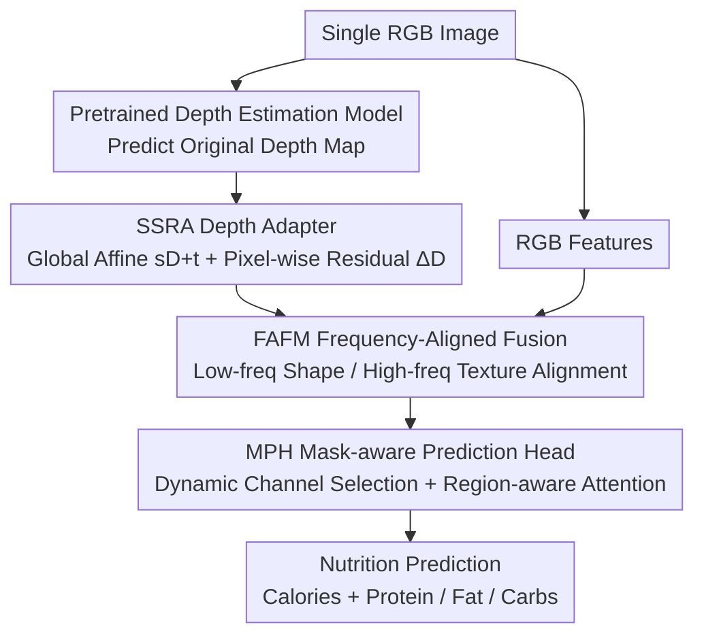

# OmniFood8K: Single-Image Nutrition Estimation via Hierarchical Frequency-Aligned Fusion

**Conference**: CVPR 2026 Highlight  
**arXiv**: [2604.12356](https://arxiv.org/abs/2604.12356)  
**Code**: [https://yudongjian.github.io/OmniFood8K-food/](https://yudongjian.github.io/OmniFood8K-food/)  
**Area**: Food Computing / Multimodal Fusion  
**Keywords**: Food nutrition estimation, multimodal dataset, depth estimation, frequency domain fusion, Chinese cuisine

## TL;DR

Ours constructed OmniFood8K, a multimodal nutrition dataset for Chinese food with 8,036 samples, and NutritionSynth-115K, a synthetic dataset with 115K samples. An end-to-end framework is proposed to predict nutrition information from a single RGB image via a Scale-Shift depth adapter, frequency-aligned fusion, and a mask prediction head.

## Background & Motivation

**Background**: Food nutrition estimation is vital for public health. Deep learning methods have demonstrated potential in automatically identifying and estimating food quality, volume, and nutrition.

**Limitations of Prior Work**: (1) Data restrictions: Existing datasets are heavily biased toward Western cuisine, with insufficient coverage of Chinese food. (2) Algorithm restrictions: Advanced methods rely on depth cameras for depth information, whereas food photos in daily scenarios are typically captured with RGB cameras.

**Key Challenge**: Depth information is critical for accurate food volume and nutrition estimation, yet actual deployment scenarios usually provide only RGB images.

**Goal**: (1) Construct a comprehensive multimodal food dataset covering Chinese cuisine. (2) Propose an end-to-end nutrition prediction framework requiring only a single RGB image.

**Key Insight**: Utilize pretrained depth estimation models to predict depth from RGB images, using adapters for correction and frequency domain fusion to replace physical depth sensors.

**Core Idea**: Predicted depth map → Adapter correction → Frequency-aligned fusion of RGB and depth features → Mask-aware prediction.

## Method

### Overall Architecture

Ours addresses the contradiction between having only a single RGB photo in daily scenarios and the need for food volume and nutrition estimation. Accurate estimation depends on depth, but users lack depth cameras. The mechanism involves "calculating" and utilizing depth: first, a pretrained depth estimation model predicts a depth map from the RGB image. Since this depth map has inaccurate scales and local distortion, an SSRA adapter corrects it into usable geometric signals. The corrected depth features are then aligned and fused with RGB features in the frequency domain (FAFM), separating shape and texture. Finally, a mask-aware prediction head (MPH) focuses attention on regions containing actual ingredients to regress calories and three macronutrients. The entire pipeline is trained end-to-end and requires only a single RGB image during inference.

### Key Designs

**1. Scale-Shift Residual Adapter (SSRA): Transforming "Borrowed" Depth into Usable Geometric Signals**

Pretrained depth models are trained on general scenes and commit two types of errors on food images: global scale mismatch (absolute depth may be shifted) and local structural blurring (e.g., plate edges or stacked ingredients). SSRA utilizes two complementary corrections: one learns global parameters $s, t$ to apply an affine transformation $sD+t$ to the original depth $D$, resetting the scale and zero-point. The other uses a lightweight residual network to predict pixel-wise local corrections $\Delta D$ for details. The final corrected depth is $\hat D = sD + t + \Delta D$. Global affine ensures "accuracy" while the residual ensures "clarity," explaining why error increases by ~12 points without SSRA in ablation studies.

**2. Frequency-Aligned Fusion Module (FAFM): Avoiding Modal Conflict via Frequency Domain Fusion**

RGB carries color/texture while depth carries geometry; direct concatenation in the spatial domain allows heterogeneous signals to interfere with each other. FAFM operates in the frequency domain: after transforming features, it aligns and fuses components by frequency bands. Low-frequency components correspond to global food shape/volume contours, while high-frequency components correspond to surface textures and edges. By aligning "shape with shape" and "texture with texture," only semantically compatible parts are fused. Frequency domain fusion reduced Calorie MAE from 175.6 to 165.8 compared to direct concatenation.

**3. Mask-based Prediction Head (MPH): Narrowing Attention to Nutrient-Containing Regions**

In food photography, plates, tables, and backgrounds are noise. MPH narrows attention in two steps: first, dynamic channel selection scores feature channels by information content to filter low-contribution channels. Second, region-aware attention weights spatial areas containing ingredients, suppressing responses from containers and backgrounds. This concentration of capacity on key ingredients reduced error by approximately 5.5 points.

### Loss & Training

The training uses standard regression loss to supervise the prediction of calories and three macronutrients (protein, fat, carbohydrates). To mitigate data scarcity, ours pretrains on the synthetic NutritionSynth-115K dataset (115,000 samples) for generalization before fine-tuning on OmniFood8K.

## Key Experimental Results

### Main Results

| Method | Calories MAE↓ | Protein MAE↓ | Fat MAE↓ | Carbs MAE↓ |
|------|----------|-----------|----------|----------|
| Im2Calories | 224.5 | 15.8 | 13.2 | 22.1 |
| Nutrition5K | 198.3 | 13.5 | 11.4 | 19.7 |
| RoDE | 185.7 | 12.8 | 10.6 | 18.3 |
| FBFPN (RGB+D) | 172.4 | 11.2 | 9.8 | 16.5 |
| **Ours (RGB only)** | **165.8** | **10.5** | **9.2** | **15.8** |

### Ablation Study

| Configuration | Calories MAE↓ | Description |
|------|----------|------|
| Full Model | 165.8 | SSRA + FAFM + MPH |
| w/o SSRA | 178.2 | No depth correction |
| w/o FAFM (Concat) | 175.6 | Spatial domain concatenation |
| w/o MPH | 171.3 | Standard MLP head |
| w/o Depth Branch | 182.5 | RGB only |

### Key Findings

- SSRA provided the largest contribution: removing depth correction increased MAE by ~12 points, indicating significant bias in raw pretrained depth.
- Frequency domain fusion outperformed spatial concatenation, validating the design of FAFM.
- Performance using only RGB input exceeded the FBFPN method which utilizes actual depth sensors.

## Highlights & Insights

- Replacing depth sensors with pretrained depth estimation is highly practical for deploying nutrition estimation in daily scenarios.
- OmniFood8K covers the complete culinary process (ingredients → recipes → videos → multi-view products), making it one of the most comprehensive datasets in the field.
- The construction of the synthetic NutritionSynth-115K dataset provides a reference for data-scarce scenarios.

## Limitations & Future Work

- Currently covers only Chinese cuisine; cross-cultural generalization remains unverified.
- Dataset scale (8,036 samples) is still relatively small by deep learning standards.
- Suitability of general-purpose depth models for food imagery requires more analysis.
- Future work could integrate ingredient recognition and portion estimation for further improvements.

## Related Work & Insights

- **vs Nutrition5K**: Nutrition5K focuses on Western food and requires multi-view input; ours covers Chinese food and requires only a single view.
- **vs FBFPN**: FBFPN requires real RGB-D input; ours achieves better results predicting depth from a single RGB image.

## Rating

- Novelty: ⭐⭐⭐⭐ (Novel dataset and frequency-domain fusion framework)
- Experimental Thoroughness: ⭐⭐⭐⭐ (Multi-dataset comparisons and detailed ablation)
- Writing Quality: ⭐⭐⭐⭐ (Clear structure)
- Value: ⭐⭐⭐⭐ (Significant dataset contribution)

<!-- RELATED:START -->

## Related Papers

- [\[CVPR 2026\] Multi-Hierarchical Contrastive Spectral Fusion for Multi-View Clustering](multi-hierarchical_contrastive_spectral_fusion_for_multi-view_clustering.md)
- [\[AAAI 2026\] Private Frequency Estimation via Residue Number Systems](../../AAAI2026/others/private_frequency_estimation_via_residue_number_systems.md)
- [\[CVPR 2026\] When Lines Meet Textures: Spatial-Frequency Aligned Diffusion Features for Cross-Sparsity Correspondence](when_lines_meet_textures_spatial-frequency_aligned_diffusion_features_for_cross-.md)
- [\[AAAI 2026\] CAE: Hierarchical Semantic Alignment for Image Clustering](../../AAAI2026/others/hierarchical_semantic_alignment_for_image_clustering.md)
- [\[CVPR 2025\] Towards In-the-Wild 3D Plane Reconstruction from a Single Image](../../CVPR2025/others/towards_in-the-wild_3d_plane_reconstruction_from_a_single_image.md)

<!-- RELATED:END -->
