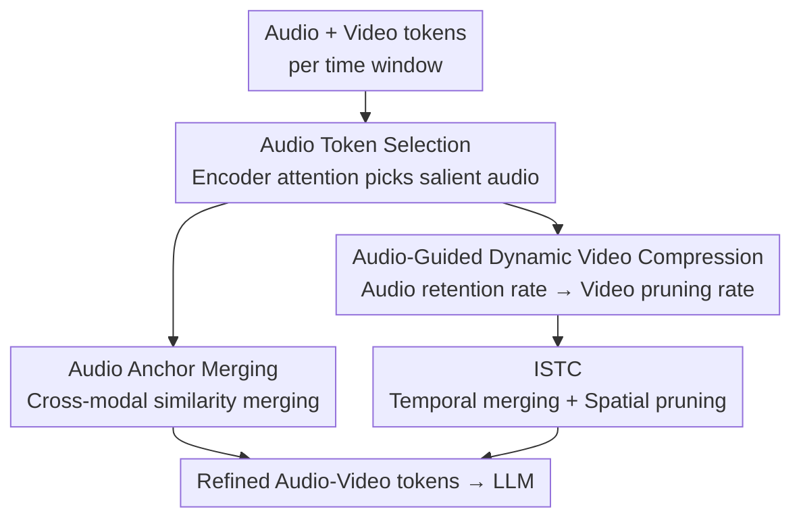

# OmniZip: Audio-Guided Dynamic Token Compression for Fast Omnimodal Large Language Models

**Conference**: CVPR 2026  
**arXiv**: [2511.14582](https://arxiv.org/abs/2511.14582)  
**Code**: https://github.com/KD-TAO/OmniZip (Available)  
**Area**: Multimodal VLM / LLM Efficiency  
**Keywords**: Omnimodal Large Language Models, Token Compression, Audio-guided, Training-free Acceleration, Audio-visual Understanding

## TL;DR
OmniZip is the first **training-free** token compression framework for joint audio-video understanding in Omnimodal Large Language Models (OmniLLM). It utilizes the attention distribution of audio tokens as a prior for "information density/event boundaries" to dynamically determine video token pruning rates within each time window. Combined with an Interleaved Spatiotemporal Compression (ISTC) module, it achieves 3.42× prefill acceleration and 1.4× memory reduction on Qwen2.5-Omni with almost no performance degradation.

## Background & Motivation
**Background**: OmniLLMs (e.g., Qwen2.5-Omni) unify vision, audio, and text into a single LLM, enabling the model to "watch videos + listen to sounds" simultaneously. The input sequence segments audio and video streams into **fixed-length time windows**. Audio and video tokens within each window are aligned and concatenated into cross-modal blocks, which are then fed sequentially into the LLM. A single video typically generates 10,000–20,000 tokens.

**Limitations of Prior Work**: The quadratic complexity of attention over such long sequences makes OmniLLM inference a bottleneck in terms of compute and memory. Existing token compression methods almost exclusively focus on a **purely visual perspective** (single-mode image or video); no prior work addresses the combined requirement of "audio + video joint compression." Furthermore, many methods rely on accessing video encoders or internal LLM attention matrices, which are incompatible with modern optimizations like FlashAttention and can easily cause OOM issues by explicitly materializing the full attention matrix for long sequences.

**Key Challenge**: Audio and video streams differ in time scales and sparsity—audio has higher information density but fewer tokens, while video has many tokens with significant redundancy. They are simultaneously redundant and complementary, making joint pruning highly sensitive to "what to prune" and "how much to prune." Naively pruning all tokens equally destroys the time window structure and cross-modal alignment.

**Key Insight**: The authors performed an attention analysis (Fig. 2), revealing that **periodically appearing vertical bright bands in the attention heatmap align precisely with audio token positions**. This indicates that all layers assign significantly higher attention to audio tokens than video tokens—audio dominates inference, while vast regions of video tokens have very low attention and high redundancy. Zooming in shows that attention is "block-locally" distributed; tokens primarily attend to each other **within the same time window**, with rapid decay across windows.

**Core Idea**: Since audio is both "important" and "cheap," the framework adopts a **"listen-to-prune"** strategy. It uses the retention of audio tokens to measure the information density of each time window: windows with dense audio information undergo less video pruning, while those with sparse information are pruned more aggressively. Compression is performed independently at the **time window granularity**, entirely training-free.

## Method

### Overall Architecture
OmniZip is an inference-time compressor inserted after the projector and before the LLM, processing aligned audio-video tokens **window by window**. Let there be $n_a$ audio tokens and $n_v$ video tokens in the $t$-th window. The pipeline consists of three sequential stages: ① **Audio token selection**—using the last-layer attention of the audio encoder to identify salient audio tokens; ② **Audio anchor merging**—merging minor audio tokens into anchors based on cross-modal similarity to preserve semantics and context; ③ **Audio-guided dynamic video compression**—mapping the audio retention rate of each window to a video pruning rate, using an independent **ISTC (Interleaved Spatiotemporal Compression) module** for the actual video reduction. ISTC performs temporal merging based on inter-frame similarity followed by spatial pruning via density clustering. The refined tokens are then fed to the LLM.

### Key Designs

**1. Audio Token Selection: Locating "Salient Audio" via Encoder Self-Attention**

The goal is to rank audio importance without materializing large LLM or vision encoder attention matrices (which causes OOM and conflicts with FlashAttention). OmniZip uses the **last layer of the audio encoder**, which is lightweight. It calculates the audio self-attention $A = \mathrm{Softmax}(QK^\top/\sqrt{d}) \in \mathbb{R}^{B\times N_a\times N_a}$, then uses the mean attention received by each token as its importance score $a_{avg}\in\mathbb{R}^{B\times N_a}$. Average pooling is applied to $a_{avg}$ to match any pooling done by the model. The top $\rho_a\%$ tokens are selected as "information-dense" representatives. This approach provides reliable importance while remaining compatible with FlashAttention.

**2. Audio Anchor Merging: Integrating Minor Audio via Cross-modal Similarity**

Pruning audio tokens directly is risky due to their small quantity and semantic sensitivity. OmniZip **uniformly samples a few anchors** from the non-salient audio tokens in each window. It then uses **cross-modal similarity** to select candidates for merging. After L2 normalization $\hat{H} = \mathrm{Diag}(\sqrt{\mathrm{diag}(HH^\top)}+\varepsilon)^{-1}H$, the cosine similarity matrix $S_{cross}=\hat{H}_a\hat{H}_v^\top$ is computed. For each anchor, the top-$G$ audio tokens most relevant to the paired video segment are merged into it. This ensures the merged audio anchors remain semantically consistent with the corresponding video content.

**3. Audio-Guided Dynamic Video Compression: Audio Retention as a Density Prior**

This is the core of "listen-to-prune." While it is difficult to judge key frames from pure vision, audio provides vital cues. OmniZip maps the audio selection results back to time windows to get an **audio retention score** $S_a(i)\in[0,1]$, interpreted as a **prior for information density and event boundaries**. High audio retention implies a dense window/event boundary, requiring conservative video pruning. For a global video budget $\rho_v$, the initial video pruning rate for window $i$ is:

$$\rho_v'(i) = \rho_{max} - (\rho_{max}-\rho_{min})\cdot S_a(i),$$

where $\rho_{max}, \rho_{min}$ are bounds (set to $0.75/0.35$) to prevent over-pruning. These rates are then **normalized** to strictly satisfy the global budget $\rho_v$, achieving temporal adaptivity while maintaining a constant total token count for fair comparison.

**4. ISTC (Interleaved Spatiotemporal Compression): Alternating Redundancy Removal**

ISTC handles the actual pruning within each window using **four-frame** units. It alternates between temporal and spatial evaluations: cosine similarity $S_{vid}=\frac{h_v^i\cdot h_v^j}{\|h_v^i\|\|h_v^j\|}$ is computed for tokens at the same position in adjacent frames. In frames 2 and 4, tokens highly similar to the previous frame are merged (temporal redundancy). In frames 1 and 3, **Density Peak Clustering + k-Nearest Neighbors (DPC-KNN)** is used for spatial pruning. Local density $\rho_i$ and distance to higher-density tokens $\delta_i$ are used to determine which tokens to retain. This interleaved design avoids information collapse along a single dimension.

### Loss & Training
**Entirely training-free**. OmniZip is a pure inference-time post-processing method. It introduces no learnable parameters and does not fine-tune the OmniLLM, making it plug-and-play with existing models and compatible with multi-turn dialogue and inference frameworks like FlashAttention. Pruning overhead is minimal (< 40 ms).

## Key Experimental Results

### Main Results
Evaluated on Qwen2.5-Omni 7B/3B across four audio-visual benchmarks: AVUT, VideoMME, ShortVid-Bench, and WorldSense. Tab. 1 normalizes baseline accuracy to 100% and uses **FLOPs ratio** to unify compression intensity.

| Model / Setting | Retention | FLOPs Ratio | AVUT | VideoMME | ShortVid | Norm. Mean |
|------|------|------|------|------|------|------|
| Qwen2.5-Omni-7B Full | 100% | 100% | 64.5 | 66.0 | 70.5 | 100% |
| Random | 55% | 48% | 61.0 | 65.4 | 68.3 | 96.9% |
| FastV | 50% | 54% | 58.4 | — (OOM) | 68.0 | 94.3% |
| DyCoke (V&A) | 50% | 44% | 62.0 | 65.5 | 68.5 | 97.5% |
| **OmniZip** | **45%** | **39%** | **63.0** | **66.3** | **69.9** | **99.1%** |
| **OmniZip** | **35%** | **29%** | **61.0** | **66.1** | **69.0** | **97.6%** |

Key takeaway: OmniZip achieves the highest mean score at lower retention rates—even with a 60% reduction in FLOPs, normalized accuracy remains at **99.1%**.

Efficiency comparison (WorldSense, single A6000, Tab. 3):

| Method | VRAM ↓ | Prefill Time ↓ | Accuracy | Per-sample Latency ↓ |
|------|------|------|------|------|
| 7B Full | 35G | 291ms (1.00×) | 46.8 | 4.52s (1.00×) |
| DyCoke (V&A) | 31G | 184ms (1.58×) | 44.6 | 3.64s (1.24×) |
| **OmniZip (45%)** | 28G | 116ms (2.51×) | 45.9 | 3.40s (1.33×) |
| **OmniZip (35%)** | 25G | 85ms (**3.42×**) | 45.3 | 3.18s (**1.42×**) |

### Ablation Study
| Configuration | AVUT | WorldSense | ShortVid | Description |
|------|------|------|------|------|
| Full (45% retention) | 63.0 | 45.9 | 69.9 | Full model |
| w/o DP | 62.0 (-1.0) | 45.0 (-0.9) | 69.3 (-0.6) | Fixed pruning rate for video |
| w/o DP & AC | 61.7 (-1.3) | 44.8 (-1.1) | 69.0 (-0.9) | Removed both DP and Anchor merging |

### Key Findings
- **Dynamic Pruning (DP) is the core contributor**: Switching DP to a fixed rate causes drops across all benchmarks, proving that audio tokens effectively identify key frames.
- **Global Selection (GS) is unsuitable for Omnimodal**: Strategies like VisionZip that select tokens globally ignore semantic alignment and break the time window structure, leading to worse performance and OOM risks.
- **Audio should be pruned less than video**: Pruning either modality excessively hurts performance, but audio retention should remain higher than video to preserve the dominant cue.

## Highlights & Insights
- **"Listen-to-prune" is a powerful lever**: Audio tokens are few but dominate inference attention. Using them as a prior to guide the pruning of massive video tokens uses a "cheap" signal to drive "expensive" decisions.
- **Deliberate avoidance of LLM/Vision attention matrices**: By only using the lightweight audio encoder's self-attention, OmniZip bypasses OOM issues and FlashAttention incompatibility.
- **Interleaved compression within time windows**: The method respects the "block-local" nature of cross-modal attention, ensuring temporal structure is preserved while eliminating both spatial and temporal redundancy.

## Limitations & Future Work
- **Dependency on audio quality**: If audio is missing, noisy, or irrelevant (e.g., background music vs. action), the "audio = information density" assumption may fail.
- **Empirical hyperparameters**: Parameters like $\rho_{max}/\rho_{min}$ and fusion ratios $G$ are currently manually tuned.
- **Evaluation Scope**: Validated primarily on the Qwen2.5-Omni 3B/7B family; generalizability to other omnimodal architectures remains to be tested.

## Related Work & Insights
- **vs. FastV**: FastV prunes based on LLM attention at layer $L$, which OOMs on long videos and ignores audio. OmniZip uses a lightweight encoder prior instead.
- **vs. DyCoke**: DyCoke only compresses the temporal dimension. OmniZip's ISTC handles both spatial and temporal dimensions.
- **vs. VisionZip**: VisionZip's global selection (GS) approach destroys temporal alignment and cross-modal synchronization, which OmniZip preserves through its window-based joint compression.

## Rating
- Novelty: ⭐⭐⭐⭐⭐ 
- Experimental Thoroughness: ⭐⭐⭐⭐ 
- Writing Quality: ⭐⭐⭐⭐ 
- Value: ⭐⭐⭐⭐⭐ 

<!-- RELATED:START -->

- **FastV**: "FastV: Facilitating Vitally Efficient Vision-language Model with Token Pruning" (CVPR 2024)
- **DyCoke**: "DyCoke: Dynamic Token Compression for Efficient Video Large Language Models" (arXiv 2024)
- **VisionZip**: "VisionZip: Longer is Better but Not Spatially" (arXiv 2024)

<!-- RELATED:END -->

## Related Papers

- [\[CVPR 2026\] EvoComp: Learning Visual Token Compression for Multimodal Large Language Models via Semantic-Guided Evolutionary Labeling](evocomp_learning_visual_token_compression_for_multimodal_large_language_models_v.md)
- [\[CVPR 2026\] ApET: Approximation-Error Guided Token Compression for Efficient VLMs](apet_approximation-error_guided_token_compression_for_efficient_vlms.md)
- [\[CVPR 2026\] On Token's Dilemma: Dynamic MoE with Drift-Aware Token Assignment for Continual Learning of Large Vision Language Models](on_tokens_dilemma_dynamic_moe_with_drift-aware_token_assignment_for_continual_le.md)
- [\[CVPR 2026\] Dynamic Token Reweighting for Robust Vision-Language Models](dynamic_token_reweighting_for_robust_vision-language_models.md)
- [\[CVPR 2026\] UniCompress: Token Compression for Unified Vision-Language Understanding and Generation](unicompress_token_compression_for_unified_vision-language_understanding_and_gene.md)

<!-- RELATED:END -->
