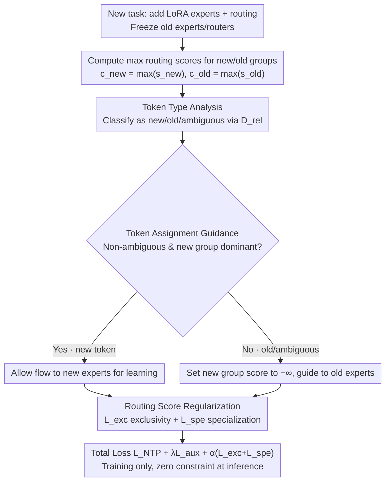

# On Token's Dilemma: Dynamic MoE with Drift-Aware Token Assignment for Continual Learning of Large Vision Language Models

**Conference**: CVPR 2026  
**arXiv**: [2603.27481](https://arxiv.org/abs/2603.27481)  
**Code**: [https://zhaoc5.github.io/DyMoE](https://zhaoc5.github.io/DyMoE)  
**Area**: Multimodal VLM / Continual Learning  
**Keywords**: Continual Learning, Mixture-of-Experts, Routing Drift, Large Vision Language Models, Token Assignment

## TL;DR

This paper reveals the "token's dilemma" in dynamic MoE continual learning—where ambiguity in new task data and weak contributions from old tokens toward new knowledge lead to routing drift and catastrophic forgetting. It proposes LLaVA-DyMoE, which mitigates routing drift through Token Assignment Guidance and Routing Score Regularization, achieving an MFN improvement of over 7% and a 12% reduction in forgetting on the CoIN benchmark.

## Background & Motivation

1. **Background**: Large Vision-Language Models (LVLMs) like LLaVA perform excellently across various vision-language tasks. Multimodal Continual Instruction Tuning (MCIT) aims to enable LVLMs to learn new tasks incrementally while maintaining performance on old tasks. Mixture-of-Experts (MoE) architectures have become the mainstream solution for MCIT due to their dynamic modularity and parameter isolation properties.

2. **Limitations of Prior Work**: (1) Fixed-size MoE sharing experts and routers leads to inter-task interference; (2) Methods that incrementally expand MoE and freeze old experts, while achieving parameter isolation, still suffer from **routing-drift**: old task tokens are mistakenly attracted to new experts, causing forgetting; (3) Existing methods attempt to circumvent this via task-level routers but require heavy computation for task identification and sacrifice the inherent token-level routing flexibility of MoE.

3. **Key Challenge**: Even if old experts and routing parameters are frozen, training newly added components still causes forgetting. The root cause is that **not all new task tokens carry genuinely new patterns**—part of them are similar to old task patterns or possess ambiguous affinity between old and new experts.

4. **Goal**: (1) Precisely analyze the causes of routing drift at the token level; (2) Design differentiated routing strategies for different token types to mitigate forgetting.

5. **Key Insight**: Through a controlled two-task experiment, tokens are classified into three types (new/old/ambiguous) based on their routing score distribution across new and old expert groups. It was discovered that ambiguous tokens are the primary culprits of routing drift—they neither assist in new task learning nor protect old knowledge, yet they train the router to attract old task patterns when routed to new experts.

6. **Core Idea**: Identify token types and guide ambiguous/old tokens away from new experts, while using soft regularization to promote exclusive routing and new expert specialization.

## Method

### Overall Architecture

This paper addresses the phenomenon in dynamic MoE for multimodal continual learning where "forgetting occurs despite freezing old experts." LLaVA-DyMoE attaches a set of MoE (LoRA experts) to each layer of the LLaVA LLM backbone. When a new task arrives, a new set of experts and corresponding routing parameters are added; old experts and routers are frozen, and only the new components are trained. Although parameters are isolated, the process of training new components still pulls old task tokens toward new experts—this is where forgetting "leaks" in.

The methodology follows two steps: first, using controlled experiments to clarify which tokens cause drift by categorizing them into three types based on routing tendencies; second, applying two constraints based on these types. Token Assignment Guidance (TAG) overrides routing scores during training to block suspicious tokens from new experts, while Routing Score Regularization (RSR) uses a soft loss to encourage "either-or" exclusive routing via gradients. Both constraints are active only during training and are removed during inference.

### Key Designs

**1. Token Type Analysis and the Token's Dilemma: Identifying the Forgetting Cultprit**

Before presenting the method, the authors conducted controlled two-task experiments to decompose the "forgetting despite frozen parameters" issue to the token level. Each new task token is categorized based on its routing tendency toward new vs. old expert groups: **new tokens** clearly favor the new group and are the primary drivers for acquiring new knowledge with minimal forgetting cost; **old tokens** clearly favor the old group and contribute little to the new task, but their residual affinity for the new group is absorbed by the router, biasing it toward old patterns; **ambiguous tokens** have nearly equal affinity for both groups and are the main drivers of drift.

The "token's dilemma" is the misalignment between the value and cost of these three types: ambiguous and old tokens, which have the lowest learning value, cause the most forgetting if allowed into new experts without guidance. By locating the cause at this level, the solution becomes targeted—not suppressing all tokens, but only those that should be blocked.

**2. Token Assignment Guidance (TAG): Blocking Suspicious Tokens at the Source**

TAG addresses the dilemma: since ambiguous/old tokens are the sources of pollution, they are identified in real-time during training and prevented from accessing new experts. For each token, the maximum routing scores for the old group $c_{\text{old}} = \max(\mathbf{s}_{t-1})$ and the new group $c_{\text{new}} = \max(\mathbf{s}_{t,\text{new}})$ are extracted, and a relative difference is calculated:

$$D_{\text{rel}} = \frac{|c_{\text{new}} - c_{\text{old}}|}{\max(|c_{\text{new}}|, |c_{\text{old}}|) + \epsilon}$$

Only when a token is sufficiently "unambiguous" ($D_{\text{rel}} > \tau$) **and** the new group is dominant ($c_{\text{new}} > c_{\text{old}}$) is it allowed to flow to the new experts. Otherwise, the routing score for the new group is set to $-\infty$, forcing it back to the old experts. This acts as a gatekeeper: new tokens naturally enter new experts, while ambiguous/old tokens are safely redirected, preventing the router from receiving "polluting gradients." For example, if a token has $c_{\text{new}}=0.52$ and $c_{\text{old}}=0.50$, $D_{\text{rel}}\approx0.04$ is well below threshold $\tau=0.2$, so it is masked back to the old group.

**3. Routing Score Regularization (RSR): Cultivating Exclusive Routing Habits**

While TAG is a hard mask for discrete decisions, RSR uses gradients to encourage exclusive and specialized routing. It consists of two loss terms. The **exclusivity loss** $\mathcal{L}_{\text{exc}} = g_{\text{old}} \cdot g_{\text{new}}$ penalizes the product of gating weights—if a token activates both groups, the term is positive, pushing the router toward a binary choice. The **specialization loss** $\mathcal{L}_{\text{spe}}$ uses $y = 1 - \max\{w_i\}_{i \in \mathcal{S}_{t-1}}$ as a soft target with BCE to encourage higher routing weights $g_{\text{new}}$ for new experts: tokens that old experts are less suited for should be handled specifically by new experts. Together, these terms balance stability (not forgetting old knowledge) and plasticity (learning new knowledge). TAG and RSR are complementary: TAG handles hard boundaries, while RSR shapes the score distribution.

### Loss & Training

The total objective combines three parts:

$$\mathcal{L} = \mathcal{L}_{\text{NTP}} + \lambda\mathcal{L}_{\text{aux}} + \alpha(\mathcal{L}_{\text{exc}} + \mathcal{L}_{\text{spe}})$$

Where $\mathcal{L}_{\text{NTP}}$ is the standard auto-regressive cross-entropy, and $\mathcal{L}_{\text{aux}}$ is the standard load balancing loss applied only to new experts. $\alpha$ controls the strength of RSR. Crucially, TAG and RSR are only active during training; inference remains unconstrained and can be seamlessly combined with other MCIT methods. The backbone used is an instruction-untuned LLaVA-v1.5-7B, with new LoRA experts added for each task.

## Key Experimental Results

### Main Results

Comparison on the CoIN benchmark (learning sequence of 8 VQA tasks):

| Method | MFN↑ | MAA↑ | BWT↑ |
|------|------|------|------|
| LoRA | 41.79 | 43.99 | -23.12 |
| MoELoRA | 43.93 | 43.92 | -22.18 |
| O-LoRA | 49.53 | 46.65 | -17.54 |
| IncMoELoRA | 49.68 | 49.50 | -16.67 |
| **LLaVA-DyMoE** | **57.03** | **57.70** | **-4.67** |

### Ablation Study

| Configuration | MFN↑ | MAA↑ | BWT↑ |
|------|------|------|------|
| IncMoELoRA (baseline) | 49.68 | 49.50 | -16.67 |
| + $\mathcal{L}_{\text{aux}}$ | 50.76 | 51.17 | -15.44 |
| + TAG | 54.44 | 52.18 | -7.04 |
| + $\mathcal{L}_{\text{exc}}$ | 55.18 | 54.38 | -6.83 |
| + $\mathcal{L}_{\text{spe}}$ (Full) | 57.03 | 57.70 | -4.67 |

Impact of ambiguity threshold $\tau$:

| $\tau$ | MFN↑ | BWT↑ |
|--------|------|------|
| 10% | 56.87 | -4.94 |
| **20%** | **57.03** | **-4.67** |
| 30% | 56.27 | -5.21 |
| 50% | 55.32 | -5.54 |

### Key Findings

- TAG is the most critical component: adding TAG alone improved BWT from -15.44 to -7.04 and MFN from 50.76 to 54.44 (+3.68%).
- Exclusivity loss and specialization loss contributed an additional 0.74% and 1.85% MFN gain, respectively.
- The optimal ambiguity threshold is $\tau=20\%$; too low (10%) fails to capture some ambiguous tokens, while too high (50%) excessively restricts new expert learning.
- LLaVA-DyMoE achieved the best or second-best final accuracy across all 8 individual tasks.
- Improvement was particularly significant on the ImageNet task (95.80% vs 68.42% for IncMoELoRA), likely because its visual features differ most from other VQA tasks, resulting in more severe routing drift.

## Highlights & Insights

- **Discovery of the Token's Dilemma is highly valuable**: By pinpointing the stability-plasticity dilemma to the token granularity, the paper identifies ambiguous tokens as the primary cause of forgetting. This insight is transferable to all MoE-based dynamic expansion methods.
- **Analysis-driven Method Design**: The authors first used controlled experiments to reveal causal relationships and then designed targeted solutions. Three sets of mask experiments clearly demonstrated the different roles of the three token types.
- **Training-time Regularization, Zero Inference Overhead**: TAG and RSR only affect routing scores during training. Inference is unconstrained, maintaining efficiency and allowing orthogonal combination with other MCIT methods.
- This paradigm—analyzing token routing distributions and applying targeted regularization—can be generalized to other MoE scenarios such as multi-task learning and domain adaptation.

## Limitations & Future Work

- Evaluation is limited to the CoIN benchmark (8 VQA tasks); performance on more diverse task types (e.g., generation, detection) is not yet verified.
- Adding new experts for every task leads to linear parameter growth; the efficiency of long-term expansion warrants attention.
- Token type identification relies on instantaneous routing score snapshots, which might be inaccurate during early training stages.
- The dynamic change of token types during the training process—where ambiguous tokens might become new/old tokens—was not explored.
- Lack of combined experiments with recent task-level routing methods (e.g., ProgLoRA) to verify orthogonality claims.

## Related Work & Insights

- **vs MoELoRA**: Shared routers and experts lead to severe inter-task interference (MFN 43.93 vs 57.03); LLaVA-DyMoE fundamentally solves this through isolation and routing regularization.
- **vs IncMoELoRA**: Direct incremental expansion still suffers from routing drift despite isolation (BWT -16.67 vs -4.67), proving that freezing old parameters is insufficient—active management of the new parameters' training process is required.
- **vs O-LoRA**: O-LoRA applies orthogonal constraints in the LoRA subspace, while LLaVA-DyMoE applies constraints at the routing level; the two approaches are complementary.
- **vs ProgLoRA**: ProgLoRA mitigates interference through progressive LoRA pools and task isolation; LLaVA-DyMoE performs fine-grained management at the token level, suggesting potential for combined use.

## Rating

- Novelty: ⭐⭐⭐⭐⭐ The discovery and analysis of the Token's Dilemma are profound; the tripartite token classification is intuitive and experimentally supported.
- Experimental Thoroughness: ⭐⭐⭐⭐ Ablations are comprehensive and validate every component step-by-step; hyperparameter analysis is sufficient, though limited to one benchmark.
- Writing Quality: ⭐⭐⭐⭐⭐ The analysis-driven structure is very clear; the design and visualization of controlled experiments are excellent.
- Value: ⭐⭐⭐⭐⭐ Provides deep mechanistic insights into MoE continual learning; the method is concise, effective, and possesses good generalizability.

<!-- RELATED:START -->

## Related Papers

- [\[CVPR 2026\] Enhancing Continual Learning of Vision-Language Models via Dynamic Prefix Weighting](enhancing_continual_learning_of_vision-language_models_via_dynamic_prefix_weight.md)
- [\[CVPR 2026\] Octopus: History-Free Gradient Orthogonalization for Continual Learning in Multimodal Large Language Models](octopus_history-free_gradient_orthogonalization_for_continual_learning_in_multim.md)
- [\[CVPR 2026\] Towards Dynamic Modality Alignment in Multimodal Continual Learning](towards_dynamic_modality_alignment_in_multimodal_continual_learning.md)
- [\[CVPR 2026\] PACT: Phase-Like Transition Constraints in Adapter-Based Continual Learning of Vision-Language Models](pact_phase-like_transition_constraints_in_adapter-based_continual_learning_of_vi.md)
- [\[CVPR 2026\] Token Warping Helps MLLMs Look from Nearby Viewpoints](token_warping_helps_mllms_look_from_nearby_viewpoints.md)

<!-- RELATED:END -->
