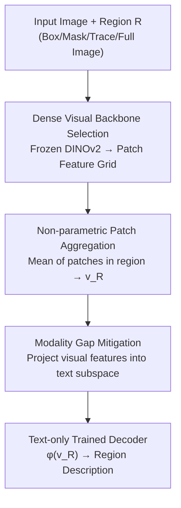

# One Patch to Caption Them All: A Unified Zero-Shot Captioning Framework

**Conference**: CVPR 2026  
**Paper**: [CVF Open Access](https://openaccess.thecvf.com/content/CVPR2026/html/Bianchi_One_Patch_to_Caption_Them_All_A_Unified_Zero-Shot_Captioning_CVPR_2026_paper.html)  
**Code**: https://paciosoft.com/Patch-ioner/  
**Area**: Multimodal VLM  
**Keywords**: Zero-shot captioning, region-level captioning, patch aggregation, DINOv2, modality gap

## TL;DR
This work redefines zero-shot image captioning from "image-centric" to "patch-centric." It utilizes a frozen dense visual backbone (DINOv2 family) to extract patch features, applies non-parametric aggregation for specific regions, and feeds the result into a text-only trained decoder. This unified framework addresses multi-granularity tasks—including single patches, boxes, mouse traces, and whole images—without requiring any region-level annotations.

## Background & Motivation

**Background**: Recent "zero-shot captioners" (e.g., DeCap, CapDec, CLOSE, ViECap) follow a similar paradigm: leveraging CLIP to compress images and text into a shared semantic space and training a text decoder **using only pure text** to reconstruct sentences from text embeddings. During inference, image embeddings are treated as "pseudo-text embeddings" for direct decoding. This enables captioner creation without paired image-text data.

**Limitations of Prior Work**: These methods are restricted to **global representations**, specifically the CLIP CLS token, describing the "entire image." When attempting to describe a specific **region** (a box, a set of boxes, or a mouse trace), they either fail or must crop the region and process it in isolation, which discards global context and leads to misinterpretation. While traditional region-level captioning (dense/controllable captioning) exists, it requires expensive, non-scalable supervision where **every box is paired with a human ground-truth description**.

**Key Challenge**: There is a trade-off between the flexibility of region-level description and the cost of region-level annotation. A gap exists between zero-shot label-free methods and granular region-level requirements.

**Key Insight**: The authors identify a neglected fact: in modern ViT architectures, the **atomic unit of image representation is the patch**. If a model can generate descriptions for a single patch, any region (box/mask/trace/image) is merely a "collection of patches" whose features can be aggregated. The problem then converges into a specific question: **How can a model be built to describe a single patch without any patch-level ground truth?**

**Core Idea**: Replace image-to-caption with **patch-to-caption**. By shifting the descriptive target from the whole image to patches, region representation becomes the non-parametric aggregation of patch features. Coupled with a text-only decoder, this zero-shot mechanism shifts from "whole image description" to "arbitrary region description," provided the visual backbone produces **semantically meaningful dense patch features** (a strength of DINO rather than CLIP).

## Method

### Overall Architecture

The framework (termed Patch-ioner) relies on three assumptions: **no region-text pairs** during training, a **completely frozen** visual backbone, and a decoder **trained only on text**. Under these constraints, image processing involves three serial steps: ① A frozen vision-language backbone $\psi_v$ encodes the image into a dense, language-aligned patch embedding grid $V=\{v_i\}$; ② Given a region $R$ (box, mask, trace, or whole image), patches within $R$ are selected and their features undergo **non-parametric aggregation** to obtain the region embedding $v_R$; ③ A text-only trained decoder $\phi$ decodes $v_R$ into natural language.

The key lies in mathematical decoupling: traditional methods use $t=D(I,R)$, where image encoding and region specification are entangled. This work reformulates it as:

$$t=\phi\big(\mathrm{agg}_R(\psi(I),\,R)\big)$$

Here, the visual encoding $\psi(I)$ is independent of region $R$ and runs only once. Region selection is deferred to a **non-parametric fixed aggregation** $\mathrm{agg}_R$. The learnable decoder $\phi$ **does not directly see the region**, thus requiring no region labels for training. This separation allows a single forward pass of the backbone to describe multiple regions without re-computation.

### Key Designs

**1. Patches as Atoms, Regions as Sets: Reformulating Late Region Selection**

To resolve the need for region labels, the authors define a region as a set of patch indices. The image is divided into $P\times P$ non-overlapping patches, and the backbone encodes the grid $V=\psi_v(I)=\{v_i\}$. A region $R$ selects a subset $S$, and the region embedding is computed as $v_S=\sum_{i\in S}w_i v_i$. This is critical because it transforms "region specification" from a **learnable internal operation** to a **geometric selection at inference**. The decoder only processes an aggregated vector, making it agnostic to the source (patch or box), thereby eliminating the need for region labels.

**2. Non-parametric Patch Aggregation: Unified Representation via Set Operators**

Regarding the aggregation weights $w_i$, the authors found that the specific scheme (uniform, Gaussian, attention-weighted) has minimal impact on region description. Thus, the default is simple averaging: $w_i=1/|S|$. This simplicity enables unity: boxes, masks, traces, and points are all expressed as the "mean of a patch subset." For example, image captioning averages all patches $v_I=\mathrm{avg}_i(v_i)$, while trace captioning averages points mapped to patch indices $v_T=\frac{1}{L}\sum_{j=1}^{L}v_{i_j}$. This approach incurs zero training cost and allows feature reuse.

**3. Dense Semantic Backbone Selection: Why DINO over CLIP**

The effectiveness of the framework depends on whether $\psi_v$ produces **meaningful per-patch features**. Although CLIP is aligned with text, its patch tokens lack spatial detail and mismatch fine-grained semantics. Consequently, the authors explored DINOv2 backbones. While DINO provides strong local semantics, it lacks language alignment. Variants like DINO.txt and Talk2DINO, which map CLIP text representations into the DINOv2 patch space, are utilized. Talk2DINO is the default backbone due to its superior performance in dense local semantic quality.

**4. Modality Gap Mitigation: Enabling Decoders to Read Visual Features**

Even in shared multimodal spaces, text and image embeddings occupy **distinct subspaces** (modality gap). A decoder trained only on text embeddings often struggles with visual embeddings. Three strategies are compared: (i) **Memory Bank Projection**: Projecting region representation $v$ into the text subspace as a weighted combination of text embeddings $M$: $v_{proj}=M\alpha$, where $\alpha=\mathrm{softmax}(\frac{1}{\tau}M^\top v)$; (ii) **Noise Injection**: Adding perturbations during training to improve decoder robustness; (iii) **Diffusion Bridge**: Using a diffusion model to iteratively refine patch representations toward the text subspace. Memory bank projection is the default.

## Key Experimental Results

Evaluation covers four granularities. Metrics include CIDEr (C) and RefPAC-S (P). CLIP-Score is reported for whole-image tasks.

### Main Results: Ours (Talk2DINO) vs. Zero-shot Captioners

| Task (Dataset) | Metric | Ours (Talk2DINO) | ViECap | MeaCap | DeCap |
|------|------|------|------|------|------|
| Trace (COCO) | C | **27.9** | 24.3 | 22.5 | 20.5 |
| Dense (VG v1.2) | C | **31.9** | 26.4 | 28.6 | 24.6 |
| Region-Set (COCO Entities) | C | **109.1** | 102.7 | 97.9 | 95.1 |
| Image (COCO) | C | 69.2 | 75.6 | 77.8 | 79.3 |

In tasks emphasizing local content (**trace / dense / region-set**), the patch-centric framework outperforms all baselines. It even exceeds adapted versions of AlphaCLIP. In **whole-image captioning**, it is slightly behind specialized global architectures like MERCap or EntroCap. ⚠️ ViECap/MeaCap/DeCap results for "dense" refer to the crop-adapted versions.

### Ablation Study: Backbone Selection (Same framework, varying $\psi_v$)

| Visual Backbone | Trace-C | Dense-C | Region-Set-C | Image-C |
|------|------|------|------|------|
| CLIP B/16 | 10.9 | 10.9 | 41.6 | 42.1 |
| DenseCLIP | 18.6 | 19.9 | 51.0 | 28.0 |
| INViTE | 13.8 | 16.8 | 43.3 | 21.3 |
| SigLIP2 | 18.3 | 19.8 | 47.2 | 27.7 |
| DINO.txt | 23.2 | 23.4 | 91.8 | 67.8 |
| **Talk2DINO** | **27.9** | **31.9** | **109.1** | **69.2** |

### Key Findings
- **Backbone is the decisive variable**: Standard CLIP achieves only 41.6 CIDEr on region-sets, whereas Talk2DINO reaches 109.1. This confirms that dense local semantic quality is the foundation of zero-shot region captioning.
- **Aggregation method is insensitive**: Mean aggregation is simple and effective. Attention weighting provides marginal gains for whole-image tasks but is not critical for regions.
- **New Task: Trace Captioning**: A benchmark was constructed using LLaMA 3 to clean mouse traces and narrations from Localized Narratives, resulting in thousands of descriptions to demonstrate the flexibility of patch representations for free-form regions.

## Highlights & Insights
- **"Region = Patch Set" is a powerful shift**: This perspective unifies disparate region description tasks into a zero-modification framework.
- **Precise attribution of bottleneck**: The ablation study clarifies why CLIP fails where DINO succeeds—dense local semantics, rather than global alignment, are essential for region-level understanding.
- **Efficiency**: Decoupling backbone forward passes from region selection allows a single set of cached patch features to describe an arbitrary number of regions at zero additional cost.

## Limitations & Future Work
- **Dependency on external region sources**: For tasks like dense captioning, the model relies on ground-truth boxes or external proposals; it does not perform localization itself.
- **Backbone-dependent upper bound**: Since the backbone is frozen, the semantic quality is limited by the current state of models like Talk2DINO.
- **Whole-image performance gap**: Standard global captioning models still perform better on image-level tasks, as mean aggregation may not capture the necessary global abstraction as effectively as global tokens.
- ⚠️ Mean aggregation may introduce background noise for small or non-compact regions.

## Related Work & Insights
- **vs. DeCap/CapDec/CLOSE**: These share the text-only decoder foundation but are limited to global CLS tokens. This work extends the paradigm to the patch level.
- **vs. DenseCLIP/RegionCLIP**: These require region-level supervision (pixel-to-text losses). This work achieves similar ends without region labels.
- **vs. Talk2DINO/DINO.txt**: This work treats these as plug-and-play modules that provide aligned dense features, focusing on the aggregation and decoding logic.

## Rating
- Novelty: ⭐⭐⭐⭐⭐ 
- Experimental Thoroughness: ⭐⭐⭐⭐ 
- Writing Quality: ⭐⭐⭐⭐ 
- Value: ⭐⭐⭐⭐⭐ 

<!-- RELATED:START -->

## Related Papers

- [\[ICLR 2026\] One Patch Doesn't Fit All: Adaptive Patching for Native-Resolution Multimodal Large Language Models](../../ICLR2026/multimodal_vlm/one_patch_doesnt_fit_all_adaptive_patching_for_native-resolution_multimodal_larg.md)
- [\[CVPR 2026\] Bridging the Modality Gap in Compositional Zero-Shot Learning via Sparse Alignment and Unimodal Memory Bank](bridging_the_modality_gap_in_compositional_zero-shot_learning_via_sparse_alignme.md)
- [\[CVPR 2026\] Explaining CLIP Zero-shot Predictions Through Concepts](explaining_clip_zero-shot_predictions_through_concepts.md)
- [\[CVPR 2026\] FlowComposer: Composable Flows for Compositional Zero-Shot Learning](flowcomposer_composable_flows_for_compositional_zeroshot_learning.md)
- [\[AAAI 2026\] Plug-and-Play Clarifier: A Zero-Shot Multimodal Framework for Egocentric Intent Disambiguation](../../AAAI2026/multimodal_vlm/plug-and-play_clarifier_a_zero-shot_multimodal_framework_for_egocentric_intent_d.md)

<!-- RELATED:END -->
