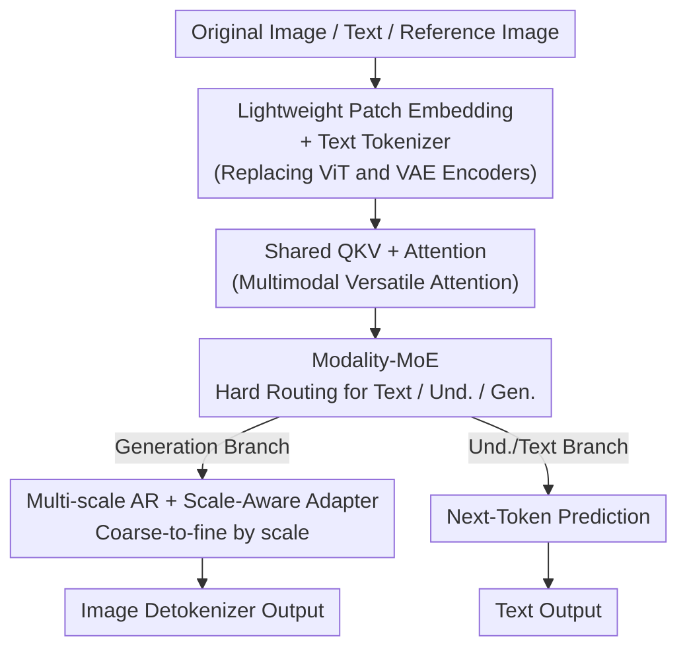

# OneCAT: Decoder-Only Auto-Regressive Model for Unified Understanding and Generation

**Conference**: CVPR 2026  
**Paper**: [CVF Open Access](https://openaccess.thecvf.com/content/CVPR2026/html/Li_OneCAT_Decoder-Only_Auto-Regressive_Model_for_Unified_Understanding_and_Generation_CVPR_2026_paper.html)  
**Code**: https://onecat-ai.github.io/ (Project Page)  
**Area**: Multimodal VLM / Unified Understanding and Generation  
**Keywords**: Unified Multimodality, Decoder-only, Auto-regressive Generation, Modality-MoE, Next-Scale Prediction

## TL;DR
OneCAT integrates "understanding + generation + editing" into **the same decoder-only Transformer**. By utilizing a Modality-MoE with hard routing (text, understanding, and generation specialists), it achieves encoder-free inference. It also introduces **multi-scale auto-regressive generation** into LLMs via a Scale-Aware Adapter, attaining SOTA performance in a unified model while delivering approximately 10× faster generation speeds than diffusion models.

## Background & Motivation
**Background**: Current multimodal systems mostly follow a "modular" path—using one set for understanding (ViT + LLM), diffusion models for generation, and separate pipelines for editing. Even models claiming to be "unified" (e.g., BAGEL, Mogao) often use a Mixture-of-Transformers (MoT) approach, where an AR branch handles understanding and a diffusion branch handles generation, with external ViT encoders and VAE tokenizers. These are essentially several models coupled together.

**Limitations of Prior Work**: This multi-module design has two major drawbacks. First, deep early fusion across modalities is constrained by the architecture—visual data is compressed into semantic features by an independent encoder before being fed to the LLM, preventing low-level interaction between text and pixels. Second, external components (especially ViT encoders and diffusion denoising) introduce significant inference latency, particularly for high-resolution inputs/outputs.

**Key Challenge**: Achieving true "unification" requires a single model to master two opposing tasks: understanding requires **compressing images into abstract semantics** (continuous tokens), while generation requires **expanding semantics into pixel details** (discrete tokens). Sharing the same parameters causes gradient conflicts during early training; splitting them into separate sub-networks reverts to the modular approach.

**Goal**: To create a **pure decoder-only, pure auto-regressive** unified architecture that requires **no ViT/VAE encoders during inference**. It aims for early fusion, avoids interference between understanding and generation, and maintains high speed.

**Key Insight**: The authors propose that "pure auto-regression is sufficient to support unified multimodal intelligence." Visual input is no longer processed by a heavy encoder but directly converted into continuous tokens via a lightweight Patch Embedding layer. For generation, visual AR is shifted from "token-by-token" to "scale-by-scale" (coarse-to-fine), bypassing diffusion latency while naturally fitting the next-token paradigm.

**Core Idea**: Utilize **Modality-MoE with hard routing** to allow the same decoder to share attention while providing specialized FFNs for different modalities. A **unified AR objective** then unifies understanding, generation, and editing as "predicting the next (token or scale)."

## Method

### Overall Architecture
Initialized from a pre-trained Qwen2.5 LLM, the entire system is a **single decoder-only Transformer**. Attention (QKV + Attention) is shared across all modalities, while the FFNs diverge into three specialists based on the modality. During inference, there are three types of input tokens: text tokens, continuous visual tokens (original images via Patch Embedding for understanding and reference), and discrete visual tokens (produced by the model during generation). Outputs include text via a Text Detokenizer and generated images via an Image Detokenizer (multi-scale VAE decoder). Notably, **no ViT or VAE encoder is required during inference**—the VAE encoder is only used during training to generate ground-truth multi-scale discrete tokens.

Understanding follows **Next-Token Prediction**, and generation follows **Next-Scale Prediction** (coarse-to-fine). Editing treats the reference image as continuous tokens routed to the understanding specialist as visual conditions, while the LLM auto-regressively outputs discrete tokens for the new image, without changing the architecture.

### Key Designs

**1. Modality-MoE: Enabling Dual Competence in Understanding and Generation**

Understanding and generation have opposing token requirements (semantic compression vs. detail expansion). Sharing an FFN leads to parameter contention. OneCAT replicates the original Qwen2.5 FFN into three specialists per block: **Text FFN** (text tokens), **Und. FFN** (continuous visual tokens for understanding), and **Gen. FFN** (discrete visual tokens for generation). **Hard routing** is used based on token modality and task type without learned gating. The shared attention layer ensures parameter efficiency and early cross-modal alignment, which is crucial for instruction following. This enables an "encoder-free" architecture: raw patches enter shared attention and modality-specific FFNs directly, merging text and pixels from the first layer.

**2. Multi-scale Visual AR + Scale-Aware Adapter (SAA): Scaling VAR within LLMs**

Token-by-token image generation is slow, and diffusion has high latency. OneCAT adopts multi-scale VAE to encode images into **hierarchical multi-scale discrete tokens**, allowing the LLM to perform **Next-Scale Prediction**. Since low-scale tokens (color, structure) and high-scale tokens (texture, detail) differ significantly, the authors propose **SAA**: a set of **scale-specific** bypasses (skip connections) parallel to Gen. FFN linear layers. Discrete tokens are routed to the corresponding scale adapter via a scale index. Each adapter uses LoRA-style low-rank decomposition ($r=64$). Unlike LoRA, **SAA is jointly trained end-to-end as a permanent component**. Removing SAA drops GenEval from 81.2 to 78.1.

**3. Multimodal Versatile Attention: One Attention for Four Tasks**

Different tasks require different attention masks. Based on FlexAttention, OneCAT assigns specific masks: **Causal Attention** for text tokens $T$; **Full Attention** for continuous visual tokens $U$ (inputs/references) for global interaction; and **Block Causal Attention** for multi-scale discrete tokens $G$—where tokens within the same scale attend to each other freely, but cross-scale attention follows causal order.

**4. Three-Stage Training + Understanding Distillation: Efficient Visual Perception**

The Und. FFN is initialized from the text-only FFN. To bridge the visual gap efficiently, a three-stage pipeline is used. **Stage 1 (Multimodal Pre-training)** involves: (1-1) **Customizing an MLLM teacher** by connecting a pre-trained ViT and Qwen2.5 with an MLP, sharing the same LLM backbone to ensure consistency; (1-2) Freezing shared layers and pre-training Und. FFN (via distillation) and Gen. FFN separately. The distillation objective is:

$$L_{Und} = L_{NTP} + \lambda L_{Distill}, \quad L_{Distill} = \sum_{n=1}^{N}\mathrm{MSE}\big(h_S^{(n)}, h_T^{(n)}\big)$$

Where MSE alignment is performed on **every layer's** hidden states ($\lambda=0.02$). **Stage 2 (Unified Mid-training)** unfreezes the model for joint training across four tasks with SAA and native resolution strategies. **Stage 3 (Unified SFT)** performs supervised fine-tuning on high-quality data.

### Loss & Training
The understanding side uses $L_{Und}$; the generation side uses cross-entropy for next-scale prediction. CFG is used during inference. Data ratios: Text:Und:Gen = 1:6:7. Variants include OneCAT-1.5B (Active 1.5B) and OneCAT-3B (Active 3B).

## Key Experimental Results

### Main Results

Understanding benchmarks (SOTA among encoder-free unified models; "/" denotes no external visual components):

| Model | Visual Components | DocVQA | ChartQA | AI2D | MME-P | MMB | MMVet |
|-------|-------------------|--------|---------|------|-------|-----|-------|
| Janus-Pro-7B (Unified) | SigLIP | - | - | - | 1567 | 79.2| 50.0  |
| HoVLE-2.6B (Und.-only) | / | 86.1 | 78.6 | 73.0 | - | 71.9 | 44.3 |
| Qwen2.5-VL-3B (Enc.-based) | 0.6B ViT | 93.9 | 84.0 | 81.6 | - | 79.1 | 61.8 |
| **OneCAT-3B** | **/** | **91.2**| **81.2**| **77.8**| **1630**| **78.8**| **52.2**|

Generation benchmarks († = using LLM prompt rewriting; OneCAT does not rewrite):

| Model | GenEval Overall↑ | Counting | Color Attri. | DPG Overall↑ |
|-------|------------------|----------|--------------|--------------|
| Janus-Pro-7B | 0.80 | 0.59 | 0.66 | 84.19 |
| BAGEL-7B† | 0.88 | 0.84 | 0.77 | - |
| Mogao-7B† | 0.89 | 0.83 | 0.80 | 84.33 |
| OneCAT-1.5B | 0.85 | 0.83 | 0.75 | 81.72 |
| **OneCAT-3B** | **0.90** | 0.84 | 0.80 | **84.53** |

Inference Efficiency (H800):

| Task | Baseline | Res | Baseline Speed | OneCAT-3B | Gain |
|------|----------|-----|----------------|-----------|------|
| Und. TTFT | Qwen2.5-VL-3B | 1792² | 0.583s | 0.225s | 61%↓ |
| T2I Gen | BAGEL-7B | 1024² | 26.29s | 2.85s | 89%↓ |
| Editing | BAGEL-7B | 1024² | 46.44s | 4.61s | 90%↓ |

### Ablation Study

| Config | Key Metric | Insight |
|--------|------------|---------|
| Full Hidden Distill | Avg. 35.3 | Complete strategy |
| Last Layer Logits | Avg. 33.9 | -1.4 drop |
| Custom Teacher | Avg. 35.3 | Shared backbone is better |
| Qwen2.5-VL Teacher| Avg. 33.7 | Off-the-shelf teacher is worse |
| w/ SAA | GenEval 81.2| Baseline |
| w/o SAA | GenEval 78.1| -3.1 drop |

### Key Findings
- **Full layer distillation > Logit-only distillation**: Aligning internal computation patterns across every layer is more effective than output alignment (35.3 vs 33.9).
- **Custom Teacher > Off-the-shelf Teacher**: Sharing the LLM backbone between teacher and student provides better consistency (+1.6 points).
- **Encoder-free speed gains** are most significant at high resolutions: 61% reduction in TTFT for 1792² and ~10× speedup for 1024² generation.

## Highlights & Insights
- **Discarding encoders at inference is a major win**: Removing ViT and diffusion denoising eliminates the two most expensive components of unified models.
- **Minimalist Modality-MoE**: Hard routing is enough to coexist understanding and generation within a unified AR objective, proving that unified models don't need complex separate Transformers.
- **SAA for "Scale-Division"**: Using permanent low-rank bypasses for different scales mimics frequency-specific processing in an AR framework.
- **Next-Scale Prediction in LLMs**: Replacing token-by-token generation with coarse-to-fine scales maintains the AR paradigm while reaching diffusion-level quality at much higher speeds.

## Limitations & Future Work
- There remains a gap in understanding compared to top-tier encoder-based models (e.g., Qwen2.5-VL-3B), likely due to training data scale (0.5T vs 4T tokens).
- Generation quality is partially bounded by the external multi-scale VAE (Infinity) detokenizer.
- Hard routing by modality might lack flexibility for interleaved multimodal tasks; more dynamic routing could be explored.

## Related Work & Insights
- **Comparison with MoT (BAGEL, Mogao)**: These use separate Transformers and external encoders; OneCAT uses a single decoder with MoE, achieving 10× speedup and proving a single AR objective is sufficient.
- **Comparison with Encoder-free Understanding (EVE)**: OneCAT adds a custom teacher and full-layer distillation to enhance efficiency while expanding capabilities to generation and editing.
- **Comparison with VAR/Infinity**: OneCAT ports multi-scale AR into LLMs and introduces SAA to handle scale-variance in shared FFNs.

## Rating
- Novelty: ⭐⭐⭐⭐⭐ 
- Experimental Thoroughness: ⭐⭐⭐⭐⭐ 
- Writing Quality: ⭐⭐⭐⭐ 
- Value: ⭐⭐⭐⭐⭐ 

<!-- RELATED:START -->

## Related Papers

- [\[CVPR 2026\] Unified Multimodal Models as Auto-Encoders](unified_multimodal_models_as_auto-encoders.md)
- [\[CVPR 2026\] Rosetta Stone for Unified MLLMs: A Unified Tokenizer to Decipher Understanding and Generation](rosetta_stone_for_unified_mllms_a_unified_tokenizer_to_decipher_understanding_an.md)
- [\[ICCV 2025\] GenDoP: Auto-regressive Camera Trajectory Generation as a Director of Photography](../../ICCV2025/multimodal_vlm/gendop_auto-regressive_camera_trajectory_generation_as_a_director_of_photography.md)
- [\[CVPR 2026\] HBridge: H-Shape Bridging of Heterogeneous Experts for Unified Multimodal Understanding and Generation](hbridge_h-shape_bridging_of_heterogeneous_experts_for_unified_multimodal_underst.md)
- [\[ICLR 2026\] UniF2ace: A Unified Fine-grained Face Understanding and Generation Model](../../ICLR2026/multimodal_vlm/unif2ace_a_underlineunified_underlinefine-grained_underlineface_understanding_an.md)

<!-- RELATED:END -->
