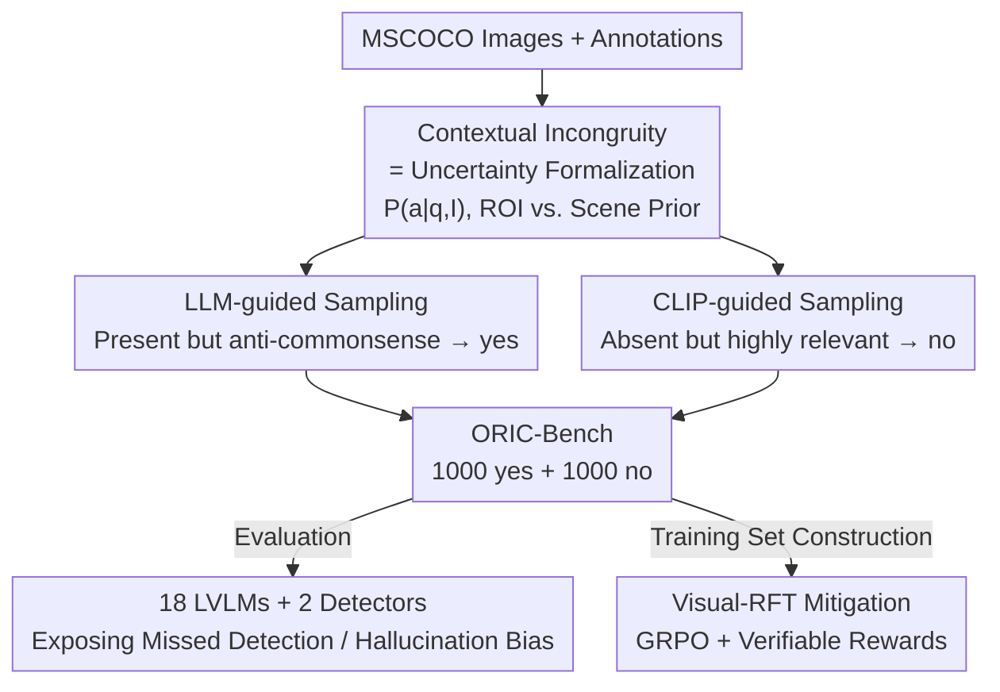

# ORIC: Benchmarking Object Recognition under Contextual Incongruity in Large Vision-Language Models

**Conference**: CVPR 2026  
**Paper**: [CVF Open Access](https://openaccess.thecvf.com/content/CVPR2026/html/Li_ORIC_Benchmarking_Object_Recognition_under_Contextual_Incongruity_in_Large_Vision-Language_CVPR_2026_paper.html)  
**Code**: https://github.com/ZhaoyangLi-1/ORIC  
**Area**: Multimodal VLM  
**Keywords**: Object recognition, contextual incongruity, hallucination, uncertainty, benchmark

## TL;DR
ORIC formalizes **contextual incongruity**—where objects appear in unexpected scenes or are missing from expected ones—as a source of uncertainty. Using LLM-guided and CLIP-guided sampling strategies, the authors construct ORIC-Bench from MSCOCO to test this specific scenario. Results reveal that the Macro F1 of 18 mainstream LVLMs drops from near-perfect to approximately 60–80. Performance is recovered and aligned more closely with human judgment using Visual-RFT fine-tuning on 600 ORIC-style samples.

## Background & Motivation

**Background**: Large Vision-Language Models (LVLMs) have made significant progress in tasks like VQA, image captioning, and robotics. A core capability is accurate object recognition—answering whether an object exists in an image. On existing benchmarks like POPE, AMBER, and HallusionBench, top models achieve near-perfect scores on existence judgment.

**Limitations of Prior Work**: Most benchmarks maintain semantic consistency between "object" and "scene": the queried objects are either common in the scene (e.g., asking about a baseball bat in a stadium) or absent and unrelated to the scene. In reality, LVLMs struggle with **anti-commonsense combinations**, such as failing to recognize a train in an office (missed detection) or hallucinating a ball in a stadium when none exists. These high-uncertainty regions of "weak local evidence vs. strong scene prior" are systematically overlooked by current benchmarks.

**Key Challenge**: Borrowing from the theory that LMs tend to guess rather than abstain under binary scoring, the authors formulate existence judgment as estimating $P(a\mid q, I)$, where the image $I=(\text{ROI}, \text{context})$ consists of the target object region and the surrounding scene. When ROI evidence is weak, the scene prior $P(a\mid q,\text{context})$ dominates inference: a scene strongly suggesting an object leads to a "yes" (hallucination), while a scene suggesting its absence leads to a confident "no" (missed detection). Consistency-based benchmarks only sample the high-frequency head of the joint distribution $P(o,c)$, leaving the difficult tail blank.

**Goal**: (1) Demonstrate that contextual incongruity is a neglected source of visual uncertainty that significantly degrades recognition performance; (2) Create a diagnostic benchmark to controllably construct such scenarios; (3) Provide a training scheme to mitigate these errors.

**Key Insight**: Since the problem stems from "weak local evidence and strong scene priors," data should be constructed inversely—**deliberately selecting objects where scene priors mislead the model**: present but counter-intuitive objects (for "yes" questions) and absent but highly implied objects (for "no" questions).

**Core Idea**: Use LLMs to identify objects that are "present but denied by scene priors" and CLIP to identify objects that are "absent but highly correlated with the scene." These are combined to form binary classification tasks that maximize contextual incongruity for both evaluation and training.

## Method

### Overall Architecture
ORIC is a "Construct-Diagnose-Mitigate" pipeline. The input consists of annotated MSCOCO images, and the output is a set of binary existence questions (ORIC-Bench evaluation set + ORIC-style training set), along with a more robust LVLM fine-tuned via Visual-RFT. The process involves two complementary sampling branches: positive samples (label: yes) use LLM-guided sampling to pick **present but anti-commonsense objects**, while negative samples (label: no) use CLIP-guided sampling to pick **absent but visually relevant objects**. After benchmarking 18 LVLMs and 2 open-vocabulary detectors, the same pipeline is applied to the training set for targeted mitigation using Visual-RFT (GRPO + verifiable rewards).

### Key Designs

**1. Recasting Contextual Incongruity as a Source of Uncertainty**

This serves as the conceptual foundation of ORIC. The authors formulate the probability of an object $o$ being present as a posterior estimate $P(a\mid q, I)$ and decompose the image into $I=(\text{ROI}, \text{context})$. Consistency-based heuristics work when $P(a_{gt}\mid q,\text{ROI})$ and $P(a_{gt}\mid q,\text{context})$ are both high. Contextual incongruity falls into the high-uncertainty zone where ROI evidence and scene priors **conflict**: the ROI posterior is diffuse, but the scene prior strongly favors one side, leading to hallucinations or over-denial. A control experiment confirms this: replacing the queried object with an anti-commonsense one in POPE causes Macro F1 to drop from 96–100 to ~60. They quantify this misalignment using $\text{CLIPScore}(I,O)=\hat{f}_I^\top \hat{f}_O \times 100$. In "no" questions, anti-commonsense objects (22.87) are shiftier as they "look" more like the scene than the original objects (20.18).

**2. LLM-guided Sampling for Positives: Selecting Anti-commonsense Objects**

The goal is to test "missed detection" where an object is present but unlikely given the context. Objects are split by area $A_i$: those below the 50th percentile $M_{50}(A)$ are categorized as ROI (target), and others as non-ROI (background context). GPT-5 predicts existence based solely on commonsense: $f(o)=1$ if and only if $\text{LLM}(o, O_{\text{nonROI}})=\text{"no"}$. Objects deemed "should not be there" by the LLM are most likely to mislead the model.

**3. CLIP-guided Sampling for Negatives: Selecting Highly Implied but Absent Objects**

The goal is to test "hallucinations" where an object is absent but the scene is highly suggestive. Using the CLIP image encoder, the authors find the most visually similar image $I'$ to the query image $I$ using cosine distance $D(I_q, I_i)=1-\frac{e_q\cdot e_i}{\|e_q\|\|e_i\|}$. Objects in $I'$ but not in $I$ are candidates. The top-$k$ candidates prioritized by $\text{CLIPScore}$ are used to generate "no" questions. Manual verification shows a low error rate of 2%.

**4. Visual-RFT for Mitigation: Verifiable Rewards**

The authors apply the pipeline to the COCO-2014 training set to generate 600 ORIC-style samples for Visual-RFT on Qwen3-VL-8B-Instruct. GRPO is used: for each question, $G$ responses $\{o_1,\dots,o_G\}$ are sampled. Two verifiable rewards are used: accuracy $r_{acc}\in\{0,1\}$ and format consistency $r_{fmt}\in\{0,1\}$. The total reward $r_i=r_{acc,i}+r_{fmt,i}$ is normalized via z-score within the group: $\hat{r}_i=\frac{r_i-\text{mean}(\{r_j\})}{\text{std}(\{r_j\})+\varepsilon}$. An R1-style prompt forces the model to use a `<REASONING>` block before the `<SOLUTION>`, ensuring the reward acts on evidence-based reasoning.

### Loss & Training
Full-parameter Visual-RFT is performed on Qwen3-VL-8B-Instruct with group size $G=8$ for 15 epochs. During evaluation, results are averaged across 4 prompt variants. Detectors are considered to answer "yes" if confidence $\ge 0.25$.

## Key Experimental Results

### Main Results

Comparison between POPE consistency subset and anti-commonsense control (Macro F1):

| Model | POPE Subset F1 | Anti-commonsense F1 | Drop |
|------|------|------|------|
| Janus-Pro-7B | 95.99 | 57.98 | −38.0 |
| Qwen3-VL-8B-Instruct | 98.00 | 58.33 | −39.7 |
| GPT-5-08-07 | 100.0 | 60.79 | −39.2 |

The F1 collapse despite identical images proves that contextual incongruity is the failure mode.

ORIC-Bench Main Results (Macro F1 + YP=Yes Prediction %):

| Model | Category | Total F1 | YP(%) | yes F1 | no F1 |
|------|------|------|------|------|------|
| Qwen3-VL-8B-Instruct | Vision Encoder | 79.55 | 44.94 | 78.51 | 80.59 |
| GPT-5-08-07 | Closed-source | 78.61 | 42.12 | 76.92 | 79.35 |
| InternVL3-9B | Vision Encoder | 76.87 | 44.60 | 75.60 | 78.13 |
| Janus-Pro-7B | Vision Encoder | 74.83 | 56.42 | 76.71 | 72.95 |
| Grounding DINO 1.5 Pro | Detector | 72.48 | 68.30 | 77.51 | 67.44 |
| Emu3-Chat | Encoder-free | 64.78 | 33.41 | 58.90 | 70.67 |
| Llama-3.2-11B-Vision | Vision Encoder | 33.33 | 0.00 | 0.00 | 66.67 |

Visual-RFT Mitigation:

| Configuration | Total F1 | yes F1 | no F1 | no recall |
|------|------|------|------|------|
| Base w/o CoT | 79.55 | 78.51 | 80.59 | 84.68 |
| Visual-RFT | 82.79 | 81.59 | 83.99 | 89.83 |

### Ablation Study

| Configuration | Key Metric | Description |
|------|---------|------|
| Base on Manual GT | Total F1 78.63 | Tested on 200 manually re-labeled questions |
| Visual-RFT on Manual GT | Total F1 83.62 | Closer to human judgment; no recall 80.75→88.75 |
| Cross-benchmark (AMBER) | Macro F1 87.48→90.49 | Significant generalization on compositional reasoning |

### Key Findings
- **Scene priors dominate failures**: The F1 drop when switching queried objects proves models rely on priors rather than vision.
- **Architectural differences**: Models with ViT encoders lead; encoder-free models lag significantly.
- **Transferable Mitigation**: Visual-RFT with only 600 samples improves performance on ORIC and generalizes to AMBER, indicating a genuine correction of reasoning rather than overfitting.

## Highlights & Insights
- **Using "Model Bias" to Construct Hard Samples**: Using LLM and CLIP priors as "adversarial searchlights" to find where LVLMs are most likely to fail is a highly reusable methodology.
- **Closed-loop Logic**: The paper follows a consistent Theory-Construction-Mitigation cycle.
- **CLIPScore as an Incongruity Metric**: Quantitatively proving that ORIC is more inconsistent than POPE by comparing alignment scores provides a template for future adversarial benchmark designs.

## Limitations & Future Work
- **Reliance on MSCOCO**: Limited to COCO categories and scenes.
- **Dependency on GPT-5/CLIP Priors**: The "hardness" of the benchmark is bounded by the quality of the priors used to build it.
- **Scale of Mitigation**: Visual-RFT was only tested on one model (Qwen3-VL-8B); effectiveness on larger models remains to be seen.

## Related Work & Insights
- **Comparison to POPE**: While POPE tests recognition under strong priors, it maintains consistency; ORIC targets the high-uncertainty regions where consistency is broken.
- **Comparison to Visual-RFT/RLHF-V**: This work adopts the verifiable reward paradigm but specifically applies it to existence judgment under incongruity, using GRPO to drive evidence-based decision-making.

## Rating
- Novelty: ⭐⭐⭐⭐⭐ Formalizing contextual incongruity as uncertainty and using LLM/CLIP priors for adversarial construction is novel.
- Experimental Thoroughness: ⭐⭐⭐⭐ Evaluated 18 LVLMs and 2 detectors, though mitigation was only verified on a single model.
- Writing Quality: ⭐⭐⭐⭐ Clear logic from theory to mitigation; well-structured.
- Value: ⭐⭐⭐⭐ Provides both a diagnostic benchmark and a practical mitigation strategy for LVLM reliability.

<!-- RELATED:START -->

## Related Papers

- [\[CVPR 2026\] GraphVLM: Benchmarking Vision Language Models for Multimodal Graph Learning](graphvlm_benchmark_vlm_graph_learning.md)
- [\[CVPR 2026\] Mechanisms of Object Localization in Vision-Language Models](mechanisms_of_object_localization_in_vision-language_models.md)
- [\[CVPR 2025\] COUNTS: Benchmarking Object Detectors and Multimodal Large Language Models under Distribution Shifts](../../CVPR2025/multimodal_vlm/counts_benchmarking_object_detectors_and_multimodal_large_language_models_under_.md)
- [\[CVPR 2026\] Boosting Vision-Language Models Towards Cross-Domain Incremental Object Detection](boosting_vision-language_models_towards_cross-domain_incremental_object_detectio.md)
- [\[CVPR 2026\] Venus: Benchmarking and Empowering Multimodal Large Language Models for Aesthetic Guidance and Cropping](venus_benchmarking_and_empowering_multimodal_large_language_models_for_aesthetic.md)

<!-- RELATED:END -->
