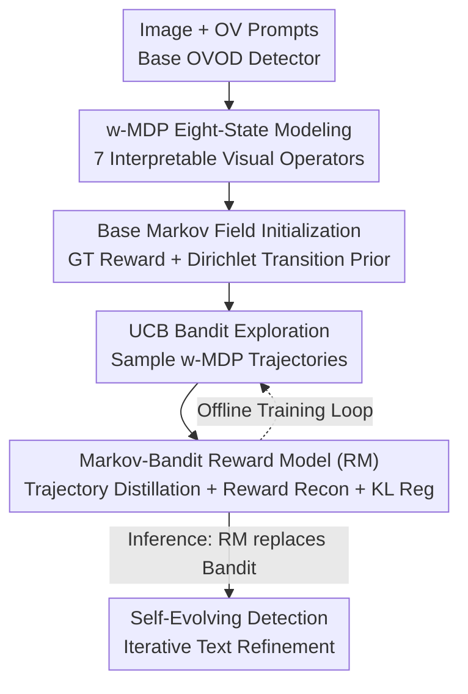

# OVOD-Agent: A Markov-Bandit Framework for Proactive Visual Reasoning and Self-Evolving Detection

**Conference**: CVPR 2026  
**Paper**: [CVF Open Access](https://openaccess.thecvf.com/content/CVPR2026/html/Wang_OVOD-Agent_A_Markov-Bandit_Framework_for_Proactive_Visual_Reasoning_and_Self-Evolving_CVPR_2026_paper.html)  
**Code**: TBD  
**Area**: Multimodal VLM / Open-Vocabulary Detection  
**Keywords**: Open-Vocabulary Detection, Visual Chain-of-Thought, Weak Markov Decision Process, Bandit Exploration, Self-evolving Reward Model

## TL;DR
This work transforms Open-Vocabulary Object Detection (OVOD) from a "one-time static matching of text and regions" into an **LLM-free** proactive visual reasoning process. It employs an eight-state weak Markov Decision Process (w-MDP) to characterize visual state transitions, uses UCB Bandit to sample reasoning trajectories in uncertain regions, and jointly trains a lightweight Reward-Policy Model (RM) using Markov transition statistics. This creates a self-evolving closed loop that consistently improves rare class detection on COCO/LVIS with minimal inference overhead.

## Background & Motivation

**Background**: OVOD relies on semantic priors from large-scale vision-language pre-training to extend detectors to arbitrary categories. Recent works in region-text alignment and large-vocabulary modeling have significantly improved open-set recognition. Extensive research (prompt learning, attribute descriptions, class name optimization, LLM-generated priors) has repeatedly proven that **the impact of text space on OVOD performance is greater than expected and far from saturated**.

**Limitations of Prior Work**: Despite multimodal supervision during training, the inference stage often degrades into **unimodal matching** against a fixed set of category names. Detection becomes a simple table-lookup alignment, causing a misalignment between "multimodal training vs. unimodal inference." Consequently, models struggle with visual ambiguity, unfamiliar contexts, and rare/fine-grained categories. Approaches using LLMs to generate attribute priors are essentially **static**, performing one-time adjustments that fail to capture the evolving relationships between regions, contexts, and attributes during the detection process.

**Key Challenge**: The standard route to stronger reasoning is placing an LLM at the core of decision-making (CoT-PL, LLM priors, multi-round human feedback). However, this directly conflicts with the **speed, scalability, and ease of deployment** upon which object detection relies. Integrating a heavy LLM pipeline into OVOD is often counterproductive.

**Goal**: To provide OVOD with a **context-aware, iterative** mechanism for text representation refinement without introducing LLMs or significant inference overhead.

**Key Insight**: The authors observe that region-text matching is highly **discrete**—small perturbations in the text space can cause large jumps in detection behavior. This suggests that "coarse-to-fine discrete transitions" in semantic space can serve as a structured alternative to continuous LLM reasoning. The Markov formalization supports the view that discrete semantic transitions can approximate complex reasoning.

**Core Idea**: Replace LLM-centric continuous visual reasoning with a discrete decision-making framework using **weak MDP + Bandit exploration + Reward Model distillation**. This transforms passive matching into interpretable Visual-CoT proactive reasoning and self-evolving detection.

## Method

### Overall Architecture
OVOD-Agent is a lightweight "visual reasoning plug-in" for existing OVOD detectors. Given an image $x$ and open-vocabulary prompts $T$, the base detector first provides region proposals and category scores. The agent does not directly accept these results; instead, it executes a sequence of **explicit visual actions** $a_t \in \mathcal{A}$ under the current visual context $c_t = (x_t, T_t)$, transitioning the context to $c_{t+1} = f(c_t, a_t)$ to form an interpretable Visual-CoT trajectory. The pipeline consists of four steps: modeling "state + action" into compact weak Markov units via w-MDP; using UCB Bandit to sample high-quality trajectories and transition statistics; aggregating trajectories into image-level Markov transition matrices; and training a lightweight Reward-Policy Model (RM) as a self-evolution mechanism to **replace Bandit exploration during inference**.

### Key Designs

**1. w-MDP Eight-State Modeling: Compressing "State + Action" into a Weak Unit**

Traditional MDPs strictly separate state $s_t$ and action $a_t$, with transitions defined as $P(s_{t+1} \mid s_t, a_t)$. The authors argue this separation is redundant in proactive visual reasoning—visual actions based on color, texture, geometry, lighting, or spatial cues **directly rewrite the vision-text context and determine the next state**. Thus, OVOD-Agent unifies them into a single weak Markov unit $z_t = g(c_t, a_t) \in \mathcal{Z}$, where transitions simplify to $P(z_{t+1} \mid z_t)$ under a short-term memory assumption. This maintains interpretability while avoiding state-action pair enumeration. The "reasoning language" consists of 7 explicit visual operators $a_1 \sim a_7$: Dictionary/Alias fallback, Color (HSV/clustering), Texture (LBP/GLCM), Background (ROI adjustment), Geometry (scale/aspect ratio), Illumination (HSV-V analysis), and Spatial (position/IoU relations).

**2. Base Markov Field Initialization: Regularizing Reward and Transition under Weak Supervision**

To handle the low efficiency of random exploration in the cold-start phase, a "Base Markov Field" is initialized on $z_0$. For rewards, a **GT-seeded weak reward** $r_t^{GT} = 1 - \mathrm{IoU}(b_t^{pred}, b_t^{GT})$ is used—higher uncertainty (lower IoU) yields higher rewards, signaling a need for further refinement. For transitions, a **Dirichlet transition prior** $\hat P(\cdot \mid z_t) \leftarrow \mathrm{Dirichlet}(\mathbf{n}_{z_t})$ is used. This provides structured regularization for subsequent Bandit exploration, guiding early trajectories toward meaningful regions of the state space.

**3. UCB Bandit Exploration: Sampling High-Quality Trajectories**

Instead of finding a deterministic optimal solution for each image, the goal is to sample diverse, high-quality reasoning trajectories for training. A UCB contextual Bandit balances exploration and exploitation: it selects actions $a_{t+1} = \arg\max_a Q_t(a)$ based on local mean reward $\hat\mu_t$ and visit counts $n_t$, with $Q_t(a) = \hat\mu_t(a \mid c_t) + \lambda\sqrt{\ln t / (1 + n_t(a \mid c_t))}$. Transitions are updated incrementally via Dirichlet counts. Stopping conditions include state stability, reward convergence, or reaching the step limit $H_{\max}=7$.

**4. Markov-Bandit Reward Model and Self-Evolution Loop: Distilling Exploration into a Lightweight Policy Network**

The Bandit produces a set of trajectories $\mathcal{T}_i$ and transition priors $\hat P_i$ for each image, forming an offline dataset $\mathcal{D}$. The RM is a compact **dual-head network** (3-layer MLP, $\approx$20MB): a policy head $\pi_\theta(\cdot \mid z_t)$ modeling local transitions and a reward head $\hat r_\theta(z_t)$ predicting expected weak rewards. The training objective combines **trajectory distillation**, **reward reconstruction**, and **Markov regularization** via KL divergence to align the policy with the empirical Markov structure. During inference, the RM replaces UCB sampling, enabling self-evolved refinement without online sampling.

### Loss & Training
The core training objective is the joint loss $\mathcal{L}_{\mathrm{RM}}$:
1.  **Trajectory Distillation**: $\mathbb{E}[-w_t \log \pi_\theta(z_{t+1} \mid z_t)]$
2.  **Reward Reconstruction**: $\beta \, \mathbb{E}[(\hat r_\theta(z_t) - r_t)^2]$
3.  **Markov Regularization**: $\gamma \, \mathbb{E}[\mathrm{D_{KL}}(\pi_\theta(\cdot \mid z_t) \Vert \hat P_i(\cdot \mid z_t))]$
The self-evolution follows a "Sampling (Bandit) $\rightarrow$ Offline Training (RM) $\rightarrow$ Inference (RM-driven)" cycle.

## Key Experimental Results

### Main Results
Evaluated on COCO and LVIS by plugging OVOD-Agent into four base detectors. APr represents Rare class AP on LVIS. ΔLatency is the average per-image inference delay (ms).

| Base Detector | LVIS val APr | ΔAPr | LVIS minival ΔAPr | COCO mAP | ΔLatency |
| :--- | :--- | :--- | :--- | :--- | :--- |
| GroundingDINO | 30.2 $\rightarrow$ 32.9 | +2.7 | +1.6 | 52.8 $\rightarrow$ 54.1 | +120ms |
| YOLO-World | 22.8 $\rightarrow$ 25.2 | +2.4 | +1.8 | 45.0 $\rightarrow$ 45.9 | +90ms |
| GroundingDINO 1.5 | 42.7 $\rightarrow$ 44.1 | +1.4 | +1.3 | 58.0 $\rightarrow$ 58.8 | +145ms |
| DINO-X Pro | 48.0 $\rightarrow$ 49.2 | +1.2 | +1.1 | 61.5 $\rightarrow$ 62.1 | +155ms |

**Key Findings**: Gains are **concentrated in rare classes** (LVIS val APr +1.2~+2.7). Overall AP improves by +0.5~+1.2, showing long-tail improvements without hurting common classes. Latency increases linearly with trajectory length but remains acceptable, offering a strong accuracy-efficiency trade-off.

### Ablation Study
(Benchmarks using LVIS minival + GroundingDINO)

**Exploration Strategy Comparison**:
| Strategy | Top-K@Stop | PWR (%) | AI (Blind) | Human |
| :--- | :--- | :--- | :--- | :--- |
| Random | 0.54 | 19.1 | 3.0 | 2.7 |
| ε-Greedy | 0.62 | 36.5 | 3.5 | 3.3 |
| UCB (Ours) | **0.66** | **44.8** | **4.7** | **4.5** |

**Visual-CoT Operator Expansion**:
| Configuration | Metric | Description |
| :--- | :--- | :--- |
| RM w/o KL Reg. | APr 19.0 | Trajectory training only |
| RM w/ KL Reg. (Full) | APr 20.3 | Added Markov structure Reg |
| Baseline | APr 35.4 | Base detector only |
| +a1 (Dict only) | APr 36.5 | Textual reasoning |
| +a1–a7 (Full Visual-CoT) | APr 37.7 | Full attribute/geometric cues |

## Highlights & Insights
- **Discrete Transitions $\approx$ Continuous CoT**: This key insight allows approximating multi-step reasoning with a compact Markov state machine, preserving detector speed and deployability.
- **Unified w-MDP**: Merging state and action into a weak unit avoids combinatorial explosion, making transition updates lightweight enough for detection loops.
- **GT-seeded Reward + Dirichlet Prior**: Provides a clean regularization paradigm for weak-supervision cold-starts, using $1-\mathrm{IoU}$ as an uncertainty signal.
- **Deployment Friendly**: The RM is a 3-layer MLP (<20MB RAM, <100ms latency), making it an attractive engineering solution for existing detectors.

## Limitations & Future Work
- **OOD & Tiny Objects**: The model still struggles with atypical morphologies (e.g., "dried apricots") and tiny/occluded objects in cluttered backgrounds where geometric rewards are noisy.
- **Performance Ceiling**: The absolute gain in APr is modest (+1~+2.7), and multi-step forward passes through the base detector limit the speed-accuracy ceiling.
- **Generalization**: Verification is currently limited to box-level OVOD on COCO/LVIS; expansion to segmentation or video grounding remains to be explored.

## Related Work & Insights
- **vs. LLM-based Optimization**: Unlike CoT-PL or LLM-priors that use continuous reasoning, this work uses discrete Markov-Bandit decisions to maintain speed.
- **vs. Retrieval-Augmented (RAG)**: While RAG is typically a single-step enrichment, w-MDP supports state-dependent iterative reasoning.
- **vs. Full Reinforcement Learning**: Full RL is impractical for OVOD due to sparse supervision; UCB/Contextual Bandit provides a more efficient uncertainty-driven sampling alternative.

## Rating
- **Novelty**: ⭐⭐⭐⭐⭐ High. Discrete Markov transitions as an LLM-free CoT alternative is a fresh perspective.
- **Experimental Thoroughness**: ⭐⭐⭐⭐ Systemic across detectors and datasets, though absolute gains are moderate.
- **Writing Quality**: ⭐⭐⭐⭐ Clear motivation and structure.
- **Value**: ⭐⭐⭐⭐ Practical and deployable; serves as an extensible base for self-evolving visual reasoning.

<!-- RELATED:START -->

- **GroundingDINO**: Marrying DINO with Grounded Pre-training for Open-Vocabulary Object Detection (CVPR 2023)
- **YOLO-World**: Real-Time Open-Vocabulary Object Detection (CVPR 2024)
- **Visual Chain-of-Thought**: Proactive reasoning in Vision-Language Models

<!-- RELATED:END -->

## Related Papers

- [\[CVPR 2026\] VisPlay: Self-Evolving Vision-Language Models](visplay_self-evolving_vision-language_models.md)
- [\[CVPR 2026\] Decouple to Generalize: Context-First Self-Evolving Learning for Data-Scarce Vision-Language Reasoning](decouple_to_generalize_context-first_self-evolving_learning_for_data-scarce_visi.md)
- [\[CVPR 2026\] EvoGraph-R1: Self-Evolving Multimodal Knowledge Hypergraphs for Agentic Retrieval](evograph-r1_self-evolving_multimodal_knowledge_hypergraphs_for_agentic_retrieval.md)
- [\[ICLR 2026\] Why Keep Your Doubts to Yourself? Trading Visual Uncertainties in Multi-Agent Bandit Systems](../../ICLR2026/multimodal_vlm/why_keep_your_doubts_to_yourself_trading_visual_uncertainties_in_multi-agent_ban.md)
- [\[CVPR 2026\] Geometrically-Constrained Agent for Spatial Reasoning](geometrically-constrained_agent_for_spatial_reasoning.md)

<!-- RELATED:END -->
