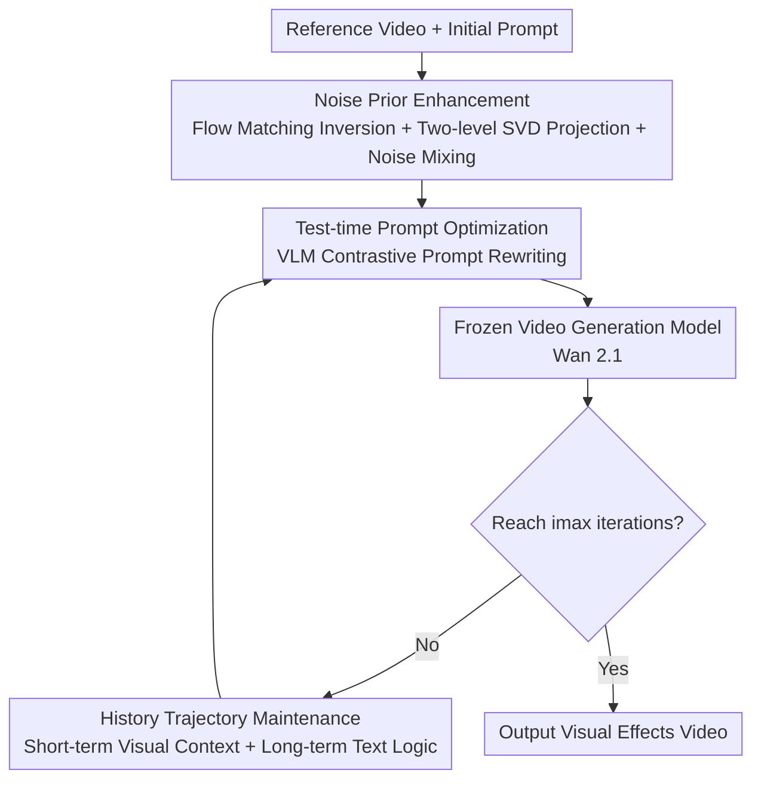

# P-Flow: Prompting Visual Effects Generation

**Conference**: CVPR 2026  
**Paper**: [CVF Open Access](https://openaccess.thecvf.com/content/CVPR2026/html/Zhao_P-Flow_Prompting_Visual_Effects_Generation_CVPR_2026_paper.html)  
**Code**: https://github.com/showlab/P-Flow  
**Area**: Video Generation (Dynamic Visual Effects Customization)  
**Keywords**: Video Effects Generation, Test-time Prompt Optimization, Training-free, Flow Matching Inversion, VLM Guidance

## TL;DR
Addressing the challenge that "dynamic visual effects such as explosions, squashing, and collapsing are difficult to describe precisely with a single text prompt," P-Flow proposes a training-free framework. It treats the text prompt as an optimization variable, using a Vision-Language Model (VLM) to contrast differences between reference and generated videos and iteratively rewrite prompts. Combined with noise prior enhancement and historical trajectory maintenance, it enables a frozen video generation model to replicate target effects with zero fine-tuning, outperforming baselines in FID-VID, FVD, Dynamic Degree, and human evaluations across T2V/I2V tasks.

## Background & Motivation
**Background**: Video generation models (e.g., Wan 2.1, HunyuanVideo) can already follow high-level semantic text instructions effectively. However, the customization of "dynamic visual effects"—phenomena driven by appearance and temporal evolution, such as objects exploding, being flattened, or collapsing—remains under-explored.

**Limitations of Prior Work**: Previous motion customization/control work primarily focuses on **low-level motion** (trajectories of subjects or cameras, poses, optical flow), which can be guided by explicit control signals. Dynamic visual effects, however, are characterized by **high-level semantics + temporal evolution** without clear motion trajectories, making explicit conditions difficult to characterize. While text prompts are a natural medium for expression, it is extremely difficult and time-consuming for humans to manually write a prompt that precisely describes effect semantics and timing, often requiring repeated trial-and-error and complex temporal reasoning. Specialized fine-tuned models (e.g., VFX Creator) are computationally expensive, require separate training for each effect, and suffer from poor generalization.

**Key Challenge**: The most natural medium for effect control is text, but "manually writing a good prompt" is difficult and unscalable, while "fine-tuning models for each effect" is expensive and non-general. A contradiction exists between "control flexibility" and "the need for no training/no manual prompt engineering."

**Goal**: Automatically transfer dynamic effects from a reference video to a new scene or subject without modifying the underlying generation model or performing any training.

**Key Insight**: The authors treat the text prompt itself as an **optimization variable**. By leveraging the semantic and temporal reasoning capabilities of VLMs, they automatically rewrite the prompt during test-time based on the effect discrepancy between the "generated video vs. reference video" to iteratively approach the target effect.

**Core Idea**: Replace "manual prompt writing" or "model fine-tuning" with VLM-driven **test-time prompt optimization**. By treating the generator as a black box and optimizing only the input text, high-fidelity effect customization is achieved.

## Method

### Overall Architecture
P-Flow is entirely training-free and optimizes text prompts only at test-time. Given a reference video $V_{ref}$ containing the target effect and an initial prompt $P_0$ describing a new scene, the goal is to generate $V_{gen}=G(P^*,\eta)$ that minimizes the discrepancy $D(V_{gen},V_{ref})$ in semantics and timing while respecting the content constraints of $P_0$. The framework consists of three synergistic components: first, **Noise Prior Enhancement** initializes latent noise that is both stable and diverse; then, **Test-time Prompt Optimization** uses a VLM to rewrite prompts by comparing the reference video with the current generation; finally, **History Trajectory Maintenance** provides the VLM with previous optimization contexts. This "generation → evaluation → rewriting" loop iterates until the maximum iteration $i_{max}$ is reached.

### Key Designs

**1. Noise Prior Enhancement: Stabilizing Iterative Optimization while Preserving Exploration**

The authors found that the initial latent noise $\eta$ significantly impacts optimization stability and diversity—completely random noise causes inconsistency across iterations, hindering convergence, while fixed noise limits exploration into sub-optimal regions. They designed a "Inversion → Isolation → Mixing" workflow. First, **flow matching inversion** is used to derive latent noise from the reference video $V_{ref}$: Flow matching defines an ODE $\frac{dx_t}{dt}=v_\theta(x_t,t;P)$. Integrating backwards from $x_T=V_{ref}$ along the reference prompt $P_{ref}$ yields $\eta_{inv}=x_T-\int_0^T v_\theta(x_t,t;P_{ref})\,dt$. This noise carries both effect dynamics and effect-irrelevant appearance attributes (texture, background). Next, **Two-level SVD Projection** is used to strip appearance while retaining motion: $\eta_{inv}$ is reshaped into $N_s\in\mathbb{R}^{(C\cdot F)\times(H\cdot W)}$ for SVD, where the top $k_s$ principal components are removed based on energy threshold $\rho_s$ to suppress spatial appearance; it is then reshaped along the temporal axis into $N_m\in\mathbb{R}^{(C\cdot H\cdot W)\times F}$ for a second SVD, retaining dominant motion components based on threshold $\rho_m$ to obtain $\eta_{temporal}$. Finally, **Noise Mixing** injects exploration: $\eta=\sqrt{\alpha}\cdot\eta_{temporal}+\sqrt{1-\alpha}\cdot\eta_{new}$, where $\eta_{new}\sim\mathcal{N}(0,I)$ and $\alpha$ controls the influence of the motion prior.

**2. Test-time Prompt Optimization: Prompt as Variable, VLM as "Gradient"**

This is the core of the framework. In iteration $i$, $V^i_{gen}=G(P_i,\eta)$ is generated using the current prompt $P_i$ and enhanced noise. Then $V_{ref}$, the previous generation, and $V^i_{gen}$ are vertically stacked into a composite video $V_{comb}$. The VLM is instructed to **focus exclusively on motion dynamics and visual effects while explicitly ignoring appearance/identity differences**. It analyzes the gap and rewrites the prompt: $P_{i+1}=M(V_{comb},P_i,H;P_0)$, where $M(\cdot)$ is a structured rewriting function that outputs a new prompt modifying **only effect-related descriptions while preserving the subject and environment**, returning analysis and revisions in structured JSON.

**3. History Trajectory Maintenance: Balancing Coherence and Efficiency via "Visual Short-term + Text Long-term Memory"**

To give the VLM a sense of direction and prevent oscillation or redundant changes, the authors maintain a history trajectory $H=\{(V_i,P_i,A_i)\}_{i=0}^{i_{max}-1}$. Feeding all historical videos to the VLM is computationally expensive due to visual token consumption. Therefore, the authors **decouple two types of memory**: visual input retains only the reference video + the previous generation + the current generation (short-term visual context), while all prompts $\{P_i\}$ and VLM analyses $\{A_i\}$ are fully retained due to their compact language tokens (long-term logical context). This allows cross-iteration reasoning while avoiding computational explosion from long visual sequences.

### Loss & Training
This method is **training-free** and has no loss function. The generator uses pre-trained Wan 2.1 14B (T2V/I2V), outputting $480 \times 832$ at 81 frames; prompt optimization uses Gemini 1.5 Pro. The mixing coefficient is fixed at $\alpha=0.001$ with $i_{max}=10$ iterations. Distributed inference for a single video takes approximately 69 seconds on 8 GPUs (~40GB VRAM per card), with an additional 1.2s for VLM input construction and 16.3s for prompt rewriting per iteration.

## Key Experimental Results

### Main Results
Evaluated on the Open-VFX dataset (675 videos, 15 effect categories, 245 reference images) using **FID-VID** (distribution similarity), **FVD** (temporal coherence/realism), and **Dynamic Degree (Dyn. Degree, magnitude of cross-frame motion, reflecting effect intensity)**. Below are the Overall (I2V+T2V composite) results:

| Method | Training Required? | FID-VID↓ | FVD↓ | Dyn. Degree↑ |
|------|----------|----------|------|--------------|
| Wan 2.1 | Training-free Baseline | 38.47 | 1265.07 | 0.31 |
| HunyuanVideo | Training-free Baseline | 37.44 | 1266.13 | 0.43 |
| HunyuanVideo + HF (Single Manual Edit) | Training-free | 35.20 | 1151.14 | 0.66 |
| **P-Flow (Ours)** | **No** | **31.13** | **882.63** | **0.91** |

VFX Creator is a training-based specialized model (one LoRA per effect, I2V only). On I2V, P-Flow matches it in FID-VID (29.32 vs 29.92) and FVD (784.51 vs 752.95), but significantly leads in Dynamic Degree (0.94 vs 0.63). P-Flow also supports T2V and is model-agnostic. Human preference win rates are also dominant:

| Comparison | P-Flow Win Rate |
|------|-------------|
| P-Flow-I2V vs Wan 2.1-I2V | 80% |
| P-Flow-I2V vs HunyuanVideo-I2V | 84% |
| P-Flow-I2V vs VFX Creator | 58% |
| P-Flow-T2V vs Wan 2.1-T2V | 75% |
| P-Flow-T2V vs HunyuanVideo-T2V | 81% |

### Ablation Study
Incremental addition of components (Overall):

| Noise-Enhance | Logic-Context | Visual-Context(i-1) | FID-VID↓ | FVD↓ | Dyn. Degree↑ |
|:---:|:---:|:---:|------|------|------|
| ✗ | ✗ | ✗ | 36.64 | 1205.47 | 0.63 |
| ✓ | ✗ | ✗ | 34.77 | 1072.10 | 0.68 |
| ✓ | ✗ | ✓ | 32.25 | 953.10 | 0.81 |
| ✓ | ✓ | ✓ | **31.13** | **882.63** | **0.91** |

Noise prior component analysis (Open-VFX, I2V):

| Setting | FID-VID↓ | FVD↓ | Dyn. Degree↑ |
|------|----------|------|--------------|
| No SVD Projection ($\rho_s=0,\rho_m=1$) | 33.25 | 1052.80 | 0.58 |
| Random Noise Only ($\alpha=0$) | 32.74 | 923.67 | 0.73 |
| Enhanced Noise ($\alpha=0.001,\rho_s=0.1,\rho_m=0.9$) | **29.32** | **784.51** | 0.94 |

### Key Findings
- **Prompt optimization alone exceeds baselines**: Even with all three ablation modules off, P-Flow's Dynamic Degree exceeds Wan 2.1, indicating that "text prompt optimization" itself significantly enhances temporal dynamics.
- **Synergistic Modules**: Noise-Enhance stabilizes optimization, Visual-Context(i-1) provides short-term visual insight, and Logic-Context provides full-trajectory semantics.
- **Hyperparameter Trade-offs**: $\rho_s=0$ (no appearance suppression) retains reference video appearance, degrading quality; excessively high $\rho_s (>0.5)$ over-suppresses useful priors; $\rho_s=0.1$ is optimal. $\alpha=0.001$ offers a balance between fidelity and motion dynamics.
- **Less Constrained than Training-based Methods**: VFX Creator is limited by fixed-length training samples, causing truncated effects (e.g., early end of "Deflate" sequences) and encoding dataset bias (e.g., human-like structures in "Venom" frames). P-Flow has no constraints on reference duration or resolution.

## Highlights & Insights
- **"Prompt as Optimization Variable" is the core paradigm shift**: Treating the generator as a black box and optimizing only the text input avoids the computational/generalization costs of fine-tuning and is more systematic than manual engineering. This mindset is applicable to any controllable generation task defined by reference examples.
- **Decoupling Visual and Logical Memory**: Retaining only recent videos as visual context while keeping all textual analysis as logical context efficiently manages VLM token budgets while maintaining long-range coherence.
- **Flow Matching Inversion + Two-level SVD**: Successfully separating "motion" from "appearance" at the noise level allows the initial noise to anchor effect dynamics without being tied to a specific appearance.
- **Universal Applicability**: Model-agnostic, training-free, and supporting both T2V/I2V makes it an engineering-ready, plug-and-play solution.

## Limitations & Future Work
- **Iteration Cost**: Defaulting to 10 iterations, each requiring a full video generation (~69s) + VLM inference (~17.5s), results in significant end-to-end latency and API costs.
- **Dependencies**: The performance ceiling is limited by the VLM's temporal reasoning and the generator's underlying capacity; if the generator fundamentally cannot render an effect, prompt optimization will fail.
- **Evaluation Range**: Primarily tested on 15 effect categories in Open-VFX; generalization to completely novel or combined effects requires further validation.

## Related Work & Insights
- **vs. VFX Creator**: While VFX Creator uses specialized LoRAs for each effect and supports only I2V, it suffers from fixed-length training and bias. P-Flow is model-agnostic, zero-training, and leads in Dynamic Degree.
- **vs. Low-level Motion Control**: Those methods excel at explicit trajectories but fail at "effects with high-level semantics and no clear trajectory." P-Flow uses VLM reasoning to address this semantic dimension.
- **vs. VLM-based Alignment (e.g., VideoAlign)**: While those methods use VLMs to **train** models, P-Flow uses the VLM as a **test-time optimizer** without modifying weights, an under-explored utility of VLMs in video generation.

## Rating
- Novelty: ⭐⭐⭐⭐ The "prompt as variable + VLM as optimizer" training-free tuning approach is novel, though test-time optimization has precedents in the image domain.
- Experimental Thoroughness: ⭐⭐⭐⭐ Comprehensive I2V/T2V settings, objective metrics, human evaluation, and ablation studies.
- Writing Quality: ⭐⭐⭐⭐ Clear motivation and component explanation.
- Value: ⭐⭐⭐⭐ A plug-and-play, model-agnostic customization framework with high practical utility for content creation.

<!-- RELATED:START -->

## Related Papers

- [\[CVPR 2026\] SynMotion: Semantic-Visual Adaptation for Motion Customized Video Generation](synmotion_semantic-visual_adaptation_for_motion_customized_video_generation.md)
- [\[CVPR 2025\] Visual Prompting for One-Shot Controllable Video Editing Without Inversion](../../CVPR2025/video_generation/visual_prompting_for_one-shot_controllable_video_editing_without_inversion.md)
- [\[CVPR 2026\] RFDM: Residual Flow Diffusion Models for Video Editing](rfdm_residual_flow_diffusion_models_for_video_editing.md)
- [\[CVPR 2026\] FlowDirector: Training-Free Flow Steering for Precise Text-to-Video Editing](flowdirector_training-free_flow_steering_for_precise_text-to-video_editing.md)
- [\[CVPR 2026\] Phantom: Physics-Infused Video Generation via Joint Modeling of Visual and Latent Physical Dynamics](phantom_physics-infused_video_generation_via_joint_modeling_of_visual_and_latent.md)

<!-- RELATED:END -->
