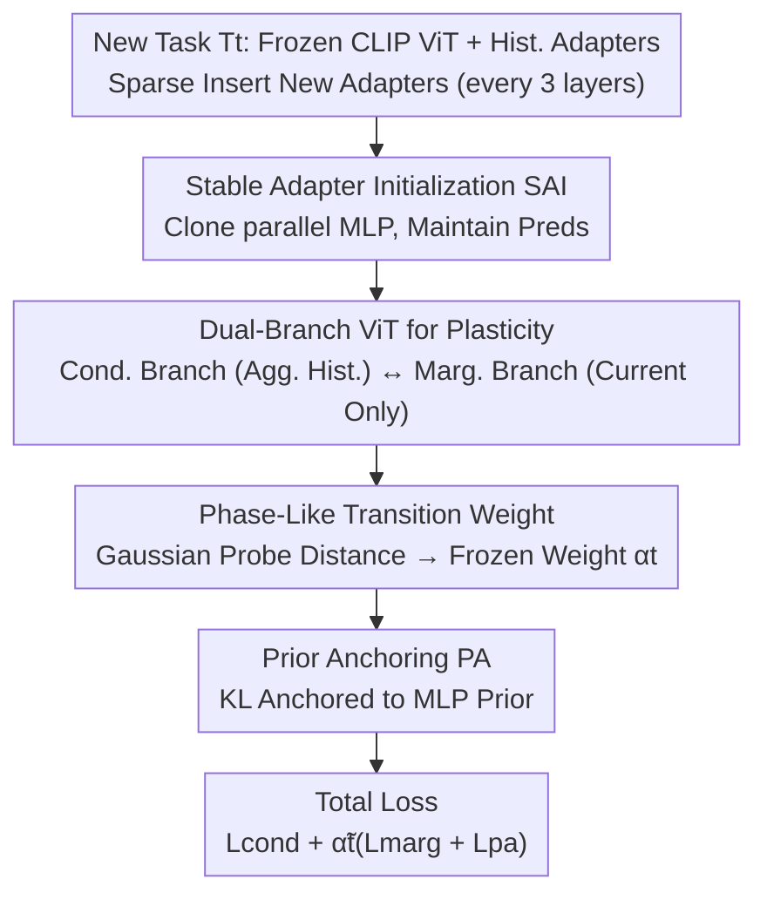

# PACT: Phase-Like Transition Constraints in Adapter-Based Continual Learning of Vision-Language Models

**Conference**: CVPR 2026  
**Paper**: [CVF Open Access](https://openaccess.thecvf.com/content/CVPR2026/html/Wang_PACT_Phase-Like_Transition_Constraints_in_Adapter-Based_Continual_Learning_of_Vision-Language_CVPR_2026_paper.html)  
**Code**: https://github.com/xwangrs/PACTCVPR2026.git  
**Area**: Multimodal VLM / Continual Learning  
**Keywords**: Continual Learning, PAC-Bayes, adapter, Stability-Plasticity Trade-off, Phase Transition Constraints

## TL;DR
Addressing the limitation where orthogonal constraints isolate task adapters and suppress cross-task knowledge sharing, the authors derive "Phase-Like Transition Constraints (PACT)" from PAC-Bayes theory for the **post-convergence phase**. This allows adapters to **smoothly transition rather than hard-threshold** between "frozen" (preserving history) and "melting" (adapting to new tasks) states, similar to the phase transitions of water. Implemented via a dual-branch ViT, Stable Adapter Initialization (SAI), and Prior Anchoring (PA), the method outperforms SOTA across multiple continual learning settings while using 36.96% fewer trainable parameters than standard adapter baselines.

## Background & Motivation

**Background**: To enable Vision-Language Models (VLMs) to learn new tasks without catastrophic forgetting, Parameter-Efficient Fine-Tuning (PEFT) is commonly used—freezing most pre-trained weights while training small modules like adapters, LoRA, or prompts. A standard approach involves optimizing task-specific adapters to convergence, often employing **(approximate) orthogonal constraints** to ensure different task adapters occupy mutually orthogonal directions in a shared subspace to reduce interference.

**Limitations of Prior Work**: Research in deep learning and neuroscience indicates that **forcing different tasks into mutually orthogonal subspaces suppresses cross-task knowledge transfer and sharing, creating "knowledge islands."** In other words, while "orthogonal isolation" reduces interference, it also severs legitimate synergies between related tasks.

**Key Challenge**: The stability-plasticity dilemma. Plasticity terms encourage adapters to adapt to new tasks, while stability terms prevent deviation from accumulated knowledge; orthogonal constraints act as a "one-size-fits-all" hard isolation, leaving no elastic space for sharing when tasks are related or isolation when they are not.

**Goal**: To provide a **theoretically grounded** constraint mechanism that adaptively transitions between sharing and isolation based on task similarity, replacing rigid orthogonal constraints.

**Key Insight**: The authors frame continual learning within the PAC-Bayes framework by sequentially treating the posterior of the previous task as the prior for the current task ($P_t:=Q_{t-1}$). The resulting generalization bound naturally yields two complementary terms: a **plasticity term** rewarding task adaptation and a **stability term** penalizing deviation from accumulated knowledge. A crucial observation is that PAC-Bayes theory assumes bounded loss, a condition that **only approximately holds after training has largely converged**. Therefore, these constraints should manifest as a "post-convergence phenomenon."

**Core Idea**: Following standard convergence for each task, adapter updates are modulated by a "phase-like transition relationship." If the current adapter is distant from historical adapters, it remains free (melting); if it is close, constraints are smoothly increased (frozen). This enables a soft switch between states like the phase transition of water, rather than a hard threshold.

## Method

### Overall Architecture
PACT processes a task sequence $T_1,\dots,T_T$ using a frozen CLIP ViT-B/16 backbone. Only newly inserted adapters are trained for each task (sparse insertion: one every 3 layers, i.e., layers 3/6/9/12). Specifically, PAC-Bayes is used to decompose the KL complexity term of the current task into a **plasticity term $\mathcal{P}$** (KL between current adapter conditional posterior and marginal posterior) and a **stability term $\mathcal{S}$** (drift of the current adapter posterior relative to its initialization). Plasticity is implemented via a **dual-branch ViT**: a conditional branch aggregates frozen history adapters with the current adapter, while a marginal branch use only the current adapter; both branches minimize their respective cross-entropy to align the posteriors. Stability is achieved through two components: **SAI (Stable Adapter Initialization)** initiates new adapters to be functionally equivalent to pre-trained MLPs, and **PA (Prior Anchoring)** uses KL to anchor the posterior to the MLP prior, limiting drift. The "phase transition" is driven by a **phase-like transition weight**: Gaussian probes measure the distance between current and recent historical adapters; close distance $\to$ frozen weight $\alpha_t\to1$, far distance $\to$ $\alpha_t\to0$. This is further modulated by training stability into $\tilde\alpha_t$, gating the marginal and PA losses only during the post-convergence stage. Total loss: $\mathcal{L}_{\text{total}}=\mathcal{L}_{\text{cond}}+\tilde\alpha_t(\mathcal{L}_{\text{marg}}+\mathcal{L}_{\text{pa}})$.

### Key Designs

**1. PAC-Bayes $\to$ Cond.-Marg. Decomposition for Continual Learning: Formulating Stability-Plasticity as KL Terms**

Classical PAC-Bayes handles single tasks and does not model the sequential evolution of posteriors across tasks. The authors extend this to continual learning: for task $t$, the prior is set as $P_t:=Q_{t-1}$ (posterior of the previous task), which depends only on historical data $D_{<t}$ and is independent of current data $D_t$, systematizing "transfer from old to new tasks." Adapter parameters are split into frozen historical blocks $\theta_a^{[t-1]}$ and the trainable current block $\theta_a^t$. The theorem provides an upper bound decomposition of the KL term $I_t$ for each task: $I_t\le\mathbb{E}_{\theta_a^{[t-1]}\sim Q_t^a}[\underbrace{\mathcal{P}}_{\text{Plasticity}}+\underbrace{\kappa\mathcal{S}}_{\text{Stability}}]$, where the plasticity term $\mathcal{P}=\mathrm{KL}(Q_t^a(\theta_a^t\mid\theta_a^{[t-1]})\Vert Q_t^a(\theta_a^t))$ measures the statistical dependence of the current adapter inference on historical adapters (lower is more plastic), and the stability term $\mathcal{S}=\mathrm{KL}(Q_t^a(\theta_a^t)\Vert Q_{t-1}^a(\theta_a^t))$ measures the posterior drift relative to initialization (lower is more stable), with $\kappa<\infty$ as an overlapping constant. This transforms the "stability-plasticity trade-off" from empirical intuition into two explicit optimizable objectives, serving as the theoretical foundation for the algorithm.

**2. Dual-Branch ViT for Plasticity: Using Conditional/Marginal Contrast as a Trainable Surrogate for $\mathcal{P}$**

The plasticity term aims to minimize the KL between the conditional posterior $Q_t^a(\theta_a^t\mid\theta_a^{[t-1]})$ and the marginal posterior $Q_t^a(\theta_a^t)$—directly calculating distribution divergence is infeasible. The authors construct two parallel branches sharing the frozen backbone $\theta_f$ and current adapter $\theta_a^t$, differing only in whether they aggregate historical adapter outputs: the **conditional branch** aggregates historical outputs via mean pooling and adds the current adapter, $h_{\text{cond}}=\frac{1}{t}\sum_{i=1}^t h_a^{(i)}+0.1\epsilon$; the **marginal branch** uses only the current adapter, $h_{\text{marg}}=h_a^{(t)}+0.1\epsilon$ (where $\epsilon\sim\mathcal{N}(0,I)$ provides PAC-Bayes stochasticity). Both feed into independent heads for $\mathcal{L}_{\text{cond}}$ and $\mathcal{L}_{\text{marg}}$. Since both branches use the same data and share $\theta_f$ and $\theta_a^t$, minimizing $\mathcal{L}_{\text{cond}}+\mathcal{L}_{\text{marg}}$ serves as a tractable surrogate to align the conditional and marginal posteriors, thereby reducing $\mathcal{P}$, encouraging the current adapter to focus on new knowledge, and weakening dependence on specific historical blocks.

**3. SAI + PA for Stability: Zero-Drift Starting Point and Drift Limitation**

The stability term $\mathcal{S}$ measures the current adapter's posterior drift relative to its initialization; excessive drift distorts representations shared by historical tasks. The authors employ a two-step approach. **SAI (Stable Adapter Initialization)**: The new adapter is placed in **parallel** with frozen MLP blocks, sharing the same structure and **initially cloning MLP parameters**. A gate $g_t=\sigma(\gamma_t)$ is used for convex combination $h_{\text{out}}=(1-g_t)h_{\text{base}}+g_t h_{\text{adapter}}$, inserted sparsely (every 3 layers). Consequently, the model's prediction distribution remains nearly unchanged at the moment of insertion, minimizing $\mathcal{S}=\mathrm{KL}(Q_t^a\Vert Q_{t-1}^a)$ (approaching zero with exact matching), providing a well-behaved starting point for optimization. **PA (Prior Anchoring)**: Since SAI only ensures a good starting point but does not constrain subsequent drift, a stability loss $\mathcal{L}_{\text{pa}}=\mathrm{KL}(Q_t^a(\theta_a^t)\Vert Q_{\text{mlp}}^a(\theta_a^t))$ is added to anchor the current adapter posterior to the fixed MLP prior ($Q_{\text{mlp}}^a\equiv Q_{t-1}^a$), directly penalizing drift. Given the strong zero-shot generalization of pre-trained MLPs, keeping the adapter close ensures stability and may even enhance zero-shot performance on unseen tasks.

**4. Phase-Like Transition Weight: Smooth Frozen/Melting Gating via Adapter Distance**

This is the core of the "phase transition." The authors construct a fixed Gaussian probe library $Z=\{z_m\}_{m=1}^M$ ($z_m\sim\mathcal{N}(0,I_d)$, shared across layers and steps). Probes are fed to the current adapter and each historical adapter to obtain response matrices $H^{(t)},H^{(j)}$. The difference is quantified using a scale-normalized Frobenius distance $d_j=\frac{\lVert H^{(t)}-H^{(j)}\rVert_F^2}{\varepsilon+\lVert H^{(t)}\rVert_F^2+\lVert H^{(j)}\rVert_F^2}$. Taking the nearest historical adapter $j^\star=\arg\min_j d_j$, an exponential kernel converts this into a frozen weight $\alpha_t=\exp(-d_{j^\star}/\tau)$: when the current adapter behaves similarly to a historical one, $\alpha_t\approx1$ (frozen); when it deviates significantly, $\alpha_t\approx0$ (melted). This $\alpha_t$ is further modulated by a training stability metric into $\tilde\alpha_t\in[0,1]$, ensuring regularization only takes effect during the relatively stable post-convergence stage. This is because the theory behind $\mathcal{L}_{\text{marg}}$ and $\mathcal{L}_{\text{pa}}$ relies on the "bounded loss" assumption, which is only approximately met after the main conditional objective has converged. Thus, in the total loss $\mathcal{L}_{\text{total}}=\mathcal{L}_{\text{cond}}+\tilde\alpha_t(\mathcal{L}_{\text{marg}}+\mathcal{L}_{\text{pa}})$, $\tilde\alpha_t\approx0$ during the unstable phase focuses on adaptation, while the marginal and PA losses are activated after stabilization—providing a "dual-mode, phase-like, smooth transition."

### Loss & Training
The total objective is $\mathcal{L}_{\text{total}}=\mathcal{L}_{\text{cond}}+\tilde\alpha_t(\mathcal{L}_{\text{marg}}+\mathcal{L}_{\text{pa}})$. The conditional cross-entropy dominates throughout, while the marginal cross-entropy and PA (KL anchoring loss) are smoothly activated in the post-convergence phase by the stability-aware weight $\tilde\alpha_t$. Implementation uses CLIP ViT-B/16, with adapters replicating the MLP block structure and inserted only at layers 3/6/9/12. Optimized via AdamW, with MTIL trained for 3k steps and CIL for 1k steps. Sparse insertion reduces trainable parameters by 36.96% compared to standard adapter baselines.

## Key Experimental Results

### Main Results
Two settings: Multi-domain Task Incremental Learning (MTIL, 11-dataset benchmark) and Class Incremental Learning (CIL, CIFAR-100 / TinyImageNet-100). MTIL metrics: Transfer (TF, avg. accuracy on unseen tasks after learning task $i$, i.e., zero-shot generalization), Last (LS, retention on seen tasks), and Avg (mean of TF and LS). The table below shows overall mean for MTIL Order-I.

| Method | Transfer | Average | Last |
|------|------|------|------|
| Zero-shot CLIP | 69.4 | 65.3 | 65.3 |
| MoE-Adapters | 67.4 | 77.2 | 87.4 |
| ConDU | 70.3 | 78.3 | 86.2 |
| AFA | 70.3 | 78.5 | 87.2 |
| TRGE | 69.8 | 78.5 | 87.6 |
| **PACT (Ours)** | **71.76 (+1.46)** | **81.05 (+2.55)** | **90.54 (+2.94)** |

PACT leads comprehensively across Transfer, Average, and Last by +1.46, +2.55, and +2.94 respectively over the second-best method. Notably, **zero-shot generalization (Transfer) and task retention (Last) improve simultaneously**, indicating a superior stability-plasticity balance: effectively adapting to new data while minimizing forgetting.

### Ablation Study
On Few-Shot MTIL (FS-MTIL), PACT is optimal under both 5-shot and 16-shot protocols, demonstrating the robustness of its PAC-Bayes formulation (where $\Delta$ is the change relative to zero-shot).

| Configuration | Key Metrics | Description |
|------|---------|------|
| Zero-Shot | TF 69.4 / Avg 65.3 / Last 65.3 | CLIP Baseline |
| ConDU (5-shot) | TF 70.3 / Avg 72.7 / Last 77.4 | Runner-up |
| AFA (5-shot) | TF 70.2 / Avg 74.1 / Last 79.4 | Runner-up |
| **PACT (5-shot)** | TF 70.5 / Avg 72.0 / **Last 80.7 (+15.4)** | Ours |
| IAP (16-shot) | TF 70.9 / Avg 72.5 / Last 77.7 | Comparison |
| **PACT (16-shot)** | Ranked 1st in TF/Avg/Last | Ours |
| Sparse Insertion | Trainable params −36.96% | vs. standard adapter baseline |

### Key Findings
- **Simultaneous Gain in Stability and Plasticity**: PACT surpasses baselines in both zero-shot generalization (Transfer) and retention (Last), whereas many methods trade one for the other. This validates that the "phase-like transition + complementary cond./marg. regularization" enables sharing when tasks are related and interference suppression when not.
- **Higher Performance with Fewer Parameters**: Sparse insertion (one adapter every 3 layers) reduces trainable parameters by 36.96% compared to standard baselines while achieving higher accuracy, suggesting more efficient utilization of adapter capacity.
- **Critical Importance of Post-Convergence Activation**: $\tilde\alpha_t$ delays regularization until training stabilizes, echoing the "bounded loss" premise of PAC-Bayes. Early training focuses on adaptation via conditional loss, while subsequent constraints prevent drift.
- **Training Dynamics Visualization**: Introducing PACT after CE convergence causes loss to **temporarily rise** before re-converging to a new equilibrium. Geometrically, adapters move smoothly between "Free" and "PACT" states (denoted as ↭ in the paper), visualizing the "phase-like" soft transition.

## Highlights & Insights
- **"Adapters phase-shifting like water" is a resonant analogy with theoretical support**: It transforms abstract stability-plasticity trade-offs into a soft transition between frozen/melting states, supported by the dual-modal optimization landscape of PAC-Bayes.
- **The insight that "constraints should be applied post-convergence" is highly reusable**: While most regularization methods are active throughout training, PACT identifies that PAC-Bayes generalization bounds depend on bounded loss assumptions met post-convergence. This "stage-aware regularization scheduling" can be migrated to other bound-based methods.
- **Gaussian probe response distance is a lightweight, parameter-free similarity metric**: Using a fixed probe library shared across layers to compare mappings provides a versatile trick for any scenario needing task or module similarity estimation.
- **SAI ensures adapters start as equivalents to pre-trained MLPs**: By reducing the initial stability term to near zero, it provides a well-posed starting point while preserving CLIP’s zero-shot capabilities—an elegant paradigm for "painless module insertion."

## Limitations & Future Work
- The method relies on "post-convergence" detection and $\tilde\alpha_t$ modulation. ⚠️ Detailed calculations for these are in the appendix and not fully expanded in the main text; sensitivity to stability thresholds/scheduling is hard to assess.
- The use of the nearest historical adapter $j^\star$ for distance calculation might overlook complex relationships with multiple historical tasks as the task sequence grows.
- Experiments focus specifically on CLIP ViT-B/16 + adapters. Whether the PAC-Bayes derivation fits other PEFT forms like LoRA or prompts, or whether it relies on the adapter's replication of the MLP structure, remains to be verified.
- While PACT theoretically outperforms orthogonal constraints on highly related tasks, the paper lacks a fine-grained analysis of "Task Similarity vs. Gain."

## Related Work & Insights
- **vs. Orthogonal PEFT (e.g., Orthogonal-LoRA series)**: These methods use (approximate) orthogonality to hard-isolate task adapters into non-interfering subspaces. This paper argues this suppresses sharing and creates knowledge islands. PACT uses phase-like soft gating to allow sharing when related and constraint when not.
- **vs. Classical Regularization (EWC/Parameter Importance)**: These penalize changes in important parameters to prevent forgetting. PACT derives stability-plasticity from sequential PAC-Bayes priors, offering a more systematic theoretical framework and limiting constraints to the post-convergence phase.
- **vs. Other PEFT-CL (MoE-Adapters / DIKI / IAP / AFA / TRGE, etc.)**: Many of these focus on converging and then fixing individual adapters. PACT’s key differentiator is "reshaping after convergence"—using phase-like constraints to induce structural coupling across tasks, leading to consistent gains in Transfer/Avg/Last with fewer parameters.

<!-- RELATED:START -->

## Related Papers

- [\[CVPR 2026\] Enhancing Continual Learning of Vision-Language Models via Dynamic Prefix Weighting](enhancing_continual_learning_of_vision-language_models_via_dynamic_prefix_weight.md)
- [\[CVPR 2026\] Learning from Itself: Mining Internal Knowledge from Vision Language Models for Continual Learning](learning_from_itself_mining_internal_knowledge_from_vision_language_models_for_c.md)
- [\[CVPR 2026\] On Token's Dilemma: Dynamic MoE with Drift-Aware Token Assignment for Continual Learning of Large Vision Language Models](on_tokens_dilemma_dynamic_moe_with_drift-aware_token_assignment_for_continual_le.md)
- [\[CVPR 2026\] Octopus: History-Free Gradient Orthogonalization for Continual Learning in Multimodal Large Language Models](octopus_history-free_gradient_orthogonalization_for_continual_learning_in_multim.md)
- [\[CVPR 2026\] Re-evaluating Continual VQA: Toward Fair and Robust Evaluation for Multimodal Continual Learning](re-evaluating_continual_vqa_toward_fair_and_robust_evaluation_for_multimodal_con.md)

<!-- RELATED:END -->
