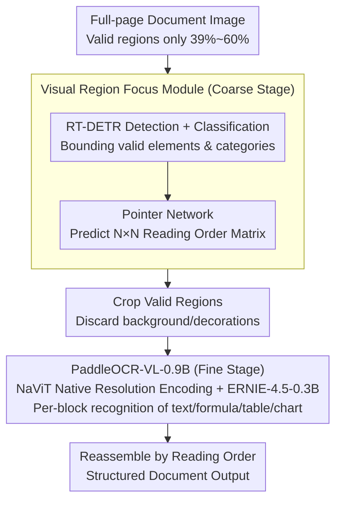

# PaddleOCR-VL: Boosting Document Parsing Efficiency and Performance with Coarse-to-Fine Visual Processing

**Conference**: CVPR 2026  
**arXiv**: [2603.24326](https://arxiv.org/abs/2603.24326)  
**Code**: [https://github.com/PaddlePaddle/PaddleOCR](https://github.com/PaddlePaddle/PaddleOCR)  
**Area**: Multimodal VLM  
**Keywords**: Document Parsing, Vision-Language Model, Coarse-to-Fine Processing, Visual Redundancy Elimination, OCR

## TL;DR

PaddleOCR-VL proposes a coarse-to-fine document parsing architecture: the coarse stage utilizes a lightweight Visual Region Focus Module (VRFM) to locate valid visual regions and predict reading order, while the fine stage employs a compact 0.9B visual-language model for refined recognition of cropped regions. This achieves SOTA performance in document parsing with minimal visual tokens and parameters.

## Background & Motivation

1. **Background**: Current document parsing methods are categorized into three types: pipeline methods (connecting expert components), general VLMs (end-to-end but heavy), and specialized VLMs (unified architecture but inefficient). High-resolution input is critical for document parsing but leads to a quadratic increase in visual tokens.
2. **Limitations of Prior Work**: General VLMs frequently generate hallucinations and recognition errors on handwritten or complex documents. Specialized VLMs (e.g., MinerU2-VLM) suffer from high latency due to large parameters and long decoding sequences. Unified visual token compression (e.g., DeepSeek-OCR) tends to compromise fine-grained layout precision.
3. **Key Challenge**: Valid visual regions in document images are highly non-uniform—valid regions in PPT documents account for only 39%, while information-dense documents occupy approximately 60%. Extensive background and decorative areas waste computational resources.
4. **Goal**: Maintain high-resolution precision while eliminating visual redundancy to achieve high accuracy and efficiency.
5. **Key Insight**: Observing the sparsity of valid visual regions, the authors propose using a detector to locate valid regions and perform fine-grained recognition only on these areas.
6. **Core Idea**: Decouple layout analysis from element recognition—utilize a lightweight detector for coarse-grained localization and reading order prediction, followed by a compact VLM for fine-grained recognition of cropped regions, avoiding the processing of the entire high-resolution image.

## Method

### Overall Architecture

The core contradiction PaddleOCR-VL addresses is that document parsing requires high resolution (for fine-grained recognition) but is penalized by high resolution (quadratic token growth). The solution decouples "where to look" from "what it is." The coarse-stage Visual Region Focus Module (VRFM) receives the full document image to perform lightweight layout analysis—bounding each valid element's location and category and predicting their reading order. The fine-stage PaddleOCR-VL-0.9B only processes the small regions cropped by VRFM for precise recognition (text, formulas, tables, charts). Finally, the recognition results are reassembled into a structured document based on the reading order provided by VRFM. The full-page image is processed only once by the lightweight detector, and the token-heavy VLM only handles the cropped small blocks.

### Key Designs

**1. Visual Region Focus Module (VRFM): Replacing Generative VLMs with Detectors for Layout and Reading Order**

Valid regions in document images are sparse—PPTs contain only ~39% text/charts, and dense documents ~60%, with the rest being background. Forcing a generative VLM to digest the whole page and output layout is slow and yields unstable coordinates. VRFM uses an RT-DETR detector for direct element detection and classification, obtaining region-level representations. A Pointer Network is then attached to the detection head to model pairwise relations, outputting an $N \times N$ matrix encoding relative reading order. Detection, classification, and ordering are jointly completed in one lightweight module. This ensures coordinate precision via a specialized detector and sequence ordering via the pointer network, making it more robust than a VLM predicting coordinates and order simultaneously.

**2. PaddleOCR-VL-0.9B: Recognition Module for Cropped Regions with Native Dynamic Resolution**

With valid regions cropped by VRFM, the fine-grained recognition step no longer needs to process the entire page. PaddleOCR-VL-0.9B follows a LLaVA-style structure—vision encoder + MLP projector + language model—but compresses the scale to only 0.9B. The vision encoder adopts a NaViT-style native dynamic-resolution design (initialized by Keye-VL), processing images at their original resolution rather than scaling or tiling, which avoids distortion and reduces hallucinations in dense text tasks. The language model utilizes the compact ERNIE-4.5-0.3B with 3D-RoPE positional embeddings to balance low latency and memory usage. Since the VLM only processes one cropped region at a time, the visual token count decreases significantly. The model does not need to locate elements and recognize content simultaneously; it focuses solely on recognizing multiple elements and 109 languages within pre-located blocks. Consequently, smaller parameter counts achieve better results—the core advantage of "choosing where to invest computation."

**3. High-quality Data Pipeline: 30 Million Samples for Multi-lingual and Multi-type Generalization**

Beyond architecture, data is the other pillar of performance. The authors collected over 30 million diverse samples from public sources and synthetic data, covering various document types, languages, and complexities. This scale and diversity enable the 0.9B model to remain robust on challenging content like handwriting and historical documents, supporting its 109-language capability. The paper explicitly lists data diversity as a key factor for high performance, emphasizing its impact on VLMs is as significant as the model structure itself.

### Mechanism

Traditional processing of a mixed PPT page: ~39% is valid, the rest is background. In PaddleOCR-VL, VRFM first scans the page, bounding perhaps 3 title blocks, 2 body paragraphs, 1 table, and 1 figure (7 regions total). It labels each and outputs a $7 \times 7$ reading order matrix (e.g., "Title → Body → Table → Figure"). Subsequently, only these 7 cropped blocks are sent to PaddleOCR-VL-0.9B: text blocks are converted to text, the table block to a structured table, and formula blocks to LaTeX. The 61% background area never enters the VLM, saving tokens. Finally, the 7 recognition outputs are joined into a structured document based on the reading order matrix.

### Loss & Training

- **VRFM**: Standard object detection loss + pointer network ranking loss, jointly training detection, classification, and reading order.
- **PaddleOCR-VL-0.9B**: Autoregressive generation loss.
- The two modules are optimized independently to focus on their respective sub-tasks, avoiding coupling.
- Training is supported by a large-scale dataset of over 30 million samples.

## Key Experimental Results

### Main Results

| Method | Parameters | Visual Tokens | OmniDocBench v1.5 Overall |
| :--- | :--- | :--- | :--- |
| MinerU2-VLM | High | High | Sub-optimal |
| Dolphin | High | High | Sub-optimal |
| DeepSeek-OCR | Medium | Medium (Compressed) | Sub-optimal |
| **PaddleOCR-VL (Ours)** | **Lowest (0.9B)** | **Lowest** | **SOTA** |

### Ablation Study

| Configuration | Key Metric | Description |
| :--- | :--- | :--- |
| End-to-end VLM | Baseline | Processes full page, high token count |
| Coarse Stage (VRFM) | Efficient Localization | Filters 39-60% redundant areas |
| + Fine Stage (VL-0.9B) | SOTA | Refined recognition of cropped areas |
| W/o Pointer Network | Poor Reading Order | Validates the necessity of the ordering module |

### Key Findings

- PaddleOCR-VL achieves SOTA across four key metrics: text, formula, table, and reading order.
- Parameter count and visual token usage are the lowest among competitors, with significantly better inference latency and throughput.
- The high-quality data pipeline is a critical factor for performance.
- Exhibits strong robustness on challenging content like handwriting and historical documents.
- Supports multi-lingual document parsing for 109 languages.

## Highlights & Insights

- **Statistical Analysis of Visual Redundancy** provides compelling motivation: the fact that only 39% of PPT documents are valid areas directly proves the necessity of selective processing.
- **Decoupled Design** allows independent optimization of modules, offering a practical advantage—the detector or recognition model can be upgraded separately.
- Achieving **SOTA with 0.9B parameters and minimal tokens** demonstrates that "choosing where to invest computation intelligently" is more effective than "using larger models to process everything."

## Limitations & Future Work

- The two-stage pipeline introduces cascading errors—detection errors in VRFM propagate to the recognition stage.
- Localization precision of VRFM may be limited on extremely dense pages.
- Reading order prediction might be inaccurate in highly complex layouts (e.g., multi-column mixed with floating elements).
- Validated only in document parsing scenarios; not yet extended to broader VLM applications.

## Related Work & Insights

- **vs. MinerU2.5/Dolphin**: These are unified end-to-end VLMs with large parameters and low efficiency; PaddleOCR-VL achieves higher efficiency through coarse-to-fine decoupling.
- **vs. DeepSeek-OCR**: DeepSeek uses unified visual token compression which can damage layout precision; PaddleOCR-VL selectively discards invalid regions instead of uniform compression.
- **vs. Pipeline Methods**: Traditional pipelines use many independent expert models, which are complex and prone to error accumulation; PaddleOCR-VL is more concise with only two modules.

## Rating

- **Novelty**: ⭐⭐⭐⭐ The logic of coarse-to-fine decoupling and valid region focus is clear and effective.
- **Experimental Thoroughness**: ⭐⭐⭐⭐⭐ Comprehensive validation across multiple benchmarks and extensive datasets.
- **Writing Quality**: ⭐⭐⭐⭐ Motivation analysis is well-supported by data.
- **Value**: ⭐⭐⭐⭐⭐ Open-source code and models provide high practical utility.

<!-- RELATED:START -->

## Related Papers

- [\[CVPR 2026\] Boosting Document Parsing Efficiency and Performance with Coarse-to-Fine Visual Processing](boosting_document_parsing_efficiency_and_performance_with_coarse-to-fine_visual_.md)
- [\[CVPR 2026\] Efficient Document Parsing via Parallel Token Prediction](efficient_document_parsing_via_parallel_token_prediction.md)
- [\[CVPR 2026\] Towards Real-World Document Parsing via Realistic Scene Synthesis and Document-Aware Training](towards_real-world_document_parsing_via_realistic_scene_synthesis_and_document-a.md)
- [\[CVPR 2026\] RxnCaption: Reformulating Reaction Diagram Parsing as Visual Prompt Guided Captioning](rxncaption_reformulating_reaction_diagram_parsing_as_visual_prompt_guided_captio.md)
- [\[CVPR 2026\] Reading or Reasoning? Format Decoupled Reinforcement Learning for Document OCR](reading_or_reasoning_format_decoupled_reinforcement_learning_for_document_ocr.md)

<!-- RELATED:END -->
