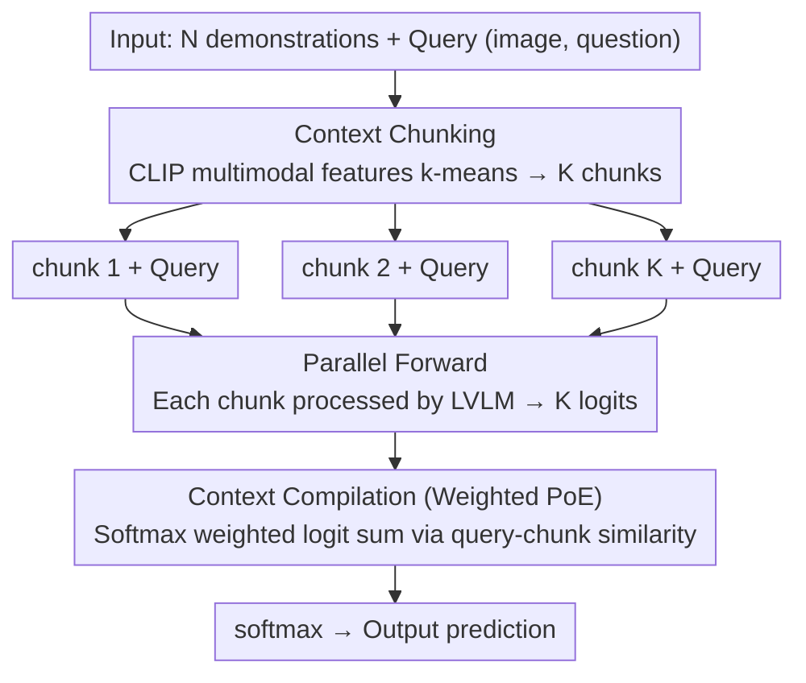

# Parallel In-context Learning for Large Vision Language Models

**Conference**: CVPR 2026 Findings  
**arXiv**: [2603.16092](https://arxiv.org/abs/2603.16092)  
**Code**: None  
**Area**: Multimodal VLM  
**Keywords**: In-context learning, Inference acceleration, Product-of-Experts, Multimodal learning, Context chunking

## TL;DR
Parallel-ICL is proposed to partition long demonstration contexts in multimodal in-context learning into chunks for parallel processing. By integrating these at the logit layer using a weighted Product-of-Experts, the method achieves performance comparable to or exceeding full-context MM-ICL while significantly reducing inference latency.

## Background & Motivation
**Background**: Large Vision-Language Models (LVLMs) utilize MM-ICL to adapt to new tasks through multiple demonstration examples. Performance generally scales with the number of examples.

**Limitations of Prior Work**: The computational cost of attention in Transformers grows quadratically with context length. In LVLMs, where each image requires thousands of visual tokens, increasing the number of demonstrations drastically increases inference latency. For example, 32-shot is approximately 3.5x slower than 8-shot.

**Key Challenge**: A severe trade-off exists between accuracy and inference efficiency: higher performance requires more demonstrations, yet inference speed necessitates shorter contexts.

**Goal**: To efficiently approximate long-context MM-ICL during inference without requiring additional training or datasets.

**Key Insight**: Demonstrations are mutually independent and do not strictly require processing as a single long sequence. They can be partitioned into chunks, processed in parallel, and then ensembled.

**Core Idea**: Long demonstration contexts are divided into multiple short "chunks." After parallel processing, predictions are merged at the logit layer via weighted PoE. The theoretical basis is derived from the diversity-relevance analysis of Fano’s inequality in ensemble learning.

## Method

### Overall Architecture
This paper addresses a hard constraint in MM-ICL: while performance improves with more demonstrations, concatenating dozens of examples into a single long sequence causes the attention overhead to explode quadratically. 32-shot inference is roughly 3.5x slower than 8-shot. The overall strategy of Parallel-ICL is based on the observation that since demonstrations are independent, they do not need to attend to one another in a single sequence. Instead, they are partitioned into several short "chunks," each containing a few examples. These chunks are processed through the forward pass in parallel, and their predictions are integrated at the logit layer using a weighted sum.

Specifically, when $N=32$ and $K=4$, the 32 examples are first clustered into 4 groups based on multimodal features, with each group of roughly 8 examples forming a chunk. These 4 chunks are fed into the model in parallel along with the query, each producing a logit distribution over the vocabulary. Weights are calculated based on the similarity between each chunk and the current query, and the 4 sets of logits are combined via a weighted sum for the final prediction. Consequently, each forward sequence length is only about 8-shot (~21K tokens instead of ~85K for full context), reducing latency from 3.5s to approximately 1.5s while maintaining or improving accuracy. The process requires no parameter updates or changes to the demonstration set. The pipeline is summarized as "Clustering & Chunking → Parallel Forward → Weighted PoE Merging," corresponding to the key designs of Context Chunking and Context Compilation.

### Key Designs

**1. Context Chunking: Using clustering to minimize inter-chunk redundancy**

A naive approach would be random grouping, but this may place similar examples into different chunks, leading to high redundancy and wasted computation. Parallel-ICL utilizes k-means clustering on the multimodal features of each demonstration (concatenated CLIP image and text features). By grouping semantically similar examples into the same chunk, different chunks cover distinct "knowledge subsets," maximizing diversity. This design is grounded in the Fano’s inequality analysis of ensemble learning: the lower bound of ensemble error is positively correlated with the redundancy of member predictions. Minimizing the redundancy term $I_{redun}$ is achieved by maximizing inter-chunk diversity. Ablations confirm that clustering consistently outperforms random chunking in terms of accuracy and diversity.

**2. Context Compilation: Weighted PoE at the logit layer for relevance**

After parallel processing, results must be synthesized. Parallel-ICL employs a weighted Product-of-Experts (PoE) at the logit layer. The final score for each candidate answer $y_i$ is a weighted sum of the logits from each chunk:

$$\hat{l}_\theta(y_i) = \sum_{k=1}^{K} w_k\, l_\theta(y_i \mid C_k, x, t)$$

Weights $w_k$ are not assigned uniformly but are determined by the similarity (softmax-normalized cosine similarity) between the chunk and the query. Chunks more relevant to the current query have a greater influence on the final prediction. This corresponds to the relevance term $I_{relev}$ in Fano analysis: higher correlation between member predictions and the ground truth results in lower ensemble error. PoE is chosen over MoE because it is better suited for the high-dimensional probability distributions of large vocabularies in VLMs and can be implemented efficiently without an auxiliary routing network.

**3. Mechanism: Diversity and relevance determine the ensemble ceiling**

The two designs are derived from a unified theoretical framework. The paper references Theorem 5.1 (Brown & Zhou-Li), decomposing ensemble prediction error into relevance (correlation between members and ground truth) and redundancy (shared information between members). Maintaining low ensemble error requires high relevance for individual chunks and low redundancy between them. Thus, chunking maximizes diversity to reduce redundancy, while compilation uses similarity weighting to enhance relevance.

### Loss & Training
The method is training-free and purely inference-based (plug-and-play), compatible with any LVLM that supports MM-ICL.

## Key Experimental Results

### Main Results

| Method | Token Length | Accuracy | Total Latency (s) |
|------|-----------|--------|-----------|
| Zero-shot | 2,557 | 0.00 | 0.099 |
| MM-ICL (8-shot) | 23,318 | 56.90 | 1.004 |
| MM-ICL (16-shot) | 44,027 | 58.20 | 2.376 |
| MM-ICL (32-shot) | 84,959 | 58.90 | 3.479 |
| Parallel-ICL (32-shot, K=4) | ~21K/chunk | ≈58.90 | ~1.5 |

### Ablation Study

| Configuration | Key Finding |
|------|---------|
| Random chunking vs Clustering | Clustering outperforms random grouping in accuracy and diversity. |
| Uniform vs Similarity weights | Similarity weighting is superior across most benchmarks. |
| Image vs Text vs Multimodal features | Multimodal feature clustering yields the best performance. |
| K=2, 4 vs K=1 (full) at N=32 | K=2, 4 exceeds full-context on some tasks, likely mitigating "lost in the middle." |

### Key Findings
- Parallel-ICL sometimes **outperforms** full-context MM-ICL at $N=32$, potentially by mitigating "lost in the middle" effects.
- Significant inference acceleration: At $K=4$, latency is reduced to roughly 1/3–1/2 of the full-context approach.
- Cross-model generalizability: Validated on LLaVA-OV, Qwen2.5-VL, and InternVL3.5.
- Diversity between chunks correlates positively with final accuracy, validating the theoretical analysis.

## Highlights & Insights
- **Theory-driven Design**: Derived from Fano’s inequality to balance diversity and relevance, implemented via clustering and weighted integration.
- **Plug-and-play Inference**: Requires no additional training, datasets, or model modifications.
- **Unexpected Finding**: Parallel chunking outperforming full context suggests information loss issues in long-context MM-ICL, providing a new perspective for future research.
- **Orthogonality**: Complementary to general acceleration methods like token pruning or KV cache compression.

## Limitations & Future Work
- PoE assumes approximate conditional independence between chunks, which may fail if demonstrations are highly interdependent.
- Clustering requires CLIP feature extraction, introducing a minor preprocessing overhead.
- Performance on generative long-text tasks (e.g., image captioning) is less stable than on discriminative tasks (e.g., VQA).
- The optimal $K$ value varies by task and requires tuning.

## Related Work & Insights
- **vs. Task Vector Methods (Peng et al. / Jiang et al.)**: These require many demonstrations to extract task vectors beforehand and often involve extra optimization. Parallel-ICL maintains the dynamic nature of MM-ICL.
- **vs. VCD / Contrastive Decoding**: While VCD applies subtraction at the logit layer to de-bias, Parallel-ICL uses weighted summation for enhancement; both utilize "logit-level manipulation."

## Supplementary Analysis
- Gains in performance despite identical demonstration sets suggest that full-context MM-ICL faces information processing bottlenecks.
- PoE is preferred over MoE for efficiently handling high-dimensional distributions without extra parameters.
- Feature extraction using CLIP ViT-L/14 introduces negligible latency.
- In MI-Bench-ICL tasks, the latency of Parallel-ICL ($K=4, N=32$) is only about 40% of the full-context baseline.

## Rating
- Novelty: ⭐⭐⭐⭐ Theory-driven parallel chunking is a novel approach for ICL.
- Experimental Thoroughness: ⭐⭐⭐⭐ Validated across multiple models and tasks.
- Writing Quality: ⭐⭐⭐⭐⭐ Clear theoretical analysis and logical flow.
- Value: ⭐⭐⭐⭐ A highly practical inference acceleration method.

<!-- RELATED:START -->

## Related Papers

- [\[CVPR 2026\] PointThinker: Point-Incentivized Parallel Thinking for Multimodal Large Language Model](pointthinker_point-incentivized_parallel_thinking_for_multimodal_large_language_.md)
- [\[CVPR 2026\] Efficient Document Parsing via Parallel Token Prediction](efficient_document_parsing_via_parallel_token_prediction.md)
- [\[CVPR 2026\] HiFICL: High-Fidelity In-Context Learning for Multimodal Tasks](hificl_highfidelity_incontext_learning_for_multimo.md)
- [\[CVPR 2026\] CoVFT: Context-aware Visual Fine-tuning for Multimodal Large Language Models](covft_context-aware_visual_fine-tuning_for_multimodal_large_language_models.md)
- [\[CVPR 2026\] Decouple to Generalize: Context-First Self-Evolving Learning for Data-Scarce Vision-Language Reasoning](decouple_to_generalize_context-first_self-evolving_learning_for_data-scarce_visi.md)

<!-- RELATED:END -->
