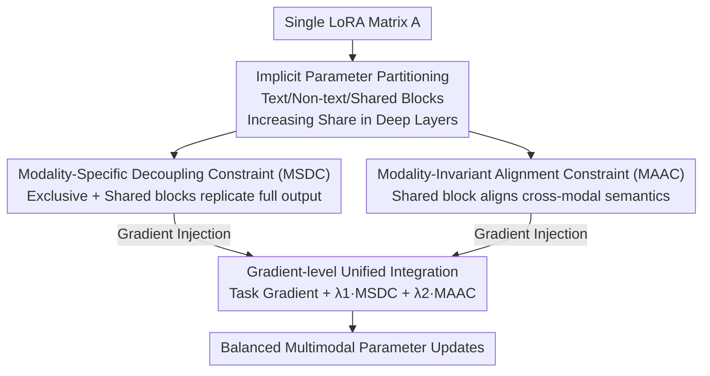

# Parameter-Efficient Adaptation for MLLMs via Implicit Modality Decomposition

**Conference**: CVPR 2026  
**Paper**: [CVF Open Access](https://openaccess.thecvf.com/content/CVPR2026/html/Zhang_Parameter-Efficient_Adaptation_for_MLLMs_via_Implicit_Modality_Decomposition_CVPR_2026_paper.html)  
**Code**: https://github.com/mmffzzz/IMoD.git  
**Area**: Multimodal VLM / LLM Efficiency  
**Keywords**: PEFT, LoRA, Multimodal Large Language Model, Modality Imbalance, Gradient-level Constraint

## TL;DR
To address the imbalance issue where the "text modality excessively dominates parameter updates" when fine-tuning Multimodal Large Language Models (MLLMs) with LoRA, this paper proposes IMoD. It implicitly partitions a single LoRA matrix into text-exclusive, non-text-exclusive, and shared blocks, and guides them via two gradient-level constraints directly injected into backpropagation. This achieves an average improvement of approximately 3.3% across audio-visual-text tasks without adding any trainable parameters or compromising weight mergeability.

## Background & Motivation

**Background**: Scaling pre-trained LLMs into Multimodal Large Language Models (MLLMs) has become the mainstream paradigm—freezing the LLM backbone, attaching modal encoders and lightweight projection layers, and then fine-tuning via PEFT. LoRA is the most widely adopted method due to its minimal parameter overhead, lack of architectural changes, and mergeability into the backbone during inference.

**Limitations of Prior Work**: LoRA was not originally designed for multimodality. Through parameter-level analysis using the Fisher Information Matrix (FIM), the authors found that when training on MUSIC-AVQA, the **Non-Text Dominance Rate** (defined below) drops from an initial level to **14.8%** in the final step. This implies that the updates of the vast majority of trainable parameters are driven by the text modality, while visual/audio signals participate minimally despite being information-rich, causing model predictions to be dominated by text prompts.

**Key Challenge**: LoRA has only a small subset of trainable parameters but must accommodate gradients from all modalities. Since the LLM backbone is pre-trained on massive text data and supervision signals for non-text encoders are relatively limited, gradients from all modalities are forced to compete within the same low-rank matrix, allowing the dominant text modality to consume most of the update budget.

**Goal**: Enable non-text modalities to regain their rightful share of updates while reserving capacity for capturing "modality-invariant semantics," all without sacrificing LoRA’s three key advantages: parameter efficiency, mergeability, and structural simplicity.

**Key Insight**: An apparently direct solution is to assign a LoRA matrix to each modality (explicit modality decomposition, e.g., MokA / Uni-modal LoRA). However, this has three drawbacks: parameters scale linearly with the number of modalities, it cannot be merged back into the backbone after fine-tuning (slowing inference), and there are no dedicated parameters to learn cross-modal shared semantics. The authors inversely reason: can modality decoupling be achieved **within a single matrix**?

**Core Idea**: Replace "explicit multi-matrices" with "implicit partitioning + gradient-level constraints." By softly partitioning text-exclusive, non-text-exclusive, and shared functional zones within a single LoRA matrix and shaping them via gradients of two constraints directly injected into backpropagation, the model achieves both decoupling and alignment with exactly the same parameter count as standard LoRA.

## Method

### Overall Architecture
IMoD (Implicit Modality Decomposition) is built upon standard LoRA. The workflow is as follows: before training, the LoRA $A$ matrix is softly partitioned into text-exclusive, non-text-exclusive, and shared blocks using binary masks based on a predetermined ratio (with higher sharing ratios in deeper layers). During training, the **Modality-Specific Decoupling Constraint (MSDC)** forces each modality to replicate the full-matrix output using only its "exclusive + shared" blocks, thereby isolating modal knowledge. The **Modality-Invariant Alignment Constraint (MAAC)** forces the shared blocks to produce consistent, modality-invariant semantics for different modalities. Finally, these two constraints do not enter the total loss; instead, their respective gradients are calculated and directly injected into the backpropagation of $A$, combined with the task gradient via weighted summation. In this way, "which parameters respond to which modality" is precisely controlled locally, raising the non-text dominance rate from 14.8% to approximately 21.4%.

### Key Designs

**1. Implicit Parameter Partitioning: Softly slicing functional zones within one matrix rather than hard assignment**

To address the issue that "explicit multi-matrices lead to linear parameter expansion and non-mergeability," IMoD adds no new matrices. Instead, for $A\in\mathbb{R}^{r\times d}$, it uses three binary masks $M_t,M_o,M_s\in\{0,1\}^{r\times d}$ for element-wise partitioning: $A=(M_t\odot A)+(M_o\odot A)+(M_s\odot A)$. Elements are assigned with **random interleaving** based on preset ratios (not block-wise). This is a "soft target"—parameters are not strictly forced to respond only to designated modalities; the division of labor is gradually enforced by the two subsequent constraints.

Furthermore, **layer-wise increasing allocation** is used. Leveraging the known property that "lower MLLM layers are more modality-specific and higher layers are more modality-invariant," the sharing ratio increases linearly with layer depth: $r_s^{(l)}=r_s^{(0)}+\alpha\cdot\frac{l}{L}$, with the remainder split between text/non-text exclusives ($r_t^{(l)}+r_o^{(l)}+r_s^{(l)}=1$). This allows shallow layers to focus on modality-specific cues while deep layers transition to shared semantics, creating a naturally hierarchical parameter distribution. Ablations show $\alpha=0.4$ is optimal.

**2. Modality-Specific Decoupling Constraint (MSDC): Making "exclusive parameters" equivalent to the "full matrix" to achieve implicit separation**

This constraint directly targets the interference between knowledge from different modalities. The principle is simple: when processing pure text input, perturbing non-text-exclusive parameters should not significantly affect text output. Specifically, define the text-related parameter subset $A_T=A\odot(M_t+M_s)$. Given text features $X_t$ (non-text tokens zeroed), compute two outputs: $\tilde z_t=A_TX_t$ using only the text-related subset and $z_t=AX_t$ using the full matrix. Consistency is enforced via $L_{TS}=\lVert\tilde z_t-z_t\rVert_2^2$; a symmetric $L_{OS}$ is used for the non-text side. Consequently, for each modality, the behavior of the full parameter matrix is equivalent to activating only modality-related parameters, preserving modality-specific behavior during inference when all parameters are used. Finally, rather than adding these to the total loss, their gradients with respect to $A$ are injected into backpropgation: $G_A^{MSD}=\nabla_AL_{TS}+\nabla_AL_{OS}$.

**3. Modality-Invariant Alignment Constraint (MAAC): Ensuring the shared block produces reliable modality-invariant semantics**

While MSDC ensures exclusive blocks mind their own business, it does not guarantee that the shared block learns cross-modally consistent semantics; MAAC fills this gap. Given text/non-text tokens, shared representations are $s_t=(A\odot M_s)X_t$ and $s_o=(A\odot M_s)X_o$, with sequence means $\bar s_t,\bar s_o$ serving as sentence-level semantics. However, means can be unreliable—for long or semantically divergent sequences, the mean might not be a good semantic center. Thus, a **concentration coefficient** is introduced: $c_t=\frac1L\sum_i\cos(s_{t,i},\bar s_t)$ (analogous for $c_o$), measuring the average cosine similarity of token embeddings relative to the mean. A higher value indicates the mean better represents the overall semantics. The alignment term is weighted by concentration: $L_{MA}=1-(c_t+c_o)\cdot\cos(\bar s_t,\bar s_o)$, emphasizing alignment for sequences with reliable semantics. Only gradients are injected: $G_A^{MA}=\nabla_AL_{MA}$. ⚠️ Note: In the original paper Eq. (7), the shared mask dimension is labeled as $M_s\in\{0,1\}^{d\times k}$, which is inconsistent with Eq. (1)’s $r\times d$; this is likely a typo.

**4. Gradient-level Unified Integration: Replacing loss summation with gradient injection to preserve fine-grained local correction signals**

Why integrate at the gradient level instead of adding the two constraints as losses to the total objective? The authors' core argument is that constraints are designed to "guide the behavior of each parameter within its designated partition." If merged into a global loss, these fine-grained per-parameter correction signals are diluted. The unified update rule is written as $G_A=\nabla_AL_{Task}+\lambda_1\cdot G_A^{MSD}+\lambda_2\cdot G_A^{MA}$, allowing decoupling and alignment to act precisely where they are needed for more stable and accurate optimization. Ablations indicate $\lambda_1=1,\lambda_2=1\times10^{-4}$ are optimal and performance remains stable over a wide range.

### Custom Metric Definition
- **Non-Text Dominance Rate $R_{Non\text{-}Text}$**: The proportion of parameters dominated by the non-text modality, $R_{Non\text{-}Text}=|\{(i,j)\mid \text{FIM}_{Non\text{-}Text}[i,j]>\text{FIM}_{Text}[i,j]\}|/|W|$. Here, FIM is the Fisher Information Matrix, and $\text{FIM}_{Text}[i,j]$ measures the extent to which the text modality drives the update of parameter $W[i,j]$. In standard LoRA, this rate drops to 14.8% by the end of training (severe imbalance); IMoD improves it to approximately 21.4%.

## Key Experimental Results

### Main Results
Two-stage training (cross-modal pre-alignment + instruction tuning, LLM backbone frozen throughout), covering audio-visual-text, visual-text, and audio-text configurations. Comparisons include standard LoRA and variants like LoRAMoE, DoRA, HydraLoRA, Uni-modal LoRA, and MokA. "#A/#B" denotes the number of LoRA adaptation matrices required to train N modalities; "Inf. Merge" indicates whether merging into the backbone is possible.

Audio-visual-text scenario (MUSIC-AVQA / AVE, Accuracy):

| Backbone | Method | MUSIC-AVQA | AVE | #A | #B | Inf.Merge |
|------|------|-----------|-----|----|----|-----------|
| LLaMA2 | LoRA | 73.41 | 69.84 | 1 | 1 | ✓ |
| LLaMA2 | MokA | 75.71 | 74.68 | N | 1 | ✗ |
| LLaMA2 | **IMoD** | **77.31** | **75.77** | 1 | 1 | ✓ |
| Qwen2.5-VL | LoRA | 73.00 | 71.38 | 1 | 1 | ✓ |
| Qwen2.5-VL | **IMoD** | **75.71** | **74.38** | 1 | 1 | ✓ |
| Qwen3 | LoRA | 78.57 | 74.17 | 1 | 1 | ✓ |
| Qwen3 | **IMoD** | **80.13** | **76.94** | 1 | 1 | ✓ |

Visual-text scenario (LLaMA2 backbone):

| Method | MMEpercep | MMBench | POPE | SEED-Bench | Inf.Merge |
|------|-----------|---------|------|-----------|-----------|
| LoRA | 908.52 | 50.64 | 70.28 | 39.71 | ✓ |
| MokA | 1025.86 | 52.74 | 74.23 | 40.45 | ✗ |
| **IMoD** | **1032.68** | **53.35** | **75.60** | **41.83** | ✓ |

Key takeaway: IMoD achieves accuracy comparable to or higher than the explicit decomposition method MokA, while being the only method in the table that **maintains single-matrix parameter efficiency (#A=#B=1) and mergeability**. It also leads LoRA across the board in audio-text scenarios (MMAU/AIR-Bench).

### Ablation Study
LLaMA2 backbone, MUSIC-AVQA / AVE:

| Configuration | MUSIC-AVQA | AVE | Description |
|------|-----------|-----|------|
| Baseline (None) | 73.41 | 69.84 | Equivalent to standard LoRA |
| MSDC only | 75.98 | 74.33 | Decoupling constraint is effective alone |
| MAAC only | 75.47 | 73.13 | Alignment constraint is effective alone |
| MSDC + MAAC | 76.91 | 75.22 | Both are complementary |
| MSDC + MAAC + Layer-wise | **77.31** | **75.77** | Full model |

### Key Findings
- **Constraints are complementary and individually effective**: MSDC alone is stronger than MAAC alone (indicating "separating modalities first" contributes more), but the combination with layer-wise increasing allocation yields the highest gains.
- **Layer-wise allocation provides incremental gains**: Partitioning the matrix equally without increasing the shared ratio in deeper layers leads to performance drops, suggesting that shared capacity in deep layers favors cross-modal alignment; $\alpha=0.4$ is optimal.
- **Hyperparameter robustness**: $\lambda_1=1, \lambda_2=10^{-4}$ are optimal, but performance is stable over a wide range, eliminating the need for delicate tuning.

## Highlights & Insights
- **"Implicit partitioning + soft targets" is elegant**: Rather than hard assignment, it uses a one-time random interleaved mask to set a soft target and lets constraints drive the labor division. This preserves LoRA’s flexibility while achieving modality decoupling without increasing parameters.
- **Gradient-level injection instead of loss summation** is a transferable trick: When a regularization is "per-parameter local guidance" in nature, injecting it as a gradient directly into backpropagation preserves fine-grained signals better than a global loss—a concept applicable to other PEFT scenarios requiring precise parameter control.
- **Quantifying modality dominance with FIM** provides a measurable metric (Non-Text Dominance Rate) for the "text dominance" phenomenon, which is often only discussed qualitatively, turning "imbalance" into an optimizable target.

## Limitations & Future Work
- Partitioning ratios, the layer-wise growth rate $\alpha$, and the two $\lambda$ factors are preset hyperparameters. While stable, whether this soft partitioning is optimal across more modalities/tasks is not fully verified.
- Masks are **randomly interleaved** once before training; the potential for adaptive partitioning (e.g., dynamic adjustment based on FIM) remains unexplored.
- Evaluations focus on QA/classification benchmarks; effectiveness on more complex tasks like generation or long-sequence multimodal reasoning needs further validation.
- The Non-Text Dominance Rate improved from 14.8% to ~21.4%, which is still far from "balanced" (50%), indicating that imbalance is mitigated rather than cured.

## Related Work & Insights
- **vs. Standard LoRA**: Standard LoRA uses a single shared matrix for all modal gradients, leading to text dominance and non-text under-learning. IMoD implicitly decouples three blocks within the same matrix and uses gradient-level control, keeping parameters identical but modalities more balanced.
- **vs. Explicit Modality Decomposition (MokA / Uni-modal LoRA)**: These assign separate matrices per modality, enabling decoupling but scaling parameters linearly, preventing merging, and lacking shared semantic capacity. IMoD achieves decoupling + alignment within a single matrix, preserving parameter efficiency and mergeability while learning modality-invariant semantics.
- **vs. Other Imbalance Mitigation Methods**: Prior works often focus on alignment learning speeds or adjusting data streams/sampling without inspecting or controlling how modality-specific updates are distributed across trainable parameters. IMoD addresses this directly at the parameter level, which is particularly suitable for parameter-scarce scenarios like low-rank PEFT.

## Rating
- Novelty: ⭐⭐⭐⭐ "Implicit partitioning + gradient-level constraints" achieves decoupling and alignment in a single matrix; novel and practical, though an incremental refinement within the LoRA framework.
- Experimental Thoroughness: ⭐⭐⭐⭐ Covers audio-visual-text, visual-text, and audio-text configurations with multiple backbones; includes main results, ablations, and hyperparameter analysis.
- Writing Quality: ⭐⭐⭐⭐ Motivation empirically supported by FIM; method is clearly presented step-by-step; minor typos in individual formula dimensions.
- Value: ⭐⭐⭐⭐ Zero extra parameters, mergeable, and plug-and-play mitigation of modality imbalance; directly valuable for MLLM fine-tuning.

<!-- RELATED:START -->

## Related Papers

- [\[CVPR 2026\] Harmonious Parameter Adaptation in Continual Visual Instruction Tuning for Safety-Aligned MLLMs](harmonious_parameter_adaptation_in_continual_visual_instruction_tuning_for_safet.md)
- [\[CVPR 2026\] FairLLaVA: Fairness-Aware Parameter-Efficient Fine-Tuning for Large Vision-Language Models](fairllava_fairness-aware_parameter-efficient_fine-tuning_for_large_vision-langua.md)
- [\[CVPR 2026\] Decoupled and Reusable Adaptation for Efficient Cross-Modal Transfer](decoupled_and_reusable_adaptation_for_efficient_cross-modal_transfer.md)
- [\[NeurIPS 2025\] RobustMerge: Parameter-Efficient Model Merging for MLLMs with Direction Robustness](../../NeurIPS2025/multimodal_vlm/robustmerge_parameter-efficient_model_merging_for_mllms_with_direction_robustnes.md)
- [\[ICLR 2026\] MoRA: Missing Modality Low-Rank Adaptation for Visual Recognition](../../ICLR2026/multimodal_vlm/mora_missing_modality_low-rank_adaptation_for_visual_recognition.md)

<!-- RELATED:END -->
