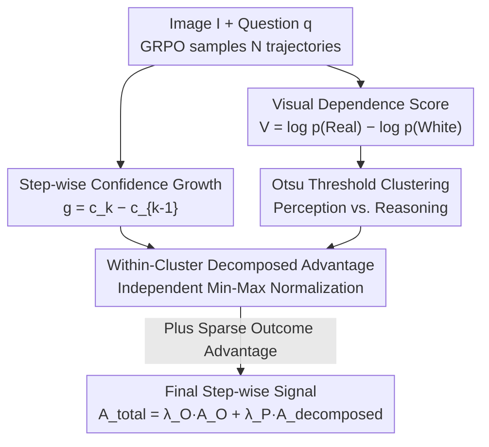

# PDCR: Perception-Decomposed Confidence Reward for Vision-Language Reasoning

**Conference**: CVPR 2026  
**arXiv**: [2605.13467](https://arxiv.org/abs/2605.13467)  
**Code**: https://github.com/hee-suk-yoon/PDCR  
**Area**: Multimodal VLM / Alignment RLHF  
**Keywords**: Vision-Language Reasoning, RLVR, Process Reward, Confidence Growth, Skill Decomposition

## TL;DR
Addressing the issue where directly migrating "confidence growth process rewards" from the language domain to vision-language reasoning fails because sparse visual perception steps are overwhelmed by the statistics of dense textual reasoning steps (mixture-induced signal degradation). PDCR uses a model-internal Visual Dependence Score combined with an Otsu threshold to cluster steps into "perception" and "reasoning" in an unsupervised manner. Advantages are then calculated via independent min-max normalization within each cluster, providing sparse visual steps with correctly scaled reward signals. This approach consistently outperforms GRPO/DAPO/PACR across 7 V-L reasoning benchmarks.

## Background & Motivation
**Background**: Reinforcement Learning with Verifiable Rewards (RLVR) is the dominant path for improving multi-step reasoning in VLMs. However, standard practices (like GRPO) only provide a sparse outcome reward—$+1$ for a correct final answer and $0$ otherwise. This signal offers no guidance for intermediate steps, causing severe credit assignment problems. To mitigate this sparsity, one path is training external Process Reward Models (PRMs), which are expensive and data-hungry. A more efficient alternative from the language domain (PACR) uses the model's own "confidence growth" (log-probability of the correct answer) across reasoning steps as a dense process reward, requiring no external models.

**Limitations of Prior Work**: PACR is effective in pure-text reasoning, but the authors find that migrating it "as-is" to vision-language reasoning is suboptimal. V-L reasoning is not a homogeneous process but a mixture of two heterogeneous skills: ① **Visual Perception Steps** (extracting evidence from images, e.g., "A person is standing at the counter operating a POS terminal")—sparse but critical; ② **Textual Reasoning Steps** (logic/calculation based on existing facts)—dense and dominant. Empirical measurements show perception steps account for ~30% (31.4%) while reasoning steps account for ~70% (68.6%), with distinctly different attention patterns.

**Key Challenge**: The process advantage in PACR is calculated by performing min-max normalization on discounted returns within a **single global pool** (Equation 5). When this pool is dominated by textual steps, the global min/max becomes unrepresentative of the sparse perception steps. Consequently, the advantage distribution for perception steps is compressed and misaligned, preventing critical "visual" actions from receiving proportional credit. The authors term this **mixture-induced signal degradation**.

**Core Idea**: Adapt the reward structure to match the task's heterogeneous nature—first partition steps into perception and reasoning clusters unsupervised, then calculate advantages via independent normalization **within each cluster** instead of a global pool. This ensures perception steps are only compared with their peers, receiving stable and correctly scaled signals.

## Method

### Overall Architecture
PDCR is built on top of standard GRPO: for an image $\mathbf{I}$ and a question $\mathbf{q}$, the old policy samples $N$ reasoning trajectories, each split into steps $\{h_k^{(i)}\}$, with a sparse outcome reward $R^{(i)}$ at the end. PDCR adds a parallel dense process reward path:

- **Process Reward Path**: Following PACR, it calculates the model's confidence $c_k^{(i)}=\log\pi_\theta(Y_{gt}\mid\mathbf{I},\mathbf{q},H_{\le k}^{(i)})$ in the correct answer $Y_{gt}$ step-by-step. The confidence gain $g_k^{(i)}=c_k^{(i)}-c_{k-1}^{(i)}$ is accumulated into discounted returns $G_k^{(i)}=\sum_{m\ge k}\gamma^{m-k}g_m^{(i)}$.
- **Unsupervised Skill Decomposition Path**: For each step, it calculates a Visual Dependence Score $V_k^{(i)}$ (log-likelihood ratio of the real image vs. a white image). Otsu's method is used to find an optimal threshold $c^*$ to cluster all steps into a visual perception cluster $\mathcal{I}_{\text{visual}}$ and a textual reasoning cluster $\mathcal{I}_{\text{textual}}$.
- **Mechanism (Decomposed Advantage)**: The returns $G_k^{(i)}$ are placed into their **corresponding clusters** for min-max normalization, yielding a decomposed process advantage $A_{\text{decomposed},k}^{(i)}$. This is finally combined with the sparse outcome advantage $A_O^{(i)}$ for training.

### Key Designs

**1. Visual Dependence Score: Quantifying image dependency via "Real vs. White" log-likelihood ratio**

To categorize steps during training without manual labels, PDCR uses a model-internal signal: for step $h_k^{(i)}$, it calculates the log-probability under the **real image** $\mathbf{I}$ and a **pure white placeholder image** $\mathbf{I}_{\text{white}}$. The difference is the visual dependence score:

$$V_k^{(i)} = \underbrace{\log\pi_\theta(h_k^{(i)}\mid\mathbf{I},\mathbf{q},H_{<k}^{(i)})}_{p_k^{(i)}} - \underbrace{\log\pi_\theta(h_k^{(i)}\mid\mathbf{I}_{\text{white}},\mathbf{q},H_{<k}^{(i)})}_{p_{w,k}^{(i)}}$$

The intuition is straightforward: if the probability drops significantly when the image is replaced by white ($V$ is large), the step relies heavily on visual evidence (perception). If $V \approx 0$, the step is primarily driven by preceding text (reasoning).

**2. Otsu Dynamic Thresholding: Parameter-free binary clustering**

Instead of a sensitive Top-K approach, PDCR applies the classic **Otsu's method** from image segmentation. After sorting all $M$ scores, it iterates through split points $k$ to minimize the **Sum of Squared Errors (SSE)** within clusters $C_1, C_2$:

$$SSE(k)=\sum_{i=1}^{k}(v_i-\mu_1(k))^2+\sum_{i=k+1}^{M}(v_i-\mu_2(k))^2,\quad k^*=\arg\min_k SSE(k)$$

The optimal threshold $c^*=v_{k^*}$ adaptively separates the step set into $\mathcal{I}_{\text{visual}}$ and $\mathcal{I}_{\text{textual}}$ based on each batch's distribution, achieving 76.2% classification accuracy.

**3. Within-cluster Decomposed Advantage: Curing signal degradation**

PDCR calculates min-max normalization independently within clusters. For a visual step:

$$A_{V,k}^{(i)}=\frac{G_k^{(i)}-\min_{(j,k')\in\mathcal{I}_{\text{visual}}}G_{k'}^{(j)}}{\max_{(j,k')\in\mathcal{I}_{\text{visual}}}G_{k'}^{(j)}-\min_{(j,k')\in\mathcal{I}_{\text{visual}}}G_{k'}^{(j)}}$$

The same logic applies to textual steps $A_{T,k}^{(i)}$ using $\mathcal{I}_{\text{textual}}$. This ensures perception rewards are stable and correctly scaled, as they are no longer "diluted" by reasoning steps.

### Loss & Training
The final total step-wise advantage is:

$$A_{total,k}^{(i)}=\lambda_O A_O^{(i)}+\lambda_P A_{\text{decomposed},k}^{(i)},\quad A_{\text{decomposed},k}^{(i)}=\begin{cases}A_{V,k}^{(i)},&(i,k)\in\mathcal{I}_{\text{visual}}\\ A_{T,k}^{(i)},&(i,k)\in\mathcal{I}_{\text{textual}}\end{cases}$$

Training is conducted using Qwen2.5-VL-3B/7B-Instruct on the Vision-SR1 dataset (~47K samples).

## Key Experimental Results

### Main Results
Average accuracy across 7 V-L reasoning benchmarks:

| Backbone | Method | Avg. Accuracy | Note |
|----------|------|-----------|------|
| Qwen2.5-VL-3B | Zero-shot | 36.3 | Untrained baseline |
| Qwen2.5-VL-3B | GRPO | 43.6 | Sparse outcome reward |
| Qwen2.5-VL-3B | DAPO | 44.1 | Dynamic sampling |
| Qwen2.5-VL-3B | PACR | 44.4 | Global dense reward |
| Qwen2.5-VL-3B | **PDCR (Ours)** | **45.2** | Decomposed, highest |
| Qwen2.5-VL-7B | Zero-shot | 41.4 | Untrained baseline |
| Qwen2.5-VL-7B | GRPO | 51.5 | — |
| Qwen2.5-VL-7B | DAPO | 52.0 | — |
| Qwen2.5-VL-7B | PACR | 52.2 | Runner-up |
| Qwen2.5-VL-7B | **PDCR (Ours)** | **52.9** | Highest |

### Ablation Study
**Random Decomposition** (keeping within-cluster normalization but assigning steps **randomly** to clusters):

| Backbone | Config | Avg. Accuracy | Note |
|----------|------|-----------|------|
| Qwen2.5-VL-3B | PDCR (Ours) | 45.2 | Full model |
| Qwen2.5-VL-3B | → Random Decomposition | 44.1 | Drops 1.1 |
| Qwen2.5-VL-7B | PDCR (Ours) | 52.9 | Full model |
| Qwen2.5-VL-7B | → Random Decomposition | 52.3 | Drops 0.6 |

Random decomposition performs similarly to PACR, proving that the gain comes from **accurately identifying and separating** heterogeneous skills.

### Key Findings
- **Decomposition is the true driver**: Random clustering fails, highlighting that the data-driven partition via Visual Dependence Score is the source of the gain.
- **Concise Reasoning**: Both PACR and PDCR learn to generate more refined and shorter reasoning chains, improving inference efficiency.
- **Otsu vs. Top-K**: The dynamic thresholding (76.2% accuracy) significantly outperforms Top-K (67.5% peak) and removes the need for hyperparameter tuning.

## Highlights & Insights
- **"White Image Contrast" as a Minimalist Probe**: A simple likelihood ratio accurately quantifies visual dependency without external models or captions.
- **Statistical Baseline Alignment**: The primary insight is that the "reference group" for advantage normalization must align with the task structure. PDCR doesn't change the signal itself but fixes its statistical baseline.

## Limitations & Future Work
- **Binary Softness**: The perception/reasoning split is "hard"; mixed steps might be misclassified.
- **Counterfactual Baseline**: Whether a white image is the optimal null condition for all tasks remains to be fully explored.
- **Training Overhead**: The extra forward pass for the white image adds cost, though it is partially offset by shorter generated trajectories.

## Related Work & Insights
- **vs. PACR**: PACR uses a **global pool** for normalization; PDCR identifies the resulting signal degradation in V-L tasks and introduces **within-cluster normalization**.
- **vs. PRMs**: PDCR avoids the cost and misalignment of external reward models by using internal signals (confidence + visual dependency).
- **vs. DAPO**: While both address vanishing advantages, PDCR provides higher quality signals by acknowledging perception/reasoning heterogeneity.

## Rating
- Novelty: ⭐⭐⭐⭐ The diagnosis of "mixture-induced signal degradation" and the use of Otsu for reward decomposition is very clever.
- Experimental Thoroughness: ⭐⭐⭐⭐ Broad coverage across benchmarks; however, absolute gains are relatively modest.
- Writing Quality: ⭐⭐⭐⭐⭐ Excellent logical flow from problem diagnosis to solution.
- Value: ⭐⭐⭐⭐ A lightweight, plug-and-play improvement for V-L RLVR.

<!-- RELATED:START -->

## Related Papers

- [\[CVPR 2026\] Linking Perception, Confidence and Accuracy in MLLMs](linking_perception_confidence_and_accuracy_in_mllms.md)
- [\[ICML 2026\] Decomposed On-Policy Distillation for Vision-Language Reasoning: Steering Gradients for Visual Grounding](../../ICML2026/multimodal_vlm/decomposed_on-policy_distillation_for_vision-language_reasoning_steering_gradien.md)
- [\[CVPR 2026\] Perception Programs: Unlocking Visual Tool Reasoning in Language Models](perception_programs_visual_tool_reasoning.md)
- [\[CVPR 2026\] CICA: Coupling Confidence-Aware Pretraining with Confidence-Informed Attention for Robust Multimodal Sentiment Analysis](cica_coupling_confidence-aware_pretraining_with_confidence-informed_attention_fo.md)
- [\[CVPR 2026\] Hierarchical Process Reward Models are Symbolic Vision Learners](hierarchical_process_reward_models_are_symbolic_vision_learners.md)

<!-- RELATED:END -->
