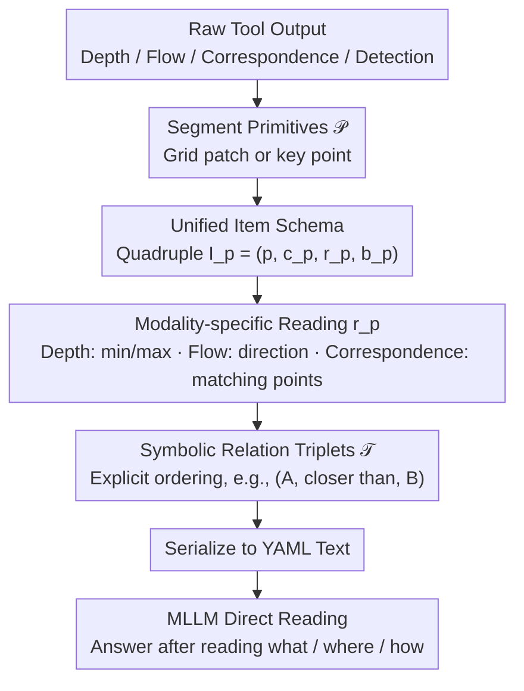

# Perception Programs: Unlocking Visual Tool Reasoning in Language Models

**Conference**: CVPR 2026  
**arXiv**: [2604.12896](https://arxiv.org/abs/2604.12896)  
**Code**: [https://github.com/AISmartPerception/perception-programs](https://github.com/AISmartPerception/perception-programs)  
**Area**: LLM/NLP  
**Keywords**: Perception Programs, Visual Tools, Language-Native Representation, Training-Free, Multimodal Reasoning

## TL;DR

Perception Programs (P2) is proposed as a training-free and model-agnostic method that converts raw outputs from visual tools (depth, optical flow, correspondence, etc.) into compact, language-native structured summaries. This enables MLLMs to directly "read" visual modalities instead of inferring from dense pixels, achieving an average improvement of 19.66% across six BLINK tasks.

## Background & Motivation

**Background**: MLLMs are increasingly integrated with visual tools (depth estimation, optical flow, visual correspondence, etc.) to enhance visual reasoning capabilities.

**Limitations of Prior Work**: Although visual tools provide accurate perceptual signals, MLLMs often fail to fully utilize them. Raw tool outputs are dense, pixel-level representations that do not match the language-native reasoning capabilities of LLMs. Experiments show that GPT-5 Mini cannot even recover correct depth ordering from depth maps (Kendall $\tau$ quickly approaches zero).

**Key Challenge**: The bottleneck lies not in the number of tool calls or MLLM size, but in the representation of visual tool outputs. There is a fundamental mismatch between dense numerical tokens and the linguistic reasoning substrate.

**Goal**: Convert tool outputs from dense pixel-level representations into language-native structured summaries.

**Key Insight**: The way humans extract cues from visual information varies by data type (e.g., focusing on distance for depth, direction for optical flow). Converting key information into text reduces the model's burden of processing pixel details.

**Core Idea**: P2 standardizes what is communicated by the tool (what), its spatial location (where), and the relationships between parts (how), allowing any MLLM to parse and reason directly.

## Method

### Overall Architecture

P2 addresses a specific problem: results calculated by visual tools (depth, optical flow, correspondence, etc.) are dense pixel-level values that MLLMs struggle to interpret. While MLLMs are proficient at reading text, they are poor at "seeing" numerical arrays in a depth map. P2 inserts a "translation" layer between tools and MLLMs to rewrite pixel outputs into structured summaries in the LLM's native language.

The pipeline functions as follows: after obtaining raw tool output, the pixel domain is first segmented into a finite set of primitives (grid patches or key points). For each primitive, a structured item $I_p = (p, c_p, r_p, b_p)$ is extracted, representing the primitive ID, normalized coordinates, the value read from the modality, and an optional semantic label, respectively. Subsequently, a set of sparse symbolic relation triplets $\mathcal{T}$ is generated between primitives (e.g., "A is closer than B"). Finally, all items and relations are serialized into a YAML text block and inserted directly into the MLLM input. The model no longer needs to guess from pixels but reads a list of what / where / how. The entire process is completed at inference time without modifying model parameters.

### Key Designs

**1. Unified Item Schema: Generalizing the structure across modalities**

Outputs from various visual tools vary significantly (depth is a scalar field, optical flow is a vector field, correspondence consists of point pairs). Designing a separate reading method for each would tie the method to specific tools. P2 unifies depth, optical flow, correspondence, and detection into the same quadruple $I_p = (p, c_p, r_p, b_p)$: $p$ is the primitive ID, $c_p$ represents spatial coordinates normalized to $[0,1000]^2$ (unifying the coordinate system across resolutions), $r_p$ is the value read from the modality, and $b_p$ is an optional semantic label. The only variations between modalities are how $r_p$ is constructed and whether relation triplets are included. This unified backbone allows new tools to be integrated by simply defining the $r_p$ logic.

**2. Modality-specific Reading: Retaining essential reasoning cues**

Key information varies by modality; humans look for distance in depth and direction in optical flow. Thus, $r_p$ is tailored for each modality. In depth modality, each grid cell stores minimum and maximum depth $r_p = [\min D, \max D]$, and relation triplets like "closer than / farther than" are generated between adjacent cells to explicitly document spatial ordering. Optical flow encodes movement direction and magnitude; correspondence encodes matching point locations and confidence; detection encodes object classes and bounding boxes. This converts "implicit relations in pixels" into explicit text, so MLLMs do not have to reconstruct order from numbers.

**3. Training-free & Model-agnostic: Changing representation without modifying models**

P2 is a pure inference-time representation conversion module requiring no parameter updates, architectural changes, or extra tool calls. It is embedded directly into standard tool-use pipelines. The same tool output, once converted to a P2 summary, is consumed by the MLLM with minimal text processing overhead. This allows any existing MLLM (closed-source APIs or open-source small models) to be used plug-and-play. Since it does not rely on training, it can be stacked onto existing agent tool-use methods for further gains.

### Example: Translating a Depth Map to YAML

Consider the task "judge which object in the image is closer." A depth tool outputs a dense depth map, which P2 segments into an $8\times8$ grid. For each cell, $r_p = [\min D, \max D]$ is calculated, resulting in an item like `{p: c34, c: [375, 500], r: [2.1, 2.8]}`—located in the center of the normalized space with a depth of approximately 2-3 meters. Nearby cells are then compared to generate relation triplets like `(c34, closer_than, c52)`. Finally, dozens of items and relations are packed into a YAML block. The MLLM reads a detailed list of "what is where and what is closer" instead of a pixel array.

### Loss & Training

P2 does not involve any training. It is a pure inference-time representation conversion with no training objectives or hyperparameters.

## Key Experimental Results

### Main Results

| Model | Task | Baseline | +Raw Tool | +Ours |
|------|------|------|---------|-----|
| GPT-5 Mini | Multi-view Reasoning | 41.4% | 52.8% | **86.5%** |
| GPT-5 Mini | Relative Depth | 52.4% | 61.2% | **81.5%** |
| GPT-5 Mini | Visual Correspondence | 38.7% | 45.3% | **72.1%** |
| InternVL3.5-4B | Avg. 6 Tasks | 42.1% | 48.5% | **70.3%** |
| Qwen3VL-4B | Avg. 6 Tasks | 43.5% | 49.2% | **71.8%** |

### Ablation Study

| Configuration | BLINK Avg. 6 Tasks | Description |
|------|---------------|------|
| Full P2 | 86.5% | Items + Relations |
| Items Only | 78.2% | No neighborhood relations |
| Coarse Grid (4×4) | 82.1% | Reduced resolution |
| Fine Grid (12×12) | 85.8% | Higher resolution |
| Raw Tool Output | 52.8% | Pixel-level representation |

### Key Findings

- P2 improves GPT-5 Mini's accuracy on multi-view reasoning from 41.4% to 86.5% (+45 percentage points), a significant effect.
- Even on 4B-scale small models, it provides an absolute improvement of 21-25%.
- P2 enhances existing agent tool-use methods: providing an additional 18.28% improvement on depth and localization tasks.

## Highlights & Insights

- Deep core insight: The bottleneck in visual reasoning is not tool accuracy but the representation method. MLLMs can "read" text but cannot effectively "see" dense numerical values.
- The design of P2 reflects the principle of "letting machines do what they are good at": using visual tools for perceptual signals and LLMs for linguistic reasoning.
- Being training-free and model-agnostic gives it extremely high practical utility.

## Limitations & Future Work

- Grid partition granularity needs adjustment based on the specific task.
- For tasks requiring precise pixel-level information (e.g., fine segmentation boundaries), spatial discretization in P2 may cause information loss.
- Extension to the temporal dimension of video has not been evaluated.
- Exploration of adaptive granularity and dynamic relation generation is possible.

## Related Work & Insights

- **vs VisProg/ViperGPT**: These methods generate programs to call tools but still operate on tool outputs at the pixel level; P2 changes the representation of the tool output itself.
- **vs Aurora/Mirage**: These methods use training to improve tool usage, whereas P2 achieves greater improvements without requiring training.

## Rating

- Novelty: ⭐⭐⭐⭐⭐ The insight that "representation is the bottleneck" reframes the problem.
- Experimental Thoroughness: ⭐⭐⭐⭐⭐ Comprehensive validation across multiple models and tasks with striking results.
- Writing Quality: ⭐⭐⭐⭐⭐ Clear motivation, analysis, and experiments.
- Value: ⭐⭐⭐⭐⭐ Provides significant inspiration for the MLLM tool-use paradigm.

<!-- RELATED:START -->

## Related Papers

- [\[CVPR 2026\] Don't Show Pixels, Show Cues: Unlocking Visual Tool Reasoning in Language Models via Perception Programs](dont_show_pixels_show_cues_unlocking_visual_tool_reasoning_in_language_models_vi.md)
- [\[CVPR 2026\] Proof-of-Perception: Certified Tool-Using Multimodal Reasoning with Compositional Conformal Guarantees](pop_proof_of_perception_conformal_reasoning.md)
- [\[CVPR 2026\] Synthesizing Visual Concepts as Vision-Language Programs](synthesizing_visual_concepts_as_vision-language_programs.md)
- [\[CVPR 2026\] Abstract 3D Perception for Spatial Intelligence in Vision-Language Models](abstract_3d_perception_for_spatial_intelligence_in_vision-language_models.md)
- [\[CVPR 2026\] Visual Reasoning through Tool-supervised Reinforcement Learning](visual_reasoning_through_tool-supervised_reinforcement_learning.md)

<!-- RELATED:END -->
