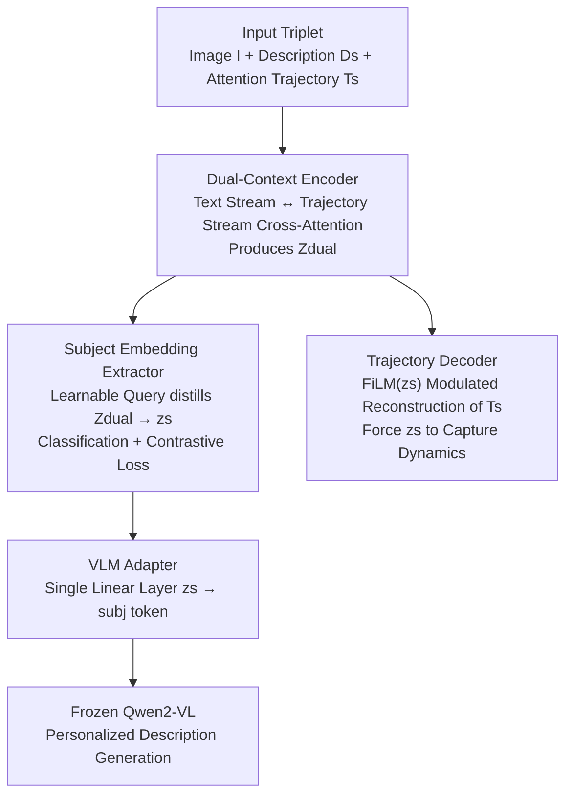

# Personalized Image Descriptions from Attention Sequences

**Conference**: CVPR 2026  
**Paper**: [CVF Open Access](https://openaccess.thecvf.com/content/CVPR2026/html/Xue_Personalized_Image_Descriptions_from_Attention_Sequences_CVPR_2026_paper.html)  
**Code**: https://github.com/cvlab-stonybrook/Personalized-Image-Description  
**Area**: Multimodal VLM  
**Keywords**: Personalized Image Captioning, Human Attention Trajectories, Subject Embedding, Few-shot Personalization, Frozen VLM

## TL;DR
DEPER is the first to treat "how an individual views an image" (attention scanpath trajectories) as a personalization signal. It distills a cross-image stable subject embedding and injects it into a frozen Qwen2-VL via a lightweight adapter. This allows the model to generate personalized descriptions without requiring gaze data at test time or per-person fine-tuning, achieving an average improvement of approximately 24% across four datasets.

## Background & Motivation
**Background**: The goal of personalized image captioning is to make generation "depend on who is describing" rather than just "what is in the image." Starting from CSMN, the mainstream approach has been to use TF–IDF statistics of high-frequency words in a user’s historical posts, treating "most frequently used words" as a person's characterization. Subsequent works (MHTN, UMCap, etc.) changed architectures or added long-short term memory, but the core of personalization remained "high-frequency word usage." Another line of work involves style-controlled captioning, using explicit text labels like "sweet" or "dramatic" for conditional generation.

**Limitations of Prior Work**: These methods focus exclusively on **linguistic style**—which words and what tone to use—while completely ignoring **how a person looks at an image**. Cognitive science has long indicated that each individual's visual attention patterns are stable and unique: some scan large objects first before jumping to others, while some examine items one by one; some prefer the background, while others focus on foreground figures. These "sequences of looking, where to look, and for how long" directly determine "what to say first, in what detail, and which objects to mention." Discarding attention loses half of the personalization landscape. While other works (attention-controlled captioning) utilize fixation signals, they treat attention as a **per-image, group-level** conditional input, requiring live gaze data during testing, which fails to generalize as a "stable cross-image preference for an individual" and is impractical for large-scale deployment.

**Key Challenge**: Human attention represents a **noisy, continuous, and behaviorally diverse** signal that is strongly dependent on image content—a trajectory contains both "the individual's inherent looking habits" and "the image's layout that forces attention." Decoupling **stable personal traits** from **image-specific content cues** is inherently difficult. Compounding this is a second challenge: image description models are usually parameter-heavy, making them highly prone to overfitting when fine-tuned on only a few samples for new users.

**Goal**: (1) Learn a subject representation that is consistent across images and discriminative between individuals, encoding both attention habits and linguistic style; (2) Enable this representation to transfer to new users in a few-shot manner without retraining; (3) Remove dependence on gaze data during inference.

**Core Idea**: Summarized in one sentence—**"By understanding how a person looks at an image, one can predict how they will describe it."** A (image, description, attention trajectory) triplet is fed into a persona encoder to distill a content-agnostic subject embedding $z_s$, which is then inserted into the prompt space of a frozen VLM using a `<subj>` token and a lightweight adapter.

## Method

### Overall Architecture
The core output of DEPER (DEscription-PERception persona encoder) is a subject embedding $z_s$: a vector compressing "how someone views and describes an image," required to remain consistent for the same person across images and discriminative between different people. The pipeline consists of two stages: the first half (DEPER network) extracts $z_s$ from the triplet $(I, D_s, T_s)$—image, subject description, and attention trajectory; the second half projects $z_s$ through an adapter into the token space of a frozen VLM, triggering personalized generation with the prompt "Write a description of this photo in the style of `<subj>`". The trajectory $T_s = \{(b_i, \tau_i)\}_{i=1}^{M}$ is a sequence of fixation boxes with durations $\tau_i$ (collected via mouse movement or eye-trackers).

DEPER is composed of three complementary modules: a Dual-Context Encoder merges visual, linguistic, and attention streams into $Z_{dual}$; a Subject Embedding Extractor distills $Z_{dual}$ into a compact $z_s$ under discriminative supervision; and a Trajectory Decoder uses an auxiliary "attention trajectory reconstruction" task to force $z_s$ to incorporate viewing dynamics rather than just linguistic style.

### Key Designs

**1. Dual-Context Encoder: Exchanging Information between "Viewing Trajectories" and "Linguistic Style"**

The pain point is that attention and language cannot be encoded separately—a person's scanning habit of "looking at people then the background" is inherently coupled with their linguistic habit of "using detailed vocabulary." DEPER uses two streams to alternate between self-attention and cross-attention: the text token stream attends to visual and trajectory contexts, while the trajectory token stream attends to visual and text contexts, formulated as:

$$T_{\ell+1} = \mathrm{FFN}_\ell^T\!\big(\mathrm{Cross}_\ell^T(\mathrm{Self}_\ell^T(T_\ell),\,[V; L_\ell])\big),\qquad L_{\ell+1} = \mathrm{FFN}_\ell^L\!\big(\mathrm{Cross}_\ell^L(\mathrm{Self}_\ell^L(L_\ell),\,[V; T_\ell])\big),$$

where $V$ represents image patch features, $[\,;\,]$ denotes concatenation, and this is repeated for $\ell$ layers. Trajectory features specifically use sinusoidal position encodings to encode the **duration and scanning order** of each fixation box, allowing the model to distinguish between "quick glances" and "prolonged gazes." After several layers, a fused representation $Z_{dual} = [L'; T']$ is obtained, which naturally carries both the linguistic style and attention behavior of the individual.

**2. Subject Embedding Extractor: Distilling Stable Personal Traits without Collapse**

Using $Z_{dual}$ directly as a persona representation is insufficient because it contains significant amounts of image-specific content. The extractor uses a **learnable subject query** $q_s$ to cross-attend to $Z_{dual}$, selectively aggregating the unique viewing and description patterns of the individual into a stable $z_s$. To prevent collapse into a common subspace, a joint discriminative objective is added: a classification head predicts the subject ID from $z_s$ using cross-entropy $L_{cls}$ to ensure **inter-person separability**; this is layered with a supervised contrastive loss $L_{con}$ (SupCon) to pull embeddings of the same person closer and push different ones apart. Classification ensures discriminability, while contrastive loss prevents collapse; removing the contrastive loss drops BLEU-4 from 0.312 to 0.228.

**3. Trajectory Decoder: Forcing Subject Embeddings to Capture Viewing Habits via Reconstruction**

Without the reconstruction task, $z_s$ might only learn linguistic styles and discard attention as noise. To force viewing dynamics into $z_s$, the authors introduce a decoder to **reconstruct the instance's attention trajectory** $T_s$. It first uses a trajectory query $q_{traj}$ to extract an instance-level trajectory latent $z_{traj}$ from $Z_{dual}$, then initializes $M$ box queries, broadcasting $z_{traj}$ to each as a global prior, followed by layer-wise self-attention and cross-attention on $z_{traj}$: $Q_\ell = \mathrm{Cross}_\ell(\mathrm{Self}_\ell(Q_\ell), z_{traj})$. A crucial step uses **FiLM** to let the subject embedding $z_s$ modulate each decoder block, ensuring reconstruction happens in a "personalized manner":

$$Q_{\ell+1} = \mathrm{FFN}_\ell\!\big(\mathrm{FiLM}(\mathrm{Cross}_\ell(Q_\ell, [V; L_0]),\, z_s)\big).$$

Finally, a linear head predicts box coordinates $\hat{B}$ and validity bits $\hat{V}$, supervised by a masked smooth L1 (boxes) and BCE (validity) as $L_{traj} = L_{box} + L_{valid}$. Here, $z_{traj}$ absorbs instance-specific reconstruction details, **allowing $z_s$ to focus on stable individual viewing patterns rather than memorizing a specific image**.

**4. VLM Adapter: Injecting Personality into Frozen Large Models via a `<subj>` token**

With $z_s$ obtained, how can the VLM utilize it without parameter modification? The authors add a subject token `<subj_x>` to the VLM vocabulary and use a **single-layer linear adapter** to map the 384-dimensional $z_s$ to the VLM token dimension. The embedding of `<subj_x>` in the prompt is then **directly replaced** with this adapter vector. The rest of the VLM remains frozen, treating the subject vector as part of the input sequence. To avoid information leakage, the VLM is trained to condition on **another pair** $(I', D'_s)$ from the same subject. This design is highly efficient: since personalization is compressed into a continuous vector, the model can adapt to new users by averaging embeddings from 5 support samples **without per-person fine-tuning**.

### Loss & Training
The training follows two stages. **Stage 1**: $L_{stage1} = \lambda L_{con} + L_{traj} + L_{cls}$, making the subject embedding image-agnostic and persona-aware, while $L_{traj}$ forces the dual-context encoder to learn visual dynamics. **Stage 2**: Freeze the trained dual-context encoder and only train the subject embedding extractor and VLM adapter, $L_{stage2} = L_{des} + \lambda L_{con} + L_{cls}$, aligning the subject embedding to the VLM space, where $L_{des}$ is the standard supervised fine-tuning description loss. $\lambda=0.1$, backbone is Qwen2-VL-2B-Instruct, image encoder is DINOv3 (ConvNeXt-Tiny), hidden dimension 384.

## Key Experimental Results

### Main Results
Evaluation on four datasets (COCO-LN, Flickr30k-LN, Kollenda et al., He et al.) covering mouse trajectory/eye-tracking and short/detailed descriptions. Human Consistency (HC, m-BLEU-4) is very low (0.037–0.061), indicating significant diversity between different people describing the same image. Representative results on seen subjects (Flickr30k-LN):

| Method | B4 | CIDEr | OSS | CLS | Description |
|------|------|-------|------|------|------|
| Qwen Zero-shot | 0.024 | 0.004 | 0.133 | – | Group-level, non-personalized |
| MITR-FT | 0.101 | 0.094 | 0.224 | 0.427 | Per-person fine-tuned attention model |
| CSMN | 0.010 | 0.003 | 0.070 | 0.459 | Only personalized baseline with public code |
| Qwen+PT | 0.135 | 0.498 | 0.320 | 0.563 | Prompt tuning |
| **Qwen+DEPER (Ours)** | **0.312** | **0.789** | **0.408** | **0.796** | Full model |

Across four datasets: seen subjects showed a 62% gain in BLEU-4, 28% in CIDEr, 13.0% in OSS, and 15.4% in CLS; average improvement is ~24%. OSS (Object Sequence Score) is a new metric proposed for personalization—extracting **ordered nouns** and using Needleman–Wunsch alignment with weighted "exact/stem/synonym" matching to measure personalized narrative alignment; CLS is top-1 classification accuracy, measuring if a person's description can be distinguished from others for the same image.

Results on unseen (few-shot, no fine-tuning) subjects remain robust:

| Dataset | Method | B4 | CIDEr | OSS | CLS |
|--------|------|------|-------|------|------|
| COCO-LN | Qwen few-shot | 0.071 | 0.077 | 0.142 | 0.406 |
| COCO-LN | **Ours** | **0.164** | **0.453** | **0.330** | **0.445** |
| Flickr30k-LN | Qwen+PT | 0.074 | 0.338 | 0.278 | 0.479 |
| Flickr30k-LN | **Ours** | **0.202** | **0.382** | **0.329** | **0.625** |
| Kollenda et al. | Qwen few-shot | 0.063 | 0.538 | 0.272 | 0.151 |
| Kollenda et al. | **Ours** | **0.143** | **1.053** | **0.380** | **0.157** |

### Ablation Study
Ablation of attention components (Flickr30k-LN, Tab. 4):

| Config | B4 | CIDEr | OSS | CLS |
|------|------|-------|------|------|
| Text-only input (No attention) | 0.222 | 0.770 | 0.379 | 0.649 |
| + Trajectory + Reconstruction (No dynamics) | 0.276 | 0.748 | 0.378 | 0.731 |
| + Trajectory + Dynamics (No reconstruction) | 0.230 | 0.774 | 0.381 | 0.724 |
| Full Model | **0.312** | **0.789** | **0.408** | **0.796** |

Module Ablation (Tab. 5):

| Config | B4 | CIDEr | OSS | CLS | Description |
|------|------|-------|------|------|------|
| w/o Dual-Context | 0.229 | 0.729 | 0.380 | 0.731 | Remove dual-context encoder |
| w/o Traj Latent | 0.272 | 0.745 | 0.391 | 0.750 | Use $z_s$ directly for reconstruction |
| w/o Contrast | 0.228 | 0.743 | 0.386 | 0.722 | Disable contrastive loss |
| w/o FiLM | 0.270 | 0.723 | 0.394 | 0.768 | Decoder without $z_s$ modulation |
| Full | **0.312** | **0.789** | **0.408** | **0.796** | Full model |

### Key Findings
- **Attention is a core signal, not an ornament**: Completely removing the attention trajectory (text-only) drops BLEU-4 from 0.312 to 0.222; adding trajectories without duration/sequence dynamics only recovers half the performance (0.276), demonstrating that "how long and in what order" carries personalization information.
- **Dual-Context Encoder provides the largest contribution**: Removing it drops BLEU-4 to 0.229, the largest drop for any single module, confirming that linguistic/attention cross-modal fusion is the foundation.
- **Contrastive loss prevents collapse**: Disabling contrastive loss drops CLS from 0.796 to 0.722 and BLEU-4 to 0.228, showing discriminative supervision is vital for inter-person separability.
- **High data efficiency**: With only 100 samples per person (2700 total), DEPER matches baselines trained on full data. Using 62% of the data results in only minor performance decreases, which is valuable for data-scarce scenarios like medical or assistive vision.

## Highlights & Insights
- **Treating "how one looks" as a first-class personalization signal**: This is the first work to incorporate human attention trajectories (rather than just linguistic style or high-frequency words) into personalized image description. The concept is clean—"understanding how someone looks helps predict what they say"—and experimental results validate this.
- **Auxiliary reconstruction as a clever mechanism to embed dynamics**: Since directly supervising the subject embedding to learn attention is difficult, the authors use "reforming the trajectory" as an auxiliary task. The $z_{traj}$/$z_s$ division (instance details vs. stable persona) avoids rote memorization, a decoupling strategy transferable to any task compressing behavioral sequences.
- **Single-token + Frozen VLM enables true few-shot capability**: By compressing personality into a continuous `<subj>` vector and freezing the VLM, new users can be integrated simply by averaging embeddings from a few support samples, making it memory and time-efficient.
- **OSS evaluation design is insightful**: Aligning ordered nouns via Needleman–Wunsch to quantify "what was mentioned and in what order" captures the essence of personalized narrative better than standard BLEU/CIDEr and could be reused for other order-sensitive generation tasks.

## Limitations & Future Work
- **Dependency on attention labels for training**: While inference does not require gaze data, the training phase relies heavily on expensive mouse/eye-tracking annotations.
- **Limited dataset scale and subject count**: One dataset (He et al.) has only 5 subjects, leading to the omission of unseen subject evaluations. CLS values on Kollenda's 30-way classification remain low (0.157), suggesting inter-person differentiation remains a challenge on difficult datasets.
- **Metrics tension**: In some settings, adding trajectory input causes a slight decrease in CIDEr (e.g., 0.770 → 0.748), suggesting that OSS/CLS gains do not always align with n-gram-based metrics.
- **Interpretability of personality**: The subject embedding is a black-box vector. While visualizations show it "learns something," exactly which interpretable traits (e.g., foreground preference) are encoded remains opaque.

## Related Work & Insights
- **vs. CSMN / TF–IDF systems**: These use historical high-frequency words for personalization, capturing only linguistic style. This work uses attention scanpaths to capture viewing habits, expanding personalization to includes "where to look, in what order, and what level of detail."
- **vs. Attention-controlled captioning**: These treat attention as a per-image group-level condition requiring live gaze data at test time. This work learns attention as a **cross-image, subject-level, transferable** preference, requiring no gaze input during inference.
- **vs. Identity token VLMs (DreamBooth / Yo'LLaVA)**: These focus on identifying specific entities (a specific pet or person), emphasizing appearance. This work personalizes the **viewer's latent looking patterns and linguistic tendencies**, targeting the person describing the image rather than the entities within it.

## Rating
- Novelty: ⭐⭐⭐⭐⭐ First to use human attention trajectories as a core signal for personalized image captioning.
- Experimental Thoroughness: ⭐⭐⭐⭐ Four datasets plus two types of attention collection and full ablations, though some datasets have small subject sizes.
- Writing Quality: ⭐⭐⭐⭐ Clear chain of motivation, challenges, and method; terminology and formulas are well-aligned.
- Value: ⭐⭐⭐⭐ The persona token + auxiliary reconstruction paradigm is transferable and practical for few-shot scenarios in assistive vision.

<!-- RELATED:START -->

## Related Papers

- [\[CVPR 2026\] Unified Personalized Understanding, Generating and Editing](unified_personalized_understanding_generating_and_editing.md)
- [\[CVPR 2026\] PersonaVLM: Long-Term Personalized Multimodal LLMs](personavlm_long_term_personalized_multimodal_llms.md)
- [\[ACL 2026\] What Do Vision-Language Models Encode for Personalized Image Aesthetics Assessment?](../../ACL2026/multimodal_vlm/what_do_vision-language_models_encode_for_personalized_image_aesthetics_assessme.md)
- [\[ICLR 2026\] Constructive Distortion: Improving MLLMs with Attention-Guided Image Warping](../../ICLR2026/multimodal_vlm/constructive_distortion_improving_mllms_with_attention-guided_image_warping.md)
- [\[CVPR 2026\] Multi-speaker Attention Alignment for Multimodal Social Interaction](multi-speaker_attention_alignment_for_multimodal_social_interaction.md)

<!-- RELATED:END -->
