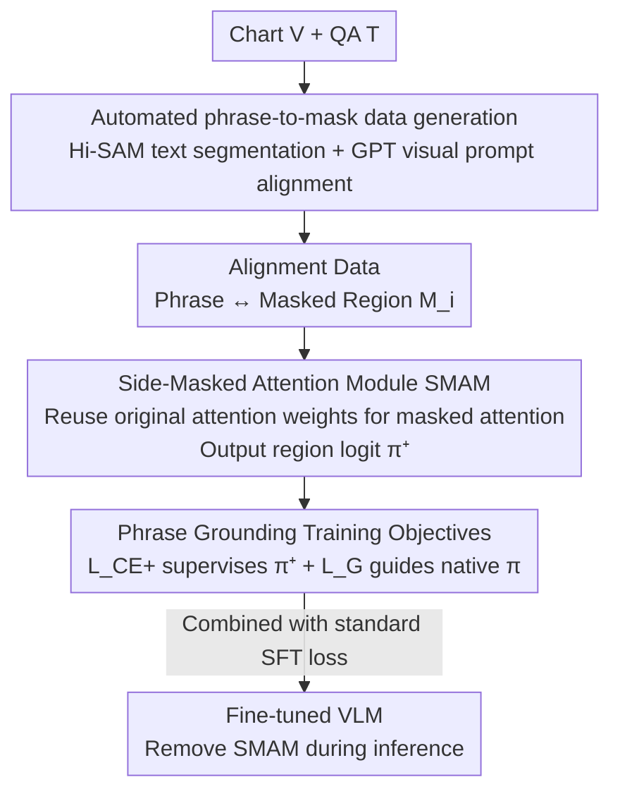

# Phrase-Grounding-Aware Supervised Fine-Tuning for Chart Recognition via Side-Masked Attention

**Conference**: CVPR 2026  
**Paper**: [CVF Open Access](https://openaccess.thecvf.com/content/CVPR2026/html/Ito_Phrase-Grounding-Aware_Supervised_Fine-Tuning_for_Chart_Recognition_via_Side-Masked_Attention_CVPR_2026_paper.html)  
**Code**: https://github.com/jaxa/PGA-SFT (Paper states it will be open-sourced soon)  
**Area**: Multimodal VLM  
**Keywords**: Chart Recognition, Phrase Grounding, Supervised Fine-Tuning, Masked Attention, Logit Contribution

## TL;DR
During the VLM fine-tuning phase, a zero-parameter "Side-Masked Attention Module" (SMAM) is inserted to align each phrase in the answer to text regions on the chart. By supervising the logit contribution of these regions, the model learns to "ground" its generation to correct visual areas during chart QA, consistently outperforming standard SFT on benchmarks like ChartQA and C2T.

## Background & Motivation
**Background**: Current mainstream approaches for chart recognition (VQA on bar/line charts) unify tasks like table extraction and QA into a single framework for Supervised Fine-Tuning (SFT). Enhancement methods mostly focus on the **text side**, such as providing intermediate Chain-of-Thought (CoT) or using table extraction for pre-training.

**Limitations of Prior Work**: These methods operate solely on the text side and do not utilize explicit **spatial annotations**. Another research line (object detection with LLMs) has shown that jointly learning phrase grounding (aligning text phrases with image regions) during SFT improves both detection and fine-grained generation quality. However, phrase grounding is rarely applied to charts due to the **lack of phrase-region alignment datasets**—benchmarks like ChartQA only provide bounding boxes without phrase-level correspondences.

**Key Challenge**: While "stronger vision encoder" routes for chart VLMs are effective, they require re-training the vision-language connector, which is **computationally and labor-intensive**. Moreover, chart domain data is often scarce in real-world scenarios. Therefore, the **Goal** is a method that incorporates spatial grounding **only during the SFT stage without additional pre-training**.

**Key Insight**: The authors leverage the **logit contribution** analysis proposed by Ferrando et al. to quantify the direct contribution of each input token to the output token logit. Extrapolating this tool from text tokens to **visual patch tokens**, they observed that in existing VLMs, high-contribution visual areas often **already** fall on relevant chart regions, suggesting that the model possesses implicit grounding (Fig. 1 heatmaps).

**Core Idea**: Since the model already possesses implicit grounding, the objective is to **explicitly supervise** it. By extracting and supervising the logit contribution of phrase-aligned regions and using it as a "reference signal" to guide the model's native output probabilities, grounding becomes more faithful. This mechanism is only enabled during fine-tuning and is completely removed during inference, making it compatible with various pre-trained VLMs.

## Method

### Overall Architecture
The method consists of two main components: an **automated data generation pipeline** to supplement existing chart datasets with "phrase $\to$ masked region" alignment labels, and the **SMAM** (Side-Masked Attention Module) to impose grounding constraints on these aligned tokens during fine-tuning. Given a chart $V$ and QA text $T$, the pipeline produces alignment data "Phrase in answer $\leftrightarrow$ Mask $M_i$ of corresponding text region". During training, SMAM is attached to each transformer attention block to perform an auxiliary forward pass on masked tokens, producing an additional logit optimized alongside the standard SFT objective via two grounding losses. Crucially, the masked input and SMAM **exist only during training**; they are removed during inference, reverting the model to its original architecture.

### Key Designs

**1. Automated Phrase-to-Mask Data Generation: Overcoming the lack of alignment data**

The fundamental barrier to phrase grounding in charts is the lack of phrase-level alignment labels. This design constructs an automated annotation pipeline using existing tools. Given image $V$ and QA pair $T$, Hi-SAM (a SAM variant fine-tuned for text segmentation) is used to extract a set of **text region masks** $M=\{M_i\}$. The authors specifically segment only text regions rather than semantic elements like axes, bars, or lines, because these elements vary wildly in granularity and are difficult for GPT to segment stably in non-natural images. Since "a phrase is grounded only when its exact textual form appears in the chart," text regions provide **stable** correspondences. Each mask is then alpha-blended onto the image with a unique ID to create $V_\alpha$, which is fed to GPT-4o-mini. Utilizing its visual prompting capabilities, GPT wraps phrases in $T$ corresponding to each labeled region with `<MARK ID>...</MARK ID>`, producing marked text $T'$ and explicit phrase-to-mask alignments. Note that $V_\alpha$ and $T'$ are used only for generation; during actual training, the model sees the original $V$ and $T$.

**2. Side-Masked Attention Module (SMAM): Extracting "region logits" with zero new parameters**

How to ensure the model "looks" at the correct region? To avoid introducing new modules or parameters, the authors designed SMAM as an auxiliary path parallel to the original transformer attention blocks. For a token $x_t^{l-1}$ with mask $M_t$, SMAM **reuses the pre-calculated** attention weights $A^l$, value states $V^l$, and output projection $W_O^l$ to perform Mask2Former-style masked attention:

$$z^{l,+}_t = W_O^l\Big(\sum\nolimits_{j=1}^{t} \mathrm{softmax}(\hat{M}_t + A^l)_{t,j}\,V^l_j\Big)$$

The spatial mask $M_t$ is expanded into an attention mask $\hat{M}_t\in\{0,-\infty\}$, assigning 0 to language tokens and visual patches within the mask, and $-\infty$ to patches outside. Thus, attention is restricted to "language tokens + in-region visual patches." Retaining language tokens is critical as output tokens depend on language context, and it keeps $z^{l,+}_t$ aligned with the original LLM representation, allowing it to be processed by the model's **original parameters**. Accumulating $z^{l,+}_t$ across layers via residual connections yields $x_t^{L,+}$, which passes through the original normalization layer $L_N$, de-embedding matrix $U$, and softmax to produce the output probability $\pi^+_{w_t}$ calculated by SMAM. This path introduces no learnable parameters and is removed during inference.

**3. Dual-term Phrase Grounding Loss: Supervising region probability and using it as a reference**

$\pi^+_{w_t}$ must be converted into a training signal. The first term is cross-entropy $\mathcal{L}_{\mathrm{CE}^+}=-\log(\pi^+_{w_t})$, directly supervising the region-based probability for the correct answer token $w_t$. The second term, $\mathcal{L}_{\mathrm G}$, is the core—it uses $\pi^+_{w_t}$ as "local grounding evidence" to guide the model's **native** output probability $\pi_{w_t}$:

$$\mathcal{L}_{\mathrm G} = -\log\sigma\big(\beta(\log\pi_{w_t}-\log\pi^+_{w_t})\big),\quad \beta=0.1$$

This format is borrowed from DPO but re-interpreted as a comparison between **two calculation paths for the same token**: the native VLM probability $\pi_{w_t}$ and the SMAM region probability $\pi^+_{w_t}$. The goal is to encourage $\log\pi_{w_t}$ to exceed $\log\pi^+_{w_t}$, meaning the model uses in-region evidence while leveraging remaining image context to perform **better than seeing only the region**. The final auxiliary loss added to SFT is:

$$\mathcal{L}_{\mathrm{aux}} = \sum\nolimits_{x_t\in\mathcal{X}}\big(\gamma\mathcal{L}_{\mathrm G} + \alpha\mathcal{L}_{\mathrm{CE}^+}\big)$$

where $\mathcal{X}$ is the set of aligned tokens, $\alpha=0.1$ is fixed (as a regularizer since $\mathcal{L}_{\mathrm G}$ might lower $\pi^+_{w_t}$), and $\gamma$ balances the terms based on the model (2.0 for LLaVA, 0.5 for Qwen). $\mathcal{L}_{\mathrm{aux}}$ applies only to aligned tokens, while the standard SFT objective covers all answer tokens.

## Loss & Training
Total Objective = Standard SFT loss + $\mathcal{L}_{\mathrm{aux}}$. Hyperparameters: $\beta=0.1$, $\alpha=0.1$, $\gamma$ varies by model (LLaVA 2.0 / Qwen 0.5). For the Qwen series, each task is trained for only 1 epoch (more epochs lead to degradation); LLaVA handles multiple epochs. Global batch size is 96 for ChartQA and 48 otherwise, kept constant to ensure fair comparison (as batch size impacts performance).

## Key Experimental Results

### Main Results
Comparison on C2T (Table Extraction, F1) and ChartQA (Relaxed Accuracy) against standard SFT, text localization baseline (TL., outputting `<box>...` coordinates), and segmentation baseline (Seg., GLaMM). Ours outperforms baselines across multiple VLMs:

| Model | Method | C2T Avg (F1) | ChartQA Avg (RA) | ChartQA Hum. |
|------|------|------|------|------|
| LLaVA-7B | SFT | 72.4 | 50.2 | 36.5 |
| LLaVA-7B | TL. | 36.0 | 50.9 | 37.1 |
| LLaVA-7B | **Ours** | **74.1** | **51.9** | **38.6** |
| Qwen2.5VL-3B | SFT | 91.9 | 82.0 | 69.5 |
| Qwen2.5VL-3B | **Ours** | **93.2** | **83.0** | **71.1** |
| Qwen2.5VL-7B | SFT | 93.3 | 85.6 | 76.2 |
| Qwen2.5VL-7B | **Ours** | 93.4* | **86.5** | **90.2 (Hum F1)** |

> ⚠️ Some Qwen7B C2T Avg figures were line-truncated in the source; refer to原文 Tab. 2. "90.2" represents Qwen7B-Ours F1 on C2T Hum. Specialty models UniChart and ChartInstruct also improved from SFT (66.2/58.5) to 67.7/60.4 (ChartQA Avg) using Ours.

Seg. performed worst (difficult to optimize a segmentation model with ~25k samples and domain gap); TL. matched SFT on ChartQA (single region) but degraded significantly on C2T (multi-target).

### QA-CoT & Localization Accuracy

| Model | Method | QA-CoT Hum. | logit Local. Acc (Aug./Hum.) |
|------|------|------|------|
| Qwen3B | SFT | 78.9 | 62.7 / 57.9 |
| Qwen3B | Ours | **79.9** | **64.5 / 60.7** |
| Qwen7B | SFT | 82.5 | 54.4 / 53.0 |
| Qwen7B | Ours | **83.8** | **57.5 / 57.0** |

Tab. 4 uses "whether the heatmap peak falls within the GT mask" for Acc. Ours improves both Acc and AUC, indicating that improved localization correlates with better generation.

### Ablation Study
Ablation of loss terms and coefficients $\gamma, \alpha$ on ChartQA (Qwen7B / LLaVA Hum. columns):

| Config | $\mathcal{L}_{\mathrm G}$ | $\mathcal{L}_{\mathrm{CE}^+}$ | Qwen7B Hum. | LLaVA Hum. |
|------|------|------|------|------|
| SFT | – | – | 76.2 | 36.5 |
| #1 | – | ✓ | 76.8 | 36.2 |
| #2/#3 (α=0) | ✓ | – | 76.4 | 37.0 |
| #4 (γ=0.5,α=0.1) | ✓ | ✓ | **77.1** | 37.8 |
| #5 (γ=2.0,α=0.1) | ✓ | ✓ | 76.7 | **38.6** |

### Key Findings
- Using only $\mathcal{L}_{\mathrm{CE}^+}$ (#1) or setting $\alpha=0$ (#2/#3) yields limited gains; **both terms are necessary** and must be balanced by $\gamma$.
- Optimal $\gamma$ varies: LLaVA prefers larger $\gamma$ (2.0) while Qwen prefers smaller $\gamma$ (0.5), attributed to LLaVA having more "superficial" grounding that requires stronger constraints.
- Improvements are concentrated in the **ChartQA Hum. (multi-step reasoning) split**, which is more difficult; the Aug. split is nearly saturated under SFT.
- The method remains effective for C2T where non-text components (bars/lines) are labeled, showing it is not strictly limited to text regions.

## Highlights & Insights
- **Zero-parameter auxiliary path**: SMAM reuses original attention weights ($A^l/V^l/W_O^l$) and the de-embedding matrix. This allows end-to-end training and inference-time removal—the engineering key to a portable grounding method for any VLM.
- **Visual Logit-Contribution**: Extrapolating logit contribution to visual patches provides a solid motivation for designing explicit supervision based on existing implicit grounding.
- **Clever DPO Adaptation**: A relative constraint originally for comparing two output sequences is repurposed to compare **two calculation paths for the same token**, allowing regional evidence to pull the native prediction without locking it.

## Limitations & Future Work
- Data generation focuses on **text regions**, with limited coverage of visual elements without explicit text (axis ticks, trends). The authors avoided these due to unstable segmentation by GPT.
- Gains are small on saturated splits like Aug. split; effectiveness depends on how much "room for improvement" remains in the task.
- Training overhead increases due to the extra SMAM forward pass and logit contribution calculation. The ALTI component was omitted due to compute constraints.
- $\gamma$ requires per-model tuning (LLaVA 2.0 vs Qwen 0.5) without an automatic selection strategy.

## Related Work & Insights
- **vs Text-augmented Chart SFT (CoT, table extraction)**: These provide "indirect grounding" via text; Ours uses spatial annotations for explicit phrase-region grounding and can be stacked on top of CoT.
- **vs Text Localization / bounding-box output (mPLUG-DocOwl, RefChartQA)**: TL. requires generating coordinate tokens, which degrades for multi-target tasks (C2T); SMAM adds supervision without changing the output sequence.
- **vs Segmentation-based grounding (GLaMM/SAM integration)**: Seg. requires training additional segmentation modules, which is hard to optimize in small-sample chart SFT; SMAM reuses existing weights.
- **vs Stronger Vision Encoder VLMs**: Those require expensive re-training of connectors; Ours focuses on the SFT stage, making it more practical for real-world small data scenarios.

## Rating
- Novelty: ⭐⭐⭐⭐ Extrapolating logit-contribution to visual patches and designing the zero-parameter SMAM introduces phrase grounding systematically to chart recognition SFT.
- Experimental Thoroughness: ⭐⭐⭐⭐ Covers 5 VLMs, 3 task types, localization accuracy, and loss ablations, though some gains are modest.
- Writing Quality: ⭐⭐⭐⭐ Clear motivation and complete formulas; tables require care due to original formatting quirks.
- Value: ⭐⭐⭐⭐ Provides a portable "grounding without re-training" solution, useful for data-scarce chart domains.

<!-- RELATED:START -->

## Related Papers

- [\[CVPR 2026\] TRivia: Self-supervised Fine-tuning of Vision-Language Models for Table Recognition](trivia_self-supervised_fine-tuning_of_vision-language_models_for_table_recogniti.md)
- [\[CVPR 2026\] Rethinking BCE Loss for Multi-Label Image Recognition with Fine-Tuning](rethinking_bce_loss_for_multi-label_image_recognition_with_fine-tuning.md)
- [\[CVPR 2026\] CoVFT: Context-aware Visual Fine-tuning for Multimodal Large Language Models](covft_context-aware_visual_fine-tuning_for_multimodal_large_language_models.md)
- [\[CVPR 2026\] FairLLaVA: Fairness-Aware Parameter-Efficient Fine-Tuning for Large Vision-Language Models](fairllava_fairness-aware_parameter-efficient_fine-tuning_for_large_vision-langua.md)
- [\[CVPR 2026\] SketchVL: Policy Optimization via Fine-Grained Credit Assignment for Chart Understanding and More](sketchvl_policy_optimization_via_fine-grained_credit_assignment_for_chart_unders.md)

<!-- RELATED:END -->
