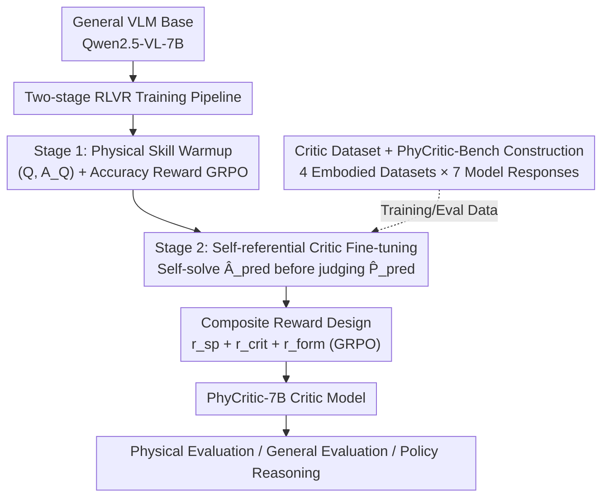

# PhyCritic: Multimodal Critic Models for Physical AI

**Conference**: CVPR 2026  
**Paper**: [CVF Open Access](https://openaccess.thecvf.com/content/CVPR2026/html/Xiong_PhyCritic_Multimodal_Critic_Models_for_Physical_AI_CVPR_2026_paper.html)  
**Code**: Project Page https://research.nvidia.com/labs/lpr/phycritic/  
**Area**: Multimodal VLM  
**Keywords**: Multimodal Critic Model, Physical AI, RLVR, GRPO, Self-referential Evaluation  

## TL;DR
PhyCritic utilizes a two-stage RLVR pipeline comprising "physical skill warmup + self-referential critic fine-tuning" to train a 7B multimodal model into a critic specialized for physical AI tasks (perception/causality/planning). The core mechanism involves the critic "solving the problem first, then using its own solution as a reference to judge which of two responses is superior." It achieves state-of-the-art performance among open-source 7B/8B models on the newly established PhyCritic-Bench and enhances physical reasoning capabilities when used as a policy model.

## Background & Motivation

**Background**: With the explosion of Multimodal Large Language Models (MLLMs), critic (or judge) models have become critical components for open-ended evaluation and preference alignment. These models must provide pairwise preferences, numerical scores, and textual explanations for model-generated responses. However, existing critic models are primarily trained on general visual domains (image captioning, VQA, STEM reasoning).

**Limitations of Prior Work**: Evaluation for physical AI tasks (robot manipulation, embodied interaction, autonomous driving) differs fundamentally from general domains. A critic model must determine if reasoning is causally valid, if visual interpretations align with real physical configurations, and if final answers adhere to temporal, spatial, and dynamic constraints. The authors identify three major weaknesses in existing critic models: (1) Lack of physical awareness, often failing to distinguish between visually coherent but physically impossible reasoning; (2) General training data lacking manipulation, affordance, and embodied 3D interaction scenarios; (3) Judgments not anchored to the model's own physical understanding of the problem, leading to inconsistent or superficial conclusions.

**Key Challenge**: The judgment quality of a critic model is limited by its own depth of understanding regarding physical problems. How can a model that cannot solve a problem itself accurately judge the correctness of others? Existing critic models typically "select one from two responses" directly, skipping the self-solving step, making them susceptible to superficial phrasing.

**Goal**: Construct a multimodal critic model specifically designed for physical AI, requiring its judgments to be **grounded, stable, and physically correct**, accompanied by a benchmark that strictly measures physical evaluation capabilities.

**Key Insight**: The authors draw an analogy to "expert human judges"—before evaluating others, they solve the problem themselves. This intuition leads to the "self-referential" mechanism: the critic model first generates its own reasoning and prediction, then utilizes this self-prediction as a reference to evaluate candidate responses.

**Core Idea**: Employs a "solve before judge" self-referential critic mechanism paired with a two-stage RLVR (first physical skill warmup, then critic fine-tuning) to anchor critic judgments to the model's own physical understanding.

## Method

### Overall Architecture
PhyCritic starts from a general VLM (Qwen2.5-VL-7B-Instruct) and undergoes a two-stage reinforcement learning fine-tuning. **Stage 1 (Physical Skill Warmup)** uses verifiable physical QA data containing only $(Q, A_Q)$ paired with accuracy rewards using standard GRPO to elevate the base model's physical perception and reasoning capabilities—building a foundation for complex evaluation tasks. **Stage 2 (Self-referential Critic Fine-tuning)** utilizes complete $(Q, L_A, L_B, A_Q, P)$ tuples for training. The model is required to **first generate its own internal prediction $\hat{A}_{pred}$ for problem $Q$, then act as a critic to explicitly judge the preference $\hat{P}_{pred}$ for candidate pairs $(L_A, L_B)$ using the self-prediction as a reference**, optimized via GRPO with composite rewards (self-prediction reward + critic reward + formatting reward). Training data is sourced from videos in four robot/embodied datasets and physical QA from Cosmos-Reason1, paired with responses from seven models of varying tiers.

The training tuple is defined as $(Q, L_A, L_B, A_Q, P)$: where $Q$ is a multimodal prompt with visual input, $L_A/L_B$ are two candidate responses (the subjects of evaluation), $A_Q$ is the ground-truth answer, and $P\in\{A, B\}$ is the binary preference label.

### Key Designs

**1. Two-stage RLVR Training Pipeline: Solidifying Physical Foundations Before Learning to Judge**

Addressing the limitations of "lack of physical awareness" and "general data," the authors do not start with critic tasks. Instead, **Stage 1 (Physical Skill Warmup)** uses only $(Q, A_Q)$ verifiable physical QA. The reward is simply the correctness of the answer $r = \mathbb{I}(\hat{A}_{pred}(Q) = A_Q)$. Standard GRPO aligns the model to produce accurate and reliable physical predictions $\hat{A}_{pred}$. Ablations show Stage 1 alone improves physical reasoning (CosmosReason1-Bench) by +7.5 points but only +2.0 for critic capability—its role is to provide a "problem-solving" starting point for Stage 2. **Stage 2** then learns evaluation on this basis. The authors emphasize the pipeline requires only $80+300$ RL steps with 4,058 training samples, which is significantly more data-efficient than methods relying on millions of supervised distillation trajectories (e.g., Cosmos-Reason1).

**2. Self-referential Critic Fine-tuning: Solving Before Judging to Anchor Judgments**

This is the core contribution, targeting the issue of "unanchored judgments." Stage 2 requires the policy $\pi_\theta$ to perform two tasks concurrently: first, **self-prediction**—generating its own internal reasoning and answer $\hat{A}_{pred}$ for prompt $Q$ (encapsulated in `<pred_think>` / `<pred>`); second, **preference judgment**—explicitly using the self-prediction as a reference to output the preference $\hat{P}_{pred}$ for $(Q, L_A, L_B)$ (reasoning in `<think>`, conclusion in `\boxed{}`). The critic prompt template (Table 1) explicitly instructs the model to "generate your own reasoning and answer first, then use your solution as a reference point to compare the two responses point-by-point." Chi-square tests verify this causal chain: the correctness of self-answers is strongly positively correlated with downstream judgment quality, and self-referential fine-tuning strengthens this dependency (Stage 1 model $\chi^2=51.07$, final model $\chi^2=161.76$, with minimal $p$-values), supporting the premise that "solve before judge" avoids spurious correlations.

**3. Loss & Training: Composite Rewards Optimized via GRPO**

To force the model to both "solve correctly" and "judge accurately," the total reward is split into accuracy and formatting rewards: $r_{total} = r_{acc} + \alpha_{form}\cdot r_{form}$. The accuracy reward is a weighted sum:

$$r_{acc} = \alpha_{sp}\, r_{sp} + \alpha_{crit}\, r_{crit}$$

The self-prediction reward $r_{sp} = \mathbb{I}(\hat{A}_{pred} = A_Q)$ verifies if the self-solution is correct, pushing the model to be a reliable solver. The critic reward $r_{crit} = \mathbb{I}(\hat{P}_{pred}(Q, L_A, L_B) = P)$ verifies if the judgment hits the ground-truth preference. The formatting reward $r_{form}$ is stepwise: 1.0 if all four tags (`<pred_think>`, `<pred>`, `<think>`, `\boxed{}`) are present, 0.5 if only `<think>` and `\boxed{}` are present, and 0 otherwise—to stabilize the self-referential output structure. GRPO (from DeepSeek-R1) is used for optimization, calculating relative advantage $A_o = (r_o - \bar{r})/\mathrm{std}(r)$ across sampled trajectories. Weights are set to $\alpha_{sp}=0.2, \alpha_{crit}=0.7, \alpha_{form}=0.1$.

**4. Dataset Construction: Verifiable Pairwise Preferences for Physical AI**

Addressing the "lack of physical AI critic data," the authors built both training and evaluation sets. The **Training Set** extracts videos from RoboVQA, BridgeData V2, HoloAssist, and AgiBot World (covering first/third-person views and various manipulations). Questions are based on 800 high-quality physical QAs from Cosmos-Reason1. Candidate responses are sampled from seven models (GPT-4o, Gemini-2.5-Flash, Qwen2.5-VL-72B, etc.) using CoT. Preference labels are generated via an accuracy-based method—GPT-4o checks each response against ground truth to give binary scores, forming 3,258 "one correct, one incorrect" pairs. **PhyCritic-Bench** contains 225 evaluation samples covering robotics and autonomous driving (LingoQA). It follows the JudgeBench process to construct preference tuples $(x, l_a, l_b, p)$, with Consistency Rate as the metric: $\mathrm{Acc} = \mathbb{I}(\mathrm{VLM}(q, l_a, l_b) = p)$.

## Key Experimental Results

### Main Results
Base model: Qwen2.5-VL-7B-Instruct using the veRL framework. Warmup 80 steps, critic fine-tuning 300 steps, batch 128, lr $1\times10^{-6}$, KL coefficient 0.01. Table below shows critic performance (Preference Consistency Rate %):

| Model | PhyCritic-Bench overall | VL-RewardBench overall | Multimodal-RewardBench overall |
|------|------|------|------|
| Gemini-2.5-Pro (Closed) | 78.2 | 74.9 | 85.4 |
| GPT-4o (Closed) | 64.7 | 65.8 | 71.5 |
| Eagle-2.5-8B | 56.0 | 50.2 | 64.4 |
| Qwen2.5-VL-7B (Base) | 51.6 | 53.2 | 64.0 |
| RoboBrain2.0-7B | 54.7 | 42.4 | 50.5 |
| Cosmos-R1-7B | 51.1 | 44.8 | 54.8 |
| **PhyCritic-7B (Ours)** | **68.0** | **57.3** | **65.9** |

PhyCritic-7B achieves the best performance among open-source 7B/8B models on PhyCritic-Bench (68.0), surpassing the base Qwen2.5-VL-7B (+16.4), Eagle-2.5-8B (+12.0), and Cosmos-R1 (+16.9). Despite being trained only on physical domains, it generalizes well to general benchmarks like VL-RewardBench (+4.1). As a policy model, it reaches 63.9 on CosmosReason1-Bench, surpassing Cosmos-R1-7B (+0.9) despite using significantly less data.

### Ablation Study
RL strategy (s1=80 steps, s2=300 steps) and self-reference ablations:

| Configuration | PhyCritic-B. overall | CosmosR1-B. overall | VL-Reward. overall | Note |
|------|------|------|------|------|
| Qwen2.5-VL-7B (Base) | 51.6 | 54.3 | 53.2 | Starting Point |
| Physical RL only (s1) | 53.6 | 61.8 | 52.0 | Reasoning up, Critic stable |
| Critic RL only (s1+s2) | 62.2 | 57.1 | 54.0 | Direct critic w/o warmup |
| Mixed RL (s1+s2) | 66.7 | 60.2 | 55.5 | Concurrent |
| **Two-stage RL (Ours)** | **68.0** | **63.9** | **57.3** | Full Pipeline |
| w/o Self-reference process | 64.4 | 62.6 | 56.6 | Critic −3.6 |
| w/o Self-prediction reward $r_{sp}$ | 65.8 | 63.5 | 56.5 | Critic −2.2 |

### Key Findings
- **Two stages are distinct yet complementary**: Stage 1 primarily boosts physical reasoning (+7.5), while Stage 2 primarily boosts evaluation (+14.4) and further enhances reasoning (+2.1).
- **Self-reference is the primary driver**: Removing the process or the prediction reward causes significant drops (−3.6 and −2.2 respectively).
- **Statistical support for "Solve better, Judge better"**: Chi-square tests show a strong positive correlation between self-answer correctness and judgment quality.
- **High data efficiency**: Achieving SOTA with only 4,058 samples and 380 RL steps.

## Highlights & Insights
- **"Solve before judge" anchors critic ability to the model's own capability**: This is a transferable meta-idea—critics shouldn't be black-box scorers; solving first provides a stable reference.
- **Step-wise formatting rewards stabilize structured output**: The 1.0/0.5/0 scheme is smoother than binary rewards, providing a gradient for the model to learn complex structures.
- **Physical domain training benefits general evaluation**: Gains in general benchmarks suggest that learning "physical-causal-planning" evaluation cultivates more universal judgment skills rather than overfitting.
- **Symmetry between critic and policy**: Improving judgment strictly also improves the model's own problem-solving ability in an RLVR setting.

## Limitations & Future Work
- The effectiveness of self-referential training depends on the base model's lower bound—if the model fails to solve problems correctly, it may introduce noise.
- Preference labels rely on GPT-4o proxy judgments against ground truth; quality is capped by GPT-4o's reasoning.
- Benchmark size is small (225 samples) and focused primarily on robotics and driving.
- Future work: extending to multi-candidate (>2) scoring, fine-grained process-level rewards, and replacing automatic labels with more robust verifiable pipelines.

## Related Work & Insights
- **vs DriveCritic**: DriveCritic focuses only on autonomous driving trajectories; PhyCritic covers broader physical AI domains including robotics perception and manipulation.
- **vs General Multimodal Critics**: Most existing critics lack physical awareness; PhyCritic uses RLVR + self-reference to target causal and affordance reasoning.
- **vs Cosmos-Reason1**: Cosmos-Reason1 relies on millions of supervised trajectories; PhyCritic uses a small set of verifiable QAs to achieve higher data efficiency and dual-role capability.
- **vs Standard GRPO for Critique**: Direct critic RL (62.2) is inferior to the two-stage approach (68.0), proving the necessity of "building a physical foundation" first.

## Rating
- Novelty: ⭐⭐⭐⭐⭐ "Solve before judge" self-reference + two-stage RLVR is a fresh and transferable approach.
- Experimental Thoroughness: ⭐⭐⭐⭐ Solid across three types of benchmarks and causality verification, though benchmark size is limited.
- Writing Quality: ⭐⭐⭐⭐ Clear motivation-method-verification chain.
- Value: ⭐⭐⭐⭐ Provides the first dedicated physical AI critic model and benchmark; highly practical for embodied and driving evaluation.

<!-- RELATED:START -->

## Related Papers

- [\[CVPR 2026\] PAI-Bench: A Comprehensive Benchmark for Physical AI](pai-bench_a_comprehensive_benchmark_for_physical_ai.md)
- [\[CVPR 2026\] EMMA: Extracting Multiple physical parameters from Multimodal Data](emma_extracting_multiple_physical_parameters_from_multimodal_data.md)
- [\[CVPR 2026\] IPR-1: Interactive Physical Reasoner](ipr-1_interactive_physical_reasoner.md)
- [\[CVPR 2026\] LifeEval: A Multimodal Benchmark for Assistive AI in Egocentric Daily Life Tasks](lifeeval_a_multimodal_benchmark_for_assistive_ai_in_egocentric_daily_life_tasks.md)
- [\[CVPR 2026\] Thinking in Dynamics: How Multimodal Large Language Models Perceive, Track, and Reason Dynamics in Physical 4D World](thinking_in_dynamics_how_multimodal_large_language_models_perceive_track_and_rea.md)

<!-- RELATED:END -->
