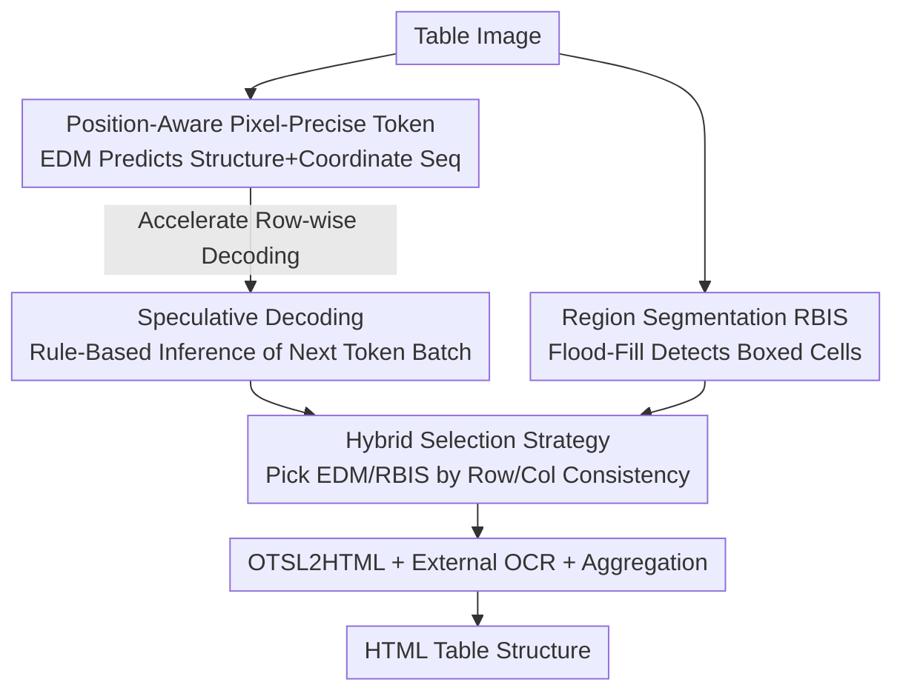

# PIX-TAB: Efficient PIXel-Precise TABle Structure Recognition Approach with Speculative Decoding and Region-Based Image Segmentation

**Conference**: CVPR 2026  
**Paper**: [CVF Open Access](https://openaccess.thecvf.com/content/CVPR2026/html/Zaytsev_PIX-TAB_Efficient_PIXel-Precise_TABle_Structure_Recognition_Approach_with_Speculative_Decoding_CVPR_2026_paper.html)  
**Code**: None  
**Area**: Multimodal VLM / Document Intelligence / Table Structure Recognition  
**Keywords**: Table structure recognition, pixel-precise tokens, speculative decoding, flood-fill segmentation, edge deployment

## TL;DR
PIX-TAB utilizes "Position-Aware Pixel-Precise (PAPP) tokens" that encode row and column pixel coordinates directly into the sequence. This allows a lightweight encoder-decoder model to simultaneously output table structures and deterministically reconstruct cell bounding boxes. Combined with rule-based speculative decoding and flood-fill-based region segmentation, it achieves accuracy comparable to SOTA while doubling speed, enabling table structure recognition on mobile devices.

## Background & Motivation

**Background**: Table Structure Recognition (TSR) is a fundamental component of document intelligence, involving the recovery of rows, columns, cells, and spanning relationships from a table image. In the deep learning era, Transformer architectures dominate, either predicting structures as HTML tag sequences or using OTSL (an optimized table language with only 5 tokens) for sequence prediction. Frameworks like MTL-TabNet use multi-task learning with a shared encoder to perform structure recognition, cell detection, and character recognition simultaneously.

**Limitations of Prior Work**: Existing methods suffer from three issues. First, many models split detection, structure parsing, and content recognition into independent sub-tasks, creating "fragmented pipelines" where errors accumulate and computational costs are high. Second, Large Vision-Language Models (such as UniTable and OmniParser) perform well but are architecturally too heavy for edge deployment. Third, mainstream methods rely heavily on large-scale annotated data, yet public datasets (FinTabNet, PubTabNet) often feature simple table structures, limited styles, and missing cell box annotations. Furthermore, autoregressive decoding of long tables token-by-token results in high latency.

**Key Challenge**: It is difficult to balance accuracy, speed, and deployability. High accuracy typically requires large models, while deployable models sacrificed for size suffer from slow token-by-token decoding in long tables. Additionally, assigning cell box detection to an independent decoder adds modules and introduces new sources of error during inference.

**Goal**: To achieve pixel-precise structure recovery with a model small enough to run on mobile devices, while accelerating decoding and maintaining independence from the recognition language (allowing language changes by swapping the OCR model without modifying the core structure model).

**Key Insight**: The authors observed that OTSL sequences are highly regular between rows. By embedding the pixel coordinates of every horizontal and vertical line directly into tokens, cell boxes can be parsed from the sequence, eliminating the need for a separate box decoder. This regularity can also be exploited for decoding acceleration without requiring a draft model.

**Core Idea**: Use "Position-Aware Pixel-Precise (PAPP) tokens" to encode geometric coordinates into the structure sequence, allowing a lightweight EDM to provide both structure and boxes. Rule-based speculative decoding is then used to reduce decoding steps, with a flood-fill RBIS path providing a fallback for complex tables with clear borders.

## Method

### Overall Architecture

PIX-TAB consists of four components: ① An Encoder-Decoder Model (EDM) that predicts PAPP tokens and OTSL tokens; ② A Region-Based Image Segmentation (RBIS) module that uses flood-fill for direct cell detection in tables with complete borders; ③ An external OCR model to recognize cell text; and ④ An aggregation module that uses a "Hybrid Selection Strategy" to choose the more reliable output between EDM and RBIS, finally assembling the HTML via OTSL2HTML. The EDM is the primary path, while RBIS provides a parallel fallback for large, dense, bordered tables. OCR is decoupled from structure recognition, enabling language-agnostic processing.

The internal EDM adopts the backbone of MTL-TabNet with modifications: the encoder is a ResNet-31-D with modified block configurations (residue stages containing 1/2/5/3 basic blocks) and embedded Global Context Blocks (GCB), followed by sine-cosine positional encoding. Above this is a two-layer shared decoder, branching into a StructDecoder for PAPP/OTSL tokens and a lightweight BboxDecoder used **only during training**. The training loss is the sum of structure and box losses: $\mathcal{L}_{\text{total}} = \mathcal{L}_{\text{structure}} + \mathcal{L}_{\text{bbox}}$, where structure loss is standard teacher-forcing cross-entropy $\mathcal{L}_{\text{structure}} = -\frac{1}{T}\sum_{t=1}^{T}\log P(y_t\mid x, y_{<t})$, and box loss is the normalized L1 distance of target coordinates. Crucially, the BboxDecoder is entirely removed during inference because coordinates are already embedded in the StructDecoder tokens.

### Key Designs

**1. Position-Aware Pixel-Precise Token (PAPP): Encoding Geometry into Sequences**

To avoid the extra module and error source of a separate bbox decoder, the authors extended the OTSL representation. For a table image normalized to $X\times Y$, two types of position tokens are added: row-start tokens `<rYYY>` ($YYY\in[0,Y)$, marking vertical coordinates of horizontal lines) and column-boundary tokens `<cXXX>` ($XXX\in[0,X)$, marking horizontal coordinates of vertical lines). These are mixed with four OTSL tokens: `C` (cell), `L` (left merge), `U` (up merge), and `X` (cross merge), ending with `</table>`. The original `NL` (newline) token is omitted as `<rYYY>` natively signifies a new row. Example: a single-row table with horizontal lines at $y=20, 40$ and verticals at $x=10, 30, 50, 70$ would result in the sequence `<r020><c010><c030><c050><c070><r040>CCC</table>`. This compact representation allows direct parsing of cell boxes from the sequence, requiring no box decoder during inference and significantly reducing token count compared to HTML (e.g., 50 vs. 95 tokens).

**2. Analytic Speculative Decoding: Rule-Based Acceleration without Draft Models**

Autoregressive decoding is the primary source of latency in long tables. The authors noted high inter-row regularity in PAPP–OTSL sequences. After the first row, `<cXXX>` tokens are absent; each new row starts with `<rYYY>` followed by OTSL tokens. This allows **pure logic rules** rather than a neural network (draft model) to speculate future tokens. The algorithm (Alg. 1) constructs speculative blocks by backtracking from the current row $L$ to find a matching prefix in history row $A$. If found, the current row is completed with the remainder of $A$ and duplicated $K=10$ times. Row coordinates are extrapolated using a stable row interval $step$ estimated within a $\pm\tau$ ($\tau=4$px) tolerance. During decoding, the speculative block is appended for a **single** forward pass. Tokens are verified: matching ones are accepted (`<rYYY>` allows $\pm 1$ pixel deviation), and decoding stops at the first mismatch. This purely token-level operation has negligible overhead $O(K\times N_{cols})$ but bypasses many decoding steps for regular tables.

**3. RBIS + Hybrid Selection: Fallback for Dense Bordered Tables**

EDM often fails on large, complex professional document tables. The authors added a parallel RBIS path (Alg. 2): flood-fill (BFS, 8-neighborhood) is applied to grayscale images to group adjacent pixels within an intensity threshold. It involves region detection, region analysis (building boxes and calculating density $\rho=\eta/A_{box}$), and quality filtering (retaining regions where density $\ge\rho_{min}$ and dimensions exceed the minimum training cell size). Complexity is $O(n\times m)$. The Hybrid Selection Strategy $\Psi$ picks the result based on row/column consistency: RBIS is chosen when its row and column counts significantly exceed EDM ($N_r^{\text{RBIS}} > \gamma\cdot N_r^{\text{EDM}}$ and $N_c^{\text{RBIS}} > \gamma\cdot N_c^{\text{EDM}}$, $\gamma=0.7$), combining EDM's robustness with RBIS's geometric precision for dense tables.

### Loss & Training

Training utilizes $\mathcal{L}_{\text{structure}}+\mathcal{L}_{\text{bbox}}$, as described above. The box loss is calculated only for tokens "opening a new cell" using normalized coordinates. The optimizer is Ranger (RAdam + LookAhead + Gradient Centralization) with $\beta_1=0.9, \beta_2=0.95$, weight decay 0.1, and global batch size 128. The peak learning rate is 0.001, decayed by 10x at 64% of epochs, with a 200-step warm-up over approximately 50 epochs. To mitigate data scarcity, a synthetic pipeline was proposed to expand Wikipedia HTML tables with CSS variations and full-resolution renders, generating over a million synthetic tables (denoted as Synth) to augment training sets like PubTabNetSynth.

## Key Experimental Results

### Main Results

Evaluations on FinTabNet / PubTabNet with varying synthetic data (higher is better):

| Training Set | Test Set | TEDSstruct / TEDS | TEDSstruct100 / TEDS100 |
|--------------|----------|-------------------|--------------------------|
| FinTabNet | FinTabNet | 98.71 / 89.69 | 97.60 / 77.30 |
| FinTabNet + SynthTabNet | FinTabNet | 98.69 / 89.79 | 97.60 / 77.41 |
| FinTabNet + **Ours (Synth)** | FinTabNet | **98.72 / 89.83** | **97.62 / 77.51** |
| PubTabNet | PubTabNet | 97.20 / 77.73 | 96.62 / 70.49 |
| PubTabNet + **Ours (Synth)** | PubTabNet | 97.26 / 77.79 | 96.63 / **70.60** |

Comparison of accuracy and speed against recent image-only methods on FinTabNet (FPS measured on single A100 40GB):

| Method | Image Size | Norm.FPS | TEDSstruct |
|--------|------------|----------|------------|
| RobusTabNet | 1024 | 5.19 | 97.00 |
| VAST | 608 | 1.38 | 98.63 |
| UniTable | - | - | 98.89 |
| TABLET | 960 | 18.01 | 98.71 |
| **PIX-TAB (✔RBIS)** | 480 | 7.23 | 98.65 |
| **PIX-TAB (✗RBIS)** | 480 | 7.96 | 98.72 |

PIX-TAB achieves SOTA accuracy (98.72) with only 480px input, offering superior FPS to most peers and a mobile-ready footprint.

### Ablation Study

Contribution of Speculative Decoding (SD) and RBIS:

| RBIS | SD | Test Set | TEDS / TEDS100 | FPS |
|------|----|----------|----------------|-----|
| ✗ | ✗ | FinTabNet | 97.62 / 77.50 | 3.80 |
| ✗ | ✔ | FinTabNet | 97.62 / 77.51 | **7.96** |
| ✗ | ✗ | PubTabNet | 96.68 / 70.60 | 3.36 |
| ✗ | ✔ | PubTabNet | 96.63 / 70.60 | **8.54** |

RBIS gains on dense tables with complete borders (MarketingStyle subset of SynthTabNet):

| Test Set | RBIS | TEDSstruct100 | TEDS100 |
|----------|------|---------------|---------|
| MarketingStyle | ✗ | 56.14 | 35.08 |
| MarketingStyle | ✔ | **57.59** | **45.61** |

### Key Findings

- **Speculative Decoding is "free" speed**: Enabling SD improves FinTabNet FPS from 3.80 to 7.96 (~1.5×) and PubTabNet from 3.36 to 8.54 (~2.5–3×) without impacting TEDS accuracy, as it only uses rules to skip redundant steps with per-token verification.
- **RBIS specialized for dense bordered tables**: On MarketingStyle, TEDS100 improved from 35.08 to 45.61 (+10 pts) with low computational overhead; however, it slightly reduces accuracy on standard FinTabNet/PubTabNet (98.72 to 98.65), thus the hybrid strategy only invokes it as a fallback.
- **Stable gains from synthetic data**: The proposed Synth outperforms SynthTabNet, raising PubTabNet TEDSstruct from 95.2 to 95.5.
- **Edge performance**: On mobile (Samsung Fold 5 / Snapdragon 8 Gen 2), optimization reduced latency from 19.9s to 6.6s (~3×) with only marginal accuracy drops (TEDS 96.63 to 96.01), still outperforming NCGM (95.4 / 9.1s).

## Highlights & Insights

- **Collapsing Box Detection into Sequence Prediction**: Using PAPP tokens makes coordinates part of the structural sequence, allowing the removal of the bbox decoder during inference. This "geometric tokenization" is a template for tasks requiring simultaneous structure and coordinate outputs, such as layout analysis.
- **Draft-model-free Speculative Decoding**: Leveraging row regularity, the authors use analytic rules to generate speculative blocks, avoiding the cost of training/maintaining a draft model. This is applicable to any task with highly structured, rule-predictable sequences.
- **Hybrid Selection as Engineering Wisdom**: Instead of a "one-model-fits-all" approach, the authors use a neural main path and a classical CV fallback, selecting the best via consistency. This balances robustness and geometric precision.
- **Decoupling OCR and Structure**: Swapping the external OCR model allows for easy multi-language adaptation without retraining the core structural model.

## Limitations & Future Work

- Overall accuracy remains highly dependent on the quality of the external OCR; box errors can propagate to structure recognition.
- RBIS is effective only for tables with clear geometric boundaries and fails on irregular or complex layouts.
- Speculative decoding gains rely on "row pattern repetition"; it provides no benefit (and risks overhead) for tables where every row is unique.
- Proposed improvements: Replacing flood-fill in RBIS with a learnable lightweight segmentation head, or enabling adaptive speculative decoding to skip speculation on irregular tables.

## Related Work & Insights

- **vs. OTSL / SPRINT**: While both uses condensed table languages, PIX-TAB adds pixel coordinates, enabling direct box reconstruction and rule-based speculative acceleration.
- **vs. MTL-TabNet**: PIX-TAB inherits the shared encoder multi-task backbone but demotes the bbox head to "training-only," reducing inference overhead and error sources.
- **vs. VLMs (UniTable/OmniParser)**: Large VLMs are too heavy for edge devices; PIX-TAB achieves 3× acceleration on mobile with comparable accuracy using a 480px input model.
- **vs. Classical Speculative Decoding (draft-then-verify)**: Unlike standard methods requiring a secondary neural network (draft model), PIX-TAB uses analytic rules to generate candidates, incurring zero extra model calls.

## Rating
- Novelty: ⭐⭐⭐⭐ The combination of PAPP tokens, analytic speculative decoding, and flood-fill fallback is clever, though individual components are engineering-driven.
- Experimental Thoroughness: ⭐⭐⭐⭐ Covers main results, speed, ablation, edge performance, and synthetic data, though some FPS comparisons are missing for complex tables.
- Writing Quality: ⭐⭐⭐ Clear logic and good diagrams, though CVF version formulas suffer from OCR breaks and some ambiguous phrasing.
- Value: ⭐⭐⭐⭐ High practical value for edge deployment and language-agnostic table recognition with reusable engineering insights.

<!-- RELATED:START -->

## Related Papers

- [\[ICLR 2026\] Grasp Any Region: Towards Precise, Contextual Pixel Understanding for Multimodal LLMs](../../ICLR2026/multimodal_vlm/grasp_any_region_towards_precise_contextual_pixel_understanding_for_multimodal_l.md)
- [\[CVPR 2026\] Twin-T & TwintVQA: A Reliable Structure-Detail Separating VLM and a Comprehensive Benchmark for Chart and Table Tasks](twin-t_twintvqa_a_reliable_structure-detail_separating_vlm_and_a_comprehensive_b.md)
- [\[CVPR 2026\] TRivia: Self-supervised Fine-tuning of Vision-Language Models for Table Recognition](trivia_self-supervised_fine-tuning_of_vision-language_models_for_table_recogniti.md)
- [\[CVPR 2026\] RetFormer: Multimodal Retrieval for Enhancing Image Recognition](retformer_multimodal_retrieval_for_enhancing_image_recognition.md)
- [\[NeurIPS 2025\] ViSpec: Accelerating Vision-Language Models with Vision-Aware Speculative Decoding](../../NeurIPS2025/multimodal_vlm/vispec_accelerating_vision-language_models_with_vision-aware_speculative_decodin.md)

<!-- RELATED:END -->
