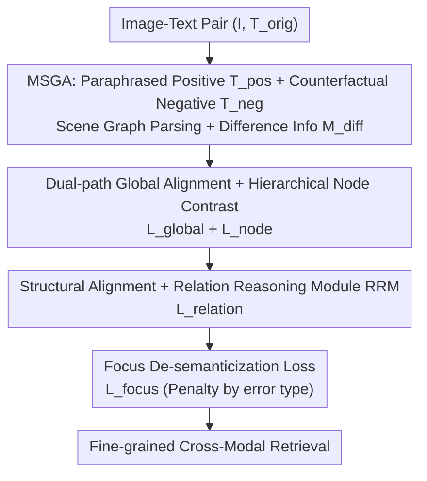

# POGA: Paraphrased and Oppositional Graph Alignment for Fine-Grained Cross-Modal Retrieval

**Conference**: CVPR 2026  
**Paper**: [CVF Open Access](https://openaccess.thecvf.com/content/CVPR2026/html/Zhang_POGA_Paraphrased_and_Oppositional_Graph_Alignment_for_Fine-Grained_Cross-Modal_Retrieval_CVPR_2026_paper.html)  
**Code**: TBD  
**Area**: Information Retrieval / Cross-modal Retrieval  
**Keywords**: Fine-grained cross-modal retrieval, Graph alignment, Long text understanding, Counterfactual negative samples, Multi-granularity alignment

## TL;DR
POGA parses both images and text into structured scene graphs, utilizes LLMs to automatically generate "paraphrased positive samples + counterfactual negative samples" along with their difference information, and trains with a composite loss across four granularities—global, node, relation, and focus. This allows the model to both recognize object attributes and reject "semantically similar but factually incorrect" descriptions in fine-grained long-text retrieval.

## Background & Motivation
**Background**: Dual-tower VLMs like CLIP use contrastive learning to compress an entire image and a paragraph of text into global vectors for matching, which is the de facto standard for cross-modal retrieval. To handle long descriptions exceeding 77 tokens, methods such as Long-CLIP and FineLIP extend input length through interpolated positional embeddings.

**Limitations of Prior Work**: These long-text methods only address "how long the input can be," while the alignment paradigm remains stuck at global feature alignment—compressing the whole image and text into single vectors. Consequently, models can recognize "a cat and a mat" but fail to distinguish "a cat on the mat" from "a cat under the mat"; small or rare objects are ignored, and attributes or spatial arrangements are weakened.

**Key Challenge**: The semantics of long text are highly structured (entities, attributes, relations), whereas global alignment naturally discards structural information. Simultaneously, the training objective lacks discriminative power, failing to reject "counterfactual" descriptions that differ from the correct one by only a single preposition or attribute but correspond to an entirely different image. Existing fine-grained methods (GOAL, Flair) mostly focus on local alignment of objects/attributes, neither explicitly modeling complex spatial relations between entities nor possessing falsification capabilities.

**Goal**: In long-text scenarios, simultaneously achieve (1) precise entity recognition, (2) understanding of spatial/structural relations between entities, and (3) sharp falsification of factual errors.

**Key Insight**: Rather than letting the model implicitly learn structure from noise, it is better to explicitly parse both images and text into scene graphs and actively create "single-fact change" hard negatives, feeding the differences directly to the model as supervision signals.

**Core Idea**: Replace "global vector alignment" with "graph alignment + multi-granularity composite loss." LLMs generate paraphrased positive samples and counterfactual negative samples while extracting differences, with a four-granularity loss optimized in a coarse-to-fine cascade.

## Method

### Overall Architecture
POGA is an end-to-end two-stage framework. The first stage, **MSGA (Multi-source Graph Augmentation)**, expands a standard image-text pair $\{I, T_{orig}\}$ into a "supervision-enriched tuple": a Vision-Language Model re-describes the image to produce a paraphrased positive $T_{pos}$ with invariant semantics but varied phrasing; an LLM performs a fine-grained factual edit (changing attributes/reversing relations/replacing entities) on the original text to create a counterfactual negative $T_{neg}$; the image (segmented into regions via SAM) and all three text versions are parsed into scene graphs, and a difference report $M_{diff}$ is extracted. The second stage, **HMA (Hybrid Multi-granularity Alignment)**, uses a four-term composite loss to unify multi-task optimization from global semantics down to node, structure, and focus falsification levels.

### Key Designs

**1. MSGA: Using LLMs to Simultaneously Create Positives, Counterfactual Negatives, and Difference Logs**

To address the lack of structural supervision and hard negatives in global alignment, MSGA actively constructs structure-enriched supervision. One path uses a VLM (e.g., InternVL3) to re-describe the image, yielding $T_{pos}$—preserving semantics but changing syntax, forcing the model to learn semantic representations robust to paraphrasing. Another path uses an LLM (e.g., Llama-8B) to perform **exactly one** fine-grained factual edit ("red" → "blue", "on" → "under") on $T_{orig}$ to create $T_{neg}$. These near-identical hard negatives are key to training falsification capabilities. Images are segmented (SAM) into region nodes with semantic features $v^{sem}_i$ and normalized coordinates $v^{spat}_i$, while text is parsed by an LLM (e.g., GPT-4o-Mini) into a scene graph $G=(E, R)$. Crucially, the **difference information** $M_{diff} = \{(e_{target}, \tau_{err}, e_{modified})\}$ is extracted by comparing $G_{orig}$ and $G_{neg}$, identifying whether an attribute, object, or relation was changed ($\tau_{err}$) and what the original vs. modified values are. This acts as a high-precision error log for focused supervision.

**2. Dual-path Global Alignment + Hierarchical Node Contrast: Stabilizing Overall Semantics while Adding Object-level Discrimination**

Standard CLIP contrastive loss only aligns $\{I, T_{orig}\}$, risking overfitting to specific phrasing. POGA introduces dual-path global loss $L_{global} = (L_{orig} + L_{pos})/2$ using InfoNCE to make global vectors robust to re-descriptions. To recover object details lost in global alignment, a **hierarchical node contrastive loss** is added: for each image region $v_i$, the positive set $P_i$ comes from entities parsed from $T_{orig} \cup T_{pos}$, while the hard negative set $N_i$ includes in-batch negatives and counterfactual entities flagged by $M_{diff}$. Calculated as:

$$L_{node} = -\mathbb{E}_{v_i \in V}\left[\log \frac{S_{pos}(v_i)}{S_{pos}(v_i) + S_{neg}(v_i)}\right]$$

This pulls regions closer to correct entities and pushes them away from counterfactual ones, achieving precise region-entity grounding.

**3. Structural Alignment + Relation Reasoning Module (RRM): Treating "Who is on top of Whom" as a Verifiable Fact**

Scene semantics are inherently compositional; isolated nodes cannot align spatial/relational structures. POGA designs the **Relational Reasoning Module (RRM)**, using a Transformer decoder that takes subject/object visual features $(v_{sub}, v_{obj})$, geometric cues, and relation text $t_{rel}$ to output a confidence score $s \in [0,1]$. It is trained as a universal "relational fact checker." Positive triplets $R^+$ come from $G_{orig}, G_{pos}$, while negative triplets come from in-batch shuffling $R^-_{sample}$ and counterfactual triplets in $G_{neg}$. The structural loss consists of positive BCE, negative BCE, and a margin term with $\Delta_r$: $L_{relation} = L_{rel\_pos} + L_{rel\_neg} + L_{rel\_margin}$, enabling the model to not only recognize entities but also judge their spatial relations.

**4. Focus De-semanticization Loss: Heavy Penalties for Specific Errors Cited by $M_{diff}$**

While previous terms ensure local and structural representation, they do not specifically "target" the counterfactual edit identified by $M_{diff}$. $L_{focus}$ applies differentiated penalties based on error type: attribute/object errors ($\tau_{err}=\text{ATTR/OBJ\_ERR}$) use a hinge loss to force the original similarity to be higher than the counterfactual similarity by a margin $\Delta_f$, where $l_{hinge} = \max(0, \Delta_f + s_{neg} - s_{pos})$; relation errors ($\tau_{err}=\text{REL\_ERR}$) use BCE to directly suppress RRM confidence for the erroneous triplet $r_{neg}$. The sum $L_{focus} = L_{focus\_obj} + L_{focus\_rel}$ serves as a directional supplement. The total objective aggregates the four granularities: $L_{POGA} = L_{node} + \lambda_g L_{global} + \lambda_r L_{relation} + \lambda_f L_{focus}$, cascading from coarse to fine to stabilize "what is there," teach "how they interact," and "point out what is wrong."

## Key Experimental Results

### Main Results
Evaluations were conducted on the DCI and DOCCI long-text image-text retrieval datasets (in-distribution), using ViT-B/16 and ViT-L/14 backbones with Recall@K metrics.

| Dataset (ViT-L/14) | Direction | Metric | POGA (Ours) | GOAL (Prev. SOTA) | Gain |
|--------|------|------|------|----------|------|
| DCI→DCI | T2I | R@1 | 84.11% | 76.89% | +7.22 |
| DCI→DCI | I2T | R@1 | 84.11% | 76.59% | +7.52 |
| DOCCI→DOCCI | T2I | R@1 | 86.29% | 84.37% | +1.92 |
| DOCCI→DOCCI | I2T | R@1 | 84.68% | 82.57% | +2.11 |

Cross-dataset generalization highlights further advantages: training on DOCCI and testing on DCI (ViT-L/14), POGA's T2I R@1 reaches 81.31%, which is **12.38** percentage points higher than GOAL's 68.93%. Regarding global representation maintenance, POGA (ViT-B/16) achieves 89.93%/67.16%/40.55% in zero-shot classification on CIFAR10/CIFAR100/ImageNet-O, outperforming GOAL across the board, proving that fine-grained tuning does not cause catastrophic forgetting of global understanding.

### Ablation Study
Ablations on DCI (ViT-B/16) decompose the HMA loss terms and MSGA augmentation strategies.

| Configuration | I2T R@1 | Description |
|------|---------|------|
| $L_{global}$ only (Baseline) | 66.58% | Standard contrastive fine-tuning |
| + $L_{node}$ | 74.21% | Added node-level contrast, +7.63 |
| + $L_{relation}$ | 77.37% | Added structural alignment, +3.16 |
| Full (+ $L_{focus}$) | 79.44% | Added focus de-semanticization, +2.07 |
| POGA w/o Aug | 76.52% | Removed all augmentations |
| $T_{pos}$ only | 78.11% | Used only paraphrased positives |
| $T_{neg}$ only | 78.34% | Used only counterfactual negatives |
| $T_{pos}+T_{neg}$ | 79.44% | Complementary combination is best |

### Key Findings
- Cumulative addition of the four-granularity losses yields positive gains, with $L_{node}$ contributing the most (+7.63), validating that lost object details in global alignment are the primary bottleneck.
- Paraphrased positives and counterfactual negatives are complementary: the former focuses on robustness, while the latter focuses on fine-grained discrimination. Using both is superior to either alone (79.44% vs 78.11%/78.34%).
- Cross-dataset migration (especially the +12.38 gain from DOCCI→DCI) suggests that graph alignment learns a more transferable structured alignment mechanism rather than dataset-specific phrasing.
- Loss weights: Global $\delta=1.0$, Relation $\alpha=0.8$, Focus $\gamma=0.8$. ⚠️ Correspondence between symbols $\lambda_g/\lambda_r/\lambda_f$ and $\delta/\alpha/\gamma$ follows the original implementation details.

## Highlights & Insights
- **"Single-fact change" hard negatives + automated difference extraction**: This is not random perturbation; the LLM performs a single-point edit and extracts exactly "what changed" as $M_{diff}$ for focused supervision. This strategy of "creating errors then naming and shaming them" is transferable to any contrastive learning task requiring fine-grained discrimination.
- **Relations as verifiable facts**: RRM is not a simple attention mechanism but is explicitly trained as a "relational checker" outputting 0-1 confidence, directly supporting the focus loss in targeting erroneous triplets.
- **Fine-grained tuning without sacrificing global capability**: Surpassing original CLIP in zero-shot classification proves that the multi-granularity cascade naturally mitigates catastrophic forgetting—highly attractive for industrial applications needing both fine-grained retrieval and generalizability.

## Limitations & Future Work
- **Heavy reliance on LLM/VLM quality**: Paraphrasing, counterfactual editing, scene graph parsing, and difference extraction all rely on models like InternVL3/Llama/GPT-4o/SAM. This entails high offline construction costs, and noise in augmented data propagates directly to supervision signals; robustness to parsing errors is not fully discussed.
- **Heavy Pipeline**: Utilizing four losses, RRM, and multi-source graph parsing results in a complex training pipeline with many hyperparameters (margins and weights), raising the barrier to reproduction.
- ⚠️ **Naming Inconsistency**: The experimental section occasionally uses terms like "Progressive Object-level Graph Alignment" and "Hierarchical Matching Alignment" that differ from the abstract/method. These are suspected typos; definitions in the method section should be considered authoritative.
- Evaluation is concentrated on English long-description datasets (DCI/DOCCI/Urban1K); generalization to cross-lingual or real-world e-commerce scenarios remains unverified.

## Related Work & Insights
- **vs. Long-CLIP / FineLIP**: They address input length but the alignment paradigm remains global vector matching; POGA's graph alignment yields higher R@1 across all settings, proving "longer input" $\neq$ "finer observation."
- **vs. GOAL / Flair**: Also fine-grained, but they stop at local alignment of objects/attributes and lack relational modeling and falsification; POGA models spatial relations via RRM and introduces counterfactual discrimination via focus loss.
- **vs. GLIP / RegionCLIP**: They rely on grounding labels for region-phrase alignment; POGA requires no manual grounding, using SAM + LLM to automatically parse scene graphs, making the supervision source much lighter.

## Rating
- Novelty: ⭐⭐⭐⭐⭐ Graph alignment paradigm + counterfactual difference supervision + four-granularity cascade forms a comprehensive new framework for fine-grained retrieval.
- Experimental Thoroughness: ⭐⭐⭐⭐ Covers in-distribution, cross-dataset, global maintenance, and ablations, though datasets are limited to English long-text.
- Writing Quality: ⭐⭐⭐ Methods are clear, but inconsistent naming of components in the experimental section hinders readability.
- Value: ⭐⭐⭐⭐ The +12 point gain in cross-dataset migration is highly significant for the practical deployment of long-text retrieval.

<!-- RELATED:START -->

## Related Papers

- [\[CVPR 2026\] Beyond Global Similarity: Multi-Conditional Retrieval for Fine-Grained Cross-Modal Understanding](beyond_global_similarity_multi-conditional_retrieval_for_fine-grained_cross-moda.md)
- [\[CVPR 2026\] CoV-Align: Efficient Fine-grained Cross-Modal Alignment with Cohesive Visual Semantics Priority](cov-align_efficient_fine-grained_cross-modal_alignment_with_cohesive_visual_sema.md)
- [\[CVPR 2026\] Language-driven Fine-grained Retrieval](language-driven_fine-grained_retrieval.md)
- [\[CVPR 2026\] Quota-Calibrated Fine-Grained Alignment with Context-Aware Marginals for Text-based Person Retrieval](quota-calibrated_fine-grained_alignment_with_context-aware_marginals_for_text-ba.md)
- [\[CVPR 2026\] Rethinking Cross-Modal Anchor Alignment for Mitigating Error Accumulation](rethinking_cross-modal_anchor_alignment_for_mitigating_error_accumulation.md)

<!-- RELATED:END -->
