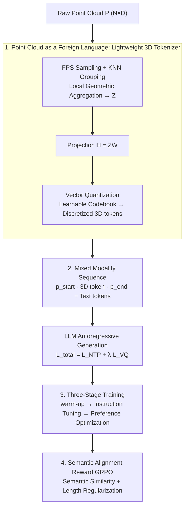

# Point Cloud as a Foreign Language for Multi-modal Large Language Model

**Conference**: CVPR 2026  
**Paper**: [CVF Open Access](https://openaccess.thecvf.com/content/CVPR2026/html/Paul_Point_Cloud_as_a_Foreign_Language_for_Multi-modal_Large_Language_CVPR_2026_paper.html)  
**Code**: https://github.com/snehaputul/SAGE3D  
**Area**: Multimodal VLM / 3D Vision  
**Keywords**: 3D MLLM, encoder-free, point cloud tokenizer, vector quantization, GRPO preference optimization

## TL;DR
SAGE is the first end-to-end 3D multimodal large language model that **does not require a pre-trained 3D encoder**. It utilizes a lightweight "3D tokenizer" to discretize raw point clouds into tokens through geometric sampling and vector quantization. This allows the 3D tokens to be expanded directly into the LLM vocabulary like a "foreign language." Combined with a GRPO preference optimization framework driven by semantic alignment rewards, SAGE outperforms encoder-dependent models like PointLLM and ShapeLLM in 3D captioning, classification, and question-answering, while achieving 2.3x faster inference and exhibiting robust adaptability to point cloud resolution variations.

## Background & Motivation
**Background**: The mainstream paradigm for extending LLMs to 3D understanding (3D MLLMs) is "encoder-dependent"—relying on a pre-trained 3D encoder (such as Point-BERT) to extract geometric features, which are then mapped into the LLM's input space using a projection module. Representative works include PointLLM, ShapeLLM, and 3D-LLaVA.

**Limitations of Prior Work**: This "heavy encoder + projection" design suffers from three inescapable issues:
1. **Semantic misalignment**: 3D encoders are trained with self-supervised or contrastive loss, targeting "geometric discriminability" rather than "language alignment." The extracted embeddings are inherently incompatible with the LLM's language space, and a simple projection layer cannot bridge this gap; additionally, this assumes the availability of large-scale pre-trained encoders, which is unrealistic for data-scarce domains.
2. **Resolution mismatch**: Encoders assume a fixed number of input points (e.g., 8192 points in Point-BERT), but real-world point cloud densities vary widely. Forcing dense point clouds to downsample discards fine details, while upsampling sparse point clouds introduces geometric artifacts.
3. **Computational overhead**: The massive 3D encoder must process the point cloud completely before the LLM can begin generation, slowing down inference.

**Key Challenge**: The representative capacity brought by the encoder is tightly coupled with the "semantic misalignment + resolution rigidity + inference bottleneck" it causes. These three issues cannot be solved as long as a pre-trained encoder is utilized.

**Goal**: Is it possible to completely **discard the pre-trained encoder** and learn 3D representations and the LLM jointly and end-to-end? Note that "encoder-free" does not mean "parameter-free"—the tokenizer still contains a small number of learnable parameters, but it is far smaller than a full encoder.

**Key Insight**: A direct solution exists in 2D vision—either directly projecting image patches into LLMs (e.g., Fuyu, EVE) or discretizing images into tokens using VQ tokenizers. However, these methods **cannot be directly transferred to 3D**: point clouds lack a regular grid topology, and patchification discards local geometric structures and spatial relationships between points, which are the very foundation of 3D understanding.

**Core Idea**: Treat point clouds as a "foreign language." The authors design a lightweight 3D tokenizer that preserves local structure through geometric sampling, and then discretizes continuous geometric features into a finite set of "3D words" via vector quantization, serving as a natural extension of the LLM vocabulary. Meanwhile, a semantic alignment reward is specifically designed for descriptive (unverifiable) 3D QA, introducing GRPO reinforcement learning to boost complex reasoning.

## Method

### Overall Architecture
SAGE (Spatial-Aware GEnerative model) aims to end-to-end generate textual responses given a raw point cloud $P \in \mathbb{R}^{N\times D}$ ($D=6$ including xyz+rgb) and a natural language question $q$, without touching any pre-trained 3D encoder. The entire pipeline consists of: "point cloud $\rightarrow$ discretized into 3D tokens via a lightweight tokenizer $\rightarrow$ concatenated with text tokens into a mixed sequence $\rightarrow$ autoregressive generation in LLM." The model capabilities are developed through a three-stage training process, topped with GRPO utilizing semantic alignment rewards to enhance descriptive reasoning.

The diagram below integrates the architecture (three steps inside the tokenizer) and the training pipeline:

### Key Designs

**1. Point Cloud as a Foreign Language: Lightweight 3D Tokenizer**

This serves as the foundation of the work, directly addressing the twin pain points of "semantic misalignment" and "computational overhead." Instead of employing a heavy encoder to extract features followed by a harsh projection, a small tokenizer is trained to **discretize the point cloud into tokens as a vocabulary**, allowing the LLM to learn how to comprehend it directly within the language space. The tokenizer operates in three steps. First, **geometric sampling and grouping**: For dense point clouds, Farthest Point Sampling (FPS) is used to select $N_s$ representative center points. For each center, K-Nearest Neighbors (KNN) is applied to find the $K_g$ nearest neighbors to form local sub-clouds. These sub-clouds are then passed through a local geometric aggregation module—which projects point features into a geometric feature space, adds relative positional encodings, and performs global max-pooling on each sub-cloud—to obtain a compact latent representation $Z \in \mathbb{R}^{M\times d_g}$. This step preserves "local geometry and relative spatial relationships between points," which is precisely what patchification fails to do. Second, **projection** to the language space: $H = ZW \in \mathbb{R}^{M\times d_{llm}}$. Third, **vector quantization (VQ)**: A learnable codebook $C=\{e_k\}_{k=1}^{C}$ is utilized to map each continuous feature $h_i$ to its nearest codeword:

$$q(h_i)=\arg\min_k \lVert h_i - e_k\rVert_2^2,\quad H_q=\{e_{q(h_i)}\}_{i=1}^{M}$$

Consequently, continuous geometric features are discretized into "3D words" within a finite vocabulary. In the paper, $N_s=512$, $K_g=81$, and the codebook size is 8192. This VQ step is key to realizing the "foreign language" metaphor: it forces geometric representations to align with an enumerable set of discrete primitives, enabling the LLM to process them like sub-words rather than dealing with a cluster of continuous vectors.

**2. Mixed-Modality Sequences and End-to-End Joint Objectives**

The quantized 3D tokens no longer require additional alignment modules and are **directly concatenated with text tokens** into a mixed sequence fed to the LLM:

$$[\langle\text{p\_start}\rangle,\, e_{q(h_1)},\dots,e_{q(h_M)},\, \langle\text{p\_end}\rangle,\, w_1,\dots,w_L]$$

where $\langle\text{p\_start}\rangle$ and $\langle\text{p\_end}\rangle$ are newly introduced special tokens used to demarcate the boundaries of point cloud segments within the language stream. Since the $\arg\min$ in VQ is non-differentiable, the training utilizes the VQ loss to bypass this:

$$L_{VQ}=\underbrace{\lVert \text{sg}[H]-H_q\rVert_2^2}_{\text{codebook loss}}+\beta\underbrace{\lVert H-\text{sg}[H_q]\rVert_2^2}_{\text{commitment loss}}$$

$\text{sg}[\cdot]$ is the stop-gradient operator: the former term pulls the codebook towards the projected features, and the latter term constrains the projected features from drifting away from the codebook (the paper uses $\beta=0.25$). The overall framework optimizes the total end-to-end objective $L_{total}=L_{NTP}+\lambda L_{VQ}$ ($\lambda=0.5$), where $L_{NTP}$ is the Next-Token Prediction loss computed only on the response tokens. The beauty of this design lies in the fact that 3D representation and language generation share the same set of gradients, allowing **discrete 3D primitives that are both geometrically valid and semantically aligned with language to naturally emerge** in the codebook, fundamentally eliminating the mismatch of "encoder objective $\neq$ language objective."

**3. Three-Stage Training Pipeline**

Architecture alone is not enough; the authors divide the training into three stages, each addressing a specific goal, to prevent the newly initialized tokenizer and the LLM from interfering with each other at the beginning. **Stage I: 3D Tokenizer Warm-up**: On 3D captioning data, only the tokenizer module and the first four transformer layers of the LLM are jointly trained (the rest are frozen) using the next-token prediction objective to align the geometric token embeddings to the language representation space, stabilizing early multimodal interactions. **Stage II: Instruction Tuning**: The entire model (tokenizer + LLM) is unfrozen and fine-tuned end-to-end using multimodal instruction-response pairs to strengthen cross-modal reasoning and instruction following. **Stage III: Preference Optimization**: Building on the first two stages, the GRPO method in Key Design 4 is deployed to further boost descriptive 3D reasoning. Notably, only the preference-optimized version is named SAGE, while the standard two-stage version without it is denoted as SAGE→. Both versions are reported to separate the "gains from the encoder-free architecture itself" from the "additional gains brought by preference optimization."

**4. GRPO Preference Optimization Driven by Semantic Alignment Reward**

The pain point is very specific: RL methods like GRPO originally rely on "verifiable rewards"—such as the correctness of math problems compared against ground-truth answers. However, responses in 3D QA are **descriptive**, where the same object can be correctly described in various ways, meaning there is no unique ground-truth answer, rendering verification-style rewards completely ineffective. To address this, the authors construct a continuous and interpretable composite reward. For each (question, point cloud) pair, the model samples a group of $m$ candidate answers $\{y_i\}$, and compares each against the reference answer $y_{ref}$. The **semantic term** computes the cosine similarity after encoding using a pre-trained sentence encoder (Sentence-BERT) $E(\cdot)$:

$$s_i^{(sem)}=\frac{E(y_i)\cdot E(y_{ref})}{\lVert E(y_i)\rVert_2\,\lVert E(y_{ref})\rVert_2}$$

This rewards answers that are "semantically close to the reference," even if the wording differs. The **length term** prevents responses from being too short or too long:

$$s_i^{(len)}=\exp\!\left(-\frac{(L_i-L_{ref})^2}{2\sigma^2}\right)$$

which reaches its maximum when $L_i=L_{ref}$ and smoothly decays with length deviation. The composite reward is $s_i=\gamma\, s_i^{(sem)}+(1-\gamma)\,s_i^{(len)}$ ($\gamma=0.95$, with semantics as the primary term). After obtaining the group scores, the intra-group normalized advantage is calculated:

$$A_i=(s_i-\bar s)/\sqrt{\frac1m\sum_j(s_j-\bar s)^2+\epsilon}$$

The GRPO objective is formulated as $L_{GRPO}=-\frac1m\sum_i A_i\log\pi_\theta(y_i\mid q,P)$, which scales up the probability of relatively better responses within the group. Furthermore, GRPO eliminates the explicit reward model required by PPO, utilizing the model's own likelihood to deduce relative preferences, making training more stable and cost-effective. This step successfully integrates "descriptive, non-verifiable" open-ended 3D reasoning into the scope of RL optimization.

## Key Experimental Results

The backbone utilizes LLaMA (initialized from Vicuna-7B v1.1), trained on 4$\times$H100 GPUs. The training dataset consists of PointLLM's 730K point-text pairs (660K Objaverse objects + 70K GPT-4 synthesized complex instructions). Evaluation spans 3D captioning (Objaverse), 3D open-vocabulary classification, and 3D question answering (MM-Vet).

### Main Results

| Task / Metric | PointLLM-13B | ShapeLLM-13B | SAGE-7B→ | SAGE-7B | SAGE-13B |
|------|------|------|------|------|------|
| Captioning GPT-4 | 48.15 | 48.94 | 49.05 | 50.98 | **52.87** |
| Captioning Sentence-BERT | 47.91 | 48.52 | 49.23 | 50.11 | **51.91** |
| Captioning BLEU-1 | 3.83 | – | 7.41 | 9.50 | **9.72** |
| Captioning ROUGE-L | 7.23 | – | 10.25 | 12.66 | **13.25** |
| Classification GPT-4 | 54.00 | 54.00 | 55.71 | 57.11 | **58.48** |
| VQA (MM-Vet) GPT-4 | 46.60 | 53.10 | 46.38 | 49.53 | **54.89** |

- Even SAGE-7B→, **which lacks preference optimization**, outperforms encoder-dependent PointLLM/ShapeLLM on Captioning GPT-4 (49.05) and nearly doubles the BLEU-1 score (7.41 vs. 3.83)—demonstrating that discrete 3D tokens yield more precise language alignment.
- SAGE with preference optimization moves up another level across the board, with the 13B model improving over ShapeLLM-13B by +3.93 in Captioning GPT-4, +4.48 in Classification, and +1.79 in VQA.

### Efficiency & Robustness

| Model | Latency (ms) ↓ | Throughput (samples/s) ↑ |
|------|------|------|
| PointLLM-7B | 239 | 4.2 |
| SAGE-7B | **100** | **10.0** |

- On 8K points with an H100 GPU, SAGE's inference latency is **more than 2.3x faster** and throughput is 2.4x higher compared to PointLLM—directly stemming from the elimination of the heavy geometric encoder preprocessing phase.
- **Resolution Robustness** (Figure 4, 2K/4K/8K points): Since PointLLM is constrained to a fixed input resolution, low-resolution inputs require upsampling, leading to a sharp drop in performance. SAGE natively supports variable resolutions, experiencing only a minor performance decline under lower resolutions, while its throughput increases from 10.0 to 11.0 as the number of tokens decreases.

### Key Findings
- **Encoder-free design itself wins**: SAGE→ already outperforms encoder-based approaches under identical training protocols. The authors argue that "the feature misalignment between pre-trained 3D encoders and the LLM's input space is too severe to be bridged by a single projection layer," whereas the jointly learned discrete tokenizer representation space is more coherent.
- **Preference optimization yields the largest gains for complex tasks**: The performance leap of SAGE over SAGE→ is particularly pronounced in descriptive tasks like captioning and VQA, verifying that semantic-alignment-reward-driven RL indeed bridges the gap for "unverifiable replies."
- **Backbone Generalization**: The method yields consistent improvements across 7B and 13B models, is not tied to any specific 3D encoder, and migrates more freely across different LLM backbones.

## Highlights & Insights
- **Translating "Point Cloud as a Foreign Language" from a Metaphor to Reality**: While many works metaphorically claim "vision is another language," SAGE actually discretizes point clouds into an extension of the LLM vocabulary through VQ and a learnable codebook. It also specifically explains why 2D patchification fails in 3D (loss of local geometry)—providing high value in its argumentation of "why we cannot simply copy 2D approaches."
- **Formulating Continuous Rewards for Descriptive Tasks**: Adapting GRPO from "verifiable math problems" to "open-ended 3D description" using Sentence-BERT semantic similarity combined with Gaussian-based length rewards establishes a reward design paradigm that can be generalized to any target-rich generation task (such as image captioning, dialogue, or summarization) where correct answers are non-unique.
- **Efficiency is a Direct Motivation, Not a Gimmick**: Removing the encoder while gaining 2.3x speedup and resolution robustness simultaneously solves three pain points (misalignment, resolution rigidity, and overhead) in a single, clean causal chain.

## Limitations & Future Work
- **Still reliant on reference answers**: The semantic alignment reward requires $y_{ref}$ and essentially guides the model "closer to the reference." In truly open-ended scenarios without high-quality references, the reward may distort, and the semantic similarity measured by Sentence-BERT has inherent limits, potentially rewarding responses that "sound correct" but contain factual errors.
- **Sensitivity to codebook and hyperparameters**: Hyperparameters such as the codebook size of 8192, $N_s=512$, and $K_g=81$ are empirically set. The paper places its sensitivity analysis in the appendix rather than the main text, and codebook utilization/collapse (a common issue in VQ) is left undiscussed in the main section.
- **Evaluation biased toward object level**: Training and evaluation primarily focus on Objaverse single-object point clouds. Thus, generalization to scene-level or large-scale indoor point clouds (featuring multiple objects and dense spatial associations) remains unverified.
- **Future directions**: Integrating reference-free rewards (such as self-consistency or fact-checking) into preference optimization, and expanding to scene-level point clouds and downstream embodied AI/robotics tasks, aligns with the authors' vision of a "shared language space for 2D, 3D, and language."

## Related Work & Insights
- **vs. PointLLM / ShapeLLM**: These follow the encoder-dependent paradigm (pre-trained 3D encoder + projection module), whereas SAGE discards the encoder entirely in favor of a jointly trained discrete tokenizer. The core difference lies in "whether representation is external or grows natively with the LLM." SAGE's advantages lie in its elimination of misalignment, fast speed, and resistance to resolution issues, at the cost of requiring the tokenizer to be trained from scratch.
- **vs. Fuyu / EVE (2D encoder-free)**: While these are also encoder-free models that project vision into LLMs, they rely on patchification or simple projection, which causes a loss of local geometry when applied to 3D. SAGE uses FPS+KNN+VQ to explicitly defend the spatial structure of point clouds.
- **vs. ENEL (concurrent encoder-free 3D work)**: Operating in the same direction, ENEL relies on a tokenizer with a large parameter size, whereas SAGE maintains a "lightweight" design as its primary advantage over ENEL.
- **vs. Standard GRPO (mathematical reasoning)**: Traditional GRPO relies on verifiable rewards. SAGE adapts it to descriptive, non-unique 3D QA through a composite semantic alignment and length reward.

## Rating
- Novelty: ⭐⭐⭐⭐⭐ First end-to-end encoder-free 3D MLLM; both "point cloud as a foreign language" and GRPO for descriptive tasks exhibit strong originality.
- Experimental Thoroughness: ⭐⭐⭐⭐ Three tasks, efficiency, and resolution robustness are well covered, with clear ablation between SAGE→ and SAGE. However, scene-level generalization and codebook collapse analysis are missing.
- Writing Quality: ⭐⭐⭐⭐⭐ The causal link from pain points to motivation and methodology is highly logical, with equations and training pipelines comprehensively detailed.
- Value: ⭐⭐⭐⭐⭐ Proposes a practical path of being "encoder-free + faster + more robust" for 3D MLLMs, and the reward design paradigm is highly transferable to other open-ended generation tasks.

<!-- RELATED:START -->

## Related Papers

- [\[CVPR 2026\] VLM-Loc: Localization in Point Cloud Maps via Vision-Language Models](vlm-loc_localization_in_point_cloud_maps_via_vision-language_models.md)
- [\[CVPR 2026\] Multi-SpatialMLLM: Multi-Frame Spatial Understanding with Multi-Modal Large Language Models](multi-spatialmllm_multi-frame_spatial_understanding_with_multi-modal_large_langu.md)
- [\[CVPR 2026\] M3DocDep: Multi-modal, Multi-page, Multi-document Dependency Chunking with Large Vision-Language Models](m3docdep_multi-modal_multi-page_multi-document_dependency_chunking_with_large_vi.md)
- [\[CVPR 2025\] Generalized Few-Shot 3D Point Cloud Segmentation with Vision-Language Model](../../CVPR2025/multimodal_vlm/generalized_few-shot_3d_point_cloud_segmentation_with_vision-language_model.md)
- [\[ICCV 2025\] Exploiting Vision Language Model for Training-Free 3D Point Cloud OOD Detection](../../ICCV2025/multimodal_vlm/exploiting_vision_language_model_for_training-free_3d_point_cloud_ood_detection_.md)

<!-- RELATED:END -->
