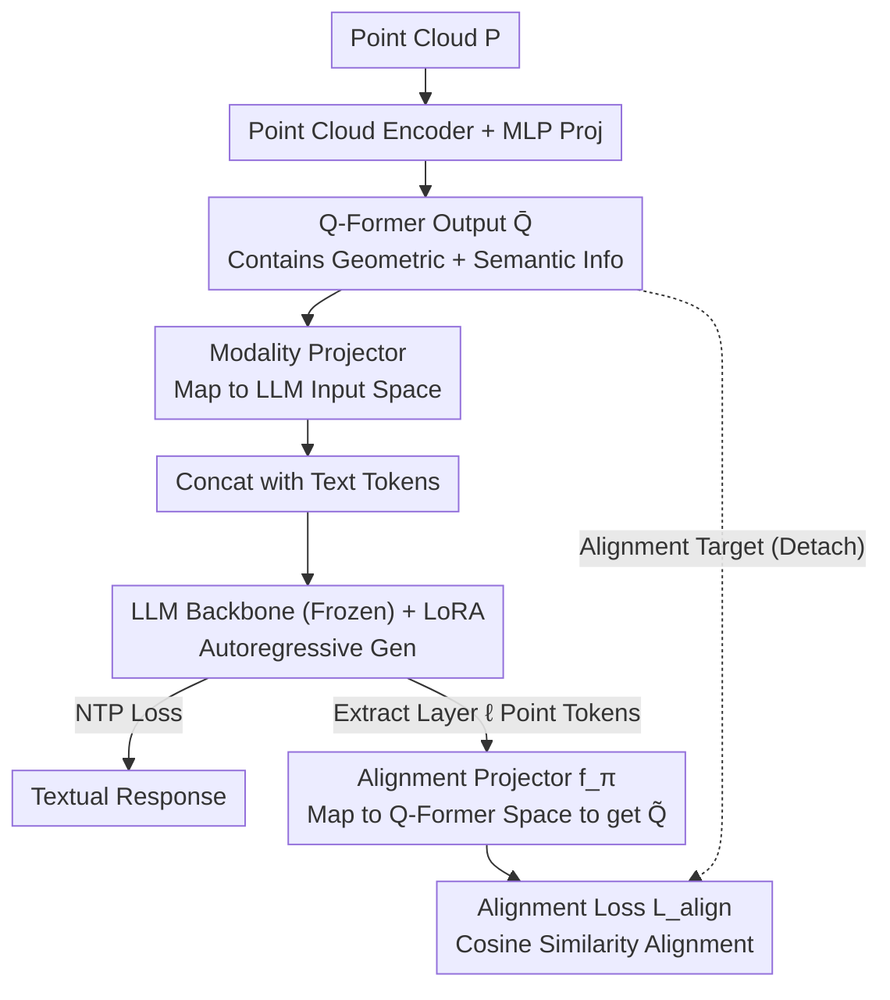

# PointAlign: Feature-Level Alignment Regularization for 3D Vision-Language Models

**Conference**: CVPR 2026  
**arXiv**: [2603.00412](https://arxiv.org/abs/2603.00412)  
**Code**: [https://github.com/yharoldsu0627/PointAlign](https://github.com/yharoldsu0627/PointAlign)  
**Area**: Multimodal VLM  
**Keywords**: 3D point cloud understanding, Vision-language models, Feature alignment, Geometry preservation, Regularization

## TL;DR
PointAlign is proposed to apply feature-level alignment regularization on point cloud tokens in the intermediate layers of a 3D VLM's LLM (aligned with Q-Former outputs). By training only lightweight alignment projectors and LoRA adapters, it effectively prevents the degradation of geometric information during language modeling, achieving a 7.50pp improvement in open-vocabulary classification.

## Background & Motivation
**Background**: 3D Vision-Language Models (3D VLMs) are crucial for applications such as robotics, autonomous driving, and AR, yet they are constrained by the scarcity of 3D-text paired data.

**Limitations of Prior Work**: Existing methods (PointLLM, ShapeLLM, MiniGPT-3D) rely solely on next-token prediction (NTP) loss for training, where only language tokens provide supervision signals. This results in:
   - Low efficiency in utilizing limited 3D data.
   - Gradual degradation and loss of valuable geometric information in intermediate representations as they propagate through different LLM layers.

**Key Challenge**: The language modeling objective only rewards geometric features that directly contribute to predicting the next token, while structural cues useful for spatial reasoning but irrelevant to the current language task are discarded during training.

**Goal**: To maintain fine-grained 3D geometric-semantic information by explicitly supervising point cloud tokens in intermediate LLM layers without increasing inference overhead.

**Key Insight**: It is observed that the features output by the Q-Former contain both geometric and semantic information (due to point cloud-text alignment pre-training), serving as an ideal internal supervision target.

**Core Idea**: A consistency loss is used to align point cloud tokens in intermediate LLM layers with frozen Q-Former outputs via a lightweight alignment projector. The projector is discarded during inference, incurring zero additional overhead.

## Method

### Overall Architecture
PointAlign aims to solve the problem of progressive degradation of geometric information as it propagates through LLM layers in 3D VLMs. It modifies two-stage training: Stage 1 involves MiniGPT-3D pre-training; Stage 2 freezes the encoder, Q-Former, and modality projector, training only LoRA and an additional alignment projector. A cosine alignment loss pulls the point cloud tokens from the intermediate LLM layers toward the frozen Q-Former outputs. While the forward backbone (Point Cloud → Encoder → Q-Former → Modality Projector → LLM) follows MiniGPT-3D, PointAlign adds an auxiliary alignment branch at layer $\ell$ of the LLM: point cloud tokens are extracted, mapped back to the Q-Former space via the alignment projector, and aligned with the frozen Q-Former outputs using cosine similarity. Crucially, the alignment projector is used only during training and discarded during inference, ensuring no extra computational cost.

### Key Designs

**1. Alignment Target: Q-Former Output $\bar{Q}$ preserves both geometric and semantic info**

Why Q-Former? Point cloud encoder outputs capture geometric features but lack semantics; deep LLM representations may have already discarded 3D information. The Q-Former, trained on point cloud-text pairs under direct supervision, preserves the most comprehensive geometric and semantic information, making it the ideal internal supervision target. This is validated by ablation studies (Alignment to Q-Former: 71.00, vs. Encoder: 67.50, vs. deep LLM layers: 68.25).

**2. Alignment Projector $f_\pi$: Lightweight 3-layer mapping, training-only**

Intermediate point cloud tokens and Q-Former features reside in different spaces, requiring a bridge. $f_\pi$ consists of 3 Linear layers with SiLU activations, mapping point cloud tokens $T_{pc}^{(\ell)}$ from LLM layer $\ell$ back to the Q-Former feature space ($\mathbb{R}^C \to \mathbb{R}^{d_h} \to \mathbb{R}^{d_h} \to \mathbb{R}^{D_1}$), with only 8.39M parameters. It is entirely discarded during inference, resulting in zero overhead—a pattern similar to auxiliary heads in knowledge distillation.

**3. Alignment Loss: Cosine Similarity + Q-Former Gradient Detach**

When aligning point cloud tokens with Q-Former outputs, focusing on orientation rather than magnitude is more suitable for cross-space alignment. Thus, a cosine similarity loss is used:

$$\mathcal{L}_{align} = -\frac{1}{o}\sum_{i=1}^{o} \frac{\tilde{Q}_i^\top \bar{Q}_i}{\|\tilde{Q}_i\|_2 \|\bar{Q}_i\|_2}$$

The gradient of the Q-Former output $\bar{Q}$ is detached to prevent backpropagation from altering frozen modules. The total loss is $\mathcal{L}_{total} = \mathcal{L}_{ntp} + \lambda \mathcal{L}_{align}$, allowing joint optimization of language modeling and geometric preservation objectives.

### Loss & Training
In Stage 2, $\mathcal{L}_{total} = \mathcal{L}_{ntp} + \lambda \mathcal{L}_{align}$ is used to jointly train LoRA and the alignment projector. Only a minimal number of parameters are updated.

## Key Experimental Results

### Main Results (3D Object Classification)

| Model | LLM Size | ModelNet40 Avg | Objaverse Avg | Overall Avg |
|------|---------|:---------:|:---------:|:---------:|
| PointLLM-7B | 7B | 50.85 | 62.50 | 56.68 |
| PointLLM-13B | 13B | 52.19 | 62.25 | 57.22 |
| MiniGPT-3D (Baseline) | 2.7B | 61.24 | 66.75 | 64.00 |
| **PointAlign (Ours)** | **2.7B** | **61.17** | **71.00** | **66.08** |

### Ablation Study

| Configuration | Objaverse Avg | Note |
|------|:----------:|------|
| Baseline (MiniGPT-3D) | 66.75 | Without alignment regularization |
| + Align to Encoder Features | 67.50 | Geometric info only, limited gain |
| + Align to Q-Former Output | **71.00** | Geometric + Semantic, optimal result |
| + Align to Deep LLM Features | 68.25 | Some 3D info already lost |

### Key Findings
- Achieved a **7.50pp** improvement (66.75→71.00 on 2-prompt avg) in challenging open-vocabulary Objaverse classification and a **4.88pp** gain in 3D captioning.
- Performance remained stable on ModelNet40 (-0.07pp), indicating that alignment regularization primarily aids in difficult or open-set scenarios.
- The 2.7B model outperformed the 13B PointLLM, demonstrating superior data efficiency.
- Selection of alignment layer $\ell$: Intermediate layers work best; layers that are too shallow or too deep yield suboptimal results.

## Highlights & Insights
- **Zero-Inference-Overhead Training Technique**: The alignment projector is used only during training. This design pattern is worth adopting in other VLMs (similar to auxiliary heads in distillation).
- **3D Extension of 2D VLM Research**: Research in 2D VLMs has shown that visual representations degrade in deep layers without explicit vision supervision; this work extends this finding to 3D point clouds and provides a solution.
- **Data Efficiency**: Under extreme 3D data scarcity, internal alignment regularization maximizes the utility of limited data.

## Limitations & Future Work
- Using MiniGPT-3D as a base implies that the small model scale may limit the performance ceiling.
- The alignment layer $\ell$ requires manual tuning, and different architectures may necessitate different settings.
- Only single-object understanding was validated; scene-level multi-object 3D understanding remains unexplored.
- Future work could explore multi-layer alignment (aligning multiple layers instead of just one) or dynamic layer selection.

## Related Work & Insights
- **vs. PointLLM**: PointLLM uses full-model fine-tuning for 3D-text alignment with high computational costs (200+ GPU-hours); PointAlign exceeds its performance by training significantly fewer parameters.
- **vs. 2D VLM Representation Supervision**: Reconstruction-based methods in 2D (recovering visual inputs) capture low-level textures; 3D requires capturing structural relationships and geometric configurations, making direct alignment with Q-Former semantic features more appropriate.

## Rating
- Novelty: ⭐⭐⭐ Clear intuition but moderate technical innovation.
- Experimental Thoroughness: ⭐⭐⭐⭐ Comprehensive ablation and convincing feature quality visualization.
- Writing Quality: ⭐⭐⭐⭐ Well-structured with clear motivation.
- Value: ⭐⭐⭐⭐ Provides practical guidance for the 3D VLM community.

<!-- RELATED:START -->

## Related Papers

- [\[CVPR 2026\] Proxy3D: Efficient 3D Representations for Vision-Language Models via Semantic Clustering and Alignment](proxy3d_efficient_3d_representations_for_vision-language_models_via_semantic_clu.md)
- [\[CVPR 2026\] The Geometry of Robustness: Optimizing Loss Landscape Curvature and Feature Manifold Alignment for Robust Finetuning of Vision-Language Models](the_geometry_of_robustness_optimizing_loss_landscape_curvature_and_feature_manif.md)
- [\[CVPR 2026\] HiSpatial: Taming Hierarchical 3D Spatial Understanding in Vision-Language Models](hispatial_taming_hierarchical_3d_spatial_understanding_in_vision-language_models.md)
- [\[CVPR 2026\] Predictive Regularization Against Visual Representation Degradation in Multimodal Large Language Models](predictive_regularization_against_visual_representation_degradation_in_multimoda.md)
- [\[CVPR 2026\] HOG-Layout: Hierarchical 3D Scene Generation, Optimization and Editing via Vision-Language Models](hog_layout_hierarchical_3d_scene_generation_optimization_and_editing.md)

<!-- RELATED:END -->
