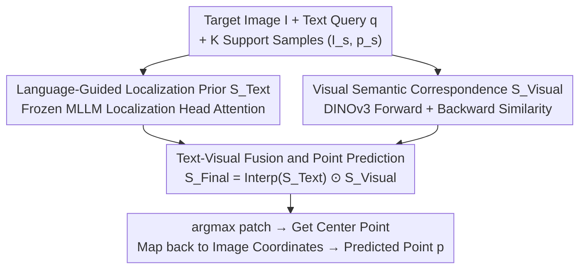

# Pointing at Parts: Training-Free Few-Shot Grounding in Multimodal LLMs

**Conference**: CVPR 2026  
**Paper**: [CVF Open Access](https://openaccess.thecvf.com/content/CVPR2026/html/Tsai_Pointing_at_Parts_Training-Free_Few-Shot_Grounding_in_Multimodal_LLMs_CVPR_2026_paper.html)  
**Code**: To be confirmed  
**Area**: Multimodal VLM  
**Keywords**: Part-level pointing, training-free, few-shot, attention maps, visual semantic correspondence

## TL;DR
POP is a training-free, plug-and-play method that performs element-wise fusion of language-guided attention maps from MLLMs (providing semantic and referential capabilities but remaining coarse) and bidirectional visual correspondences of self-supervised DINOv3 features (precise but ambiguous with multiple objects). This allows MLLMs to achieve precise **part-level** (e.g., "laptop keyboard") rather than just instance-level pointing in few-shot settings. It improves average scores by up to 8.9 points in 1-shot and 16.4 points in 3-shot across three datasets; even MLLMs without native pointing capabilities see gains of up to 30.9 points.

## Background & Motivation

**Background**: Pointing (precise spatial localization) is the most universal non-verbal communication method. A model capable of pointing can enable embodied agents to navigate/manipulate or allow GUI agents to click buttons directly. Recent MLLMs (Molmo, Qwen2.5-VL, Ovis2.5) can already achieve pointing by generating pixel coordinates via text.

**Limitations of Prior Work**: Existing MLLMs mostly perform well at **instance-level** pointing (pointing to the entire object) but struggle with **part-level** pointing (pointing to specific regions like "laptop keyboard" or "bottle neck"). Part-level pointing unlocks affordances—crucial for robotic grasping, fine-grained image/video editing, defect detection, and anatomical structure annotation.

**Key Challenge**: Transitioning from instance-level to part-level is more difficult for two reasons: (1) the target shrinks from an entire object to a specific region, requiring finer granularity; (2) part concepts and boundaries are inherently fuzzy (e.g., the "neck" and "shoulder" of a bottle are spatially adjacent and hard to distinguish). Single signals are insufficient: the authors observe that MLLM attention maps (from localization heads) provide semantics and reference but are coarse—querying "neckband" activates the correct area, but the peak score often falls on the "body." Conversely, pure visual DINOv3 patch correspondences capture fine-grained part information but lack referential ability—when two similar sweaters appear, all corresponding areas light up simultaneously, failing to disambiguate.

**Goal**: Enable MLLMs to perform precise part-level pointing in few-shot settings without any post-training.

**Key Insight**: Since MLLM attention maps (semantics + reference) and DINOv3 visual correspondence (precise local matching) are **complementary**, they should be fused. The former identifies "which part of which object," while the latter "precisely targets the specific patch." Few-shot exemplars (support image + point) are used to bridge the two, avoiding exhaustive labeling or precise terminology.

**Core Idea**: A training-free approach that performs element-wise multiplication of the language-guided localization prior $S_{Text}$ and bidirectional visual semantic correspondence $S_{Visual}$ to obtain a semantically consistent and precise part-level localization map, with the center of the highest-scoring patch used as the predicted point.

## Method

### Overall Architecture
POP solves $K$-shot part-level pointing: each episode provides a target image $I$, a text query $q$ describing the target part (e.g., "handle of the mug"), and $K$ support samples $(I_s, p_s)$ (support image + annotated point), to predict a point $p$ matching $q$ in the coordinate system of $I$. The workflow consists of two parallel branches and one fusion: the left branch extracts the **language-guided localization prior** $S_{Text}$ (coarse semantic localization) from frozen MLLM localization heads; the right branch calculates **bidirectional visual semantic correspondence** $S_{Visual}$ (precise local matching) between support and target images using DINOv3. After resolution alignment, the two maps are multiplied element-wise to form the final map $S_{Final}$. The center of the highest-scoring patch is mapped back to the original coordinates as the predicted point. No weights are updated during this process.

### Key Designs

**1. Language-Guided Localization Prior $S_{Text}$: Coarse Semantic Localization via MLLM Localization Heads**

To address the bottleneck where "pure visual correspondence lacks referential ability and cannot distinguish between objects," POP first extracts semantic signals from a frozen MLLM. Following prior findings that a small subset of **localization heads** in MLLMs consistently focus attention on visual tokens best describing the query text, the method takes the attention of the last query token over all image tokens (using the top-3 selected localization heads), reshapes it to $R^{H_l\times W_l}$, applies Gaussian filtering for smoothing, and aggregates them via element-wise summation to form $S_{Text}\in R^{H_l\times W_l}$. The value of this branch lies in its **semantic and referential capability**—knowing which object's part the query refers to. However, its localization is coarse (as seen in the "neckband" vs. "body" example), making it a prior that requires refinement by the visual branch. Ablations (Tab.5) show that the aggregation method is critical: using localization heads yields 55.8, while mean pooling gives 53.1 and max pooling drops to 49.8 (lower than the 51.2 baseline without it).

**2. Bidirectional Visual Semantic Correspondence $S_{Visual}$: Precise Local Matching via DINOv3 Forward + Backward Similarity**

To address the "coarse localization of MLLM attention maps," POP establishes patch-level correspondence between support and target images using DINOv3. Visual encoders process both images into patch features $z_s, z_t\in R^{H_vW_v\times d_v}$, and a cosine similarity matrix $A_{ij} = \frac{z_s^i\cdot z_t^j}{\|z_s^i\|\|z_t^j\|}$ is calculated. **Forward similarity**: Let $i_s$ be the patch index in the support image containing the annotated point $p_s$, then $S^{Visual\text{-}fwd}_j = A_{i_s j}$, indicating how similar the target patches are to the support patch. **Backward similarity**: For each target patch $z_t^j$, the most similar patch in the support image is found $m(j) = \arg\max_i A_{ij}$, and its similarity to the support patch containing $p_s$ is measured: $S^{Visual\text{-}bwd}_j = \frac{z_s^{i_s}\cdot z_s^{m(j)}}{\|z_s^{i_s}\|\|z_s^{m(j)}\|}$. The intuition is that if a target patch truly belongs to the part, its most similar support patch should also fall on the same part, leveraging the strong self-correlation of self-supervised encoders. The two are fused via element-wise multiplication $S_{Visual} = S^{Visual\text{-}fwd}\odot S^{Visual\text{-}bwd}$ to highlight part regions. Ablations (Tab.6) prove both directions are essential: 54.5 for forward only, 51.8 for backward only, and 55.8 for bidirectional. This branch is precise but lacks reference (multiple similar objects light up), necessitating the text branch for selection.

**3. Text-Visual Fusion and Point Prediction: Logical AND via Element-wise Multiplication**

To address the "insufficiency of single signals," POP multiplies the complementary advantages of both branches. Since the resolutions differ ($S_{Visual}$ is typically higher), $S_{Text}$ is bilinearly interpolated to the size of $S_{Visual}$ before element-wise multiplication:

$$S_{Final} = \mathrm{Interp}(S_{Text})\odot S_{Visual}$$

For few-shot settings, this is extended by multiplying the text map with the visual map of each support image. The benefit of multiplication (over addition) is that only regions where **both** branches yield high scores are preserved. This acts as a logical AND between "correct semantics (text)" and "precise local matching (visual)," automatically filtering out false positives that are "semantically correct but imprecise" or "precise but targeting the wrong object." Finally, $S_{Final}$ is bilinearly upsampled by 2x to reduce quantization error, and the center of the highest-scoring patch is mapped back to the original image coordinates.

### An Example: Localizing the "neckband of the red sweater"
Input: target image (with two similar sweaters) + query "neckband of the red sweater" + one support sample. The text branch $S_{Text}$ highlights the general area of the red sweater, but the peak score wrongly falls on the body. The visual branch $S_{Visual}$ (via forward + backward) precisely highlights the neckbands of both sweaters (precise but ambiguous). After multiplication, only the "red sweater + neckband" region—high in both maps—survives. Text helps select the right sweater, and visual helps pinpoint the neckband. $S_{Final}$ provides a clean single point. Argmax extracts the center, which is mapped to the original image for the prediction.

## Key Experimental Results

### Main Results
Three part segmentation datasets (PACO-LVIS, InstructPart, PartImageNet++) were converted into part-level pointing tasks. Metric: 1 if the predicted point falls within the ground truth part mask, 0 otherwise; mean of five random seeds reported. Below is the part pointing accuracy (%) for point-capable MLLMs at 0/1/3-shot:

| Dataset / Method | Qwen2.5-VL 0→1→3shot | Ovis2.5 0→1→3shot | Molmo 0→1→3shot |
|------|------|------|------|
| Original MLLM (Attention 0-shot) | 47.7 | 47.5 | 51.2 |
| **Ours (POP)** | **51.6 → 61.7** | **53.0 → 61.8** | 55.8 → 62.4 |

Key takeaways: POP 1-shot consistently outperforms original MLLM 0-shot pointing, with average Gains of +8.9 for Qwen2.5-VL, +6.5 for Ovis2.5, and +5.5 for Molmo across three datasets; 3-shot further improves by +16.4, +13.1, and +10.6 respectively. POP also surpasses part-specialized zero-shot segmentation models (VL-Part) and few-shot baselines (Matcher, GF-SAM, in-context learning); the authors find that ICL sometimes even drops performance, likely due to distribution shifts from multi-image inputs.

For **MLLMs without native pointing capabilities** (InternVL-3-8B, Kimi-VL-A3B), POP yields average Gains of +25.3 and +30.9, allowing them to approach zero-shot levels of point-capable MLLMs with just 1-shot. This indicates frozen general-purpose MLLMs can serve as pointing backbones.

### Ablation Study

| Configuration | Key Metric (Molmo-7B-D, PACO Acc%) | Description |
|------|------|------|
| Molmo Original | 51.2 | Starting point |
| POP w/ Max Pooling Aggregation | 49.8 | Wrong aggregation drops performance |
| POP w/ Mean Pooling Aggregation | 53.1 | Suboptimal |
| POP w/ Localization Heads (Ours) | 55.8 | Optimal |
| POP Forward Similarity Only | 54.5 | -1.3 without backward |
| POP Backward Similarity Only | 51.8 | -4.0 without forward |
| POP Bidirectional (Ours) | 55.8 | Full version |

### Key Findings
- **Branches are complementary; fusion is the winner**: The text branch provides semantics/reference but is coarse, while the visual branch is precise but ambiguous. Element-wise multiplication yields both precision and consistency.
- **Bidirectional similarity is necessary**: Forward only (54.5), backward only (51.8), bidirectional (55.8). Forward similarity contributes more, but backward similarity further tightens the localization.
- **Sensitivity to attention aggregation**: Localization heads > Mean Pooling > Max Pooling. Max pooling even performs worse than the baseline, suggesting that selecting the "right" attention heads is more important than using all attention.
- **Complexity increases language importance**: On complex real-world images (PACO), pure DINOv3 lags significantly, and the joint language+visual advantage is maximized. On simpler images, the gap narrows as support samples increase.
- **Support quality matters**: Retrieving semantically similar support samples using DINO's [CLS] token (instead of random selection) provides further Gains (e.g., Ovis2.5 on PACO improves from 53.0 to 57.0).

## Highlights & Insights
- **"Semantics for selection, Vision for precision" fusion**: Using element-wise multiplication as a logical AND between MLLM attention (referential capability) and self-supervised visual correspondence (precise matching) is a clean, training-free paradigm extensible to other fine-grained localization tasks.
- **Completely training-free and plug-and-play**: No weights are updated, and consistent gains are observed across five different MLLM families, even enabling models without native pointing capabilities.
- **Clever design of backward similarity**: Instead of just looking at "what target patches look like the support point," it verifies if the "target patch's most similar support patch also falls on that part," leveraging self-correlation to tighten matches.
- **Multiplication is superior to addition**: Multiplication naturally filters out false positives where only one branch scores high, aligning better with the logic that "both pieces of evidence must hold."

## Limitations & Future Work
- Part concepts are inherently fuzzy (Neck vs. Shoulder), and dataset mask boundaries can be ambiguous; binary "inside-mask" evaluation may not be granular enough for points near boundaries.
- Reliance on support sample quality: Random sampling causes performance fluctuations; [CLS] retrieval helps but adds a retrieval step.
- Strong dependence on external backbones (MLLM localization heads + DINOv3); the quality of localization head identification and DINOv3 features determines the upper bound.
- Future directions: Adaptive weighting of branches (more language for complex scenes, more vision for simple ones), extension to video/3D part pointing, and expanding single-point support to richer part prompts.

## Related Work & Insights
- **vs. F-LMM / Kang et al. (Attention Localization)**: They use frozen MLLM attention maps for instance-level grounding; POP inherits the localization head concept but adds few-shot visual correspondence to handle the harder part-level task.
- **vs. Matcher / GF-SAM (Training-free Few-shot Segmentation)**: These use DINOv2 + SAM for patch-level segmentation but are purely visual, lack language reference, and require full support masks. POP requires only a single support point and integrates language.
- **vs. Molmo / Qwen2.5-VL / RoboPoint (Pointing MLLMs)**: These learn instance-level pointing via post-training. POP adds part-level capability training-free and benefits models without native pointing.
- **vs. In-Context Learning (ICL) baselines**: Directly feeding samples into the context sometimes causes performance drops; POP utilizes samples through explicit visual correspondence rather than context stacking, proving more stable and precise.

## Rating
- Novelty: ⭐⭐⭐⭐ Training-free fusion of MLLM attention and DINOv3 bidirectional correspondence for part-level pointing is a novel combination with solid observations; individual components are mostly existing technologies.
- Experimental Thoroughness: ⭐⭐⭐⭐⭐ Three datasets × five MLLMs × 0/1/3-shot + multiple ablations on aggregation/similarity/support selection.
- Writing Quality: ⭐⭐⭐⭐ Motivation and complementarity insights are clear; formulas are complete.
- Value: ⭐⭐⭐⭐ Training-free, plug-and-play, and effective even for weak backbones; highly practical for robotic grasping and fine-grained editing.

<!-- RELATED:START -->

## Related Papers

- [\[CVPR 2026\] PAS: A Training-Free Stabilizer for Temporal Encoding in Video LLMs](pas_a_training-free_stabilizer_for_temporal_encoding_in_video_llms.md)
- [\[CVPR 2026\] STiTch: Semantic Transition and Transportation in Collaboration for Training-Free Zero-Shot Composed Image Retrieval](stitch_semantic_transition_and_transportation_in_collaboration_for_training-free.md)
- [\[CVPR 2026\] DRS-GUI: Dynamic Region Search for Training-Free GUI Grounding](drs-gui_dynamic_region_search_for_training-free_gui_grounding.md)
- [\[CVPR 2026\] Training-Only Heterogeneous Image-Patch-Text Graph Supervision for Advancing Few-Shot Learning Adapters](training-only_heterogeneous_image-patch-text_graph_supervision_for_advancing_few.md)
- [\[CVPR 2026\] Mind the Discriminability Trap in Source-Free Cross-domain Few-shot Learning](mind_the_discriminability_trap_in_source-free_cross-domain_few-shot_learning.md)

<!-- RELATED:END -->
