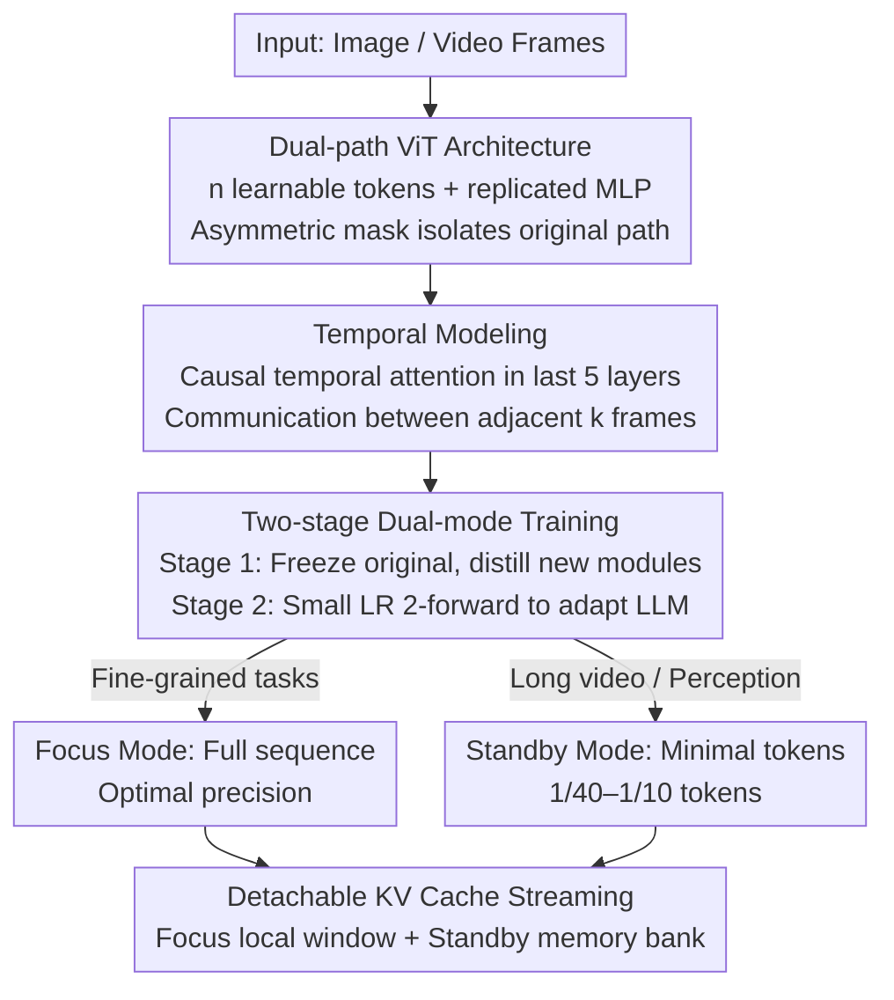

# POINTS-Long: Adaptive Dual-Mode Visual Reasoning in MLLMs

**Conference**: CVPR 2026  
**Paper**: [CVF Open Access](https://openaccess.thecvf.com/content/CVPR2026/html/Wang_POINTS-Long_Adaptive_Dual-Mode_Visual_Reasoning_in_MLLMs_CVPR_2026_paper.html)  
**Code**: The paper states that the model and code will be open-sourced (original text "available at Link"; ⚠️ please refer to the original for the specific address)  
**Area**: Multimodal VLM  
**Keywords**: Visual token compression, long video understanding, dual-mode reasoning, detachable KV Cache, streaming video  

## TL;DR
POINTS-Long equips a pre-trained Multimodal Large Language Model (MLLM) with a "Standby Mode": using a small set of learnable tokens, the entire visual sequence is distilled to 1/40–1/10 of its length. This maintains 97.7%–99.7% of the original accuracy for long video understanding while preserving the high-fidelity "Focus Mode" of the original model. By leveraging a detachable KV Cache, it supports ultra-long streaming videos, achieving up to a 6.2× increase in end-to-end decoding throughput.

## Background & Motivation

**Background**: When MLLMs process images/videos, visual content is divided into a large number of visual tokens before being fed into the LLM. As video length increases, the number of tokens grows, causing LLM prefill computation and KV Cache memory usage to scale quadratically with sequence length. Long videos (thousands of frames) quickly hit context limits. Consequently, the community has developed various visual token compression methods (pixel-shuffle, pooling, Q-Former, resampler, etc.).

**Limitations of Prior Work**: The authors point out three major hurdles for existing compression schemes: (1) **Insufficient compression ratio**: It is difficult to compress thousands of frames to a usable scale without significant performance drops; (2) **Lack of generalizability**: Models are often forced to choose between being "long-video specialists" that sacrifice fine-grained reasoning or "strong reasoning models" that cannot scale; (3) **Deployment difficulties**: Many methods (requiring explicit attention matrices or disrupting KV Cache block structures) are incompatible with modern inference frameworks like FlashAttention, vLLM, or SGLang, preventing theoretical speedups from being realized.

**Key Challenge**: In MLLM design, "efficiency" and "granularity" have long been treated as a **fixed trade-off**—aggressive compression losses accuracy, while high accuracy prevents compression. Once the compression ratio is fixed during training, the model is locked into a specific compromise point.

**Goal**: To transform "whether to compress and how much to compress" from a fixed training trade-off into a **flexible choice at inference time**. This capability must be added without damaging the original model's fine-grained abilities and must remain compatible with mainstream inference frameworks.

**Key Insight**: The authors draw inspiration from the human visual system, which naturally operates in two modes: a high-fidelity **Focus Mode** for processing current details and a low-power **Standby Mode** for long-term coarse perception. Memory is similarly divided into precise immediate playback, blurred short-term memory, and semantic long-term archiving. This inspired an architecture: precise buffers for the present, compressed cache for the near past, and conceptual archiving for the long term.

**Core Idea**: Natively install a "dual-mode visual system" on a pre-trained MLLM. The Focus Mode uses the full visual sequence for optimal precision, while the Standby Mode uses a minimal set of distilled tokens for global perception. The two modes combine via a detachable KV Cache to form a human-like memory of "high-fidelity present + compressed short-term," achieving both fine-grained reasoning and long-video scalability within a single model.

## Method

### Overall Architecture
POINTS-Long is based on POINTS1.5-8B-Instruct (an MLLM comparable to Qwen2.5-VL, using Qwen2-VL-ViT and Qwen3-8B-base). The approach inserts a set of new modules into the visual backbone (ViT) and projector to distill the original sequence into $n$ "Standby tokens," ensuring the original reasoning path remains untouched. A two-stage post-training phase integrates this new mode into the LLM. The final model can switch between Focus and Standby modes based on the task and supports streaming long videos via a detachable KV Cache.

The contribution is divided into four steps: **Dual-path ViT architecture** to process standby tokens and original tokens in parallel with physical isolation; **Temporal Modeling** to allow standby tokens from adjacent frames to communicate for higher compression; **Two-stage Dual-mode Training** to first distill the modules and then use 2-forward passes to adapt the LLM; **Detachable KV Cache streaming inference** to manage full cache for near frames and compressed cache for distant frames.

### Key Designs

**1. Dual-path ViT Architecture: Distilling global information without polluting the original path**

The core issue: inserting learnable tokens to summarize an image faces a dilemma—freezing the ViT limits fitting capacity, while unfreezing it alters training dynamics and degrades the original "Focus Mode." The authors follow CLIP by appending $n$ learnable tokens (where $n$ is much smaller than the average sequence length) and **replicate every MLP** in the ViT: original patch tokens use original MLPs, while new tokens use the replicated ones. The projector is mirrored similarly; the only interaction point is the **shared attention block**.

An **asymmetric attention mask** ensures the original path remains unaffected: original tokens only attend to each other, maintaining the exact representation as the original model. Learnable tokens are allowed to attend to the entire sequence to aggregate global information. This mask is fully compatible with FlashAttention. Position embeddings for learnable tokens are obtained by uniformly sampling the original 2D RoPE.

**2. Temporal Modeling: Upgrading frame-independent compression to joint cross-frame compression**

Simply inheriting an image encoder only addresses spatial redundancy and ignores **temporal redundancy** in videos. Instead of compressing frames independently, the authors insert a temporal attention module between the attention and MLP of the **final 5 layers** of the ViT, acting **only on compressed standby tokens**. It concatenates tokens from $k$ adjacent frames into a new sequence using 1D RoPE and **causal attention**. Causal attention ensures compatibility with streaming scenarios, significantly raising the information preservation limit for video understanding.

**3. Two-stage Dual-mode Training: Distillation followed by 2-forward adaptation**

**Stage 1 (Visual Distillation & Alignment)**: Freezes all original POINTS1.5 parameters and trains only the new modules (learnable tokens, replicated MLPs/projectors, temporal attention). The LLM is fed only compressed sequences to force the new modules to distill visual essence. **Stage 2 (LLM Mode Adaptation)**: Unfreezes the LLM and fine-tunes with a very low learning rate (1e-5) alongside Stage 1 parameters.

To prevent degradation of the Focus Mode, the authors use **2-forward training**: each step performs two forward passes—Pass 1 (Standby) with short token sequences and Pass 2 (Focus) with the full sequence (learnable + original tokens). The loss is averaged. This ensures the LLM adapts to the standby format while maintaining Focus Mode performance.

**4. Detachable KV Cache Streaming Inference: Maintaining long-term memory**

Standard MLLMs hit limits in streaming videos as the KV Cache fills up. POINTS-Long manages recent frames in a "local window" using Focus Mode. Older frames only retain their **Standby KV Cache** in a "memory bank." When the local window is full, the large full-sequence cache is discarded, and the compact standby cache is migrated to the memory bank. For a 32K budget, maintaining a 4K local window and a 28K memory bank allows for ~6 seconds of full visual Focus and up to 30 minutes of compressed video memory, increasing memory duration by ~40×.

### Loss & Training
Images are compressed into $n \in \{8,16,32\}$ tokens, with temporal $k=8$. Stage 1 uses alignment data with a 5e-5 learning rate. Stage 2 uses high-quality SFT data with a 1e-5 learning rate and 2-forward training. Total training consumed approximately 25,000 H20 GPU hours. All evaluations were performed using the SGLang framework.

## Key Experimental Results

### Main Results
Focus Mode remains consistent with the baseline, while Standby Mode maintains 97.7%–99.7% of accuracy with 1/40–1/10 of the tokens.

| Model | Tokens/Frame | Total Tokens | OpenCompass Video Avg | Description |
|------|-----------|----------|---------------------|------|
| POINTS1.5-8B (baseline/Focus) | 324 | ≈20K | 65.0 | Original model, full sequence |
| POINTS1.5-8B (Low Res) | 32 | 2048 | 59.2 | Naive token reduction, -5.8 drop |
| POINTS1.5-8B (Pooling) | 32 | 2048 | Lower ⚠️ | Naive pooling, further drop |
| POINTS-Long (Standby) | — | Minimal | 63.5 | 1/40–1/10 tokens, 97.7%–99.7% retention |

Focus Mode stability on the image leaderboard:

| Model | Image Avg | Description |
|------|-----------|------|
| POINTS1.5-8B (baseline) | 69.5 | Original model |
| POINTS-Long (Focus) | 69.7 | Dual-mode training is harmless, slight gain |
| POINTS-Long + Attn-prune 50% | 68.7 | Training-free pruning using learnable tokens |
| POINTS-Long + Avg-pooling 50% | 66.7 | Attention pruning is superior to pooling |

### Ablation Study
Ablation on components (Video Avg):

| Config | Replicated MLP | Temporal Attn | Stage 2 | Video Avg | Description |
|------|---------|-----------|---------|----------|------|
| Learnable tokens only | × | × | × | 58.1 | Weakest fitting |
| + MLP + Temporal | ✓ | ✓ | × | 61.0 | Lacks LLM adaptation |
| + MLP + Stage 2 | ✓ | × | ✓ | 62.6 | Lacks temporal modeling |
| Full Model | ✓ | ✓ | ✓ | 63.5 | All components necessary |

Efficiency (H20 + SGLang): For 256 frames, LLM prefill latency dropped from 8.95s to 0.41s, and generation throughput increased from 240 to 1494 tokens/s (~6.2×).

### Key Findings
- **Replicated MLP is crucial for fitting**: Adding replicated MLPs/temporal attention improved the score by 2.9, providing the standby mode with necessary expression.
- **2-forward training is the core for "best of both worlds"**: It boosts Standby performance while shielding Focus Mode from degradation.
- **LLM is the bottleneck, not ViT**: In long videos, LLM prefill costs scale quadratically, making LLM-side sequence compression highly beneficial.
- **Attention pruning beats pooling**: Using attention weights of learnable tokens for pruning is significantly more effective than average pooling for same compression ratios.

## Highlights & Insights
- **From trade-off to choice**: The paradigm shifts from locking compression ratios at training time to switching between Focus/Standby modes at inference.
- **Asymmetric mask is the "secret sauce"**: It guarantees bit-wise identical representations for original tokens while allowing new tokens a global view, compatible with FlashAttention.
- **Detachable KV Cache converts model ability into system dividend**: Migrating caches achieves 40× memory duration and 6.2× throughput.
- **Training-free pruning as a byproduct**: The attention map of learnable tokens naturally serves as an "importance map" for pruning visual tokens.

## Limitations & Future Work
- **Manual mode switching**: Currently, Focus/Standby selection is manual. Future work should enable the model to decide when to "glance" versus "scrutinize."
- **High reproduction barrier**: 25,000 H20 GPU hours and large-scale proprietary data make academic reproduction difficult.
- **Temporal module boundaries**: Temporal attention is specifically needed for image-encoder-based MLLMs; native video encoders may require different designs.

## Rating
- Novelty: ⭐⭐⭐⭐⭐ Reconceptualizing efficiency vs. granularity as a switchable choice is a paradigm-level contribution.
- Experimental Thoroughness: ⭐⭐⭐⭐ Multidimensional coverage; however, some compression comparisons are slightly vague (refer to original).
- Writing Quality: ⭐⭐⭐⭐⭐ Clear logic from human visual analogy to system deployment.
- Value: ⭐⭐⭐⭐⭐ Highly attractive to industry due to significant gains in memory and throughput for long-video deployment.

<!-- RELATED:START -->

## Related Papers

- [\[CVPR 2026\] R-4B: Incentivizing General-Purpose Auto-Thinking in MLLMs via Bi-Mode Annealing and Reinforce Learning](r-4b_incentivizing_general-purpose_auto-thinking_in_mllms_via_bi-mode_annealing_.md)
- [\[CVPR 2026\] Boosting Visual Reprogramming for CLIP with Dual Granularity Alignment](boosting_visual_reprogramming_for_clip_with_dual_granularity_alignment.md)
- [\[CVPR 2026\] TimeViper: A Hybrid Mamba-Transformer Vision-Language Model for Efficient Long Video Understanding](timeviper_a_hybrid_mamba-transformer_vision-language_model_for_efficient_long_vi.md)
- [\[CVPR 2026\] REVISOR: Beyond Textual Reflection, Towards Multimodal Introspective Reasoning in Long-Form Video Understanding](revisor_beyond_textual_reflection_towards_multimodal_introspective_reasoning_in_.md)
- [\[CVPR 2026\] Scaling the Long Video Understanding of Multimodal Large Language Models via Visual Memory Mechanism](scaling_the_long_video_understanding_of_multimodal_large_language_models_via_vis.md)

<!-- RELATED:END -->
