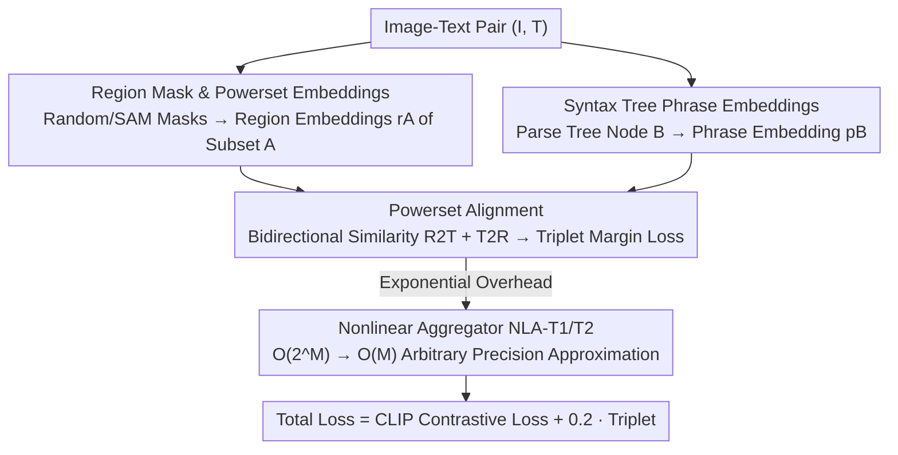

# PowerCLIP: Powerset Alignment for Contrastive Pre-Training

**Conference**: CVPR 2026  
**Paper**: [CVF Open Access](https://openaccess.thecvf.com/content/CVPR2026/html/Kawamura_PowerCLIP_Powerset_Alignment_for_Contrastive_Pre-Training_CVPR_2026_paper.html)  
**Code**: The authors declare that the code will be open-sourced (no repository link provided in the paper)  
**Area**: Multimodal VLM  
**Keywords**: Contrastive Pre-training, Local-to-Global Alignment, Powerset, Syntax Tree, Compositionality

## TL;DR
PowerCLIP performs exhaustive local-to-global alignment between the "powerset of image region subsets" and "textual syntax tree phrases." It utilizes a linear-complexity Nonlinear Aggregator (NLA) to reduce the exponential overhead of powerset alignment to $O(M)$. On 28 zero-shot benchmarks, it outperforms existing CLIP-like methods in 22 cases, showing significant gains in compositionality and robustness.

## Background & Motivation
**Background**: Image-text contrastive pre-training, such as CLIP, maps entire images and sentences into a shared semantic space, serving as a foundation for vision-language understanding. To improve fine-grained understanding, recent works follow two paths: local alignment (e.g., SPARC, FineLIP), which matches text tokens to image patches, and global alignment (e.g., A-CLIP, CLIP-PGS), which emphasizes informative image regions through masking.

**Limitations of Prior Work**: Both paths rely on "single region" or "masked single region" targets. Essentially, they can only handle correspondences of "one text segment ↔ one image region," making it difficult to capture **compositional semantics expressed across multiple image regions** (e.g., the relationship between "dog + chair + red" in "a dog sitting on a red chair").

**Key Challenge**: To capture compositional semantics, the most direct approach is to exhaustively align all subsets of image regions (i.e., the powerset) with text phrases. However, the powerset of $M$ region masks contains $2^M$ subsets. This combinatorial explosion makes a naive implementation computationally infeasible, creating a direct conflict between expressivity and computational feasibility.

**Goal**: (1) Design an alignment objective capable of exhaustive "region combination ↔ text phrase" correspondence; (2) Compress its exponential complexity back to linear to enable practical large-scale pre-training from scratch.

**Key Insight**: The authors observe that text naturally possesses a hierarchical structure—the constituency parse tree—which decomposes sentences into phrase nodes of different granularities (NP / VP / PP). Matching the powerset of image regions to these phrase nodes enables fine-grained local-to-global alignment at the "phrase-region combination" level.

**Core Idea**: Replace single-region alignment with bidirectional triplet alignment of "image region powerset × text syntax tree phrases," using a Nonlinear Aggregator (NLA) that can be proven to approximate the objective with arbitrary precision, reducing $O(2^M)$ to $O(M)$.

## Method

### Overall Architecture
PowerCLIP takes image-text pairs as input and outputs a CLIP encoder with compositional constraints. The process involves three steps: first, generating a set of region masks for each image, constructing their powerset, and extracting region subset embeddings; second, parsing the text into a syntax tree and extracting embeddings for phrase nodes; finally, performing bidirectional similarity aggregation between "region subsets ↔ phrase nodes" and optimizing with a triplet margin loss. Since powerset alignment is inherently exponential, NLA-T1 and NLA-T2 are used during training to linearly approximate the real losses from leaf-level similarity tensors.

### Key Designs

**1. Powerset Alignment: Exhaustive Local-to-Global Alignment of Region Subsets × Syntax Tree Phrases**

This is the core of the paper, directly addressing the inability of single-region objectives to capture cross-region compositional semantics. For the image side, $M$ bounding boxes are randomly sampled (uniform sampling of center, width, and height) on the patch grid to obtain a set of region masks $\mathcal{M}=\{R_m\}_{m=1}^M$. The powerset $2^{\mathcal{M}}=\{A\subseteq\mathcal{M}\}$ is then constructed. The embedding of each subset $A$ is defined as the L2-normalized sum of the weighted visual embeddings of each mask within the subset: $r_A=\sum_{R_m\in A}\phi(I\mid R_m)$, where $\phi(I\mid R_m)=r_m/\lVert r_m\rVert_2$ and $r_m=\sum_n R_{mn} v_n$ (masking is applied directly to the whole-image visual embeddings to avoid independent per-region encoding). For the text side, a constituency parser generates a parse tree $\mathcal{T}$. Leaf nodes are represented by token masks $P_{m'}$, and the phrase embedding $p_B=\sum_{P_{m'}\in B}\psi(T\mid P_{m'})$ for a non-leaf node $B$ is aggregated from its covered leaf nodes. Fine-grained similarity is calculated as the inner product between embeddings: $Q_{i,j,A,B}=\langle r_A^{(i)}, p_B^{(j)}\rangle$. Compared to token-to-token alignment like SPARC, this method learns compositionality by exhaustively matching within the larger candidate space of "region combinations × phrases."

**2. Bidirectional R2T / T2R Aggregation and Triplet Margin Loss**

Powerset alignment aggregates massive $(A,B)$ similarities into image-text pair matrices using two complementary directions. R2T (region-set-to-tree) finds the best-matching phrase for each region subset and averages them: $Q^{\rightarrow}_{i,j}=\frac{1}{2^M}\sum_{A\subseteq\mathcal{M}_i}\max_{B\in\mathcal{T}_j}Q_{i,j,A,B}$, emphasizing "region coverage." T2R (tree-to-region) finds the best-matching region subset for each phrase and averages them: $Q^{\leftarrow}_{i,j}=\frac{1}{|\mathcal{T}_j|}\sum_{B\in\mathcal{T}_j}\max_{A\subseteq\mathcal{M}_i}Q_{i,j,A,B}$, emphasizing "phrase grounding." The total similarity is $\bar{Q}=Q^{\rightarrow}+Q^{\leftarrow}$. Instead of InfoNCE, the triplet margin loss is used for training: $\ell_\delta(X)=\frac{1}{C}\sum_i\max(\max_{j\neq i}X_{i,j}-X_{i,i}+\delta,\,0)$, computed for both $\bar{Q}$ and its transpose. The final loss is the CLIP contrastive loss plus a weighted triplet loss: $L_{total}=L_{CLIP}+\lambda L_{triplet}$, with $\lambda=0.2$. Ablations show that removing the triplet loss causes classification accuracy to drop from 42.2 to 35.1 (back to the CLIP baseline level), making it the most significant contribution.

**3. Nonlinear Aggregator (NLA): Compressing $O(2^M)$ Alignment to $O(M)$**

The $\frac{1}{2^M}\sum_{A\subseteq\mathcal{M}}$ and $\max$ operations in Design 2 are exponential over the powerset. This component specifically addresses feasibility. NLA consists of three "aggregation + activation" layers. The input is the leaf-level similarity tensor $S^{(0)}_{i,j,m,m'}=\langle\phi(I_i\mid R_m),\psi(T_j\mid P_{m'})\rangle$. These layers perform summation and apply activation functions across the leaf nodes within phrases, region masks, and tree nodes, **bypassing explicit summation or maximization over the powerset**. This reduces complexity to $O(M)$. Two variants have theoretical guarantees: NLA-T1 (used for T2R, with Softplus activation) is proven in Theorem 1 to approximate $Q^{\leftarrow}$ with arbitrary precision. As temperature $\tau\to 0$ (ReLU), it degrades to exact hard assignment (Corollary 1); in practice, soft assignment with a small positive temperature $\tau\approx0.001$ performs better. NLA-T2 (used for R2T, with tanh activation and a residual derivative $\Lambda_\zeta$) interpolates between upper and lower bounds using hyperparameter $\zeta\in[0,1]$. Theorem 2 proves it can arbitrarily approximate $Q^{\rightarrow}$. Beyond linear complexity, soft assignment also improves training stability compared to hard max assignment.

### Loss & Training
The final similarities approximated by NLA, $\bar{S}=\text{NLA-T1}(S^{(0)})+\text{NLA-T2}(S^{(0)})$, are substituted into the triplet loss and added to the CLIP contrastive loss. Training uses CC12M, a ViT-B/16 image encoder, and a 12-layer Transformer text encoder. Settings include 32 epochs, AdamW optimizer, initial learning rate of $10^{-3}$, batch size of 4096, $M=10$ masks, and $\zeta=0.75$ for NLA-T2. Two variants: PowerCLIP-R uses random masks, and PowerCLIP-S uses masks randomly selected from those generated by SAM2.

## Key Experimental Results

### Main Results
Zero-shot classification Top-1 (%) average across 17 datasets and Image-Text Retrieval R@1 (%) average across 6 settings:

| Task | Metric | CLIP | C-PGS (Prev. SOTA Global) | SPARC (Prev. SOTA Local) | PowerCLIP-R | PowerCLIP-S |
|------|------|------|------|------|------|------|
| Zero-shot Classification | 17-Dataset Avg. Acc | 35.1 | 39.5 | 37.8 | 41.5 | **42.2** |
| Image-Text Retrieval | 6-Setting Avg. R@1 | 42.7 | 45.1 | 42.3 | 45.8 | **47.0** |
| Robustness | 6×ImageNet Overall Avg. | 31.0 | 32.9 | 32.0 | 34.7 | **35.1** |

PowerCLIP-S is +2.7 / +4.4 higher than C-PGS / SPARC in classification, leading in 14 out of 17 datasets. Improvements in fine-grained datasets are particularly large (Food101 +8.9, Cars +6.5, RESISC45 +7.4). Regarding compositionality, Winoground's image retrieval sub-item improved by +8.0, and SugarCrepe's object sub-item by +2.2, aligning with the motivation of "explicit phrase-region alignment for enhanced compositional understanding."

### Ablation Study
Ablation of key components (metrics are avg. Classification / Retrieval):

| Configuration | Class. | Retr. | Description |
|------|------|------|------|
| Full (PowerCLIP-S) | 42.2 | 47.0 | Full model |
| w/o Region Subsets | 41.1 | 45.7 | Replaced region subsets with single regions |
| w/o Syntax Tree | 41.1 | 45.4 | Replaced tree phrases with single tokens |
| w/o R2T Aggregation | 40.8 | 45.3 | Removed region→tree direction |
| w/o T2R Aggregation | 41.8 | 45.4 | Removed tree→region direction |
| w/o Triplet Loss | 35.1 | 42.7 | Reverted to CLIP baseline |

Mask generation ablation: SAM masks are generally superior to random masks, with $M=10$ being optimal (42.2 / 47.0). Random masks do not collapse given sufficient quantity, indicating the method's robustness to mask strategy and count. Activation function ablation: Softplus for NLA-T1 and tanh for NLA-T2 are optimal, consistent with theoretical choices.

### Key Findings
- Triplet loss is the most critical single component: removing it drops classification to the level of CLIP (42.2→35.1), indicating that margin-based discrimination is the key carrier of compositional gains.
- Region subsets and syntax tree phrases each contribute approximately +1 to classification. Removing either leads to degradation, proving that the exhaustive "combination × phrase" approach is complementary.
- SAM masks provide a "modest" gain over random masks (+0.7 in classification for PowerCLIP-S vs -R), suggesting the method does not heavily rely on a high-quality segmenter.

## Highlights & Insights
- **Formalizing compositional semantics as "powerset × syntax tree" alignment**: Using the natural hierarchical structure of text (parse trees) to match image region combinations is a建模 approach closer to the essence of "compositionality" than simple token-to-token alignment.
- **Dual Solution of Theory and Engineering**: Instead of using heuristic approximations for the seemingly infeasible powerset alignment, the authors designed NLA with proven arbitrary precision and linear complexity. The relationship between hard/soft assignment (Temperature → ReLU degradation) is clearly characterized, providing a solid theoretical foundation for implementation.
- **Soft Assignment Stabilizes Training**: Replacing hard max assignment with Softplus/tanh soft assignment achieves linear complexity while simultaneously improving training stability.

## Limitations & Future Work
- Region masks rely on uniform random sampling of bounding boxes (or extraction from SAM2). Random masks do not guarantee semantic alignment, and it remains unclear to what extent compositional gains come from "incidentally covering semantic entities."
- Experiments were fixed at CC12M + ViT-B/16 scale. Whether the method scales to LAION-level data and larger models, or if NLA approximation errors remain controlled at larger $M$, has not been fully verified.
- ⚠️ OCR caching issues exist for some formula symbols (e.g., $\Lambda_\zeta$, residual derivatives, the specific form of $\zeta$ as $\log\cosh$); definitions should follow Definition 1/2 and the appendix proofs in the original paper.

## Related Work & Insights
- **vs SPARC / FILIP (token-to-token local alignment)**: These perform fine-grained alignment at the single token ↔ single patch level. PowerCLIP expands the search space to "region subsets × phrase nodes," enabling cross-region composition and outperforming SPARC by +4.4 in classification average.
- **vs A-CLIP / CLIP-PGS (masked global alignment)**: These focus on informative regions but remain single-region objectives. PowerCLIP performs local-to-global compositional alignment, resulting in stronger robustness (ImageNet-R +5.9, Sketch +4.0).
- **vs TripletCLIP (source of triplet idea)**: The authors adopt the idea of triplet contrast to enhance compositionality but avoid synthetic hard negatives. Instead, they apply triplet margin loss to the bidirectional similarity matrix, maintaining a fair comparison with other methods.

## Rating
- Novelty: ⭐⭐⭐⭐⭐ "Powerset × Syntax Tree" alignment + Linearized NLA. Both the modeling perspective and theoretical treatment are highly original.
- Experimental Thoroughness: ⭐⭐⭐⭐ 28 benchmarks and complete ablations, though scaling experiments (beyond CC12M / ViT-B) are missing.
- Writing Quality: ⭐⭐⭐⭐ The logic chain from motivation to method and theory is clear, with well-explained theorems and approximations.
- Value: ⭐⭐⭐⭐ Provides a provable and implementable new paradigm for "compositional contrastive pre-training," offering insights for fine-grained VLM alignment.

<!-- RELATED:START -->

## Related Papers

- [\[ICCV 2025\] SCAN: Bootstrapping Contrastive Pre-training for Data Efficiency](../../ICCV2025/multimodal_vlm/scan_bootstrapping_contrastive_pre-training_for_data_efficiency.md)
- [\[CVPR 2026\] VITAL: Vision-Encoder-centered Pre-training for LMMs in Visual Quality Assessment](vital_vision-encoder-centered_pre-training_for_lmms_in_visual_quality_assessment.md)
- [\[CVPR 2026\] From Observation to Action: Latent Action-based Primitive Segmentation for VLA Pre-training in Industrial Settings](from_observation_to_action_latent_action-based_primitive_segmentation_for_vla_pr.md)
- [\[CVPR 2026\] β-CLIP: Text-Conditioned Contrastive Learning for Multi-Granular Vision-Language Alignment](b-clip_text-conditioned_contrastive_learning_for_multi-granular_vision-language_.md)
- [\[ICML 2026\] Deep Pre-Alignment for VLMs](../../ICML2026/multimodal_vlm/deep_pre-alignment_for_vlms.md)

<!-- RELATED:END -->
