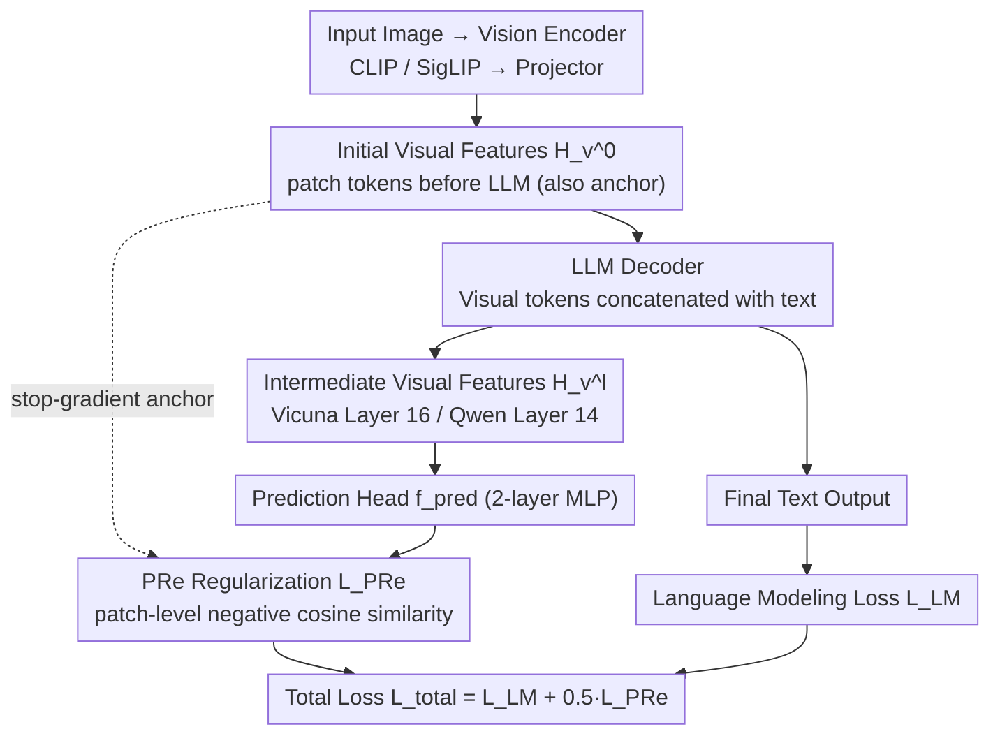

# Predictive Regularization Against Visual Representation Degradation in Multimodal Large Language Models

**Conference**: CVPR 2026  
**arXiv**: [2603.20808](https://arxiv.org/abs/2603.20808)  
**Code**: None  
**Area**: Multimodal VLM  
**Keywords**: Visual representation degradation, MLLM, predictive regularization, self-supervision, visual fidelity

## TL;DR
This paper systematically diagnoses the degradation of visual representations in the intermediate layers of MLLMs at both the global functional level and the patch-level semantic structure level. It reveals that the essence of this phenomenon is "visual sacrifice" under the pure text generation objective and proposes Predictive Regularization (PRe). By requiring degraded intermediate features to predict initial visual features, PRe mitigates degradation and achieves consistent improvements across multiple VL benchmarks.

## Background & Motivation

1. **Background**: Current MLLM mainstream architectures follow the "Vision Encoder + Projector + LLM" paradigm, where training objectives are driven entirely by language modeling (next-token prediction). Visual representations are transformed layer-by-layer within the LLM to serve the final text generation task.
2. **Limitations of Prior Work**: Existing research focuses primarily on the functionality of visual features in cross-modal tasks (e.g., how they help answer questions) but ignores a critical question: What cost does this pure language-driven training impose on the intrinsic quality of the visual representations themselves?
3. **Key Challenge**: There is no direct visual supervision signal in MLLM training. Under a single text generation objective, models sacrifice visual fidelity to optimize language capabilities. The linear classification performance of intermediate visual representations drops significantly, and patch-level semantic boundaries become blurred—this is termed "visual degradation."
4. **Goal**: (1) Systematically quantify and explain the phenomenon and mechanism of visual degradation in MLLMs; (2) Design a lightweight method to mitigate degradation without interfering with language capabilities.
5. **Key Insight**: Inspired by Predictive Coding theory—efficient neural systems should continuously predict their own bottom-up signals to maintain a coherent world model. The authors re-contextualize this principle as a regularizer.
6. **Core Idea**: Use a lightweight prediction head to let degraded intermediate visual features of the LLM predict the initial input visual features. This "visual self-prediction" regularization anchors the visual fidelity of intermediate representations.

## Method

### Overall Architecture
The paper first addresses a neglected question—the cost paid by internal visual representations in MLLMs trained under pure text objectives—and then provides a minimal-intervention remedy. The first half involves **diagnosis + attribution** (corresponding to Key Designs 1 & 2): quantifying visual degradation layer-by-layer and explaining it as "visual sacrifice." The second half provides the **remedy** (corresponding to Key Design 3: PRe). The entire pipeline follows the standard "Vision Encoder + Projector + LLM" flow, with the only modification being a bypass: extracting visual token hidden states from a specific intermediate LLM layer, passing them through a lightweight MLP prediction head to predict the initial features before they entered the LLM (using the initial features as a stop-gradient anchor). A patch-level negative cosine similarity is used as a regularization term and optimized alongside the original language modeling loss. No extra data or architectural changes are required. The diagram below illustrates the PRe training data flow:

### Key Designs

**1. Multi-level Diagnosis of Visual Degradation: Quantifying the degradation**

To mitigate degradation, it must first be proven to exist and its severity must be measured. The authors provide evidence at both macro and micro levels. Macrally, visual representations are extracted layer-by-layer for global average pooling, followed by training a linear classifier for linear probing; results show classification accuracy drops significantly in intermediate layers compared to initial layers, indicating a loss in global separability. Micrally, using COCO-stuff segmentation masks to assign patches to objects, the authors calculate intra-object cohesion and inter-object coupling. They find that coupling increases faster than cohesion, causing the semantic contrast ratio (the ratio of the two) to decrease with depth, which corresponds to patch similarity "overflowing" into unrelated objects in visualizations. These two lines of evidence confirm that both global functionality and patch-level semantic boundaries are degrading.

**2. Attribution: Explaining degradation as "visual sacrifice" rather than noise**

The authors analyze the statistical properties of intermediate representations and find that they coincide with the highest PCA effective dimensions and lowest feature correlation—meaning the intermediate layers are "unfolding and decoupling" the representation space into a form more suitable for language generation. Tracking the dynamics of VQA performance and linear probing accuracy during pre-training reveals a clear negative correlation: language capability increases while visual fidelity drops. This confirms that degradation is a systematic byproduct of a single text objective—the model actively sacrifices visual quality in exchange for language capability, rather than it being random perturbation. This causal chain points directly to the solution: providing a visual anchor for the intermediate layers.

**3. Predictive Regularization (PRe): Predicting initial visual features from degraded intermediate features**

Since degradation occurs because intermediate layers dilute visual information for language generation, a constraint is added to "remember the original state." Borrowing from Predictive Coding, the LLM's intermediate visual hidden states $\mathbf{H}_v^l$ are passed through a 2-layer MLP prediction head to align with the initial visual features $\mathbf{H}_v^0$ before they entered the LLM, using negative cosine similarity as the loss.

$$\mathcal{L}_{\text{PRe}} = -\frac{1}{N_p}\sum_{i=1}^{N_p} \mathcal{D}\big(f_{pred}(\mathbf{h}_{v,i}^l),\ \text{stopgrad}(\mathbf{h}_{v,i}^0)\big)$$

$$\mathcal{L}_{\text{total}} = \mathcal{L}_{\text{LM}} + \lambda\,\mathcal{L}_{\text{PRe}},\quad \lambda=0.5$$

Three details determine its effectiveness: The anchor uses internal Pre-LLM features rather than external models like DINOv2 to avoid representation space mismatch. Supervision is applied at the patch level rather than the global level to preserve fine-grained spatial structure. A stop-gradient is applied to the anchor $\mathbf{H}_v^0$ to prevent the prediction head from degrading the anchor itself, ensuring a clean "reference frame."

### Loss & Training
- Standard LLaVA two-stage training (558K pre-training + 665K instruction tuning), no extra data.
- Total loss = Language modeling loss + $0.5 \times$ PRe regularization loss.
- Regularization is applied only to intermediate layers (e.g., Layer 16 for Vicuna, Layer 14 for Qwen) and **not** the final layers—visual tokens in the final layers are often "silenced" into high-frequency meaningless tokens; forcing visual structure there can be counterproductive.

## Key Experimental Results

### Main Results

| Config (Encoder + LLM) | PRe | GQA | MMMU | AI2D | MMStar | TextVQA | OCRbench | RWQA | MMVP |
|---|---|---|---|---|---|---|---|---|---|
| CLIP* + Vicuna-7B | ✗ | 62.0 | 35.7 | 55.4 | 30.3 | 45.5 | 318 | 54.8 | 20.0 |
| CLIP* + Vicuna-7B | ✓ | **62.7** | **36.1** | **57.1** | **34.6** | **46.6** | **329** | **55.4** | **22.0** |
| SigLIP2 + Qwen2.5-7B | ✗ | 63.5 | 45.8 | 68.9 | 48.0 | 59.2 | 413 | 60.3 | 46.0 |
| SigLIP2 + Qwen2.5-7B | ✓ | **64.4** | **46.2** | **69.5** | 47.8 | **59.7** | **428** | **61.9** | **46.7** |

### Ablation Study

| Config | GQA | MMMU | TextVQA | RWQA | MMVP |
|------|-----|------|---------|------|------|
| Baseline (CLIP* + Vicuna) | 62.0 | 35.7 | 45.5 | 54.8 | 20.0 |
| PRe @ mid-layer | **62.7** | **36.1** | **46.6** | **55.4** | 22.0 |
| PRe @ last-layer | 62.4 | 35.6 | 45.7 | 54.5 | **25.3** |
| Anchor: Pre-LLM (default) | 62.7 | **36.1** | 46.6 | **55.4** | 22.0 |
| Anchor: Pre-Proj | 62.7 | 35.1 | 46.4 | 54.4 | **32.7** |
| Anchor: DINOv2 | 62.8 | 35.9 | 46.5 | 54.6 | 28.7 |

### Key Findings
- **Intermediate vs. Last Layer**: PRe works best at intermediate layers. Final layer visual tokens are often collapsed by the model into high-frequency meaningless tokens (e.g., '_in', '.', '<<0x0A>>'); forcing visual structures here is harmful.
- **Anchor Selection**: Pre-LLM internal features perform best overall. They avoid dimension alignment issues (after patch merging) and representational space mismatches (e.g., DINOv2). Pre-Proj performs exceptionally well on MMVP (+12.7) but has practical limitations.
- **Patch-level vs. Global-level**: Patch-level regularization consistently outperforms global regularization because it preserves finer spatial structure information.
- **Cross-architecture Generality**: PRe is effective across 6 configurations involving CLIP/SigLIP encoders, Vicuna/Qwen LLMs, and frozen/trainable encoders.

## Highlights & Insights
- **Complete Research Paradigm**: The logic flow from phenomenon discovery to causal analysis to solution design is exceptionally complete. This "understand before solve" approach is more persuasive than simply adding modules.
- **Concept of "Visual Degradation"**: Reveals a neglected systematic problem in MLLM training—representation degradation is the price of language optimization. This insight can inspire future research on better multi-objective training strategies.
- **Lightweight and Universal**: PRe requires only a 2-layer MLP and a cosine loss, with zero extra data and zero architectural changes. This "minimal intervention" philosophy is a valuable design principle.

## Limitations & Future Work
- Currently validated only on 7B scale LLMs; degradation patterns and PRe effectiveness on larger models (e.g., 70B) remain unknown.
- Regularization is applied to only a single intermediate layer; multi-layer cascaded or progressive regularization might yield better results.
- The PRe anchor consists of static initial input features, but these features (from frozen CLIP/SigLIP) may not be the optimal visual representation—could a dynamically updated "ideal visual anchor" be used?
- Quantitative metrics for visual degradation (linear probing accuracy) are somewhat indirect; are there metrics that more directly reflect "visual fidelity"?

## Related Work & Insights
- **vs. JEPA/SimSiam**: PRe re-contextualizes the predictive coding principle from self-supervised "pre-training objectives" into a "training regularizer," a clever cross-domain application.
- **vs. FastV/Token pruning methods**: Those methods accelerate inference by reducing visual tokens but might exacerbate degradation; PRe is complementary—preserving visual quality before pruning.
- **vs. Multimodal Hallucination Mitigation**: Visual degradation may be an underlying cause of hallucinations. PRe provides a remedy at the representation level, complementing calibration methods at the output level.

## Rating

- Novelty: ⭐⭐⭐⭐ Diagnosing the visual degradation phenomenon is highly valuable; the PRe method is simple but addresses the core issue.
- Experimental Thoroughness: ⭐⭐⭐⭐⭐ Comprehensive coverage with 6 architectural configurations, 9 benchmarks, and detailed ablations.
- Writing Quality: ⭐⭐⭐⭐⭐ Clear logic, progressing step-by-step from analysis to method to experiments.
- Value: ⭐⭐⭐⭐ The revealed degradation phenomenon provides broad insights for the MLLM community; the method is practical and easy to implement.

<!-- RELATED:START -->

## Related Papers

- [\[CVPR 2026\] Unleashing the Intrinsic Visual Representation Capability of Multimodal Large Language Models](unleashing_the_intrinsic_visual_representation_capability_of_multimodal_large_la.md)
- [\[CVPR 2026\] Taxonomy-Aware Representation Alignment for Hierarchical Visual Recognition with Large Multimodal Models](taxonomy-aware_representation_alignment_for_hierarchical_visual_recognition_with.md)
- [\[CVPR 2026\] PointAlign: Feature-Level Alignment Regularization for 3D Vision-Language Models](pointalign_feature-level_alignment_regularization_for_3d_vision-language_models.md)
- [\[CVPR 2026\] Grounding Everything in Tokens for Multimodal Large Language Models](grounding_everything_in_tokens_for_multimodal_large_language_models.md)
- [\[CVPR 2026\] ReMoRa: Multimodal Large Language Model based on Refined Motion Representation for Long-Video Understanding](remora_multimodal_large_language_model_based_on_refined_motion_representation_fo.md)

<!-- RELATED:END -->
