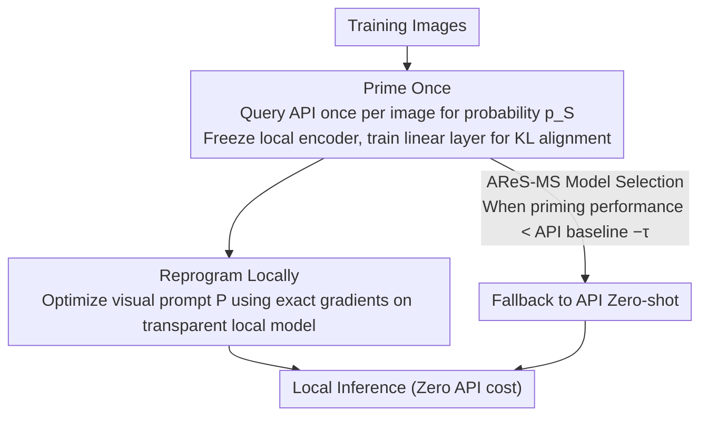

# Prime Once, then Reprogram Locally: An Efficient Alternative to Black-Box Service Model Adaptation

**Conference**: CVPR 2026  
**arXiv**: [2604.01474](https://arxiv.org/abs/2604.01474)  
**Code**: [https://github.com/yunbeizhang/AReS](https://github.com/yunbeizhang/AReS)  
**Area**: Multimodal VLM  
**Keywords**: Model-as-a-Service, Black-box Adaptation, Visual Reprogramming, Zero-order Optimization, API Efficiency

## TL;DR

This paper proposes AReS, a method that replaces the continuous API calls of traditional Zero-Order Optimization (ZOO) with a single-query API priming of a local encoder. It achieves a +27.8% gain on GPT-4o (where ZOO methods are nearly ineffective) while reducing API calls by over 99.99%, enabling cost-free inference.

## Background & Motivation

1. **Background**: Model-as-a-Service (MaaS) is the dominant paradigm for deploying SOTA models, where users only access input-output predictions via APIs. Black-box visual reprogramming (e.g., BAR, BlackVIP) adapts API models by modifying input images through ZOO.
2. **Limitations of Prior Work**: ZOO methods face a triple dilemma: (1) enormous API call requirements (~10^8), leading to high training and inference costs; (2) unstable gradient estimation, resulting in slow and unreliable optimization; (3) modern powerful APIs (e.g., GPT-4o) are robust to input perturbations, causing ZOO's small perturbations to be ignored by the model, yielding almost no performance gain.
3. **Key Challenge**: The fundamental assumption of ZOO—that "perturbing inputs can influence model outputs"—fails as models become more powerful and robust to noise.
4. **Goal**: Efficiently adapt service models under the strictest black-box settings (access only to input and prediction probabilities), especially when ZOO methods are ineffective for modern APIs.
5. **Key Insight**: Instead of performing costly continuous ZOO on the black-box model, it is better to perform a one-time API interaction to acquire knowledge and conduct efficient white-box optimization on a local model.
6. **Core Idea**: Prime the local encoder with a single API query, then complete all visual reprogramming and inference locally, completely eliminating subsequent API dependencies.

## Method

### Overall Architecture

The core problem AReS addresses is efficiently adapting service models under strict black-box constraints without being crippled by the cost of massive API calls. The breakthrough is shifting from "continuously optimizing a black-box model" to "one-time interaction, local optimization"—divided into two stages. The first stage is **Prime Once**: each training image queries the API once to obtain prediction probabilities, which are used to train a lightweight linear layer on top of a local encoder, teaching the local model to "mimic" the service model's behavior. The second stage is **Reprogram Locally**: visual prompts are optimized using standard gradient descent on this primed local model. This process is entirely white-box and no longer requires API access. During inference, only the local model is run, reducing API costs to zero. Additionally, AReS-MS inserts a near-zero-cost diagnostic gate after priming to decide if the local path is worth taking.

### Key Designs

**1. Prime Once: Transferring Service Model "Intuition" Locally via Single Interaction**

ZOO methods are expensive and unstable because they rely on thousands of perturbations to indirectly probe the black-box model's response for gradient estimation. AReS changes this: each training image queries the API only once, using the return prediction probabilities $p_S(x_i)$ as an "answer sheet" for the local model to align with. Specifically, the local encoder backbone is frozen, and only a top linear layer $\theta \in \mathbb{R}^{K^S \times (d_{enc}+1)}$ is trained to minimize the KL divergence between the local and service model outputs: $\mathcal{L}_P(p_L, p_S) = -\sum_j p_{S,j} \log p_{L,j}$.

Crucially, priming **does not require label space alignment**, differentiating it from knowledge distillation. Even if the API outputs probabilities in the ImageNet space while the target task is Flowers, priming remains effective. Its goal is not to produce a high-performance standalone model but to make the local model more "sensitive" and "programmable" for subsequent reprogramming. While distillation pursues final performance and requires aligned labels, priming simply "tunes the local model to the right state" so that visual prompts can more easily influence it.

**2. Reprogram Locally: Downgrading Black-Box Challenges to White-Box Tasks**

After priming, the actual adaptation happens locally. Defining a learnable visual prompt $\mathbf{P}$ and input transformation $g_{in}$, the objective is:

$$\mathbf{P}^* = \arg\min_{\mathbf{P}} \mathbb{E}_{(x,y)} \big[\ell(g_{out}(\mathcal{F}_L(g_{in}(x, \mathbf{P}); \theta^*)), y)\big]$$

Since the local model is transparent, this step utilizes **exact gradients** and first-order optimizers like Adam to optimize the prompt, rather than the blind search of ZOO's approximate gradients. The unstable loop of "perturb-probe-estimate" is moved locally into a conventional white-box training problem, which converges faster and more reliably.

**3. AReS-MS Model Selection: Using Priming as a Free Diagnostic Gate**

Input-level reprogramming is not universally effective across all data domains. On datasets like Food101 or Cars, all reprogramming methods (including white-box ones) often fail to outperform Zero-shot CLIP. AReS-MS addresses this by treating the priming phase as a **near-zero-cost diagnostic probe**: if the primed local model's performance falls below the API zero-shot baseline minus a tolerance $\tau$, the system falls back to the Zero-shot API. This transforms AReS into a decision framework that balances cost and performance, automatically avoiding scenarios where reprogramming is destined to underperform.

### Loss & Training

Priming phase: KL divergence loss, Adam optimizer with lr=0.001. Reprogramming phase: Cross-entropy loss, Adam optimizer with lr=0.01, padding-based visual prompts. For VM (standard visual models), Bayesian Label Mapping (BLM) is used to bridge label space differences between source and target.

## Key Experimental Results

### Main Results (CLIP ViT-B/16 as Service Model, 16-shot)

| Method | Flowers | DTD | UCF | Food | GTSRB | EuroSAT | Pets | Cars | SUN | SVHN | Avg | API Calls (M) | Time (h) |
|------|---------|-----|-----|------|-------|---------|------|------|-----|------|-----|----------|--------|
| Zero-shot | 71.3 | 43.9 | 66.9 | 85.9 | 21.0 | 47.9 | 89.1 | 65.2 | 62.6 | 17.9 | 57.2 | 0.12 | 0 |
| BAR | 71.0 | 46.8 | 64.2 | 84.4 | 21.5 | 77.3 | 88.4 | 63.0 | 62.4 | 34.6 | 61.4 | 612.8 | 185.6 |
| BlackVIP | 70.6 | 45.3 | 68.7 | 85.9 | 21.3 | 73.3 | 89.1 | 65.4 | 64.5 | 44.4 | 62.9 | 754.2 | 197.5 |
| **AReS** | **86.6** | 48.2 | 67.1 | 68.8 | **39.4** | **85.7** | 88.9 | 43.2 | 62.8 | **63.2** | **65.4** | **0.02** | **3.7** |
| **AReS-MS** | **86.6** | 48.2 | 67.1 | **85.9** | **39.4** | **85.7** | 88.9 | **65.2** | 62.8 | **63.2** | **69.3** | 0.06 | 3.7 |

### Ablation Study (Real API Evaluation, EuroSAT 16-shot)

| Method | LLaVA Acc | GPT-4o Acc | GPT-4o Cost ($) | Clarifai Acc | Clarifai Cost ($) |
|------|-----------|-----------|----------------|-------------|-------------------|
| Zero-shot | 40.1 | 59.4 | 14.6 | - | - |
| BAR | 34.1 | 59.1 | 72.2 | 68.1 | 48.1 |
| BlackVIP | 39.4 | 60.1 | 101.0 | 72.1 | 67.3 |
| **AReS** | **73.1** | **87.2** | **0.3** | **83.2** | **0.2** |

### Key Findings

- **Significant Advantage on GPT-4o**: AReS achieves a +27.8% gain (59.4→87.2) on GPT-4o, while BlackVIP only improves by +0.7%. This confirms that ZOO methods fail against robust contemporary APIs.
- **API Call Reduction >99.99%**: AReS requires only 0.02M API calls (vs. BlackVIP's 754M), and training time is reduced from 197 hours to 3.7 hours.
- **Component Analysis**: Priming only (45.6%) < Local VR only (70.6%) < Local LP only (73.8%) < Local VR+LP (80.1%) < Full AReS (85.7%), demonstrating significant synergy between priming and reprogramming.
- **Utilization of Extra Unlabeled Data**: The priming phase can utilize unlabeled downstream data to further boost performance, an advantage ZOO methods cannot exploit.

## Highlights & Insights

- **Paradigm Shift**: Shifting from "continuous optimization on black-box models" to "one-time interaction + local optimization" is a fundamental change. The key insight is that making a local model more programmable via minimal cost is more efficient than directly optimizing a black-box model at a massive cost.
- **Priming $\neq$ Distillation**: While sharing mechanisms with knowledge distillation, the goals differ. Distillation targets final performance and requires aligned label spaces; priming is a "preparation" step that works even with completely different label spaces.
- **Theoretical Guarantees**: Performance bounds are established through the $\epsilon$-faithful priming hypothesis: $\mathcal{R}_L(\mathcal{D}^T, \mathbf{P}^*) - \epsilon \leq \mathcal{R}_S(\mathcal{D}^T, \mathbf{Q}^*) \leq \mathcal{R}_L(\mathcal{D}^T, \mathbf{P}^*)$, transforming unstable black-box optimization into a stable local optimization problem.

## Limitations & Future Work

- On Food101 and Cars, AReS (and all reprogramming methods) underperforms Zero-shot CLIP, indicating natural limitations of input-level reprogramming for certain domains.
- The priming phase still requires one API query for every training sample, which might be costly on very large-scale datasets.
- Only image classification tasks were verified; applicability to dense prediction tasks like detection or segmentation remains unknown.
- The choice of local encoder significantly impacts performance (ViT-B/16 vs. RN50); exploring automatic selection of the optimal local encoder is a future direction.

## Related Work & Insights

- **vs. BlackVIP**: BlackVIP estimates gradients using SPSA-GC and introduces a Coordinator network, but it is fundamentally ZOO. AReS bypasses black-box optimization entirely via priming. Both assume a similar local encoder is available.
- **vs. BAR**: BAR uses Random Gradient-Free (RGF) optimization, requiring even more API calls (612M vs. 754M for BlackVIP) and performing worse on strong APIs.
- **vs. Knowledge Distillation**: Traditional KD requires aligned label spaces and aims for student independence. AReS's priming allows mismatched label spaces and uses subsequent reprogramming to bridge performance gaps.

## Rating

- Novelty: ⭐⭐⭐⭐⭐ Paradigm-shifting innovation from continuous black-box optimization to priming + local optimization.
- Experimental Thoroughness: ⭐⭐⭐⭐⭐ Evaluated on 10 datasets and multiple service models (CLIP/ViT/LLaVA/GPT-4o/Clarifai) with real-world cost comparisons.
- Writing Quality: ⭐⭐⭐⭐ Fluent narrative and sophisticated experimental design, though notation is occasionally overloaded.
- Value: ⭐⭐⭐⭐⭐ Solves a practical pain point (API cost) and is particularly relevant in the era of GPT-4o.

<!-- RELATED:START -->

## Related Papers

- [\[CVPR 2026\] Test-Time Distillation for Continual Model Adaptation](test-time_distillation_for_continual_model_adaptation.md)
- [\[CVPR 2026\] Parameter-Efficient Adaptation for MLLMs via Implicit Modality Decomposition](parameter-efficient_adaptation_for_mllms_via_implicit_modality_decomposition.md)
- [\[CVPR 2026\] Decoupled and Reusable Adaptation for Efficient Cross-Modal Transfer](decoupled_and_reusable_adaptation_for_efficient_cross-modal_transfer.md)
- [\[CVPR 2026\] Vision-Language Model Guided Source-Free Domain Adaptation via Optimal Transport](vision-language_model_guided_source-free_domain_adaptation_via_optimal_transport.md)
- [\[CVPR 2026\] Enhance-then-Balance Modality Collaboration for Robust Multimodal Sentiment Analysis](enhance-then-balance_modality_collaboration_for_robust_multimodal_sentiment_anal.md)

<!-- RELATED:END -->
