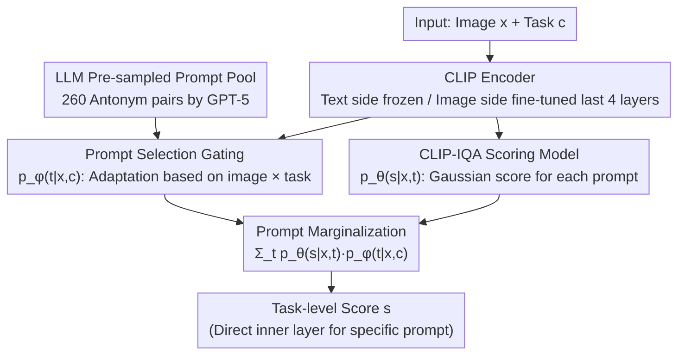

# Probabilistic Prompt Adaptation for Unified Image Aesthetics and Quality Assessment

**Conference**: CVPR 2026  
**Paper**: [CVF Open Access](https://openaccess.thecvf.com/content/CVPR2026/html/Hara_Probabilistic_Prompt_Adaptation_for_Unified_Image_Aesthetics_and_Quality_Assessment_CVPR_2026_paper.html)  
**Code**: TBD  
**Area**: Multimodal VLM  
**Keywords**: Image Aesthetics Assessment, Image Quality Assessment, CLIP, prompt marginalization, probabilistic mixture model

## TL;DR
PPA treats the choice of text prompt for scoring as a latent variable. By performing probabilistic weighted marginalization over a pool of antithetical prompts pre-sampled by an LLM, it simultaneously learns a high-precision task scorer and a general aesthetics/quality evaluator controllable by arbitrary text prompts. This is achieved using only **(task, image, score) triplets without requiring any prompt or attribute annotations**.

## Background & Motivation
**Background**: Image Aesthetics Assessment (IAA) and Image Quality Assessment (IQA) have evolved from handcrafted features to CNNs/ViTs, and recently to text-driven scoring using Vision-Language Models (VLMs) like CLIP. Methods such as CLIP-IQA calculate the softmax of image-text cosine similarity using antonym prompts (e.g., "Good photo." / "Bad photo."), providing natural flexibility for evaluating via textual descriptions.

**Limitations of Prior Work**: Existing methods face a binary choice. On one hand, zero-shot prompt scoring like CLIP-IQA is flexible but lacks precision because CLIP embeddings are trained for semantic alignment rather than perceptual quality. On the other hand, methods that fine-tune CLIP on IAA/IQA (e.g., UniQA, IAACLIP) achieve high precision but sacrifice responsiveness to arbitrary prompts, and their "text-based evaluation" capability is constrained by the quantity and quality of existing text annotations.

**Key Challenge**: There is a trade-off between **high-precision scoring** and the **diversity/controllability of scoring dimensions**. Fine-tuning on fixed tasks improves accuracy but loses flexibility, making it difficult to achieve both.

**Goal**: Develop a unified IAA/IQA framework that approaches SOTA precision while allowing fine-grained control of scoring semantics via arbitrary text prompts, without relying on prompt-level or attribute-level annotations during training.

**Key Insight**: The authors hypothesize that the "optimal text description" for evaluating an image depends on both the image content $x$ and the current task $c$ (where different datasets represent different evaluation criteria). Thus, the text prompt is treated as a **latent semantic variable**, for which a "prompt adaptation" probability distribution is modeled and subsequently marginalized.

**Core Idea**: Score prediction is formulated as a "mixture model over a pool of prompts": $p(s\mid x,c)=\sum_t p_\theta(s\mid x,t)\,p_\phi(t\mid x,c)$. Using task-level supervision (scores only), the marginal likelihood is maximized to learn both prompt selection and score prediction without annotations.

## Method

### Overall Architecture
PPA takes an image $x$ and a task $c$ (an evaluation criterion per dataset) as input and outputs a score $s$. The framework consists of two nested layers: the inner layer performs **prompt-specific scoring**, calculating the score distribution $p_\theta(s\mid x,t)$ for a given image $x$ and a text prompt $t$; the outer layer performs **task-specific scoring** by marginalizing (weighting) the scores of all candidate prompts under task $c$ by their "adaptation fit" $p_\phi(t\mid x,c)$. Candidate prompts are not learned but pre-sampled using GPT-5, resulting in a pool of 260 antonym prompt pairs. During training, only (task, image, score) triplets are provided to minimize negative log-likelihood. During inference, the model can either perform task-specific scoring (via marginalization) or respond to a specific prompt $t$ (via the inner layer).

### Key Designs

**1. LLM Pre-sampled Prompt Pool: Compressing infinite descriptions into a discrete expert set**

The mixture model $\sum_{t\in\mathcal{T}}$ theoretically requires summation over all possible prompts, which is intractable. Instead, the authors sum over a subset $\mathcal{T}_{\text{samp}}$ pre-sampled by GPT-5. For aesthetics, 11 attributes (interest, subject emphasis, lighting, color harmony, vividness, depth of field, motion blur, rule of thirds, balance, repetitive patterns, symmetry) are selected. For quality, 9 attributes (blur, color, contrast, compression, noise, overexposure, quantization, underexposure, local artifacts) are selected. Each attribute generates 4 pairs of antonym prompts ("XXX photo." / "YYY photo."); an additional 100 aesthetics and 80 quality attribute-free antonym pairs are generated, totaling **260 prompts**. This pool acts as a set of **fixed, interpretable natural language "experts"**, where the model only needs to infer weights rather than invent prompts—distinguishing it from CoOp-style continuous prompt learning.

**2. Image × Task Conditional Prompt Selection Gating: Determining "which prompt to trust for this image and task"**

Following the hypothesis that the optimal description depends on content and task, PPA uses a selection model $p_\phi(t\mid x,c)$ to weight candidate prompts. It embeds images, prompts, and tasks: image embeddings $e_{\text{image}}=I(x)$ come from the CLIP image encoder, text embeddings $e_{\text{text}}=T(t_{\text{pos}})-T(t_{\text{neg}})$ use the difference of antonym pairs, and task embeddings $e_{\text{task}}$ are learnable vectors per task (dimension $C=4$). Two 2-layer MLPs project $e_{\text{image}}\oplus e_{\text{task}}$ and $e_{\text{text}}\oplus e_{\text{task}}$ into a shared space to obtain $f_{\phi_1}(x,c)$ and $g_{\phi_2}(t,c)$, followed by a softmax:

$$p_\phi(t\mid x,c)=\frac{\exp\!\big(f_{\phi_1}(x,c)^\top g_{\phi_2}(t,c)\big)}{\sum_{t'\in\mathcal{T}_{\text{samp}}}\exp\!\big(f_{\phi_1}(x,c)^\top g_{\phi_2}(t',c)\big)}.$$

This is conceptually similar to a Mixture-of-Experts (MoE) gate, but with fixed natural language prompts as experts.

**3. Gaussian Scoring Model based on CLIP-IQA: Converting similarity into a marginalizable distribution**

The inner layer $p_\theta(s\mid x,t)$ is modeled as a Gaussian distribution where the mean is the CLIP-IQA score $\bar s_\theta(x,t)$ and the variance is a hyperparameter $\sigma^2$ (set to 0.1). The CLIP-IQA score is defined as the softmax of similarities in CLIP space:

$$\bar s(x,t)=\frac{\exp\!\big(I(x)^\top T(t_{\text{pos}})\big)}{\exp\!\big(I(x)^\top T(t_{\text{pos}})\big)+\exp\!\big(I(x)^\top T(t_{\text{neg}})\big)}.$$

Parameters $\theta$ correspond to the weights of **selected layers** in the image encoder (the last 4 blocks are fine-tuned), while the text encoder remains frozen. This enhances perceptual alignment while preserving pre-trained semantic alignment. Treating the score as a distribution allows for clean weighted marginalization in the outer layer.

**4. Prompt Marginalization + Task-level NLL Training: Learning two models with score supervision only**

The inner and outer layers are combined into a mixture: $p(s\mid x,c)=\sum_{t\in\mathcal{T}_{\text{samp}}} p_\theta(s\mid x,t)\,p_\phi(t\mid x,c)$. Training involves minimizing the negative log-likelihood over triplets $\{(x_i,c_i,s_i)\}$:

$$\mathcal{L}=-\sum_{i=1}^N\log\!\sum_{t\in\mathcal{T}_{\text{samp}}}\exp\!\Big(-\tfrac{(s_i-\bar s_\theta(x_i,t))^2}{2\sigma^2}\Big)p_\phi(t\mid x_i,c_i)+\text{const.}$$

This supervision automatically concentrates weights on prompts that align predicted scores with ground truth, jointly learning $\theta$ (scoring) and $\phi$ (prompt selection) without any prompt/attribute labels. Inference for a task uses the expectation $\mathbb{E}[s]=\sum_t \bar s_\theta(x,t)\,p_\phi(t\mid x,c)$, while specifying a prompt $t$ yields $\bar s_\theta(x,t)$.

## Key Experimental Results

Datasets: 5 IAA (AVA, AADB, TAD66k, PARA, BAID) + 7 IQA (KonIQ-10k, SPAQ, TID2013, KADID-10k, CSIQ, LIVE, LIVEC). Backbone: CLIP-B/16. Two variants: **PPA** (shared weights across datasets) and **PPA-T** (task-specific fine-tuning). Metrics: SRCC and PLCC.

### Main Results
Task-level accuracy (selected IAA/IQA datasets, SRCC):

| Dataset | Metric | PPA | PPA-T | Competitor | Note |
|--------|------|------|-------|----------|------|
| PARA (IAA) | SRCC | 0.913 | **0.919** | 0.905 (Charm) | PPA-T achieves SOTA |
| BAID (IAA) | SRCC | **0.497** | 0.385 | 0.473 (SAAN) | Shared weight version best |
| SPAQ (IQA) | SRCC | 0.934 | **0.941** | 0.929 (Gamma+) | PPA-T achieves SOTA |
| AVA (IAA) | SRCC | 0.737 | 0.780 | 0.791 (IAACLIP) | Within 4% of SOTA |
| KonIQ-10k (IQA) | SRCC | 0.918 | 0.927 | 0.945 (Gamma-T) | Within 4% of SOTA |

PPA/PPA-T achieves SOTA on PARA, BAID, and SPAQ, and remains within approximately 4% accuracy of the best results on other datasets while **maintaining prompt-controllable flexibility**.

Human evaluation (757 workers, 300 pairwise comparisons per prompt) shows that PPA significantly outperforms CLIP-IQA/UniQA on **low-level perceptual attributes** (focus, color cleanliness, contrast balance, edge sharpness, exposure control). The advantage decreases for abstract/emotional aesthetic prompts (e.g., "warm and beautiful photo"), attributed to limited semantic diversity in the training prompt pool.

### Ablation Study
Conditioning of the prompt selection model (Average SRCC/PLCC across 12 datasets):

| Configuration | SRCC | PLCC | Description |
|------|------|------|------|
| Uniform Weight (No learning) | 0.759 | 0.778 | Unweighted average |
| Task-only Conditioning | 0.803 | 0.820 | Adds task condition |
| Image-only Conditioning | 0.764 | 0.783 | Adds image condition |
| Task + Image (Full) | **0.808** | **0.828** | Optimal dynamic gating |

Prompt quantity (SRCC/PLCC):

| Total | Attribute Prompts | Attribute-free | SRCC | PLCC |
|------|-------------|---------------|------|------|
| 40 | 40 | 0 | 0.802 | 0.823 |
| 80 | 80 | 0 | 0.806 | 0.824 |
| 160 | 160 | 0 | 0.796 | 0.815 |
| **260** | 80 | 180 | **0.808** | **0.828** |
| 340 | 160 | 180 | 0.801 | 0.821 |

### Key Findings
- **Dynamic gating is essential**: Changing prompt weights from uniform to dynamic estimation based on "task × image" improved SRCC from 0.759 to 0.808. Task conditioning provided the largest gain.
- **Prompt diversity is more important than quantity**: The 260-prompt configuration performed best. Concentrating prompts in highly similar semantic ranges led to performance drops, indicating the need for broad semantic coverage.
- **PPA excels at low-level/compositional cues**: Attribute-level analysis showed largest gains in motion blur, rule of thirds, repetitive patterns, contrast, and noise. Smaller gains were seen in local/semantic cues like depth of field.
- **Improved feature separability**: t-SNE visualizations showed clearer clustering by score level. Between/Within variance ratios (BW) for PPA were higher than "fixed single-prompt" baselines.

## Highlights & Insights
- **Prompt selection as MoE with fixed experts**: Treating prompts as human-readable experts while learning only the weights enables "no annotation + interpretability + controllability" simultaneously.
- **Joint learning of selector and scorer via score supervision**: Through marginalization and NLL, prompt weights are implicitly supervised by their contribution to scoring accuracy, bypassing expensive attribute labeling.
- **Dual-use model**: The final model acts as both a task-specific scorer and a general evaluator driven by arbitrary prompts, showing strong transferability for tasks like controllable image retrieval or creative assistance.

## Limitations & Future Work
- Consistency drops for abstract/high-level aesthetic prompts (emotion, atmosphere), partly due to insufficient semantic diversity in the LLM-generated pool.
- Candidate prompts are **fixed offline** (260 pairs). The coverage is limited by the quality of the one-time GPT-5 generation and cannot be dynamically expanded during inference based on new needs.
- Scoring relies on CLIP-IQA's image-text similarity as the Gaussian mean; the performance ceiling is constrained by the representation capacity of the CLIP-B/16 backbone.
- Inference requires summation over the entire prompt pool (260 forward passes), introducing overhead compared to single-score models.

## Related Work & Insights
- **vs. CLIP-IQA**: CLIP-IQA uses zero-shot fixed antonym prompts. PPA marginalizes multiple prompts and fine-tunes the image encoder for significantly higher accuracy while retaining controllability.
- **vs. UniQA / IAACLIP**: These rely on aligned image-text pairs from humans or MLLMs. PPA requires no prompt/attribute labels, using probabilistic marginalization to gain flexibility.
- **vs. CoOp / Continuous Prompt Learning**: CoOp learns continuous vectors as prompt templates. PPA uses **fixed natural language prompts** as experts and learns their distribution, ensuring interpretability and the ability to be driven by any new prompt.
- **vs. ProDA / Multi-prompt Dist. Methods**: While similarly modeling prompt distributions, PPA uses task-level supervision with explicit marginalization and conditions weights on the "image × task" context.

## Rating
- Novelty: ⭐⭐⭐⭐ Treating prompts as latent variables for marginalization with fixed NL experts is a novel perspective.
- Experimental Thoroughness: ⭐⭐⭐⭐ Covers 12 datasets plus large-scale human studies and ablations.
- Writing Quality: ⭐⭐⭐⭐ Clear formulation of the two-layer architecture and motivations.
- Value: ⭐⭐⭐⭐ Provides a unified, unannotated, and interpreable paradigm for high-precision controllable scoring.

<!-- RELATED:START -->

## Related Papers

- [\[CVPR 2026\] UARE: A Unified Vision-Language Model for Image Quality Assessment, Restoration, and Enhancement](uare_a_unified_vision-language_model_for_image_quality_assessment_restoration_an.md)
- [\[CVPR 2026\] ArtiMuse: Fine-Grained Image Aesthetics Assessment with Joint Scoring and Expert-Level Understanding](artimuse_fine-grained_image_aesthetics_assessment_with_joint_scoring_and_expert-.md)
- [\[ICLR 2026\] VisJudge-Bench: Aesthetics and Quality Assessment of Visualizations](../../ICLR2026/multimodal_vlm/visjudge-bench_aesthetics_and_quality_assessment_of_visualizations.md)
- [\[CVPR 2026\] R4-CGQA: Retrieval-based Vision Language Models for Computer Graphics Image Quality Assessment](r4-cgqa_retrieval-based_vision_language_models_for_computer_graphics_image_quali.md)
- [\[CVPR 2026\] FluoCLIP: Stain-Aware Focus Quality Assessment in Fluorescence Microscopy](fluoclip_stain-aware_focus_quality_assessment_in_fluorescence_microscopy.md)

<!-- RELATED:END -->
