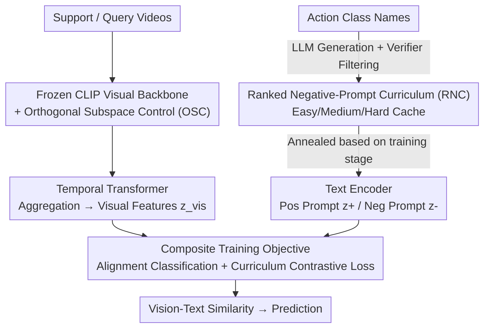

# Protect to Adapt: Orthogonal Subspace Control with Ranked Negative-Prompt Curriculum for Few-Shot Action Recognition

**Conference**: CVPR 2026  
**Paper**: [CVF Open Access](https://openaccess.thecvf.com/content/CVPR2026/html/Qi_Protect_to_Adapt_Orthogonal_Subspace_Control_with_Ranked_Negative-Prompt_Curriculum_CVPR_2026_paper.html)  
**Code**: None  
**Area**: Multi-modal VLM  
**Keywords**: VLM Adaptation, PEFT, Orthogonal Subspace, Hard Negative Curriculum, Few-Shot Action Recognition

## TL;DR
When adapting CLIP to Few-Shot Action Recognition (FSAR), the authors employ "Orthogonal Subspace Control (OSC)" to constrain LoRA updates to the orthogonal complement of the pre-trained weights' principal subspace, preventing the destruction of general semantics and suppressing catastrophic forgetting. Furthermore, a "Ranked Negative-Prompt Curriculum (RNC)" uses an LLM to generate rank-ordered intra-class hard negative samples, filtered by a verifier, to sharpen decision boundaries. By fine-tuning only 2% of parameters, this method achieves SOTA results across 5 FSAR benchmarks.

## Background & Motivation
**Background**: The mainstream of Few-Shot Action Recognition (FSAR) has shifted from designing episodic meta-learning or metric-learning algorithms to adapting powerful Vision-Language Models (VLMs, such as CLIP). For example, CLIP-FSAR fine-tunes the entire CLIP visual backbone and adds a prototype modulation layer to adjust video representations, yielding strong performance.

**Limitations of Prior Work**: Full fine-tuning risks damaging the cross-modal alignment structure learned during CLIP pre-training—leading to degradation in zero-shot transferability and increased catastrophic forgetting, which is particularly fatal in continual learning scenarios where multiple datasets are adapted sequentially. Conversely, freezing the backbone and adding light adapters often results in insufficient adaptation capability for few-shot tasks. More subtly, in each FSAR episode, a query is only compared against one positive class and a few negative classes; the text encoder rarely encounters hard negative samples near the decision boundary, resulting in small inter-class margins and blurred boundaries.

**Key Challenge**: The dilemma between knowledge retention and task adaptation. Low-rank updates in standard LoRA tend to follow the dominant directions of pre-trained weights, overwriting general semantics. Meanwhile, few-shot contrastive signals are too weak to support a clear inter-class boundary.

**Goal**: While modifying minimal parameters, the goal is to preserve the VLM's general priors, learn task-specific discriminative power, and sharpen the decision boundaries.

**Key Insight**: The authors decompose the problem into two complementary failure modes: one at the **parameter level** (where the updates should go) and one at the **data level** (what kind of negative samples should provide supervision).

**Core Idea**: OSC determines "where adaptation happens" (constrained to the orthogonal complement of the principal semantic subspace), while RNC determines "how adaptation uses hard negatives" (a negative prompt curriculum from easy to hard). Together, these form Protect-to-Adapt (P2A).

## Method

### Overall Architecture
P2A operates under the standard N-way K-shot episodic protocol: given support/query videos, a **frozen** visual backbone (CLIP ViT-B/16) combined with OSC produces visual tokens $z_{vis}$. Simultaneously, the text encoder provides positive prompt embeddings $z_{text}^+$ and curriculum-ranked negative prompt embeddings $z_{text}^-$. After visual features are aggregated by a temporal Transformer, predictions are made via vision-text similarity in a shared embedding space. During training, only the two low-rank branches of LoRA (approx. 2% of parameters) are unfrozen and optimized using a composite objective of "alignment classification loss + curriculum contrastive loss."

The two core modules act on different levels: OSC is **parameter-level**—performing SVD on selected weight matrices and projecting LoRA increments into the orthogonal complement of the principal subspace; RNC is **data-level**—offline LLM generation of three tiers of negative prompts per action class, filtered by a verifier and cached, then fed into the contrastive loss from easy to hard during training.

### Key Designs

**1. Orthogonal Subspace Control (OSC): Confining Low-Rank Updates to the "Orthogonal Complement"**

To address the issue where standard LoRA overwrites general semantics along dominant directions, OSC suggests that since stable, transferable knowledge is concentrated in a dominant subspace $S_p$, updates should avoid this direction and occur in its orthogonal complement $S_p^\perp$ (where energy is sparse, leaving room for task-specific plasticity).

The process involves two steps. First, **Principal Subspace Identification**: SVD is applied to the weights to be fine-tuned $W_0 \in \mathbb{R}^{d_1\times d_2}$, where $W_0 = U\Sigma V^\top = \sum_i \sigma_i u_i v_i^\top$. The first $k$ columns of the left singular vectors $U$ form the principal subspace ( $U$ is chosen over $V$ because the LoRA up-projection branch $B\in\mathbb{R}^{d_1\times r}$ resides in this output space). Instead of a manual threshold, the protection rank $k$ is determined adaptively using **Entropy-based Effective Rank**: singular values are normalized into probabilities $p_i = \sigma_i / \sum_j \sigma_j$, and:

$$k = \left\lfloor \exp\!\Big(-\sum_{i=1}^{D} p_i \log p_i\Big) \right\rfloor.$$

This represents the Shannon entropy of the singular value distribution; it is scale-invariant and requires no threshold. Layers with flatter spectra (dispersed semantic directions) receive larger protection subspaces, while those with concentrated spectra receive less, automatically balancing stability and plasticity.

Second, **Subspace-Constrained Update**: A projection operator $P_k^\perp = I_{d_1} - U_k U_k^\top$ is constructed to project the low-rank increment $BA$ onto the orthogonal complement: $\Delta W = P_k^\perp BA = (I_{d_1} - U_k U_k^\top)\,BA$, satisfying the constraint $U_k^\top \Delta W = 0$. Geometrically, for any input $x$, $U_k^\top(W_0+\Delta W)x = U_k^\top W_0 x$, meaning the projection of the pre-activation response on the principal subspace is **exactly invariant**. General knowledge is "locked," and new knowledge grows only in the orthogonal complement. Computationally, the projection is absorbed into branch $B$ ( $B = P_k^\perp \tilde{B}$); the parameter count remains identical to LoRA, and $U_k$ is computed/cached once.

**2. Ranked Negative-Prompt Curriculum (RNC):LLM-Synthesized Easy-to-Hard Intra-class Negatives**

To address the small inter-class margins caused by the lack of hard negatives, RNC uses LLM-synthesized negatives ranked by difficulty: Easy (coarse replacement, e.g., a completely different action), Medium (semantic reversal, e.g., "putting down the cello"), and Hard (fine-grained approximate counter-examples, e.g., "playing cello but barely touching strings").

A **Generator-Verifier Loop** ensures the negatives are usable and do not leak the Ground Truth. A forbidden token set $F$ is defined to block any tokens matching class names or their grammatical variants. The Generator produces $M$ sentences per difficulty level. The **non-generative** Verifier performs schema checks, token matching, and diversity filtering, returning `status:OK` or `status:Revise`. Once passed, negatives are cached; **no LLM calls are made during training**.

Training follows a **Difficulty Annealing Curriculum**. Each phase samples one difficulty level to avoid signal conflict, switching according to epoch $t$:

$$S_{neg}(t) = \begin{cases} S_e & 0 < t \le T_e \\ S_m & T_e < t \le T_m \\ S_h & t > T_m \end{cases}$$

This refines the discriminative boundary by starting with coarse boundaries and gradually tightening them.

**3. Composite Training Objective: Alignment Classification + Curriculum Contrastive**

The total objective is $L_{total} = L_{AC} + \alpha L_{CC}$ (with $\alpha=0.1$). $L_{AC}$ is the standard cross-entropy on query logits within an episode. $L_{CC}$ is the curriculum contrastive loss, pulling visual features toward the correct class prototype and pushing them away from current-tier hard negatives:

$$L_{CC} = -\log \frac{e^{s_i^+}}{e^{s_i^+} + \sum_{m=1}^{M} e^{s_{im}^-}},$$

where $s_i^+$ is the similarity to the ground truth prototype, and $s_{im}^-$ is the similarity to the $m$-th negative prompt of the current curriculum stage $\ell(t)$.

## Key Experimental Results

### Main Results: Five FSAR Benchmarks (5-way, CLIP ViT-B/16)
P2A achieves the highest accuracy in 8 out of 10 settings. In the 1-shot setting, it outperforms CLIP-FSAR by 6.5% on HMDB51 and 4.0% on Kinetics-100.

| Dataset (1-shot) | CLIP-FSAR | EMP-Net | P2A | Gain vs CLIP-FSAR |
|--------|------|------|------|------|
| SSv2-Small | 54.5 | 57.1 | **58.5** | +4.0 |
| SSv2-Full | 61.9 | 63.1 | **63.8** | +1.9 |
| Kinetics-100 | 89.7 | 89.1 | **93.7** | +4.0 |
| HMDB51 | 75.8 | 76.8 | **82.3** | +6.5 |
| UCF101 | 96.6 | 94.3 | **96.9** | +0.3 |

### Parameter Efficiency Comparison (5-way 1-shot)
Training only 3.1M (2.0%) parameters exceeds the performance of fully fine-tuned CLIP-FSAR (89M) and EMP-Net (7.7M), suggesting "adaptation location is more critical than parameter count."

| Method | Trainable Params | HMDB51 | SSv2-S | SSv2-F | K-100 |
|------|------|------|------|------|------|
| CLIP-FSAR (Full) | 89M (58.2%) | 75.8 | 54.5 | 61.9 | 89.7 |
| EMP-Net | 7.7M (4.9%) | 76.8 | 57.1 | 63.1 | 89.1 |
| Ours + vanilla LoRA | 3.1M (2.0%) | 78.6 | 56.4 | 62.3 | 90.7 |
| **P2A** | 3.1M (2.0%) | **82.3** | **58.5** | **63.8** | **93.7** |

### Ablation Study (5-way 1-shot)
OSC alone improves vanilla LoRA from 78.6/90.7 to 79.9/91.8. The full P2A (OSC + RNC + CL) achieves the best performance.

| Configuration | HMDB51 | Kinetics-100 | Note |
|------|------|------|------|
| CLIP-FSAR (Full FT) | 75.8 | 89.7 | Baseline |
| +VL (vanilla LoRA) | 78.6 | 90.7 | Standard PEFT |
| +OSC | 79.9 | 91.8 | w/ Subspace Constraint |
| +OSC +RNC(h) | 80.7 | 92.8 | Hard negatives only |
| **+OSC +RNC +CL** | **82.3** | **93.7** | Full P2A |

### Key Findings
- **Location > Quantity**: Constraining update directions (OSC) yields more benefit than simply adding more parameters.
- **Entropy-based Adaptive Rank** is more stable than a fixed dimension $K$.
- **Protecting higher layers is more important**: OSC is most effective on layers 6–11.
- **LLM Selection**: While DeepSeek-R1 produces the best results, P2A consistently outperforms baselines regardless of the specific LLM used.

## Highlights & Insights
- **Geometric Characterization of "Protective Adaptation"**: $U_k^\top \Delta W = 0$ ensures the principal subspace response remains mathematically invariant, turning "forgetting prevention" into a provable invariant rather than a soft regularization (like KL divergence).
- **Entropy Effective Rank as Protection Rank**: This reusable trick automatically allocates more protection to layers with dispersed semantic directions without manual thresholding.
- **Offline Generator-Verifier Loop**: This minimizes the cost of LLM data augmentation—zero calls during training—while preventing leakage through non-generative verification.
- **Curriculum in InfoNCE Denominator**: Coupling difficulty levels with the contrastive loss gradually tightens the decision boundary.

## Limitations & Future Work
- **Reliance on LLM and Manual Rules**: The quality of RNC depends on the LLM's ability to generate meaningful negatives; performance in specialized domains (e.g., technical or medical actions) remains unverified.
- **Negative FWT**: Compared to frozen CLIP, forward transfer in continual learning remains negative, implying that adaptation to early tasks still slightly hinders initial performance on new tasks.
- **Generalization**: The method was mainly tested on CLIP ViT-B/16 for action recognition; its effectiveness on larger models or other modalities (segmentation, retrieval) is yet to be explored.

## Related Work & Insights
- **vs CLIP-FSAR**: CLIP-FSAR's full fine-tuning damages alignment; P2A's orthogonal complement training is 28× more parameter-efficient and achieves better performance.
- **vs Vanilla LoRA**: Standard LoRA ignores the spectral structure of $W_0$; OSC protects pre-trained knowledge with no additional parameter cost.
- **vs Hard Negative Contrastive Learning**: Previous works often used simple text negatives; RNC combines LLM-synthesized counter-factual negatives with a difficulty curriculum.

## Rating
- Novelty: ⭐⭐⭐⭐ 
- Experimental Thoroughness: ⭐⭐⭐⭐⭐ 
- Writing Quality: ⭐⭐⭐⭐ 
- Value: ⭐⭐⭐⭐ 

<!-- RELATED:START -->

<!-- Related papers here -->

<!-- RELATED:END -->

## Related Papers

- [\[CVPR 2026\] SoC: Semantic Orthogonal Calibration for Test-Time Prompt Tuning](soc_semantic_orthogonal_calibration_for_test-time_prompt_tuning.md)
- [\[CVPR 2026\] Noise-Aware Few-Shot Learning through Bi-directional Multi-View Prompt Alignment](noise-aware_few-shot_learning_through_bi-directional_multi-view_prompt_alignment.md)
- [\[CVPR 2026\] Condensed Test-Time Adaptation of VLMs for Action Recognition](condensed_test-time_adaptation_of_vlms_for_action_recognition.md)
- [\[ICLR 2026\] Meta-Adaptive Prompt Distillation for Few-Shot Visual Question Answering](../../ICLR2026/multimodal_vlm/meta-adaptive_prompt_distillation_for_few-shot_visual_question_answering.md)
- [\[CVPR 2026\] Pointing at Parts: Training-Free Few-Shot Grounding in Multimodal LLMs](pointing_at_parts_training-free_few-shot_grounding_in_multimodal_llms.md)

<!-- RELATED:END -->
