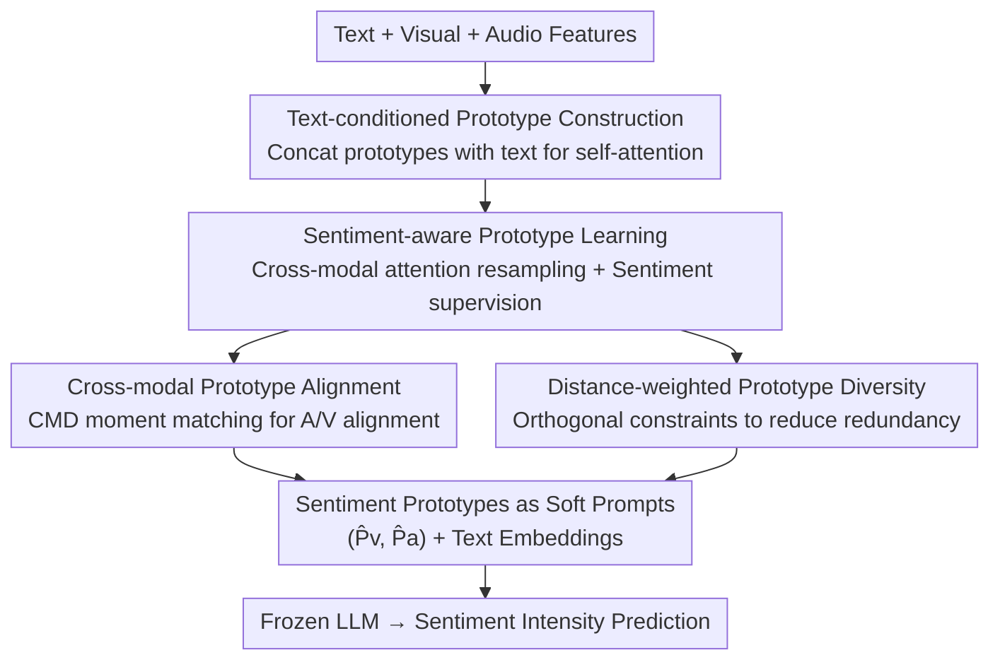

# Prototype-as-Prompt: Multimodal Sentiment Prototypes Endowing Large Language Models the Capability to Perform Multimodal Sentiment Analysis

**Conference**: CVPR 2026  
**Paper**: [CVF Open Access](https://openaccess.thecvf.com/content/CVPR2026/html/Zhao_Prototype-as-Prompt_Multimodal_Sentiment_Prototypes_Endowing_Large_Language_Models_the_Capability_CVPR_2026_paper.html)  
**Code**: To be confirmed  
**Area**: Multimodal VLM  
**Keywords**: Multimodal Sentiment Analysis, Sentiment Prototypes, Soft Prompting, Parameter-Efficient Fine-Tuning, Frozen LLM

## TL;DR
This paper proposes Prototype-as-Prompt (PaP), which compresses audio-visual modalities into a set of **sentiment prototypes with explicit semantics** as soft prompts for frozen LLMs in multimodal sentiment analysis. Through sentiment supervision, cross-modal alignment, and diversity constraints, these prototypes are forced to encode clear emotional meanings. With only 0.09%–0.26% trainable parameters, it outperforms previous SOTA across four datasets and three different LLM architectures.

## Background & Motivation
**Background**: Multimodal Sentiment Analysis (MSA) integrates text, audio, and visual signals to determine emotional polarity. With the rise of Large Language Models (LLMs), a mainstream approach involves using a set of **learnable queries** to compress audio-visual representations into a few tokens as soft prompts for the LLM. These techniques are generally categorized into: projection-based (mapping non-text features to the LLM's semantic space), query-based (using Q-Former-style resamplers to generate learnable tokens), and query-as-prompt (using text-conditioned resamplers to transform non-text features into text-guided prompts).

**Limitations of Prior Work**: Learnable queries are typically **learned implicitly**, meaning there is no explicit instruction on what emotional semantics each query should encode. Consequently, these queries lack clear emotional guidance, and prompt designs often remain heuristic or based on low-level features, failing to truly capture cross-modal emotional semantic alignment. Projection-based methods require full-length sequences (leading to redundancy), query-based methods suffer from parameter explosion as modalities increase, and query-as-prompt methods, while efficient, still rely on additional adapters without explicit emotional encoding.

**Key Challenge**: The contradiction between the "high potential" of soft prompts (which can efficiently guide frozen LLMs) and their "semantic emptiness" (implicit queries fail to learn clear emotional meanings)—guiding the LLM with tokens that cannot clearly represent specific emotions.

**Goal**: To make the soft prompts fed into the LLM **explicitly carry sentiment semantics**, thereby endowing the LLM with multimodal sentiment analysis capabilities while maintaining a frozen backbone and minimal trainable parameters.

**Key Insight**: Instead of using "semantically blank" learnable queries, the authors propose using a set of **fixed-number sentiment prototypes, each bound to a specific sentiment category**, as soft prompts. These prototypes naturally correspond to discrete sentiment semantics (e.g., Strongly Negative, Negative, Weakly Negative, Neutral, Weakly Positive, Positive, Strongly Positive), with meanings explicitly injected through supervision.

**Core Idea**: Replace "learnable queries" with "sentiment prototypes" as soft prompts. Utilize a triple constraint system—sentiment supervision + cross-modal alignment + prototype diversity—to bind explicit sentiment semantics to the prototypes, guiding the frozen LLM for MSA.

## Method

### Overall Architecture
PaP takes text features $x_t$, visual features $x_v$, and audio features $x_a$ as input and outputs sentiment polarity predictions. Two major modules "translate" audio-visual data into sentiment-semantic prototype prompts. The process involves: **Text-conditioned Prototype Construction**, where learnable visual/audio prototypes $P_v, P_a$ are concatenated with text for self-attention to generate text-conditioned prototypes $\tilde P_v, \tilde P_a$; followed by **Sentiment-aware Prototype Learning**, where $\tilde P_v, \tilde P_a$ serve as queries for cross-modal attention over raw features to resample modality-informed prototypes $\hat P_v, \hat P_a$. Explicit sentiment supervision ensures each prototype corresponds to an emotional category. Simultaneously, **Cross-modal Prototype Alignment** (ensuring consistent distributions between visual/audio prototypes) and **Distance-weighted Prototype Diversity** (ensuring distinctness between prototypes in the same modality) are applied. Finally, $\hat P_v, \hat P_a$ and text embeddings are fed into the **frozen LLM** to predict sentiment intensity. Only the PaP module is trainable.

### Key Designs

**1. Text-conditioned Prototype Construction: Anchoring Audio-Visual Info to Text**

Directly using audio-visual features as prompts creates a cross-modal semantic gap. PaP introduces learnable visual prototypes $P_v\in\mathbb{R}^{K\times d}$ and audio prototypes $P_a\in\mathbb{R}^{K\times d}$ ($K$ is the number of sentiment categories) as intermediaries to link the LLM's text representation with non-text features. The prototypes and text are concatenated along the sequence dimension as $H=[P_v;P_a;x_t]\in\mathbb{R}^{(T_t+2K)\times d}$. Self-attention $[\tilde P_v,\tilde P_a,\tilde x_t]=\mathrm{Softmax}\!\left(\frac{W_QH\,H^\top W_K^\top}{\sqrt d}\right)W_VH$ establishes correlations between text and prototype tokens, resulting in **text-conditioned** prototypes $\tilde P_v, \tilde P_a$. This alignment at the start mitigates the semantic gap in subsequent fusion.

**2. Sentiment-aware Prototype Learning: Assigning Explicit Labels to Prototypes**

Text-conditioned prototypes alone have not yet absorbed audio-visual content or sentiment semantics. PaP uses $\tilde P_v, \tilde P_a$ as queries and raw features $x_v, x_a$ as values/keys in cross-modal attention to resample modality-informed tokens $\hat P_v, \hat P_a$ (e.g., $\hat P_v=\mathrm{Softmax}(\frac{W_Q\tilde P_v x_v^\top W_K^\top}{\sqrt d})W_V x_v$). **Crucially**, each prototype is mapped to a specific sentiment category (e.g., SN/N/WN/Neu/WP/P/SP on MOSEI). After passing $\hat P_v, \hat P_a$ through an MLP $h=\sigma(W\hat P+b)$ and a softmax to predict distributions $\hat y_v, \hat y_a$, the system uses cross-entropy $L_{\text{semantic}}=-\sum_i y_i(\log\hat y_{vi}+\log\hat y_{ai})$ for explicit supervision. This solves the "implicit query" problem by forcing each prototype to align with one sentiment meaning.

**3. Cross-modal Prototype Alignment: Synchronizing Visual and Audio Sentiment Language**

If visual and audio prototypes convey conflicting information, the LLM prompts will be contradictory. PaP applies a **Central Moment Discrepancy (CMD)** based alignment loss $L^{\text{inter}}_{\text{align}}=\mathrm{CMD}_K(\hat P_v,\hat P_a)$ to ensure distributional consistency. $\mathrm{CMD}_K$ compares the differences in means and $2$nd to $K$th order central moments: $\frac{1}{|b-a|}\|E(X)-E(Y)\|_2+\sum_{k=2}^{K}\frac{1}{|b-a|^k}\|C_k(X)-C_k(Y)\|_2$ (where $C_k$ is the $k$-th order central moment). Lowering this loss ensures that both modalities communicate synchronized sentiment meanings in the semantic space.

**4. Distance-weighted Prototype Diversity: Preventing Sentiment "Overlap"**

Highly similar prototypes within the same modality (e.g., Weakly Positive and Positive clustering too closely) create redundancy. PaP adds an orthogonality constraint $L^{\text{intra}}_{\text{div}}=\sum_{m\in\{v,a\}}\lambda\,\|W\odot(\max(G_m,0)-I_K)\|_F$, where $G_m=\hat P_m\hat P_m^\top$ is the Gram matrix, $I_K$ is the identity matrix, $\lambda=\frac{1}{K(K-1)}$ is a normalization term, and $W_{ij}=\frac{|i-j|}{K}$ is the **relative position weight**. Prototypes further apart in the sentiment order are pushed further apart. The $\max(\cdot,0)$ ensures separation occurs only for positive cosine similarities, avoiding over-penalizing adjacent categories that are inherently similar. This ensures the $K$ prototypes remain orthogonal and capture distinct sentiments.

### Loss & Training
The final objective optimizes four terms: $L=\lambda_1 L_{\text{task}}+\lambda_2 L_{\text{semantic}}+\lambda_3 L^{\text{inter}}_{\text{align}}+\lambda_4 L^{\text{intra}}_{\text{div}}$, where $L_{\text{task}}=-\log p(y_i\mid I,\theta)$ is the next-token prediction loss for the LLM (input $I=(\tilde x_t,\hat P_v,\hat P_a)$). Hyperparameters are set as $\lambda_1=1, \lambda_2=\lambda_3=10^{-1}, \lambda_4=5\times10^{-2}$. Backbones include ChatGLM3-6B (C), Llama-2-7B (L), and Qwen-1.5B (Q), all kept frozen. Training is performed on V100 GPUs for 30 epochs with early stopping based on validation MAE.

## Key Experimental Results

Four datasets were used: MOSEI (YouTube movie reviews, sentiment -3 to 3), SIMS-V2 (Chinese videos, -1 to 1), MELD (dialogue sentences, 7 emotions), and CHERMA (Chinese film clips, 7 emotions). Metrics include Binary Accuracy (Acc-2), 7-class Accuracy (Acc-7), MAE, Pearson Correlation (Corr), and F1. SIMS-V2 also uses **Acc2.w** (accuracy on weak sentiment samples in the $[-0.4, 0.4]$ range).

### Main Results

Comparison on MOSEI and SIMS-V2 (C/L/Q denote ChatGLM-6B, Llama-2-7B, and Qwen-1.5B respectively):

| Dataset | Model | Acc-2 | F1 | Acc-7 / Acc2.w | MAE | Corr |
|--------|------|-------|-----|------|-----|------|
| MOSEI | MSE (L) [AAAI25] | 86.74 | 86.51 | 55.57 | 0.501 | 0.787 |
| MOSEI | **PaP (L) Ours** | **87.17** | **86.91** | **56.24** | **0.493** | 0.796 |
| MOSEI | MSE (C) [AAAI25] | 86.91 | 86.77 | 54.56 | 0.515 | 0.783 |
| MOSEI | **PaP (C) Ours** | 87.16 | 86.87 | 54.82 | 0.495 | **0.802** |
| SIMS-V2 | MSE (C) [AAAI25] | 83.77 | 83.76 | 75.24 | 0.296 | 0.720 |
| SIMS-V2 | **PaP (C) Ours** | **84.75** | **84.80** | **76.18** | **0.264** | **0.769** |

Emotion Recognition comparison on MELD / CHERMA (Acc / Weighted F1):

| Model | MELD Acc | MELD WF1 | CHERMA Acc | CHERMA WF1 |
|------|----------|----------|------------|------------|
| MSE (C) [AAAI25] | 66.23 | 65.13 | 72.90 | 72.73 |
| **PaP (C) Ours** | **67.47** | **65.97** | **75.33** | **75.28** |

PaP **consistently outperforms the strongest LLM-based method, MSE**, across all LLMs and datasets. The improvement is particularly notable on the Chinese dataset CHERMA with ChatGLM (Acc +2.43, WF1 +2.55). This validates that mapping non-text modalities to a fixed number of sentiment prototypes as soft prompts is an effective path for enhancing LLM multimodal capabilities.

### Ablation Study (CHERMA, Table 4)

| Configuration | ChatGLM Acc / F1 | Llama Acc / F1 | Qwen Acc / F1 |
|------|------------------|----------------|---------------|
| PaP (Full) | 75.33 / 75.28 | 72.70 / 72.65 | 73.93 / 73.87 |
| w/o SPL (Sentiment Learning) | 73.83 / 73.73 | 71.69 / 71.65 | 72.74 / 72.27 |
| w/o CPA (Cross-modal Alignment) | 74.01 / 73.74 | 72.01 / 72.30 | 73.00 / 73.07 |
| w/o PDR (Diversity Regular.) | 74.67 / 74.89 | 72.32 / 71.94 | 73.47 / 73.38 |

All three constraints are contributive: removing CPA drops ChatGLM performance by 1.32/1.54. Removing SPL causes significant degradation, showing that without explicit sentiment supervision, prototypes fail to learn clear semantics. PDR also contributes to robustness and expressiveness.

### Key Findings
- **SPL and CPA are the most critical**: Sentiment supervision (SPL) ensures prototypes have clear emotional meanings, while cross-modal alignment (CPA) ensures synchronization between audio and video. Diversity (PDR) provides a smaller but positive contribution.
- **Extreme Parameter Efficiency**: The PaP module accounts for only 0.09%–0.26% of total parameters but outperforms SOTA. Its parameter count is comparable to MSE but with superior performance, and far lower than MAG/CHFN/QaP.
- **Visualizing Prototypes Validates Effectiveness**: For weak positive samples, audio-visual modalities are mapped to the "Weakly Positive" prototype with the highest probability. Audio/visual prototype distributions are similar (validating CPA), while different sentiment prototypes are distinct (validating PDR). t-SNE shows audio-visual prototypes are highly intertwined (successful alignment) with clear boundaries between Positive/Negative/Neutral (semantic separability).

## Highlights & Insights
- **Prototypes instead of Queries**: While learnable queries are semantically blank, sentiment prototypes naturally correspond to discrete categories. Adding explicit supervision turns soft prompts from "black-box tokens" into "interpretable sentiment anchors." This perspective shift is elegant and potentially transferable to other multimodal prompt tasks with discrete structures.
- **Frozen LLM with Minimal Parameters**: Achieving SOTA with 0.09%–0.26% trainable parameters demonstrates that well-designed soft prompts can inject domain-specific capabilities into LLMs without modifying the backbone, which is highly beneficial for deployment.
- **Synergy of Triple Constraints**: Sentiment supervision handles "existence of semantics," cross-modal alignment handles "inter-modal consistency," and diversity handles "intra-modal separability." The methodology is self-consistent and validated by visual evidence.
- **CMD Alignment + Relative Position Orthogonality**: Using Central Moment Discrepancy for distribution alignment and relative position weights $|i-j|$ for orthogonality are specific techniques that could be reused in other representation learning scenarios requiring both alignment and class-wise distinction.

## Limitations & Future Work
- **Reliance on Predefined Category Count $K$**: The number of prototypes is tied to sentiment granularity (e.g., 7 for MOSEI). Generalizing to datasets with different systems or open-ended sentiment spaces is not direct.
- **Text-Primary LLM Input**: The LLM receives text features + prototype prompts. Audio-visual info is compressed through prototypes; if prototype capacity is insufficient, fine-grained non-text cues might be lost.
- **Dataset-specific Upper Bounds**: Optimal LLM/dataset combinations vary (e.g., Llama performs relatively weaker on SIMS-V2), suggesting that conclusions might not generalize across all settings without adjustment.
- **Future Directions**: Exploring adaptive prototype counts, feeding prototypes back into non-text encoders, or introducing fine-grained hierarchical sentiment prototypes.

## Related Work & Insights
- **vs. MSE [AAAI25] (Query-as-prompt SOTA)**: MSE uses text to filter non-text features as prompts for a frozen backbone but lacks explicit sentiment encoding. PaP uses sentiment-supervised prototypes and outperforms MSE across all tested settings with similar parameter counts.
- **vs. Projection-based MLLMs (e.g., MAG-BERT)**: Projection methods feed full sequences, which are redundant and parameter-heavy. PaP compresses info into $K$ prototypes, using far fewer parameters while achieving higher performance.
- **vs. Query-based MLLMs (Q-Former style)**: Parameters in these methods scale with the number of modalities, and queries remain semantically empty. PaP controls parameters and provides explicit semantics.
- **vs. Traditional Fusion/Representation Learning (CMamba, AlignMamba, etc.)**: These rely on complex fusion networks or geometric alignment without LLMs. PaP's "lightweight soft-prompt + frozen LLM" route achieves better results on major metrics.

## Rating
- Novelty: ⭐⭐⭐⭐ The "Sentiment prototypes as soft prompts + explicit supervision" perspective is clear and novel, though it remains within the "soft prompt + frozen LLM" paradigm.
- Experimental Thoroughness: ⭐⭐⭐⭐⭐ Comprehensive testing on 3 LLMs × 4 datasets × 5 seeds, including ablations, visualizations, and parameter analysis.
- Writing Quality: ⭐⭐⭐⭐ Methods and formulas are clear; visual aids are intuitive.
- Value: ⭐⭐⭐⭐ Achieving SOTA with minimal parameters and providing interpretable prototypes offers significant practical value for parameter-efficient MSA.

<!-- RELATED:START -->

## Related Papers

- [\[CVPR 2026\] Factorize, Reconstruct, Enhance: A Unified Framework for Multimodal Sentiment Analysis](factorize_reconstruct_enhance_a_unified_framework_for_multimodal_sentiment_analy.md)
- [\[CVPR 2026\] Conflict-Aware Adaptive Cross-Reconstruction for Multimodal Sentiment Analysis](conflict-aware_adaptive_cross-reconstruction_for_multimodal_sentiment_analysis.md)
- [\[CVPR 2026\] Enhance-then-Balance Modality Collaboration for Robust Multimodal Sentiment Analysis](enhance-then-balance_modality_collaboration_for_robust_multimodal_sentiment_anal.md)
- [\[CVPR 2026\] Multi-Metric Representation Learning Strategy Based on Clustering for Fine-Grained Multimodal Sentiment Analysis](multi-metric_representation_learning_strategy_based_on_clustering_for_fine-grain.md)
- [\[CVPR 2026\] CICA: Coupling Confidence-Aware Pretraining with Confidence-Informed Attention for Robust Multimodal Sentiment Analysis](cica_coupling_confidence-aware_pretraining_with_confidence-informed_attention_fo.md)

<!-- RELATED:END -->
