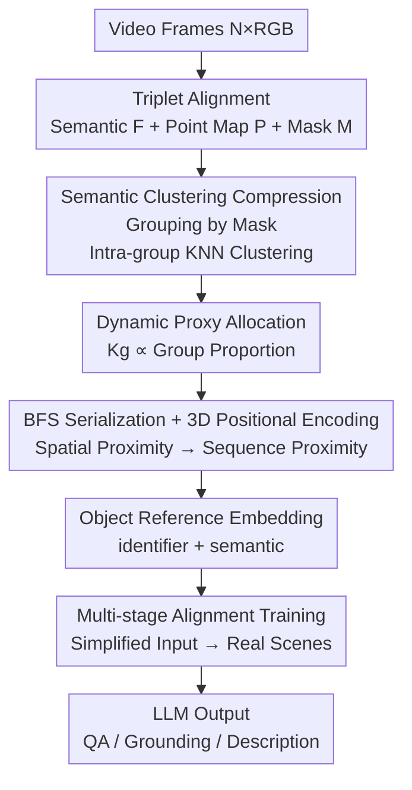

# Proxy3D: Efficient 3D Representations for Vision-Language Models via Semantic Clustering and Alignment

**Conference**: CVPR 2026  
**arXiv**: [2605.08064](https://arxiv.org/abs/2605.08064)  
**Code**: https://wzzheng.net/Proxy3D (Project Page)  
**Area**: Multimodal VLM / 3D Vision  
**Keywords**: 3D Spatial Intelligence, Visual Token Compression, Semantic Clustering, Representation Alignment, Multi-stage Training

## TL;DR
Proxy3D clusters semantic features and geometric point clouds from video frames into a compact set of 3D "proxy" tokens based on "semantic groups." By utilizing the SpaceSpan dataset for multi-stage alignment training, the VLM achieves performance comparable to or better than SOTA in 3D QA, visual grounding, and spatial reasoning using only 700 visual tokens (less than 1/10 of competitors).

## Background & Motivation

**Background**: Empowering VLM/MLLMs with 3D spatial intelligence (understanding "the sofa is to the left of the table" or "how large the room is") is a current research hotspot. Existing 3D-VLMs are generally divided into two categories: ① **Correspondence-based**, such as 3DRS, Video-3D-LLM, and GPT4Scene, which implicitly establish 3D perception through cross-frame feature matching; ② **Representation-based**, such as LLaVA-3D, Spatial-MLLM, and LEO-VL, which explicitly lift 2D features into geometric representations like point clouds, depth, or 3DGS before feeding them into the LLM.

**Limitations of Prior Work**: Correspondence-based methods rely on accumulating inter-frame similarity, resulting in low training data utilization and poor spatial consistency (forming "local world models" near the egocentric view rather than a global unified model), with sequences often exceeding 8000 tokens, leading to massive computational overhead. Representation-based methods, while incorporating geometric priors, produce extremely long sequences (3000+ tokens) when flattening every point or patch, and naive point cloud sequences fail to express complex spatial relationships via cross-attention. Creating a "unified representation" often requires complex neural network serialization modules.

**Key Challenge**: Providing MLLMs with a token sequence that **carries accurate spatial information while remaining as short as possible**—there is a direct trade-off between precision (retaining geometric and semantic details) and efficiency (sequence length).

**Goal**: (1) Design a compact yet information-complete 3D visual representation; (2) Effectively align this compressed representation with language models; (3) Address the scarcity of 3D vision-language training data.

**Key Insight**: The authors observe that **encoded visual modalities are semantically sparsely distributed**—a large number of patches in a scene actually belong to a small number of objects or semantic categories. Given this semantic redundancy, compression can be performed by clustering in the latent space according to semantics, rather than retaining a token for every patch or introducing complex neural serialization networks.

**Core Idea**: Replace "patch-wise pixel-aligned tokens" with "**3D proxy tokens obtained via semantic-aware clustering**," compressing visual sequences from tens of thousands to a few hundred, supported by a multi-stage alignment training curriculum to integrate them into the VLM.

## Method

### Overall Architecture
Proxy3D takes video frames (N RGB frames) as input and outputs a very short sequence of 3D proxy tokens $\mathbf{Z}\in\mathbb{R}^{K\times C}$ ($K\ll L$), which are directly concatenated as visual tokens for autoregressive generation in the LLM. The pipeline consists of: **Feature Extraction → (Semantic/Geometric/Mask Triplet Alignment) → Semantic Clustering Compression → Proxy Allocation → BFS Serialization + 3D Positional Encoding → Multi-stage Alignment Training**. The first half collapses "a large number of patches" into "a small set of proxies," and the second half enables the LLM to interpret this new representation.

Specifically, each frame first passes through three pre-trained encoders: a 2D visual encoder produces a semantic feature map $F_i$, a geometric predictor (VGGT) produces a point map $P_i$, and a 2D segmentation model (SAM 2) produces masks $M_i$. These are aligned into patch-wise triplets $\{\mathbf{f}_j,\mathbf{p}_j,\mathbf{m}_j\}_{j=1}^{L}$ ($L=N\times H'\times W'$, where the mask label for each patch is taken from the object with the largest area). Patches belonging to the same object are grouped by semantic mask labels, and intra-group KNN clustering is used to generate $K_g$ proxies. Proxies are dynamically allocated between groups, spatially serialized via BFS, and augmented with 3D positional encoding to form $\mathbf{Z}$. Finally, the SpaceSpan dataset is used for 4-stage progressive training to align $\mathbf{Z}$ with Qwen2.5-VL.

### Key Designs

**1. Semantic-aware Clustering: Collapsing "Sparse Semantics" into Few Proxy Tokens**

This is the core of the compression, addressing the "long sequence" issue of representation-based methods. The triplets are first grouped by semantic mask labels $g$: $\mathcal{G}_g=\{\mathbf{f}_j,\mathbf{p}_j\mid\mathbf{m}_j=g\}$. Within each group, **KNN clustering is performed on 3D coordinates $\mathbf{p}$** to obtain $K_g$ proxy centers $\{\mathcal{C}_{g,j}\}_{j=1}^{K_g}=\mathrm{KNN}(\mathcal{G}_g,\mathbf{p}_k)$. Each proxy carries aggregated visual features $\mathbf{z}_{g,j}$ and 3D coordinates $\mathbf{c}_{g,j}$.

The key is "**grouping by semantics first, then performing geometric clustering within groups**": if point clouds were clustered directly across the whole scene, points from different objects would be mixed into the same cluster, leading to inaccurate object referencing (ablation shows this step impacts visual grounding by over 20 points). Semantic grouping ensures each proxy originates from a single object, while geometric KNN allows proxies to retain the internal spatial distribution of the object. The final sequence length is compressed from $L$ (thousands) to $K$ (hundreds) **without training any neural serialization networks**.

**2. Dynamic Proxy Allocation: Allocating Token Budget by Semantic Proportion**

How many proxies $K_g$ should be assigned to each group? Averaging would waste tokens on large areas like walls/floors while drowning out small objects (cups, remotes). Ours uses $K_g\propto|\mathcal{G}_g|/L$, allocating tokens proportional to the semantic group's patch ratio in the sequence. Crucially, **a non-zero initial proxy count is given to every group**, ensuring even tiny objects have at least one proxy. Scan2Cap ablations show 5 proxies per object is optimal: too few (2) lacks detail, too many (10) dilates information—single object proxies become less informative and disrupt the multi-object understanding balance.

**3. BFS Spatial Serialization + 3D Positional Encoding: Mapping "Spatial Proximity" to "Sequence Proximity"**

Proxies are an unordered set, but LLMs read 1D sequences. The ordering determines the model's ability to capture spatial relationships. The authors perform a **Breadth-First Search (BFS) traversal** on 3D proxy centers, starting from the 3D segment closest to the origin. This ensures proxies that are spatially close are also neighbors in the sequence, making it easier for the LLM's attention mechanism to grasp relative positions.

In addition to ordering, absolute geometric priors are injected using **Hybrid 3D Positional Encoding**: the vertical dimension $\mathcal{H}$ uses Rotary Positional Encoding (RoPE) to capture vertical movement, while the horizontal plane $\{\mathcal{W}\times\mathcal{L}\}$ uses learnable Fourier embeddings (learned by an MLP for overall layout). These are added to the proxy features:
$$\mathbf{z}_{g,j}'=R(\mathbf{c}_{g,j\in\mathcal{H}})\,\mathbf{z}_{g,j}+F(\mathbf{c}_{g,j\in\{\mathcal{W}\times\mathcal{L}\}})$$
The sorted and encoded tokens form the final sequence $\mathbf{Z}=[\mathbf{Z}_1,\ldots,\mathbf{Z}_G]$.

**4. Object Reference Embedding: "Pointing" to Objects via Identifier + Semantic Tokens**

Since MLLMs are primarily trained on 2D images, directly reading 3D proxies makes precise object identification difficult. Two types of indirect representations are introduced as bridges: **identifier embeddings** (embedding-text pairs) that unify object referencing with position awareness using tokens like `<OBJXXX>` (total $m=100$ identifiers); and **semantic embeddings** describing object categories (total $n=213$ categories), extracted from simplified semantic symbols via a visual encoder (symbol maps generated by Stable Diffusion, identifier maps drawn with numeric characters). References are formed as $\mathbf{f}_j^{sem}=G_{sem}(n_j)$ and $\mathbf{f}_j^{id}=G_{id}(m_j)$. This is analogous to "chess pieces"—the model learns spatial relationships through simplified symbols. These are injected into the serialized proxy embeddings via **additive fusion**, effectively extending 2D visual prompting to 3D feature space without requiring learnable embeddings like LEO-VL.

### Loss & Training
**Progressive Multi-stage Training**: Spatial skills are cultivated from easy to hard across 4 stages (training times: 2 / 2 / 3 / 55 hours on 8×A6000):
- **Stage 1 (Identifier/Semantic Alignment)**: Replaces proxy embeddings with fused embeddings $\mathbf{f}_j^{sem}+\mathbf{f}_j^{id}$ using simplified visual inputs to simulate scenes, teaching the MLLM to reference objects based on `<OBJXXX>` tokens.
- **Stage 2 (Coordinate Alignment)**: Trains 3D RoPE embeddings to give identifier embeddings spatial scale awareness; Figure 4 shows high precision in coordinate determination.
- **Stage 3 (Spatial Exploration)**: Uses 115K object-attribute pairs from MMScan to explicitly train the MLLM on spatial relationships and positional encoding.
- **Stage 4 (Real Scene)**: Switches to real 3D scene proxies as visual input and uses the full 318K SpaceSpan data to transfer knowledge from "simplified input" to "real scenes."

The **training objective** is the standard negative log-likelihood for autoregressive instruction tuning:
$$\mathcal{L}(\theta)=-\sum_{i=K+1}^{r}\log P_\theta(t_i\mid t_{<i},\mathbf{Z})$$
where $\mathbf{Z}$ is the 3D proxy sequence and $r$ is the response length. The backbone is Qwen2.5-VL-7B, with a baseline sequence length $K=450$, input $N=32$ frames, and 512×512 resolution.

## Key Experimental Results

### Main Results
3D QA / Visual Grounding / Dense Captioning (Excerpts from Table 2, tokens represent visual sequence length):

| Model | Modality | Tokens | ScanRefer Acc@0.5 | Multi3DRefer F1@0.5 | ScanQA C | SQA3D EM |
|------|---------|--------|-------|-------|------|------|
| Video-3D-LLM | I | 8000 | 51.7 | 52.7 | 102.1 | 58.6 |
| 3DRS | I | 8000 | 56.1 | 54.9 | 104.8 | 60.6 |
| LLaVA-3D | D,I | 3096 | 42.4 | – | 91.7 | 55.6 |
| LEO-VL | D,I | 750 | – | – | 100.4 | 60.8 |
| **Ours** | I | **700** | **54.1** | **57.5** | 93.6 | 57.5 |

Key Findings: Ours achieves SOTA or second-best in ScanRefer/Multi3DRefer grounding using **700 tokens (less than 1/10 of correspondence-based 8000)**. ScanQA/SQA3D results are slightly behind correspondence-based methods but significantly more efficient. Performance is nearly identical to LEO-VL, which uses similar sequence lengths (750) but relies on additional SceneDPO post-training. Scan2Cap dense captioning is a shared weakness for representation-based methods (Ours C@0.5 is 73.3, lagging behind), attributed to the "trade-off between conciseness and semantics."

VSI-Bench Spatial Reasoning (Table 3, Avg. is the mean of 8 tasks):

| Model | Tokens | Obj.Cnt | Abs.Dist | Obj.Size | Rel.Dist | Avg. | Rank |
|------|--------|---------|----------|----------|----------|------|------|
| Gemini-1.5 Pro | – | 56.2 | 30.9 | 64.1 | 51.3 | 45.4 | 3 |
| Qwen2.5-VL-7B | – | 40.9 | 14.8 | 43.4 | 38.6 | 33.0 | 9 |
| Spatial-MLLM-4B | 3096 | 65.3 | 34.8 | 63.1 | 41.3 | **48.4** | 1 |
| **Ours** | 450 | 63.9 | **41.9** | **67.2** | 50.3 | 47.0 | 2 |

Key Findings: Ours ranks 2nd overall, slightly trailing Spatial-MLLM (48.4 vs 47.0), but the latter uses ~7× more tokens (3096 vs 450) and incorporates GRPO reinforcement learning. Compared to the Qwen2.5-VL-7B backbone (33.0), Ours improves spatial reasoning by 14 points. Object counting/sizing scores are near or above human levels, though appearance ordering and path planning remain low (both are zero-shot tasks without dedicated training).

### Ablation Study
(Table 4, 32×42 resolution / 700 tokens as full config):

| Config | ScanQA C | ScanRefer Uni@0.5 | ScanRefer Acc@0.5 | Description |
|------|---------|-------|-------|------|
| Full (Semantic+Coord) | 93.6 | 84.0 | 54.1 | Complete model |
| w/o Semantic Grouping | 92.2 | 57.0 | 31.0 | Grounding collapses, -20+ points |
| w/o Coord Alignment | 93.4 | 83.6 | 53.8 | Small impact, but significant on VSI |
| w/o Inter-frame Cross-Attn | 93.1 | 83.2 | 53.8 | Minimal drop, robust for streaming |
| 450 tokens (shorter) | 92.7 | 82.7 | 52.6 | Slight drop for efficiency |
| 1000 tokens (longer) | 94.3 | 84.7 | 53.8 | Slight gain, adjustable precision |

Dynamic Proxy Allocation (Table 5, Scan2Cap, proxies per object): 2 -> C 73.3; **5 -> C 74.9 (Optimal)**; 10 -> C 73.2.

### Key Findings
- **Semantic grouping is vital for grounding**: Removing it causes ScanRefer accuracy to plummet from 54.1 to 31.0; naive clustering without semantics leads to reference confusion. Impact on QA is milder.
- **High robustness to inter-frame cross-attention**: Removing feature aggregation across frames hardly affects performance, suggesting Ours builds scene understanding via "instance-level features," making it ideal for streaming/frame-by-frame scenarios compared to correspondence-heavy methods.
- **Coordinate alignment primarily benefits "global spatial" tasks**: Significant improvements in room size estimation, path planning, and appearance ordering (Fig 7), with limited impact on local QA.
- **Sequence length is a clean precision-compute knob**: Token counts (450/700/1000) and feature map resolution mononotonically impact performance, allowing for budget-based tuning.

## Highlights & Insights
- **The "Semantic Sparsity → Semantic Clustering Compression" observation is valuable**: Most patches in a scene are redundant. Clustering into a few proxies per object is sufficient for LLMs to grasp spatial relations, bypassing complex neural modules with simple off-the-shelf masks + KNN.
- **The two-stage "Semantic grouping then geometric clustering" is transferable**: Any task feeding dense 3D/point clouds to sequence models (robotics, AR) can adopt this—segmentation ensures instance purity, while clustering controls length.
- **Identifier/semantic embeddings = "Symbolic Chess Pieces" in 3D**: Using `<OBJXXX>` and simplified symbols as an "intermediate language" to align objects via additive fusion is a lightweight form of 3D visual prompting.
- **Multi-stage "Simplified to Real" curriculum training**: Scaling spatial skills on clean identifiers/coordinates first before transitioning to real proxies mitigates 3D VL data scarcity.

## Limitations & Future Work
- **Performance Gap**: There is still a large gap compared to humans in spatial reasoning tasks like appearance ordering and path planning (zero-shot settings). VSI-Bench scores were slightly surpassed by Spatial-MLLM, which uses GRPO post-training, suggesting further potential for Ours via RL.
- **Dense Captioning Weakness**: Like all representation-based methods, Ours lags in Scan2Cap, as compression inevitably loses fine-grained descriptive details.
- **Dependency on Pre-trained Models**: Quality depends heavily on VGGT (geometry), SAM 2 (segmentation), and the visual encoder. VGGT provides normalized points, requiring extra scale estimation.
- **Heuristic Allocation**: The optimal proxies per object (e.g., 5 for Scan2Cap) is task-dependent; a self-adaptive mechanism is currently missing.
- **Future Directions**: Integrating post-training like SceneDPO/GRPO; implementing adaptive $K_g$ based on task/object importance; and exploring end-to-end learnable semantic clustering.

## Related Work & Insights
- **vs Correspondence-based (3DRS / Video-3D-LLM)**: These rely on implicit 3D via 8000 tokens; Ours uses 700 tokens for similar grounding/reasoning, is more efficient, and suits streaming.
- **vs LEO-VL**: Similar architecture and sequence length (750 vs 700). Ours focuses on semantic-aware compression, while LEO-VL uses SceneDPO post-training—a promising direction for Ours to improve.
- **vs Spatial-MLLM**: Spatial-MLLM ranks 1st on VSI-Bench but uses ~7× more tokens (3096 vs 450) and GRPO. Ours offers a more cost-effective alternative with nearly identical performance.

## Rating
- Novelty: ⭐⭐⭐⭐ The observation of semantic sparsity and the non-trained compression scheme are innovative.
- Experimental Thoroughness: ⭐⭐⭐⭐⭐ Covers QA, grounding, captioning, and VSI-Bench with detailed ablations on all components.
- Writing Quality: ⭐⭐⭐⭐ Clear methodology and visualization, though clustering symbols are dense.
- Value: ⭐⭐⭐⭐⭐ Achieving SOTA spatial intelligence with 1/10 the tokens is highly valuable for compute-sensitive embodied AI/AR applications.

<!-- RELATED:START -->

## Related Papers

- [\[CVPR 2026\] GaussianVision: Vision-Language Alignment from Compressed Image Representations using 2D Gaussian Splatting](gaussianvision_vision-language_alignment_from_compressed_image_representations_u.md)
- [\[CVPR 2026\] PointAlign: Feature-Level Alignment Regularization for 3D Vision-Language Models](pointalign_feature-level_alignment_regularization_for_3d_vision-language_models.md)
- [\[CVPR 2026\] Gravitation-Driven Semantic Alignment for Text Video Retrieval](gravitation-driven_semantic_alignment_for_text_video_retrieval.md)
- [\[CVPR 2026\] Uncertainty-guided Compositional Alignment with Part-to-Whole Semantic Representativeness in Hyperbolic Vision-Language Models](uncertainty-guided_compositional_alignment_with_part-to-whole_semantic_represent.md)
- [\[CVPR 2026\] SMAP: Semantic Route Planning with Map-Grounded Multimodal Alignment](smap_semantic_route_planning_with_map-grounded_multimodal_alignment.md)

<!-- RELATED:END -->
