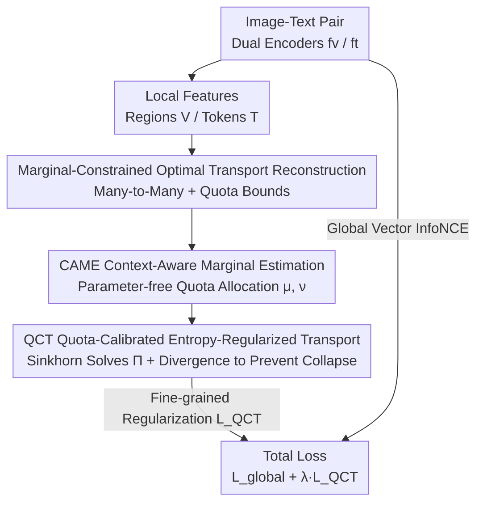

# Quota-Calibrated Fine-Grained Alignment with Context-Aware Marginals for Text-based Person Retrieval

**Conference**: CVPR 2026  
**Paper**: [CVF Open Access](https://openaccess.thecvf.com/content/CVPR2026/html/Li_Quota-Calibrated_Fine-Grained_Alignment_with_Context-Aware_Marginals_for_Text-based_Person_Retrieval_CVPR_2026_paper.html)  
**Code**: To be confirmed  
**Area**: Multimodal VLM  
**Keywords**: Text-based Person Retrieval, Fine-Grained Alignment, Optimal Transport, Marginal Constraints, Plug-and-Play Regularization

## TL;DR
To address the fine-grained alignment issue between words and image regions in text-based person retrieval, this paper proposes a parameter-free, plug-and-play training regularizer named QC-Align. It dynamically allocates a "matching quota" to each word/region using a parameter-free Context-Aware Marginal Estimator (CAME). Then, under the quota constraints, it solves for many-to-many correspondences using Quota-Calibrated optimal Transport (QCT, equipped with Sinkhorn divergence to prevent collapse), thereby suppressing over-concentration of attention and misallocation. It requires no fine-grained annotations, introduces no inference overhead, and consistently improves performance across three mainstream benchmarks, especially in low-data and cross-domain scenarios.

## Background & Motivation

**Background**: Text-Based Person Retrieval (TPR) aims to retrieve corresponding pedestrian images from a large-scale gallery using a natural language description. The mainstream approach utilizes dual encoders combined with contrastive learning to map images and texts into a shared embedding space for global alignment. While efficient and scalable, this only aligns global vectors and lacks explicit fine-grained modeling of "textual phrase ↔ visual local region" correspondences.

**Limitations of Prior Work**: Relying solely on global alignment smooths out discriminative local clues, making the model prone to over-relying on high-frequency co-occurring attribute patterns in the training set. This degrades the matching to coarse-grained attribute similarity comparison. A typical failure case is shown in Fig. 1: when querying "dark pants," the model mistakenly distributes attention to the dark background or other dark objects in the image rather than the actual pants region—this represents a "shortcut bias" that ignores low-frequency, compositional details (e.g., "holding several notebooks," "purple pants").

**Key Challenge**: Existing local matching methods suffer from two fundamental defects. First, many methods implicitly model alignment as rigid one-to-one matching, ignoring the naturally occurring many-to-many semantic correspondences in reality—a single word may relate to multiple candidate regions, and a region may correspond to multiple words. Second, pointwise allocation mechanisms based on similarity or attention normalize weights along the query axis into a probability distribution without explicitly constraining the "total matching capacity" each word/region can carry. Consequently, under attribute overlap and background noise, matching weights either collapse onto a few words or leak to irrelevant regions. Although heuristic approaches (such as hard-threshold truncation) can temporarily suppress noise, they disrupt the gradient flow through non-differentiable operations, and their manually set thresholds lack sample adaptability.

**Goal**: Without relying on fine-grained annotations, to simultaneously (i) model many-to-many semantic correspondences and (ii) explicitly control the allocation of matching capacity for each unit, learning robust and discriminative fine-grained alignments.

**Key Insight**: The authors reformulate fine-grained alignment as an **Optimal Transport (OT) problem with marginal constraints**, where the row/column marginals of the transport plan naturally act as capacity bounds for how much matching quality each unit can bear. However, standard OT often employs uniform marginals (assuming all words/regions are equally important), which rarely holds in practice: both modalities contain redundant or non-discriminative elements, and uniform marginals waste transport capacity on background or irrelevant attributes, leading to degraded solutions.

**Core Idea**: Decoupling "capacity estimation" and "transport allocation" — first using a **parameter-free** Context-Aware Marginal Estimator (CAME) to dynamically estimate **non-uniform** marginals (i.e., "matching quotas") from cross-modal interactions, and then solving for many-to-many correspondences under these quota constraints using Quota-Calibrated optimal Transport (QCT). In short, replacing "pointwise normalization/uniform marginals" with "dynamic quotas" allows highly discriminative regions to receive higher capacities while explicitly preventing weight over-concentration or misallocation.

## Method

### Overall Architecture

QC-Align is a **plug-and-play training regularizer** designed for existing TPR dual encoders, introducing no learnable parameters and leaving the inference pipeline unchanged. Given an image-text pair, the visual encoder $f_v$ outputs a global representation $v_i^g$ and $N_i$ local patch features $\mathbf{V}_i=\{v_i^n\}$, while the text encoder $f_t$ outputs a global representation $t_i^g$ and $M_i$ token features $\mathbf{T}_i=\{t_i^m\}$. The global branch employs InfoNCE for instance-level alignment as usual. The fine-grained branch is the core of this work: CAME first estimates non-uniform marginal quotas $\mu_i\in\Delta^{N_i}$ (visual side) and $\nu_i\in\Delta^{M_i}$ (textual side) from the cross-modal context. Then, QCT solves for the transport matrix $\Pi_i\in\mathbb{R}^{N_i\times M_i}_{\ge 0}$ under these marginal constraints, satisfying:

$$\Pi_i\mathbf{1}_{M_i}=\mu_i,\qquad \Pi_i^\top\mathbf{1}_{N_i}=\nu_i$$

where $\mu_i[n]$ and $\nu_i[m]$ restrict the total outgoing mass from region $v_i^n$ and the total incoming mass to token $t_i^m$, respectively, preventing mass from collapsing into a few units or leaking to irrelevant regions. The final training objective is the global contrastive loss combined with this fine-grained regularizer: $\mathcal{L}=\mathcal{L}_{\text{global}}+\lambda\mathcal{L}_{\text{QCT}}$. The two branches share encoder parameters and are trained end-to-end without requiring any fine-grained annotations.

### Key Designs

**1. Reformulating Fine-Grained Alignment as Optimal Transport with Marginal Constraints: Replacing Pointwise Normalization with "Quota Bounds"**

This step addresses the limitation where pointwise similarity/attention only normalizes weights along the query axis, failing to control the total matching capacity a single word or region can bear. This leads to weight collapse or mismatch under attribute overlap/background noise. The authors instead solve for a sample-level transport matrix $\Pi_i$ and introduce **non-uniform marginal quotas** $\mu_i,\nu_i$ as row/column constraints. The cost matrix is defined using cosine dissimilarity $\mathbf{C}_i[n,m]=1-\frac{\langle v_i^n,t_i^m\rangle}{\|v_i^n\|\|t_i^m\|}$, and the objective is to minimize the total transport cost $\min_{\Pi_i}\langle\Pi_i,\mathbf{C}_i\rangle$ over the feasible transport set $\mathcal{U}(\mu_i,\nu_i)$. Unlike "pointwise allocation" or "pruning low-quality nodes," OT models "how much a unit can match" as a differentiable soft constraint (marginal). This preserves the flexibility of many-to-many alignment while explicitly curbing weight over-concentration, serving as the formal foundation of the entire approach.

**2. CAME: Context-Aware Marginal Estimation — Allocating "Quotas" to Each Word/Region Responsively without Parameters**

Step 1 establishes the need for non-uniform marginals, but where do these quotas come from? CAME answers this by determining a unit's matching capacity based on its semantic consistency with the cross-modal context. **The entire estimation process introduces no learnable parameters**, relying solely on similarity and attention aggregation of the encoder features. Specifically, it consists of three steps: (a) **Cross-modal context aggregation**: Textual token $t_i^m$ attends to all visual regions to obtain a context $\tilde{t}_i^m=\sum_n\alpha_{mn}v_i^n$, where attention weights are defined as $\alpha_{mn}=\text{softmax}_n(\phi(\cos(t_i^m,v_i^n)))$, with $\phi(\cdot)$ clipping negative similarities via leaky-ReLU to stabilize attention. The visual side symmetrically yields $\tilde{v}_i^n$. (b) **Discriminative scoring**: The cosine similarity between each unit and its aggregated context is computed as a discriminative score $r_i_m=\cos(t_i^m,\tilde{t}_i^m)$. Higher correlation indicates the unit is more "attended to" by the other modality and should be granted a higher quota; a numerically stable softmax (LSE trick) $\psi(\cdot)$ then normalizes the scores into importance weights $w_i^m$. (c) **Marginal generation**: The importance weights of one modality are projected back to the other via the attention matrix: visual marginal $\mu_i[n]=\sum_m\alpha_{mn}\cdot w_i^m$ and textual marginal $\nu_i[m]=\sum_n\beta_{nm}\cdot w_i^n$. Consequently, areas receiving attention from multiple important text tokens (where both $\alpha_{mn}$ and $w_i^m$ are large) naturally obtain a higher quota. Since they are linear combinations of normalized attention and weights, $\mu_i,\nu_i$ naturally satisfy non-negativity and sum-to-one constraints. This parameter-free design diminishes overfitting risks, while the marginals are still implicitly refined through the gradients of the transport objective.

**3. QCT: Quota-Calibrated Entropy-Regularized Transport + Sinkhorn Divergence to Prevent Collapse**

With the quotas established, the transport plan must be solved quickly, differentiably, and without collapse. Exact linear programming has a complexity of $O((N_i+M_i)^3\log(N_i+M_i))$, which is impractical for deep learning. The authors instead resort to **entropy-regularized** Sinkhorn transport: $\Pi_i^*=\arg\min_{\Pi_i}\langle\Pi_i,\mathbf{C}_i\rangle-\epsilon H(\Pi_i)$, where $H(\Pi_i)=-\sum_{n,m}\Pi_i[n,m]\log\Pi_i[n,m]$ and $\epsilon$ controls the sparsity of the transport matrix. Sinkhorn iterations alternately scale row/column target marginals, requiring only $O(N_iM_i)$ per iteration. However, directly minimizing the cross-modal transport cost $W_i^{\text{cross}}=\langle\Pi_i^*,\mathbf{C}_i\rangle$ has a fatal flaw: the model can collapse all features to a single point to minimize the transport cost, resulting in representation degradation. To prevent this, the authors utilize the **Sinkhorn Divergence**, which subtracts intra-modal self-transport costs for normalization:

$$\mathcal{L}_{\text{QCT}}^i=W_i^{\text{cross}}-\tfrac{1}{2}\big(W_i^{\text{vv}}+W_i^{\text{tt}}\big)$$

where $W_i^{\text{vv}}$ and $W_i^{\text{tt}}$ are the self-transport costs within the visual and textual modalities under uniform marginals, measuring the "intrinsic diversity baseline" of each modality. By subtracting these terms, $\mathcal{L}_{\text{QCT}}^i$ isolates the cost unique to cross-modal alignment, forcing the model to learn discriminative cross-modal correspondences rather than trivial solutions that collapse all features into similar representations. The batch mean yields $\mathcal{L}_{\text{QCT}}$. The entire QCT is fully differentiable, enabling joint optimization of CAME and the encoders.

### Loss & Training

The total objective is $\mathcal{L}=\mathcal{L}_{\text{global}}+\lambda\mathcal{L}_{\text{QCT}}$: $\mathcal{L}_{\text{global}}$ is the InfoNCE loss on global representations $(v_i^g,t_i^g)$ ensuring instance-level consistency; $\mathcal{L}_{\text{QCT}}$ enforces discriminative local alignment under the margins estimated by CAME via the transport plan $\Pi_i$; $\lambda$ balances the two supervision scales. The two losses share encoder parameters and are trained end-to-end without requiring any fine-grained annotations. All baselines uniformly use $\lambda=0.5$ and Sinkhorn entropy $\epsilon=0.5$; experiments are completed on a single RTX 4090 (24GB).

## Key Experimental Results

Datasets: CUHK-PEDES (40,206 images / 13,003 identities), ICFG-PEDES (54,522 images / 4,102 identities), RSTPReid (20,505 images / 4,101 identities); Metrics are Rank-1/5/10 retrieval accuracy. QC-Align is validated on two types of backbones: non-CLIP-based (SSAN, SCAN, CADA, etc.) and CLIP-based (IRRA, BiLMa, etc.).

### Main Results

As a plug-and-play module, QC-Align consistently improves performance on both global alignment baselines and strong baselines that already incorporate local alignment:

| Backbone / Dataset | Metric | Baseline | +QC-Align | Gain |
|------|------|------|------|------|
| Baseline / CUHK-PEDES | R@1 | 57.19 | 59.87 | +2.68 |
| Baseline-CLIP / CUHK-PEDES | R@1 | 68.71 | 70.89 | +2.18 |
| Baseline / ICFG-PEDES | R@1 | 50.38 | 52.42 | +2.04 |
| Baseline-CLIP / ICFG-PEDES | R@1 | 59.37 | 61.52 | +2.15 |
| Baseline / RSTPReid | R@1 | 38.75 | 43.35 | +4.60 |
| Baseline-CLIP / RSTPReid | R@1 | 56.60 | 58.65 | +2.05 |
| IRRA / CUHK-PEDES | R@1 | 73.38 | 74.62 | +1.24 |
| CADA / CUHK-PEDES | R@1 | 78.37 | 79.31 | +0.94 |

Three key observations: (1) Compared to pure global alignment baselines, QC-Align consistently improves performance across all datasets, indicating that quota-calibrated OT successfully compensates for the insufficiency of global features in capturing fine-grained correspondences; (2) Even when applied on top of strong pipelines like IRRA or CADA which already feature local alignment, it yields further gains, proving that quota-aware many-to-many alignment is not redundant to existing local interaction/attribute decoupling mechanisms; (3) The largest gain is achieved on the smaller RSTPReid dataset (approx. +4.6%), which the authors attribute to the fact that when data is scarce, models easily fall prey to shallow global co-occurrence statistics, whereas QC-Align forces many-to-many alignment under non-uniform marginals to compel focus on discriminative units, thereby enhancing generalization under low-data scenarios.

### Ablation Study

Evaluated against five representative fine-grained alignment strategies and the two proposed components (SD = Sinkhorn Divergence, CAME) step-by-step (Rank-1):

| Method | CUHK Baseline | CUHK CLIP | ICFG Baseline | ICFG CLIP | RSTP Baseline | RSTP CLIP |
|------|------|------|------|------|------|------|
| Baseline | 57.19 | 68.71 | 50.38 | 59.37 | 38.75 | 56.60 |
| +MLM | 59.03 | 69.46 | 51.47 | 59.84 | 41.25 | 57.15 |
| +SCAN | 58.69 | 67.79 | 51.38 | 58.59 | 42.05 | 54.80 |
| +UOT | 58.69 | 67.67 | 51.53 | 58.42 | 40.25 | 54.60 |
| +OT | 57.97 | 67.02 | 51.56 | 58.04 | 40.40 | 54.45 |
| +SD | 58.36 | 69.31 | 51.18 | 59.97 | 41.95 | 56.20 |
| +CAME | 59.02 | 69.49 | 51.75 | 60.36 | 42.35 | 57.45 |
| +QC-Align | **59.87** | **70.89** | **52.42** | **61.52** | **43.35** | **58.65** |

### Key Findings

- **Architecture-dependence in existing methods**: MLM is effective for both architectures; however, SCAN only benefits the CNN-based baseline and degrades performance on CLIP (CUHK -0.92, ICFG -0.78); standard OT and UOT also suffer performance drops on CLIP. The authors explain that CNNs directly optimize local patches via global pooling, aligning local features naturally with the training target, whereas Transformers only supervise aggregated global features, leaving local feature optimization indirect, meaning that imposing explicit local alignment disrupts intra-modal local consistency (standard OT collapses all features to similar representations because of the lack of repulsive force).
- **Sinkhorn Divergence resolves representation collapse**: The degradation of standard OT on CLIP manifests as excessive similarity among intra-modal and cross-modal local features, losing discriminative ability (allocating nearly uniform attention to a given query). SD avoids the trivial minimization of "collapsing all features" by subtracting the intra-modal self-transport cost, restoring and even exceeding baseline performance (CLIP: CUHK +2.29, ICFG +1.93 compared to standard OT).
- **CAME contributes discriminative quotas**: Beyond the anti-collapse effect of SD, uniform marginals still fail to reflect the importance variance of different regions/tokens; CAME dynamically estimates non-uniform marginals, offering higher quotas to discriminative units. Superimposing CAME onto OT yields additional improvements on both architectures. The full QC-Align (SD + CAME) achieves the best performance in all settings.
- **Mitigating shortcut bias / cross-domain generalization (Table 3)**: Qualitative visualizations display that Baseline-CLIP relies excessively on high-frequency color words ("blue coat", "red shirt"), ignoring compositional clues such as "purple pants" and "holding a notebook"; QC-Align concentrates transport quality on discriminative attribute-region pairs, showing a more focused attention map. In cross-dataset experiments (CUHK $\leftrightarrow$ ICFG as mutual source/target domains), adding QC-Align to IRRA/CADA consistently improves Rank-1 by 1.62%–3.91% (e.g., on C $\rightarrow$ I, IRRA 42.63 $\rightarrow$ 44.74, CADA 51.37 $\rightarrow$ 53.68), validating that the learned semantics are less dependent on dataset biases and are more transferable.
- **Hyperparameter Sensitivity (RQ3)**: For $\lambda\in\{0.1, 0.3, 0.5, 1.0, 2.0\}$, a moderate value is optimal (Baseline peaks at 59.87% for $\lambda=0.5$; Baseline-CLIP peaks at 71.31% for $\lambda=1.0$); $\epsilon$ is optimal in the range of $0.1 \sim 0.5$, as too large a value makes the transport matrix overly blurry, while too small a value easily overfits noise in early stages. Overall, performance gains are stable over a wide range, and the module is only utilized during training with zero inference overhead.

## Highlights & Insights
- **Explicit Decoupling of "Capacity Estimation" and "Transport Allocation"**: Splitting fine-grained alignment into "first quota estimation (CAME), then constrained transport (QCT)" is more controllable than pointwise normalization/hard-pruning—quotas represent differentiable soft constraints rather than discrete decisions, avoiding gradient instability and context loss from hard pruning. This paradigm of "first determining how much capacity each unit can carry, then solving the allocation" is transferable to other cross-modal matching tasks.
- **Parameter-free + Zero Inference Overhead + No Fine-Grained Annotation**: CAME computes quotas solely via encoder feature similarities/attentions, and QC-Align as a whole acts as a training-only regularizer that is discarded during deployment, allowing seamless deployment on any TPR dual encoder at almost zero engineering cost.
- **Sinkhorn Divergence as an Anti-Collapse Switch**: By subtracting intra-modal self-transport costs from cross-modal transport costs, it isolates the cost specific to cross-modal alignment. This successfully isolates and addresses the specific failure mode where standard OT collapses on Transformer architectures, serving as the most critical piece of the ablation puzzle.
- **Larger Gains on Low-Data/Cross-Domain Scenarios**: This phenomenon is highly convincing; it connects the causal chain "fine-grained structural alignment $\rightarrow$ reduced shortcut dependency $\rightarrow$ more transferable semantics" through cross-domain experiments and attention visualization.

## Limitations & Future Work
- The authors expect to extend quota-calibrated transport to broader cross-modal understanding tasks, hinting that it has only been validated on TPR for now.
- **Reliance on Encoder Feature Quality**: CAME is parameter-free, meaning quotas are determined entirely by the similarity/attention output by the encoders. If the backbone's local features are deficient (e.g., in Transformers with pure global supervision, local features are optimized indirectly), the reliability of the estimated quotas may be limited—which also explains the significant performance differences across different architectures.
- **Hyperparameters Still Require Tuning**: Although $\lambda$ and $\epsilon$ are stable within a reasonable range, their optimal values vary with architecture (Baseline $\lambda=0.5$ vs. CLIP $\lambda=1.0$), necessitating minor tuning when migrating across datasets/backbones.
- **Lack of Direct Quantitative Evaluation for Many-to-Many Correspondence**: Though the method features many-to-many semantic alignment, evaluation remains based on Rank-k retrieval accuracy and qualitative visualization, lacking direct quantitative metrics (such as alignment accuracy) specifically for the "many-to-many alignment quality" itself, ⚠️ subject to the original text.

## Related Work & Insights
- **vs. Pointwise Similarity / Attention Alignment (e.g., SCAN)**: These only normalize matching weights along the query axis, failing to constrain the total quality each unit can carry; this work uses OT marginals to explicitly control capacity, preventing weight collapse and proving more stable on Transformer architectures (where SCAN degrades on CLIP).
- **vs. Explicit One-to-One Phrase-Region Matching (relying on pose estimation/segmentation/predefined rules)**: Rigid one-to-one assumptions fail to capture the ubiquitous many-to-many, context-dependent alignments in TPR and are sensitive to annotation noise; this work preserves many-to-many flexibility via soft marginal constraints without requiring fine-grained annotation.
- **vs. Standard OT / UOT (Uniform Marginals)**: Uniform marginals assume all words/regions are equally important, wasting transport quality on backgrounds/irrelevant attributes and leading to degraded solutions; this work uses CAME to estimate non-uniform quotas, directing mass to discriminative units. Ablations show standard OT/UOT universally degrade on CLIP, while QC-Align consistently improves.
- **vs. Learnable Gated Pruning of Low-Quality Nodes**: Hard pruning relies on discrete decisions, risking context loss and gradient instability; this work models "matching capacity" as differentiable soft constraints (marginals) that suppress over-concentration without disrupting gradient flow.

## Rating
- Novelty: ⭐⭐⭐⭐ Reformulating fine-grained alignment as "quota-calibrated OT", decoupling capacity estimation and transport allocation, and effectively utilizing Sinkhorn divergence to handle collapse on Transformers shows a clear and highly targeted rationale.
- Experimental Thoroughness: ⭐⭐⭐⭐ Covering three datasets, two backbone classes, step-by-step ablations with five alignment strategies, cross-domain generalization, and hyperparameter sensitivity provides relatively comprehensive validation.
- Writing Quality: ⭐⭐⭐⭐ Motivation, formulation, algorithm, and ablations are closely knit. The failure case analysis (standard OT collapse) and visualizations are well articulated.
- Value: ⭐⭐⭐⭐ As a parameter-free, zero-inference-overhead, annotation-free plug-and-play regularizer, it is highly engine-friendly, with gains on low-data and cross-domain setups being particularly practical.

<!-- RELATED:START -->

## Related Papers

- [\[CVPR 2026\] EagleNet: Energy-Aware Fine-Grained Relationship Learning Network for Text-Video Retrieval](eaglenet_energy-aware_fine-grained_relationship_learning_network_for_text-video_.md)
- [\[CVPR 2026\] Language-driven Fine-grained Retrieval](language-driven_fine-grained_retrieval.md)
- [\[CVPR 2026\] POGA: Paraphrased and Oppositional Graph Alignment for Fine-Grained Cross-Modal Retrieval](poga_paraphrased_and_oppositional_graph_alignment_for_fine-grained_cross-modal_r.md)
- [\[CVPR 2026\] Tackling Alignment Ambiguity in Person Retrieval through Conversational Attribute Mining](tackling_alignment_ambiguity_in_person_retrieval_through_conversational_attribut.md)
- [\[CVPR 2026\] Gravitation-Driven Semantic Alignment for Text Video Retrieval](gravitation-driven_semantic_alignment_for_text_video_retrieval.md)

<!-- RELATED:END -->
