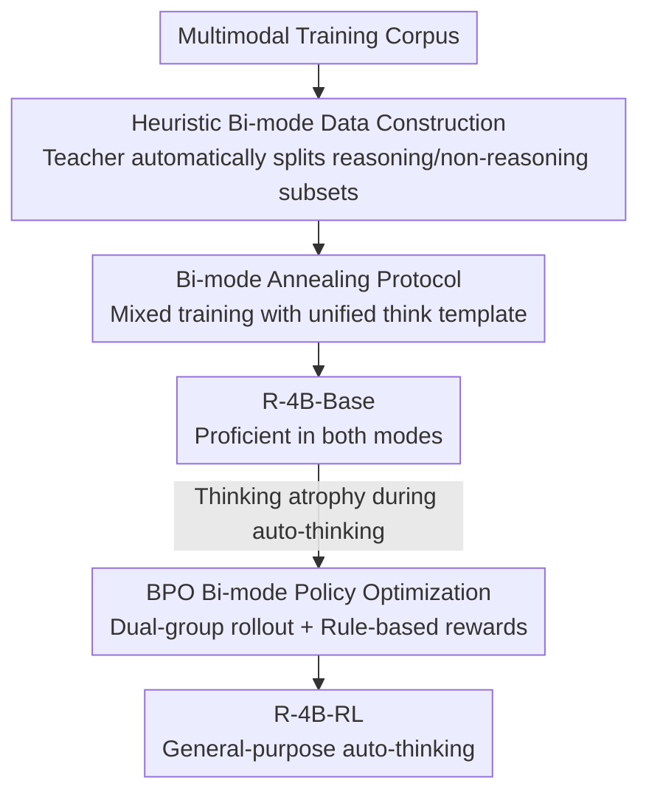

# R-4B: Incentivizing General-Purpose Auto-Thinking in MLLMs via Bi-Mode Annealing and Reinforce Learning

**Conference**: CVPR 2026  
**Paper**: [CVF Open Access](https://openaccess.thecvf.com/content/CVPR2026/html/Yang_R-4B_Incentivizing_General-Purpose_Auto-Thinking_in_MLLMs_via_Bi-Mode_Annealing_and_CVPR_2026_paper.html)  
**Code**: https://github.com/yannqi/R-4B  
**Area**: Multimodal VLM  
**Keywords**: Multimodal Large Models, Adaptive Reasoning, auto-thinking, Reinforcement Learning, GRPO

## TL;DR
R-4B teaches a 4B Multimodal Large Language Model (MLLM) to "think only when necessary." By first using **bi-mode annealing** to train a single backbone to master both "reasoning" and "direct-answering" modes, and then applying **Bi-mode Policy Optimization (BPO)**—which forces simultaneous sampling of thinking and non-thinking response pairs for joint optimization—it achieves SOTA performance across 25 benchmarks using simple rule-based mathematical rewards. It matches or exceeds larger models on reasoning tasks while significantly reducing redundant inference tokens.

## Background & Motivation
**Background**: MLLMs with explicit chain-of-thought (CoT, wrapping reasoning in `<think>` tags) have shown strong performance on complex tasks like mathematics and scientific diagrams, becoming a mainstream enhancement method.

**Limitations of Prior Work**: Mandating "think-before-answer" for all queries is costly. Simple recognition or retrieval questions, such as "What is the name of this dish?", do not require multi-step reasoning, yet are forced to generate redundant CoT, wasting computation and tokens.

**Key Challenge**: Models need to dynamically balance **reasoning quality** and **inference cost**. Existing auto-thinking solutions either rely on manual user toggles (which users often leave on), manual complexity annotations for every sample (e.g., Keye-VL, which is high-cost and consumes extra tokens during inference), or meticulously designed task-specific rewards/data (which are fragile, hard to scale, and prone to mode collapse).

**Goal**: To build a **label-free, token-efficient, and general-purpose** multimodal auto-thinking framework that allows the model to decide whether to think based on the input complexity.

**Key Insight**: The authors decompose the problem into two steps: first, making a single backbone **capable of both modes** (otherwise selection is impossible), then teaching it **when to choose which**. This decouples "capability cultivation" from "strategy learning," avoiding the difficulty of learning both reasoning and restraint in a single stage.

**Core Idea**: Utilizing "bi-mode annealing + RL with bi-mode rollouts." The annealing phase mixes reasoning and direct-answering data to create R-4B-Base. The RL phase performs contrastive optimization by simultaneously rolling out thinking and non-thinking groups for each query, inducing generalized auto-thinking behavior through simple rule-based mathematical rewards.

## Method

### Overall Architecture
The training of R-4B is a two-stage serial pipeline. **Stage 1: Bi-mode Annealing** addresses "capability": a strong teacher MLLM (Qwen2.5-VL-32B) automatically splits massive training data into "reasoning-required" and "reasoning-unnecessary" subsets. These are mixed using a unified `<think>` template to train the backbone into **R-4B-Base**, proficient in both modes. **Stage 2: BPO (Bi-mode Policy Optimization)** addresses "strategy": since R-4B-Base suffers from "thinking atrophy" during auto-thinking (tending to lazily skip reasoning even for complex tasks), a lightweight GRPO-based RL is used. For each query, it forces sampling of both thinking and non-thinking response groups for joint optimization. Simple mathematical rule rewards drive the "think only when appropriate" strategy, resulting in the final **R-4B-RL**.

### Key Designs

**1. Heuristic Bi-mode Data Construction: Splitting data into "should/shouldn't reason" without manual labels**

Annealing requires data covering both "reasoning-intensive" and "direct-answering" behaviors. To avoid the high cost and inconsistency of manual annotation, the authors use Qwen2.5-VL-32B as a judge, categorizing queries via two complementary heuristics: ① **Difficulty Heuristic** (for subjective/open-ended queries): uses prompt engineering to judge if a query requires non-trivial reasoning. ② **Performance Heuristic** (for objective queries like math/MCQs): performs "offline hard-negative mining" by sampling $N=8$ responses; if all 8 are incorrect, it is classified as **reasoning-intensive**, otherwise it is categorized as non-reasoning. Reasoning-intensive queries are then augmented with CoT from a multimodal reasoning model and pass through quality checks (consistency, keyword filtering, de-duplication).

**2. Bi-mode Annealing Protocol: Fitting two modes into one backbone via a shared `<think>` template**

The core is using a **unified input-output format** for both data types, so the model implicitly learns behaviors without seeing "complexity labels." Specifically, reasoning queries output `<think>reasoning steps</think>Answer`, while direct-answering queries output `<think> </think>Answer`. This shared template is crucial for seamless mode switching during RL. The authors found that **allocating a sufficiently large proportion of reasoning data** during annealing strengthens the thinking mode and improves the robustness of the non-thinking mode due to the shared backbone. Ablation shows that **Mixed-R (mixed training)** significantly outperforms reasoning-only or two-stage curriculum training.

**3. BPO Bi-mode Policy Optimization: Driving auto-thinking strategies via "Dual-group rollout + Rule rewards"**

R-4B-Base often defaults to direct answers even for complex problems (thinking atrophy) due to a lack of a "when to think" strategy. BPO modifies the GRPO framework by introducing **bi-mode sampling**. For each prompt $q$, it deterministically generates two equal-sized groups of responses: a thinking group $\{o_1,\dots,o_g\}$ (triggered by suffixing `<think>\n`) and a non-thinking group $\{\tilde o_1,\dots,\tilde o_g\}$ (triggered by suffixing `<think>\n\n</think>`). By forcing $|\text{Group}_\text{thinking}| = |\text{Group}_\text{non-thinking}| = g$, the model explores both modes equally, preventing strategy collapse. Relative advantage is calculated within the merged group of $2g$ rollouts. The optimization objective is:

$$\mathcal{J}^{\text{BPO}}(\theta) = \mathbb{E}_{q\sim P(Q)}\Big[\tfrac{1}{2g}\sum_{k=1}^{2g}\min\big(R_k A_k,\ \mathrm{clip}(R_k,1-\epsilon,1+\epsilon)A_k\big) - \beta\,\mathbb{D}_{\text{KL}}(\pi_\theta\,\|\,\pi_{\text{ref}})\Big]$$

Where the reward is a **simple rule-based reward defined only for math problems** (checking accuracy). This math reward **generalizes** to non-math multimodal tasks: the model learns that thinking yields high rewards for reasoning problems but offers zero return for simple ones, thus naturally reserving thinking for necessary cases.

### Loss & Training
Annealing Stage: R-4B-Base is trained on 16.3M mixed bi-mode data. RL Stage: BPO uses dual-group rollouts optimized against mathematical rule rewards. Evaluation uses greedy decoding (temperature=0) with a max length of 8192 tokens. Modes are triggered by specific tokens: non-thinking `<think>\n\n</think>`, thinking `<think>\n`, and auto-thinking `<think>`.

## Key Experimental Results

### Main Results
On 25 public benchmarks, R-4B-RL (auto-thinking mode) achieves SOTA for its size and matches or exceeds larger models on reasoning tasks. Selected results (N-T=Non-Thinking, T=Thinking, A-T=Auto-Thinking):

| Benchmark | Capability | Qwen2.5-VL-7B (N-T) | Kimi-VL-A3B-Thinking (T) | Keye-VL-8B (A-T) | R-4B-RL (A-T) |
|-----------|------|------|------|------|------|
| MMMU_val | General VQA | 58.6 | 64.0 | 66.8 | **68.1** |
| MMStar | General VQA | 64.1 | 70.4 | 72.8 | **73.1** |
| HallusionBench | Anti-hallucination | 55.7 | 57.2 | 57.3 | **58.9** |
| AI2D | Diagram | 83.9 | 82.7 | 85.8 | **86.2** |
| CharXiv (RQ) | Chart Reasoning | 42.5 | 47.7 | 40.0 | **56.8** |
| MathVerse-vision | Math | 41.2 | 57.4 | 40.8 | 64.9 |
| LogicVista | Logic | 44.5 | 51.0 | 50.6 | **59.1** |
| DynaMath | Math | 20.1 | 27.1 | 35.3 | **39.5** |

R-4B-RL exceeds Kimi-VL-A3B-Thinking by over 9 points on CharXiv-RQ. R-4B-Base also sets new SOTA on MMVet (85.9) and CountBench (92.6).

### Ablation Study
Comparison of four data strategies in the annealing stage (Average over 7 benchmarks):

| Strategy | Data Volume | Mode | MathVision | MathVista | Average |
|------|--------|------|------|------|------|
| Non-R (Only non-reasoning) | 16.3M | N-T | 33.2 | 71.1 | 64.4 |
| Only-R (Only reasoning) | 5.5M | T | 41.9 | 73.6 | 65.4 |
| Non-R→R (Two-stage) | 10.8M→5.5M | T | 43.7 | 74.9 | 66.9 |
| **Mixed-R (Mixed)** | 16.3M | T | **45.7** | **76.8** | **69.5** |

Mixed-R (69.5) significantly outperforms Only-R (+4.1%) and the curriculum approach (+2.6%). While Only-R gains +8.7% on MathVision, it sacrifices general capabilities, proving that co-training prevents catastrophic forgetting.

RL comparison (R-4B-Base vs R-4B-RL, Average over 6 reasoning benchmarks):

| Model | Mode | Average |
|------|------|------|
| R-4B-Base | N-T | 42.0 |
| R-4B-RL | N-T | 49.9 |
| R-4B-Base | A-T | 43.2 |
| R-4B-RL | A-T | 57.0 |
| R-4B-RL | T | 58.1 |

### Key Findings
- **BPO Cures "Thinking Atrophy"**: RL increases performance on reasoning tasks by an average of 10.3%, far exceeding the impact on non-reasoning tasks. Analysis shows thinking trigger rates stabilize at high levels for math benchmarks but grow slowly for OCR/hallucination tasks, proving differentiated triggering.
- **Adaptive Token Allocation**: For simple benchmarks (e.g., OCR), auto-thinking uses only slightly more tokens than direct answers. For reasoning-heavy tasks, it scales token usage to levels near the pure thinking mode, achieving "on-demand budgeting."
- **RL Enhances Both Modes**: R-4B-RL improves from 42.0 to 49.9 in non-thinking mode and from 56.1 to 58.1 in thinking mode, showing that BPO strengthens individual mode capabilities alongside the selection strategy.

## Highlights & Insights
- **Decoupled Two-Stage Design**: By training a base model with dual capabilities and then teaching the triggering strategy via RL, a difficult joint-learning problem is split into two manageable sub-problems. This paradigm is transferable to any scenario requiring adaptive triggering of expensive sub-processes.
- **Clever Anti-Collapse Mechanism**: Forcing the generation of simultaneous thinking/non-thinking rollouts for every query structurally eliminates mode collapse without requiring delicate reward weighting.
- **Unexpected Generalization of Math Rewards**: Defining simple accuracy rewards on math problems induces auto-thinking behavior in non-math multimodal tasks, suggesting the meta-skill of "when to think" is highly transferable.
- **Shared `<think>` Template Engineering**: Using the same template throughout annealing and RL ensures consistency in training and inference formats, a critical detail for seamless stage transition.

## Limitations & Future Work
- Reward signals primarily stem from verifiable math answers. For **subjective/open-ended tasks without ground truth**, how BPO secures reliable rewards remains unclear—the annealing relies on teacher heuristics, but RL generalization is more empirical than theoretical.
- Auto-thinking is a **binary** decision. There is a lack of fine-grained budget control for tasks requiring "a little bit of thinking." While compared against global token penalty methods, binary decisions might misjudge boundary samples.
- The scheme depends on a strong teacher (Qwen2.5-VL-32B). Teacher bias propagates to R-4B, and reproducibility might be hindered in domains where teacher quality is limited.

## Related Work & Insights
- **vs Keye-VL**: Keye-VL requires explicit complexity analysis as a condition, which is expensive to annotate and increases inference tokens. R-4B learns this implicitly without allowing the model to see complexity labels, saving both annotation and inference costs.
- **vs Text-domain RL Auto-thinking**: Global constraints like length penalties may prematurely truncate reasoning on complex problems. BPO's binary selection preserves quality on hard problems while avoiding overhead on easy ones.
- **vs Vanilla GRPO**: Standard RL often induces an over-zealous thinking preference leading to collapse. BPO’s dual-group deterministic sampling structurally enforces balanced exploration of both modes, a key adaptation for auto-thinking.

## Rating
- Novelty: ⭐⭐⭐⭐⭐ The combination of bi-mode annealing and dual-group rollout BPO is a clean, self-consistent, label-free auto-thinking framework.
- Experimental Thoroughness: ⭐⭐⭐⭐⭐ 25 benchmarks, strategy ablations, RL gain analysis, and token/trigger rate audits provide a comprehensive chain of evidence.
- Writing Quality: ⭐⭐⭐⭐ Clear method and strong motivation, though the mechanisms of reward generalization are largely descriptive.
- Value: ⭐⭐⭐⭐⭐ A win-win for efficiency and accuracy at the 4B scale. The open-sourced code and paradigm are widely reusable.

<!-- RELATED:START -->

## Related Papers

- [\[CVPR 2026\] MUPO: All Roads Lead to Rome - Incentivizing Divergent Thinking in Vision-Language Models](mupo_all_roads_lead_to_rome_incentivizing_divergent_thinking_in_vlms.md)
- [\[CVPR 2026\] All Roads Lead to Rome: Incentivizing Divergent Thinking in Vision-Language Models](all_roads_lead_to_rome_incentivizing_divergent_thinking_in_vision-language_model.md)
- [\[CVPR 2026\] TempR1: Improving Temporal Understanding of MLLMs via Temporal-Aware Multi-Task Reinforcement Learning](tempr1_improving_temporal_understanding_of_mllms_via_temporal-aware_multi-task_r.md)
- [\[CVPR 2026\] POINTS-Long: Adaptive Dual-Mode Visual Reasoning in MLLMs](points-long_adaptive_dual-mode_visual_reasoning_in_mllms.md)
- [\[CVPR 2026\] Thinking with Programming Vision: Towards a Unified View for Thinking with Images](thinking_with_programming_vision_towards_a_unified_view_for_thinking_with_images.md)

<!-- RELATED:END -->
